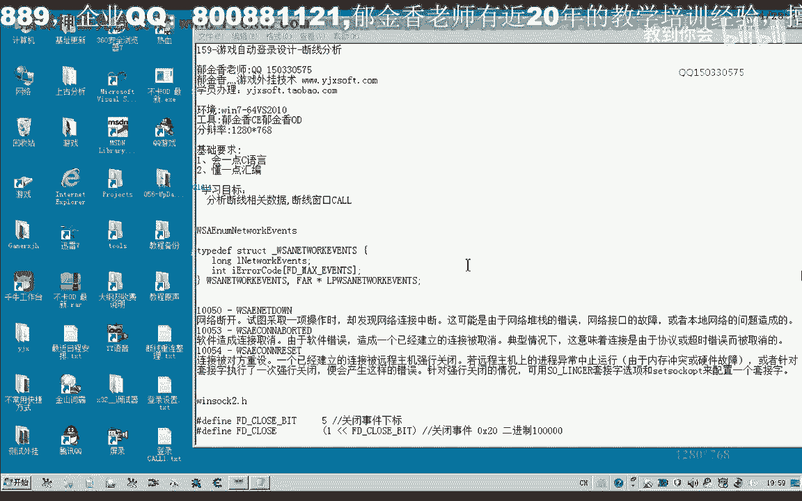
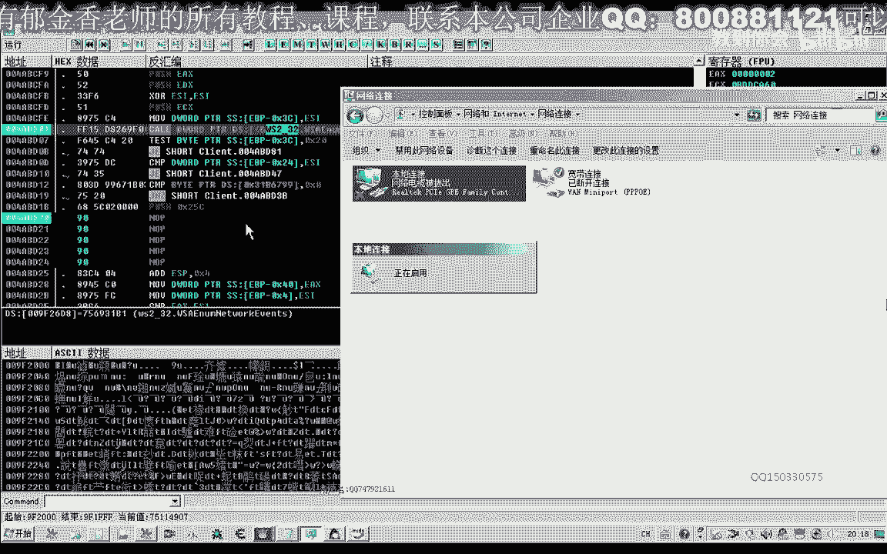

# P148：159-游戏自动登录设计-断线分析 - 教到你会 - BV1DS4y1n7qF

大家好，我是郁金香老师，那么这一节课呢，因为我们要涉及到一个呃自动登录的时候，涉及到一个断线的一个检测，那么我们需要来分析这个用来判断这个断线嗯。

相关的数据。

那么在这里呢我们可以把这个网络打开哈，然后呢把我们的这个本地链接啊，然后呢这里呢把它禁用啊，那么这里呢他就会实际上这个游戏呢它在断线的时候呢，它会弹出一个断线的一个窗口。

那么这个窗口的话需要我们选择这个服务器线之后呢，它才会出现啊，因为现在的话还没有开始与我们服务器的一个连线，那么我们与服务器连线之后呢，如果是在断线的话，它就会出现一个呃游戏断开链接的一个窗口。

那么我们可以先找到这个窗口，那么这是一种方法，那么另外呢我们也可以直接就这个掉线，有没有掉线的时候，一个数据的一个变化，当然我个人认为的话，直接搜这个窗口呢可能还要简单一些，所花的时间可能要少一些。

那么这个时候呢它已经与我们的服务器已经有这个连线了，然后呢我们断掉这个网络呢，它就会弹出啊，那么实际上我们就是检测这个窗口它是否存在，那么这个窗口是否存在的话，看也要看它是否是一个全局变量。

那么很有可能他他只是一个临时创建的这个对象，那么我们可能就找不到，但是呢我们可以呢可能他应该有其他的一个条件来判断它啊，嗯但是呢我们需要呢从这个窗口来入手，可能比较好入手一些。

另外呢我们也可以通过这个字符串来入手，与服务器断开这个字符串，那么我们可以来先搜一下，试一下这种方法可不可行，那么在这里呢把不可写的也铺上哈，嗯应该是这个字串，但是我们明显的看到这个字串的话。

它不是一个全局的呃一个变量，那么我们再次退出之后的话，它可能呢这个字串的话可能就没有了，好那么我们再次附加到游戏里面，那么这个时候的话我们发现了这个字串已经没有了。

那么所以说这种方式呢方法呢他用不是不可行的，那么我们这个时候呢可以来从我们的这个断线的一个判断的啊，相关的一些函数呢来进行分析，那么我们其中呢在判断断断线啊，是否有这个服务器存在的链接呢。

我们通常会你用这个api wa a一模能听到哈，这个英语的这个函数呢，用来嗯就是说枚举呃相关的一些产生的一些事件，那么其中呢它有一个事件啊，在我们这个关索抗日这个头文件，里面有定义啊。

那么它的事件的一个下标呢是就表示的是一个套接字的，一个就是说我们网络断开的啊，所产生的一个这个close的一个事件，那么产生这个事件的时候呢，因为这个这个数值是五，那么这个一像我们的左移五位的话。

实际上呢就是二进制的这个要五个零，那么这个数值的话我们看一下，那么是16进制的二零啊，那么也就是说这个事件它在我们的，我们把它记一下，这个关闭事件的话，那么呢会产生1~20。

但是为什么我们要说这这些相关的呃数据呢，我们来看一下这个函数在msdn里面的一个定义，那么第一个呢它是指定的一个套接字啊，套接字的一个标识，一个距离，这个是套接字。

那么第二个呢我们就是一个啊消息的一个事件的一个类型类型啊，看是一个事件的一个对象啊，那是一个事件对象，那么其中呢第三个啊这个是我们关心的最重要的一个结构，那么这个结构的话。

它里面呢就包含了我们所要的一些信息，那么这个是一个网络事件啊，那么就是说已经产生的这个网络事件，它都存放在这个long类型的变量里面，它有可能是同时产生了多个事件，那么这个事件的话它都，是以fd开头的。

那么比如说我们的这个fd close或者是下面的这个fd啊，max什么是不对啊，这一类的，那么另外还有一个呢，这里呢还有一个呃，这里呢它实际上是一个什么什么b体结尾的呢，是这个数组的一个下标啊。

那么下标那么从这个相应的这个下表里边的话，我们就能够取出相应的类型的一个事件，那么在这里呢我们说了这么多呢，实际上我们最关键的一点呢，也就是说在网络断开的时候呢，它一般来说会也就是说掉线的时候嘛。

啊它一般会产生一个这个close的这个事件啊，当然这，个超时的话，他应当来说呢也会造成这个事件啊，那么只要是这几种类型的网络断开，或者是呃链接取消，这个链接被对方重色哈。

这几种情况呢一般来说它都会产生一个关闭的一个事件啊，套接式的一个关闭事件，那么所以说我们就需要通过这些数据来来分析，我们的这个雕像的相关数据，那么呢它要获得这些数据来，肯定是要调用这个函数。

调用这个函数之后呢，那么相应的这些呃错误信息呢就存放在这个数组里边。

那么如果是没有相应的事件产生了，这里面的数值呢它是零，那么如果我们的这个关闭事件它产生了，那么这个值呢它是等于320x20 ，那么如果这个关闭事件啊，他没有出错的话。

那么呢这个相应的这个下标我们取得的第五，也就是说这个数组里面的第五个元素应该是第六个元素啊，那么里边呢呃它它的数值呢没有正常的情况下呢，里面是零，那么如果是出错的这个情况的话，那么可能有这几种情况啊。

那么我们一起来看一下。

那么我们先复制一下这个相关的呃套接字啊。

它的这个领取事件的这个函数。

然后我们转到这个地址，那么在这个地址呢我们给它下一个断点，那么马上呢我们就会断下来，这个时候我们发现，那么我们返回到上一层，我们看一下啊，那么在这里的话我们恰好能够判断呃，这里呢还有一个测试啊。

测试我们的这个3c是否等于我们的二零啊，那么我们看一下这个3c是什么地方，那么三四个我们看到的它是它的第一个亚站的一个参数，那么因为它是从右至左的呃，一个亚战的一个顺序啊，复习的一个顺序。

那么实际上这个参数呢是它的第三个参数，那我们再来看一下它的一个说明，那么也就是说它最先压榨的这个参数的话，实际上呢是最后的这个也就是压到了这样的一个结构进去啊，那么这个结构的话，他的第一项目。

那么也就是这个标志啊，事件的一个标志，具体是一个什么标志，那么我们刚才说了，如果是等于二零的话，就是产生了一个啊这个关闭套接字的一个事件啊，fd啊，closed这样的一个事件。

那么这里呢我们会把它标记下来，那么这里呢是做这样的一个判断，那么如果是这里他接e啊，如果是等于这个数值的话啊，不等于的时候呢就跳转，那么如果是等于这个事件的话，他们就会到这个地方执行，那么谁等于他呢。

那么也就是我们的，这个参数就是它的第一个参数相当于3c，我们可以看到在这里的话，实际上呢它的第一个地址啊，这个结构的第一个地址了，3c是指向这个位置的，那么它的第一个下标为零的时候。

就是因为它是负负数啊，那么就应该是三八，那么它的下边五一的时候呢。

相应的元素呢就是三四啊，因为我们要不停的加速嘛，这里是解，那么我们可以看到这里是三八，这里是啊，这里是三岁，这里是三八，那么这里呢就相当于是它它的相应的一个数组，那么这里的下标的话相当于这里是零。

这里是一，这，里是二，那么呢这里是三点，这里是四，这里是五，那么注意，那么它的下标为五的时候，我们可以看到啊，那么你就是这这一个下表啊，相当于啊呃关闭事件的下标，那么也就是说，来看一下。

也就是说在这里的话它指向了这里12345，那么也就是说24里面呢，它存放着这个相应的哈，关闭的时候的一个相相应的一个出错的一个代码啊，也就是这个减24例变，那么这里呢他又有一个比较啊。

与我们的e s i做一个比较，那我们找一下，那么在这里呢我们的es si呢它复制为零，也就是等于零啊，进行了一个相应的一个操作啊，抑或抑或之后呢，他肯定就这个数字呢就为零了啊。

那么这里呢实际上是把这个相应的里边的这个元素啊取出来，与我们的零做，比较那么如果是等于零的就跳过啊，那么如果是不为零呢，那么也就是说不为零的话，在这个地方的话就证明了啊，关闭出错。

那么也就是说这个关闭的事件出错，出错的话，就一般呢会有这几种情况啊，就是也是网络断开了啊，或者是我们的这个就是说呃超时或者是链接的一个取消，那么也就是说从这几种情况来看的话，我们呢都是啊掉线的啊。

都是掉线的，那么也就是说的话在这个位置的话，就是啊掉线的一个检测，那么掉线检测之后呢，他应当会调用相应的这个库，比如说这个扩为什么一定要调用这个库了，那么这个扩的话就有可能是我们的这个显示，断线的窗口。

那么我们具体是不是呢，我们可以把这个地方呢把它弄不掉啊，因为这里我们看到它谱写了一个参数，这里来进行的是一个屏障的一个操作，好的，我们先把这个地方呢把它弄不掉。

那么loop掉之后呢，我们在这里呢再把我们的这个本地面积来禁用，那么这个时候呢我们发现的话，它这里呢不会显示啊掉线，但是实际上呢它已经掉下来了，当然说，这个地方呢他可能也不会被执行到这里。

在前面的代码可能也不会被执行，那么证明的话这个地方呢呃应当是显示我们断线的这个窗口。

或者是与之相关的一些东西，好的，那么我们把它相关的代码复制出来，这个呢应当来说的话，已经找到这个关键的，在这个部分关键代码的附近，那这个时候呢他已经啊不能够产生这个链接。

我们看一下它能不能否进入我们的游戏。

那么我们可以转到，发送这个封包的这个函数去看一下它能否有这个断点，在这里我们下一个段，那么实际上我们可以看到的话，这个时候断线之后呢，他根本就不会啊发包了啊。

那么说明的话他肯定是某个变量里面有这个相应的一个标记啊，它进行了一个判断，然后就不会从这里经过了，那么首先呢我们把它关掉，也可以不关掉啊，呃我们可以直接在，因为刚才我们分析了一下。

那么这个括它有可能是我们的这个显示掉线的这个扣，那么我们把这个库调用一下，看它是否能够显示这个掉线率的窗口，好的我们注入到游戏里面看一下，那么这个时候呢没有任何的效果，那么我们接着再往后面看一下。

那么我们发现了他返回的这个ex呢，呃存放到了我们的，这个前四名的，这个临时变量里面啊，然后呢在与我们的这个零做了一个比较，那么如果它不等于零的时候，等于零的时候呢，跳过了啊，如果是不为零的时候呢。

再调入到下面的一个空，并且呢把上一个函数的返回值呢传到了ec x里面，那么ec x的话，我们知道一般人用这个ec x来保存的是一个对象啊，特别是在调用这个括之前，那么这个ecx的话一般是一个对象的地址。

那么他在这里的话，把这个e是ex呢送到e4 x里面，那我们猜测的话很有可能呢这前面的这个扩展，它是创建了一个窗口的对象，然后呢再通过这个空可能是来显示这个窗口，那么它也有一个参数。

我们再把它加进去看一下，那么这个时候出错了，我们再倒回来看一下我们的代理，那么我们为什么会出错呢，因为我们少写了一句，我们没有把这个ex对象的值呢放到我们的e4 x里面，因为这个扩的话。

在这里我们能够看到它啊，找一下他的e4 x，我们可以看到这个e4 x的在后边啊，直接复制到这个e是i的变形，那么说明的话这个e e sex肯定是一个参数，那么我们在之前的这个库里面来看的话。

那么呢他这里就为了没有涉及到e4 x，所以说他没有e4 x的这个参数，那么这里呢e4 x呢他也没有，进行一个赋值的一个操作啊，好的，那么我们再次启动一下游戏，那么我们直接调用一下这个课，看能否成功。

那么我们看一下我们复制的这一段代码，943829，往下边一个，6月3d，嗯嗯嗯。

然后我们再转到这个地址去看一下相应等待，嗯，啊，嗯这个时候呢我们发现的话它是可以直接测试的啊，嗯这个或者这两个货结合起来的话，就是呢打开我们的这个服务器啊，断开的这个通知啊，呃那么有了这个窗口的话。

说明我们的这个他判断的这些标志呢可能就在附近啊，那么关于他的这个标志的话，那么我们下一节课呢继续的分析啊查找。

