# 课程 P148：游戏自动登录设计 - 断线分析 🕵️♂️

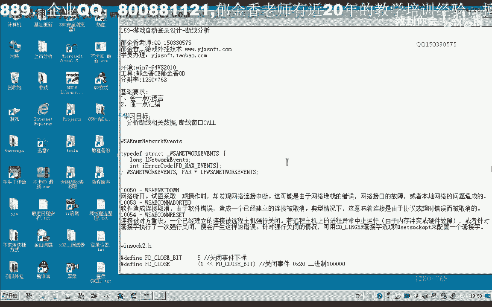

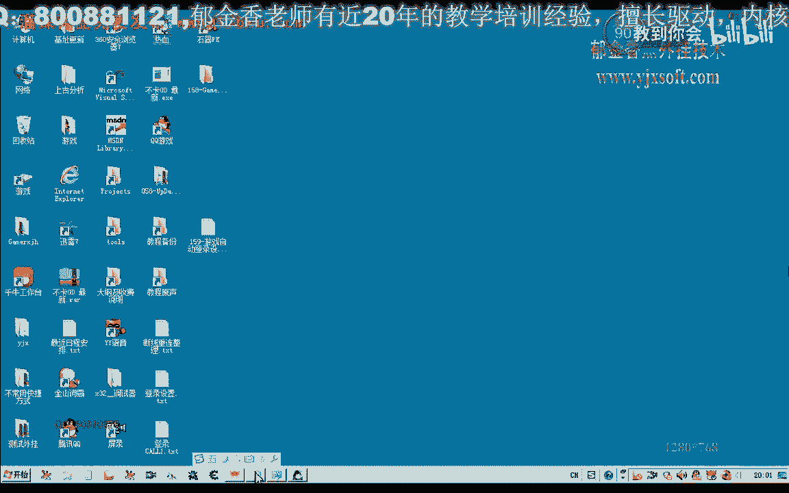

在本节课中，我们将学习如何分析游戏在断线时的行为，并定位用于判断网络连接状态的代码和数据。我们将通过分析网络事件和函数调用，来理解游戏是如何检测并响应断线情况的。

## 断线现象与初步分析

上一节我们介绍了自动登录的基本概念，本节中我们来看看如何处理网络断线的情况。当游戏与服务器断开连接时，通常会弹出一个提示窗口。

我们可以通过禁用本地网络连接来模拟断线，并观察游戏的反应。游戏在断线时会弹出一个“游戏断开链接”的窗口。一种直接的方法是查找这个窗口本身，另一种方法是分析断线时游戏内部数据的变化。直接搜索窗口可能更简单快捷。

## 从字符串入手的方法

以下是尝试通过搜索游戏内字符串来判断断线的方法：

1.  在游戏内存中搜索“与服务器断开”或类似的字符串。
2.  附加调试器，观察该字符串是否为全局变量。
3.  发现该字符串并非全局变量，游戏重启后地址会变化，因此此方法不可行。

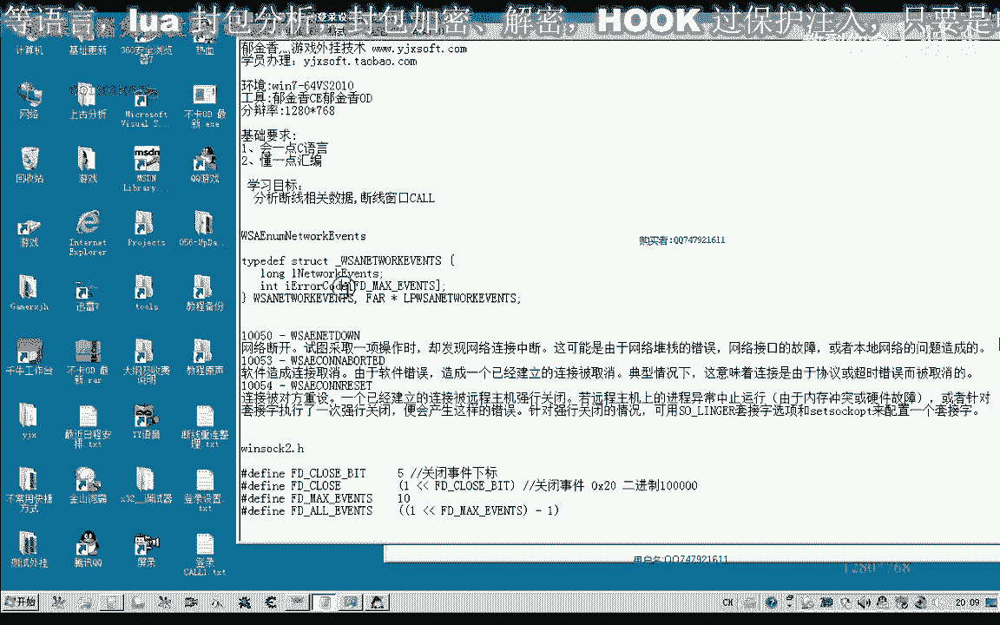

## 分析网络事件判断函数

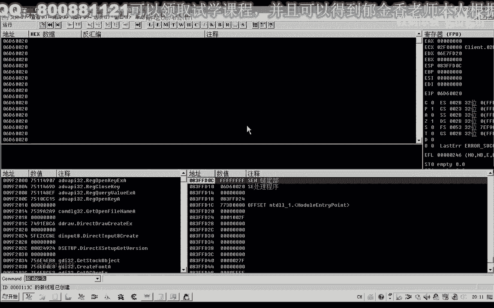

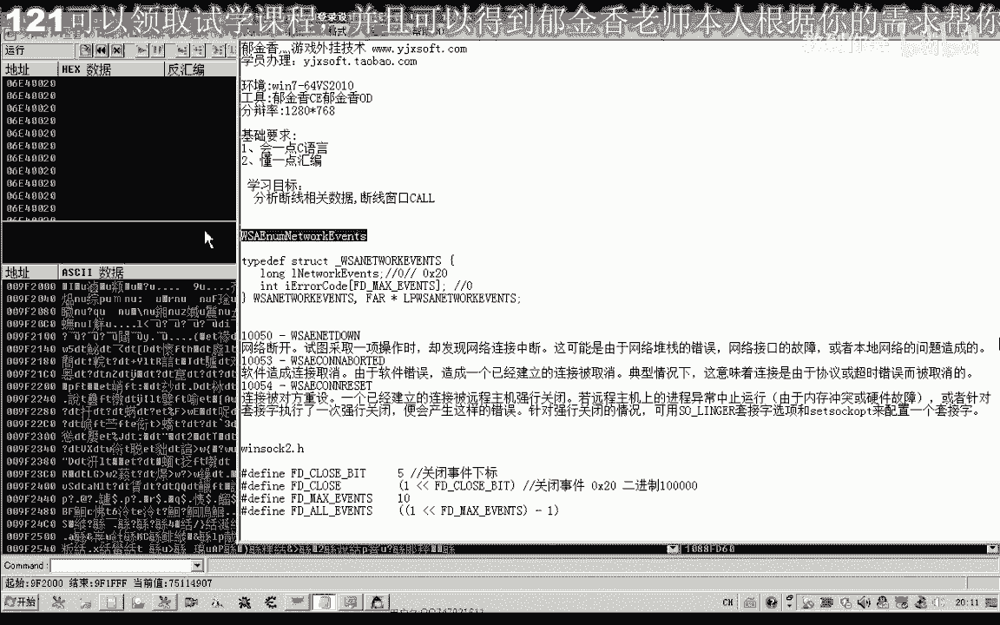

既然直接搜索字符串行不通，我们需要从判断网络连接状态的函数入手。游戏通常会使用 `WSAEnumNetworkEvents` 这个API函数来枚举网络事件。

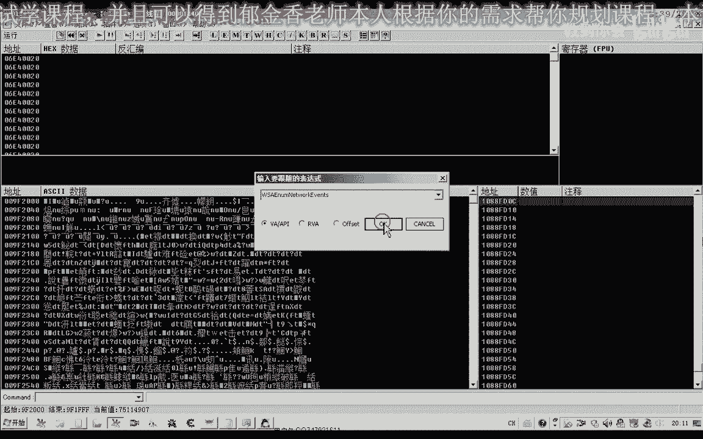

在 `winsock.h` 头文件中定义了一个事件：`FD_CLOSE`，它表示套接字关闭事件。其值定义为 `0x20`。当网络断开、超时或连接被重置时，通常会触发此事件。

`WSAEnumNetworkEvents` 函数的第三个参数是一个指向 `LPWSANETWORKEVENTS` 结构的指针。该结构中的 `lNetworkEvents` 字段是一个长整型变量，用于存放已发生的网络事件。如果 `FD_CLOSE` 事件发生，则 `lNetworkEvents` 的值会包含 `0x20`。

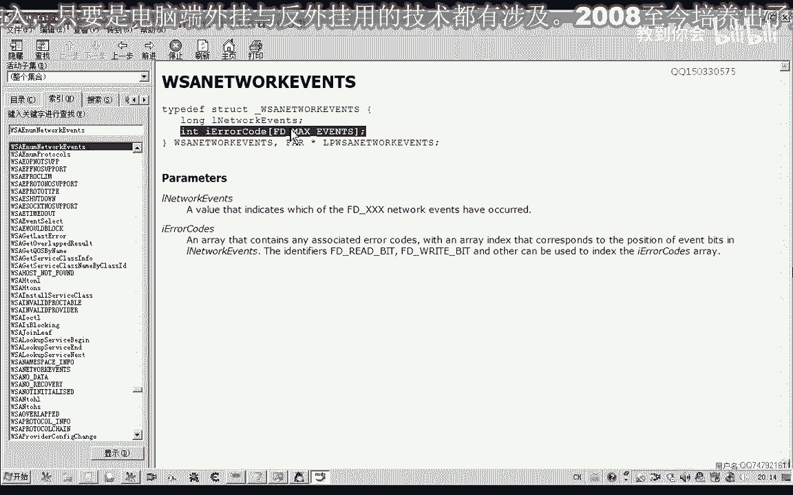

此外，该结构还有一个 `iErrorCode` 数组。如果 `FD_CLOSE` 事件发生且没有错误，`iErrorCode[FD_CLOSE_BIT]`（即数组下标为5的元素）的值应为0。如果该值不为0，则表明关闭时出现了错误。

## 定位关键判断代码

我们在游戏中找到调用 `WSAEnumNetworkEvents` 函数的位置，并下断点进行分析。

断点触发后，我们查看上层调用代码。发现有一段关键判断：代码比较一个值（来自 `lNetworkEvents` 字段）是否等于 `0x20`（`FD_CLOSE`）。

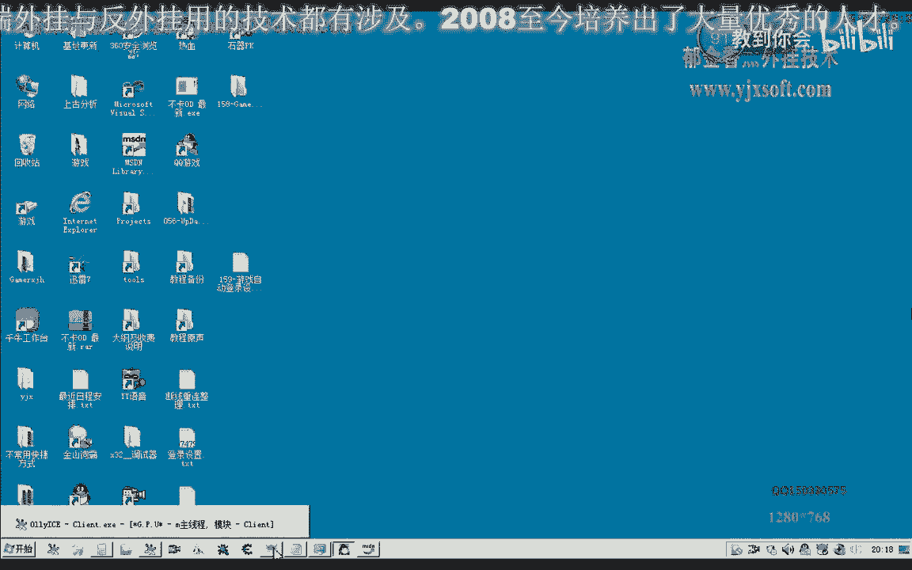

**公式：判断是否为关闭事件**
`if (lNetworkEvents & 0x20) { ... }`

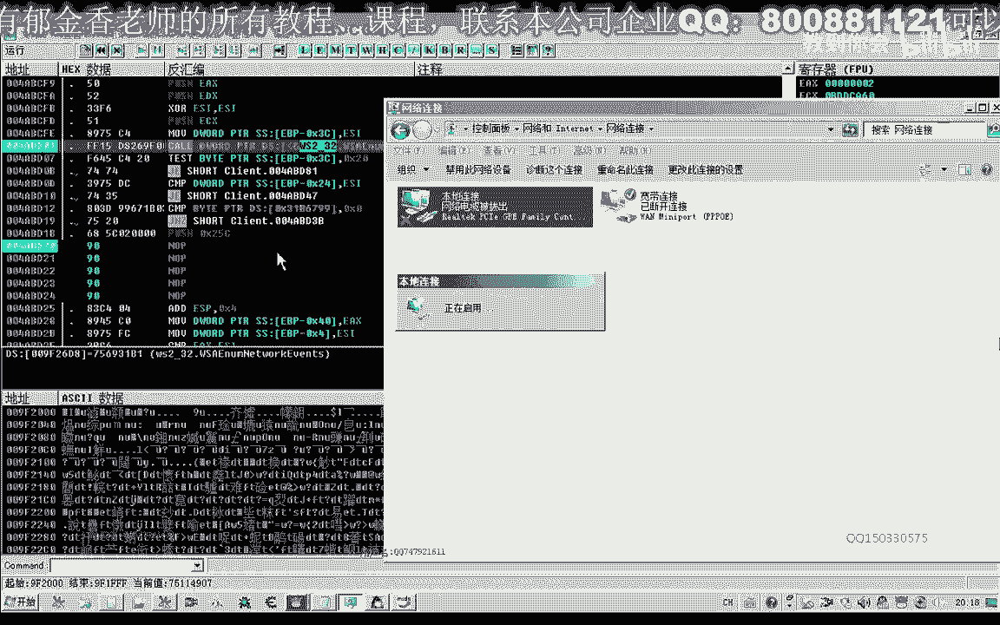

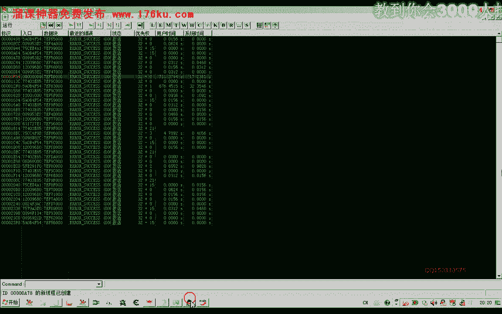

如果相等，则表明发生了关闭事件。接着，代码会检查 `iErrorCode[FD_CLOSE_BIT]` 数组中的错误代码。

**代码：检查关闭事件的错误码**
```
// 假设 lNetworkEvents 地址为 0x3C
if (*(DWORD*)(0x3C) == 0x20) {
    // 发生了关闭事件
    DWORD errorCode = *(DWORD*)(0x3C + 0x24); // 获取错误码数组的第五个元素（偏移0x24）
    if (errorCode != 0) {
        // 关闭时出错，意味着断线
        // 此处可能调用显示断线窗口的函数
    }
}
```

分析发现，当错误码不为0时，程序会跳转到处理断线的流程，并调用一个函数（我们暂称为 `CallShowDisconnectWindow`）。我们推测这个函数负责弹出断线提示窗口。

## 验证与总结

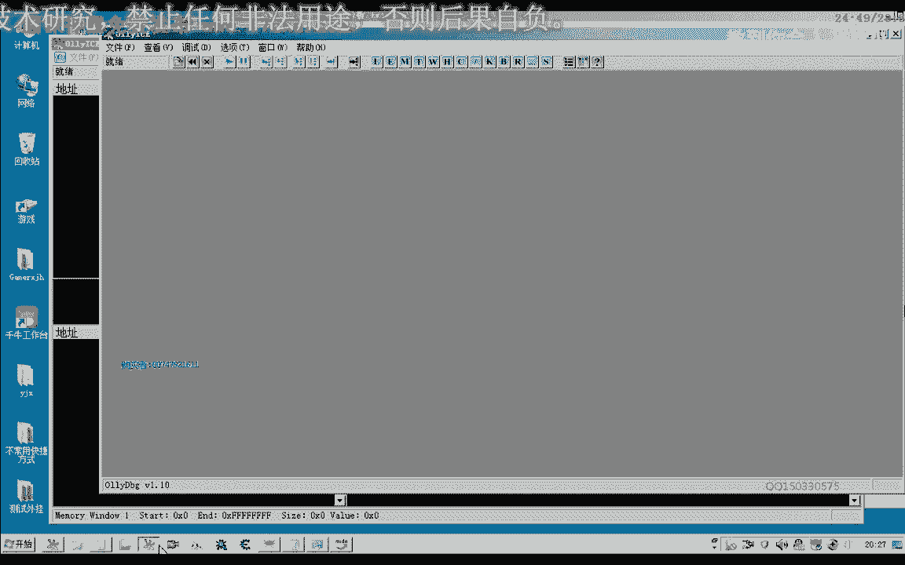

为了验证，我们尝试修改代码，跳过错误码检查或直接调用疑似显示窗口的函数。实验发现，调用特定函数后，游戏成功弹出了断线服务器选择窗口，证实了我们的分析。

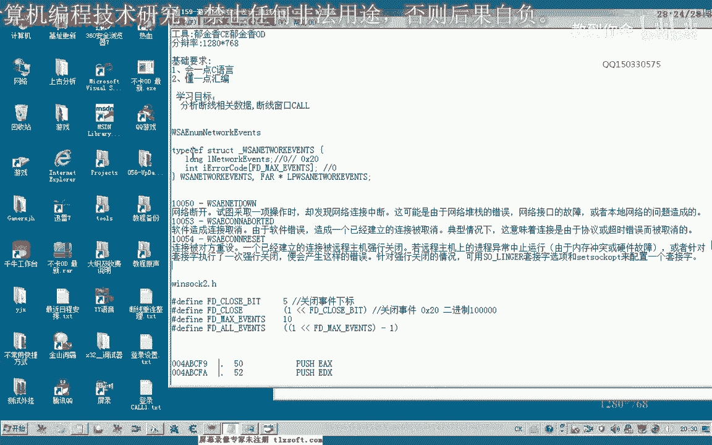

本节课中我们一起学习了如何通过分析 `WSAEnumNetworkEvents` 函数及其相关数据结构来定位游戏的断线检测机制。我们找到了判断 `FD_CLOSE` 事件和检查错误码的关键代码位置，并验证了其与断线提示窗口的关联。这为后续实现自动重连逻辑打下了基础。下一节课，我们将继续深入分析用于标记断线状态的全局变量。