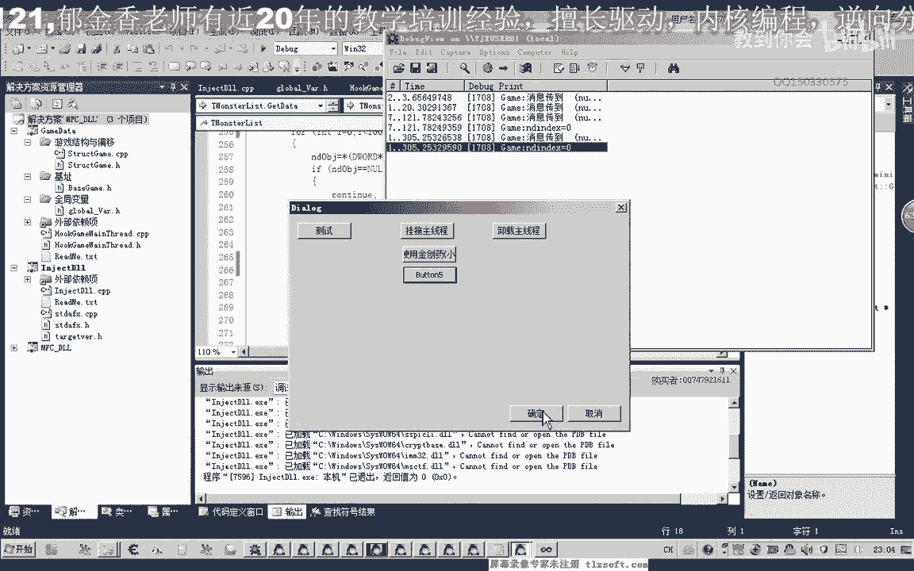
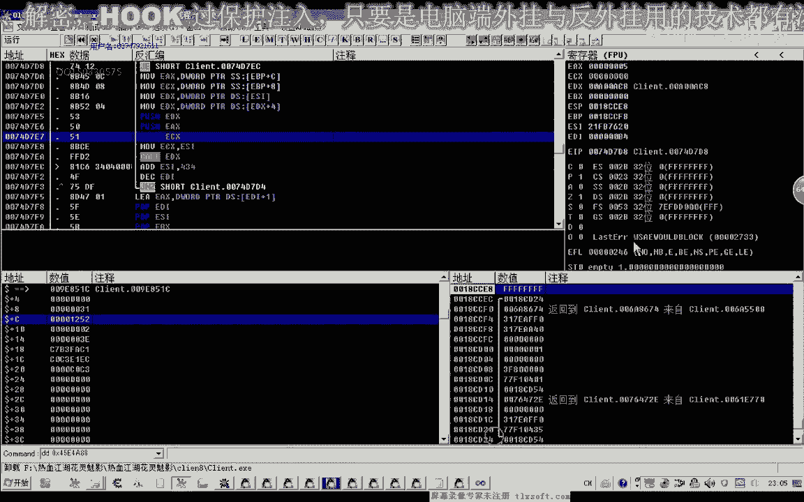
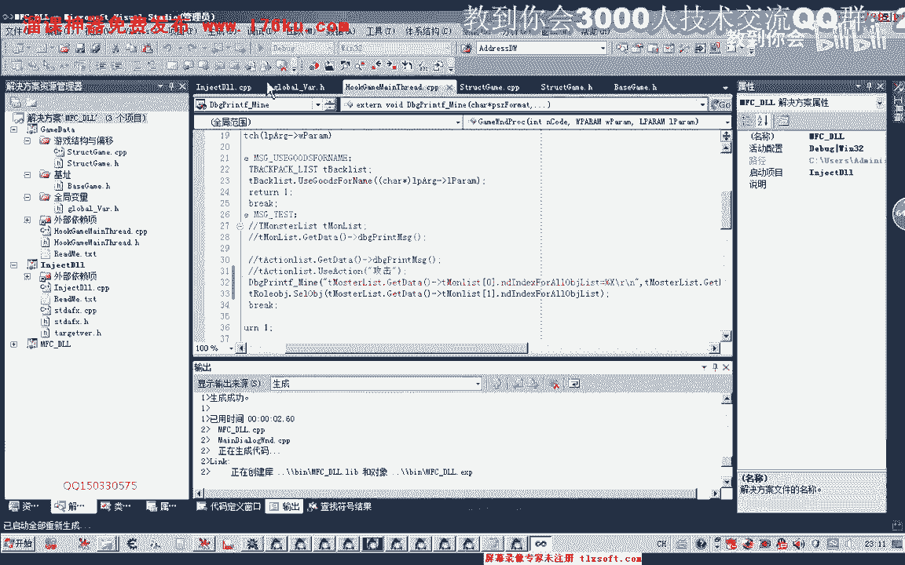

# 课程 P15：026-封装选怪功能-写代码 🧩

在本节课中，我们将学习如何将游戏中的“选择怪物”功能进行代码封装。我们将从现有代码出发，通过添加新的类和结构体，使代码结构更清晰、更易于管理。

---

## 概述

上一节我们介绍了选怪功能的基本思路。本节中，我们将动手编写代码，对玩家对象和怪物对象的数据访问逻辑进行封装。核心目标是创建清晰的类结构来管理游戏对象及其内存偏移量。

## 代码结构设计

首先，我们打开第23课的代码。为了提升代码可读性，我们计划添加两个新的分类。

以下是主要的封装思路：

1.  一个类用于管理**玩家对象**的机制。
2.  一个结构体用于管理**所有对象（包括怪物）的数据**及其相关内存偏移量。

我们将机制相关的代码放在前面的类中，而偏移量等数据定义放在后面的游戏结构体中。

## 封装玩家对象

我们首先封装玩家对象。复制相关代码到新创建的类中。

```cpp
// 示例：玩家对象类封装
class CPlayer {
public:
    // 构造函数、析构函数等
    // 成员函数，如选择目标
    void SelectTarget(int targetIndex);
private:
    // 玩家相关数据成员
};
```

在封装过程中，需要注意代码格式。例如，我们发现一处缺少分号，需要补充完整以确保编译通过。

## 封装怪物列表数据

接下来，我们封装所有对象的数据，特别是怪物列表。这涉及到一个结构体，用于存储对象ID和索引等信息。

```cpp
// 示例：怪物对象结构体
struct MonsterData {
    int objectID; // 对象ID，偏移量例如 0x04
    int index;    // 在列表中的索引
    // ... 其他属性
};
```

之前我们的怪物列表属性中可能缺少索引成员。因此，需要回过头在怪物列表类中添加相应的成员变量，并在初始化函数（如`GetData`）中从正确偏移量（例如`0x04`）读取并初始化这个索引值。

## 功能测试与调试

封装完成后，我们需要进行测试。测试思路是：从怪物列表中获取第一个怪物对象的索引，然后调用封装好的选怪函数。

以下是测试步骤：




1.  在测试单元（如`Hook`单元）中，声明一个全局的玩家对象变量。
2.  从怪物列表中取出第一个怪物的索引。
3.  调用玩家对象的`SelectTarget`函数，传入该索引。



我们首次运行测试时，发现没有成功选中怪物。通过调试信息发现，传入的索引值可能为0或无效。

我们通过以下方法排查问题：

*   在代码中打印调试信息，确认`SelectTarget`函数是否被执行。
*   检查怪物列表的初始化代码，确认索引值是否正确读取和写入。
*   使用游戏内存查看工具（如CE）直接查看游戏数据，验证怪物对象和索引值在内存中的实际状态。

经过排查，我们发现怪物列表的第一个对象可能不是怪物（例如可能是玩家自身），导致索引为0的对象无效。作为临时测试方案，我们将测试索引手动改为1。后续正式功能中，需要增加条件判断来筛选出真正的怪物对象。

修改后再次测试，成功选中了怪物。按下攻击键，角色会向选中的怪物移动并攻击。我们也测试了切换选中目标，功能正常。

## 总结



本节课中我们一起学习了如何封装选怪功能。我们通过创建`CPlayer`类和`MonsterData`结构体，将分散的逻辑和数据组织起来。过程中，我们经历了编写、测试、调试和解决问题的完整流程。

关键点包括：设计清晰的类结构、管理内存偏移量、在封装时查漏补缺（如添加缺失的索引成员）、以及通过打印日志和使用外部工具进行有效的调试。

目前我们实现了基础的选怪功能，后续可以在此基础上增加更智能的怪物筛选条件。下一节课我们将继续完善相关功能。