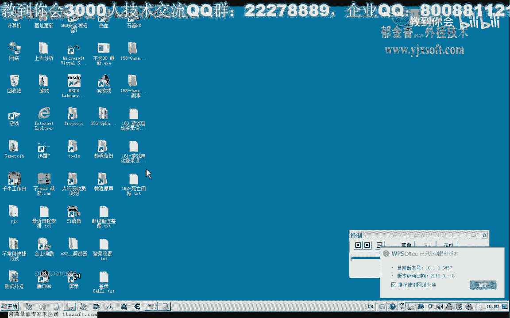

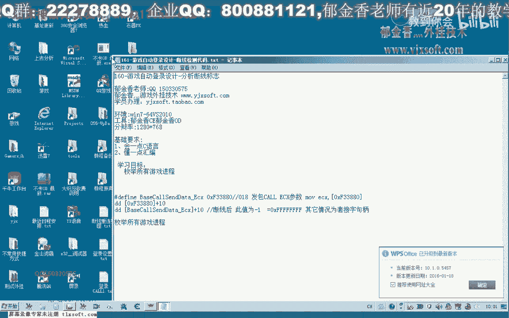

# 课程P150：161-游戏自动登录设计-遍历所有游戏进程与窗口 🎮

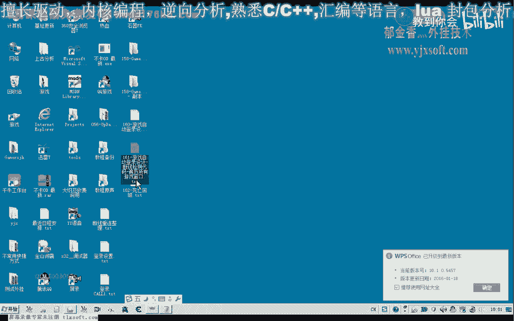

在本节课中，我们将学习如何设计游戏断线检测功能，这是实现游戏自动登录的关键部分。我们将重点讲解如何遍历所有游戏窗口，并获取其对应的进程信息，为后续读取在线状态打下基础。

## 概述 📋

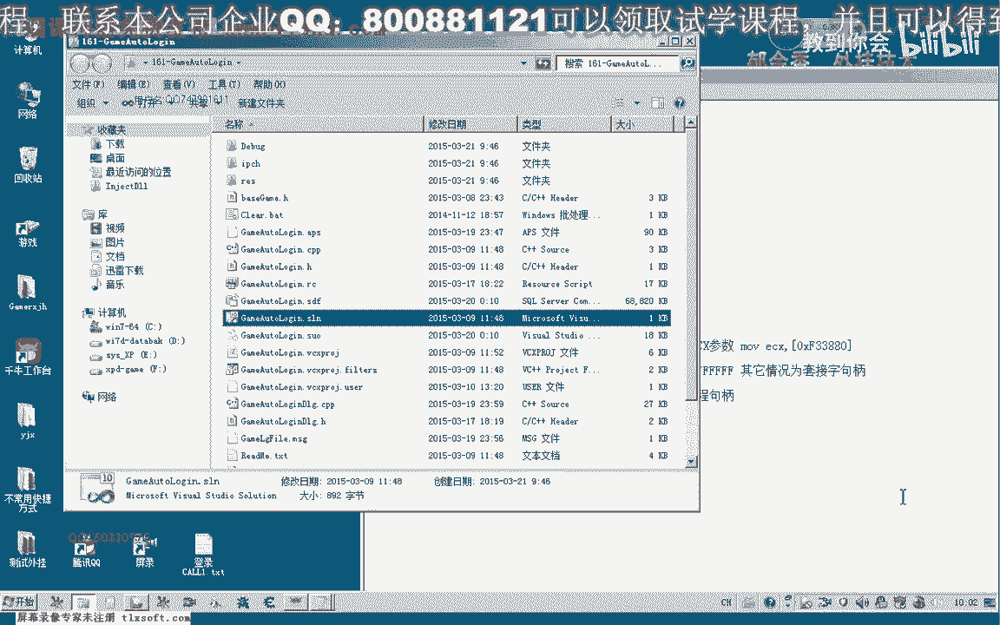

断线检测是自动登录功能的一部分。其核心原理是：首先遍历所有游戏窗口，根据窗口句柄获取对应的进程ID，然后通过读取特定内存数据来判断游戏是否在线。如果读取到的数值等于-1，则判定为掉线状态。

上一节我们介绍了自动登录的基本框架，本节中我们来看看如何枚举系统中的游戏窗口和进程。

## 遍历游戏窗口与进程

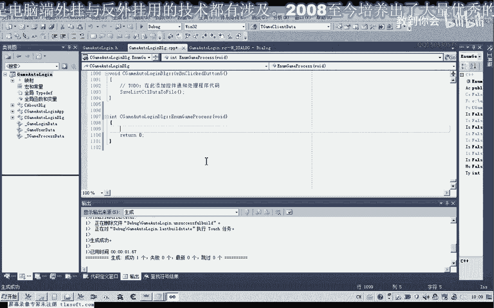

为了实现断线检测，我们需要先获取所有游戏窗口及其对应进程的信息。为了方便后续操作，我们将创建一个类成员函数来执行此任务。

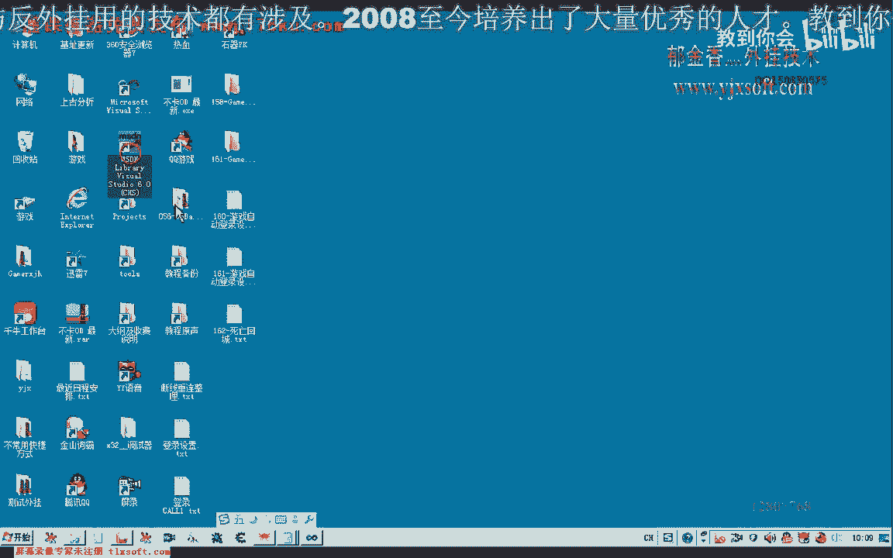

首先，我们定义一个结构体来存储所需信息，并创建一个全局动态数组来存放这些结构体数据。

```cpp
#include <vector>
#include <windows.h>

struct GameProcessInfo {
    HWND hWnd;        // 游戏窗口句柄
    DWORD dwProcessId; // 进程ID
    HANDLE hProcess;   // 游戏进程句柄
    TCHAR szTitle[256]; // 游戏窗口标题（通常是账号名）
};

// 全局变量，用于存储所有游戏进程信息
std::vector<GameProcessInfo> g_vGameProcesses;
```

接下来，我们设计一个枚举窗口的回调函数。Windows API `EnumWindows` 可以帮助我们遍历所有顶层窗口。

以下是枚举窗口回调函数的关键格式和实现：

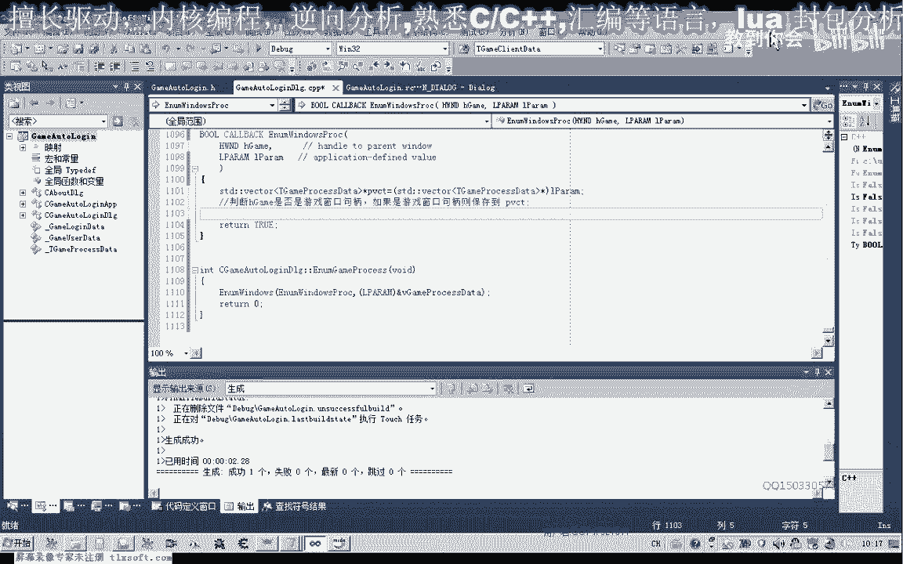

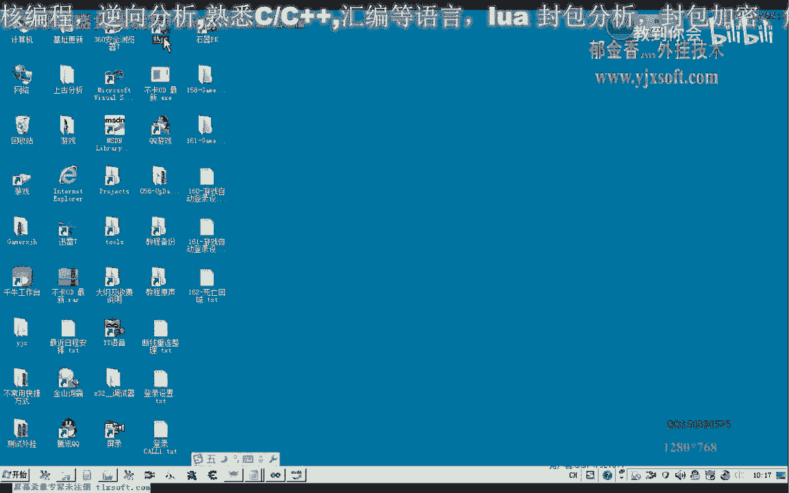

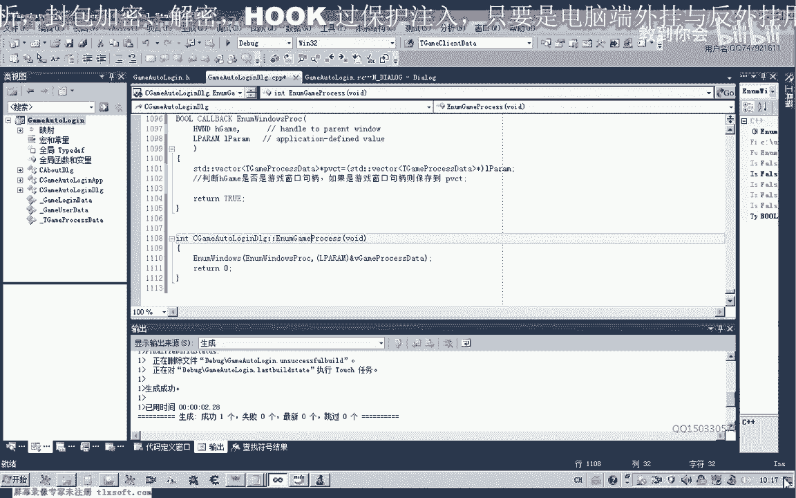

```cpp
BOOL CALLBACK EnumWindowsProc(HWND hWnd, LPARAM lParam) {
    // 将传入的参数转换为我们的动态数组指针
    std::vector<GameProcessInfo>* pVec = (std::vector<GameProcessInfo>*)lParam;

    // 获取窗口类名，用于判断是否为游戏窗口
    TCHAR szClassName[256];
    GetClassName(hWnd, szClassName, 256);

    // 假设游戏窗口类名为 "GameWindowClass"
    if (_tcscmp(szClassName, _T("GameWindowClass")) == 0) {
        GameProcessInfo info = {0};
        info.hWnd = hWnd;

        // 通过窗口句柄获取进程ID
        GetWindowThreadProcessId(hWnd, &info.dwProcessId);

        // 通过进程ID打开进程，获取进程句柄
        info.hProcess = OpenProcess(PROCESS_ALL_ACCESS, FALSE, info.dwProcessId);

        // 获取窗口标题（通常是游戏账号名）
        GetWindowText(hWnd, info.szTitle, 256);

        // 将信息添加到动态数组中
        pVec->push_back(info);
    }

    // 返回TRUE以继续枚举下一个窗口
    return TRUE;
}
```

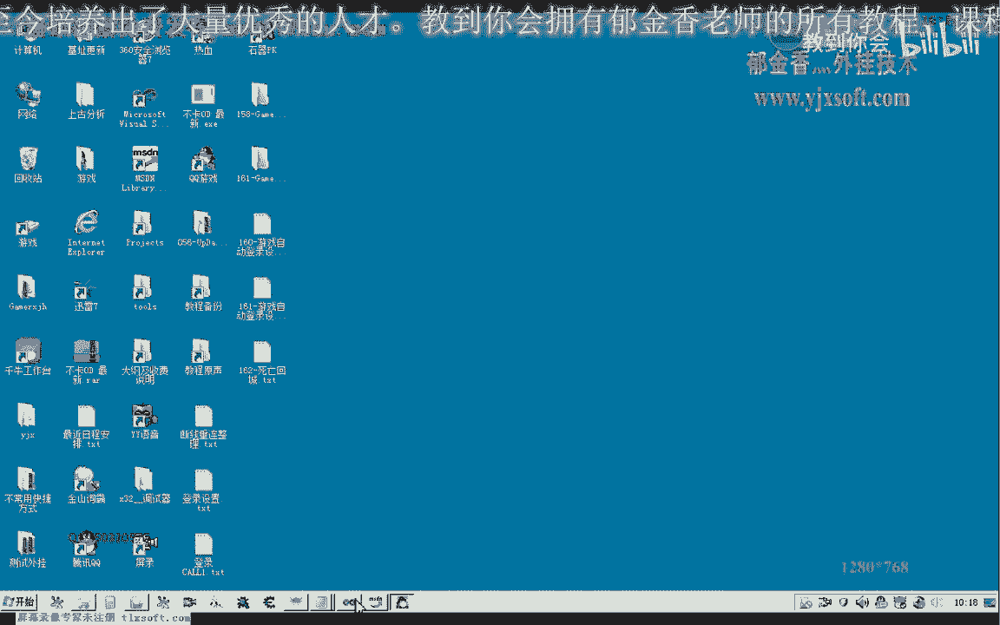

然后，我们创建类成员函数来调用此枚举过程，并清空之前的数组数据。

```cpp
void CYourClass::EnumerateGameWindows() {
    // 清空之前的进程信息
    g_vGameProcesses.clear();

    // 开始枚举所有顶层窗口
    // 将全局动态数组的地址作为参数传递给回调函数
    EnumWindows(EnumWindowsProc, (LPARAM)&g_vGameProcesses);
}
```

## 测试与验证

为了验证我们的代码是否正确获取了游戏进程信息，我们可以添加一个测试按钮，并在点击时调用枚举函数并打印结果。

以下是测试按钮点击事件的处理代码示例：

```cpp
void CYourClass::OnBtnTest() {
    // 调用枚举函数
    EnumerateGameWindows();

    // 遍历并打印所有找到的游戏进程信息
    for (const auto& info : g_vGameProcesses) {
        // 输出窗口句柄、进程ID、进程句柄和窗口标题
        // 在实际代码中，这里可以使用OutputDebugString或写入日志文件
        // 例如：printf("HWND: %p, PID: %lu, HPROCESS: %p, Title: %s\n", 
        //        info.hWnd, info.dwProcessId, info.hProcess, info.szTitle);
    }
}
```

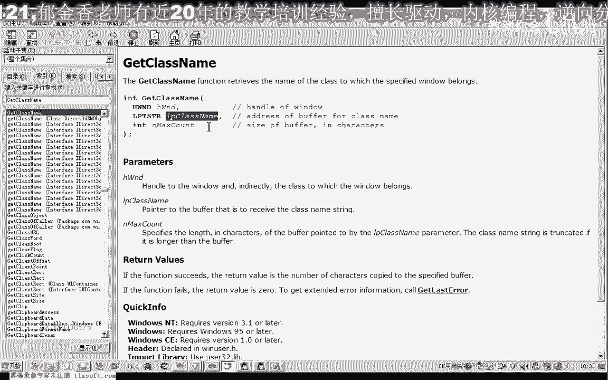

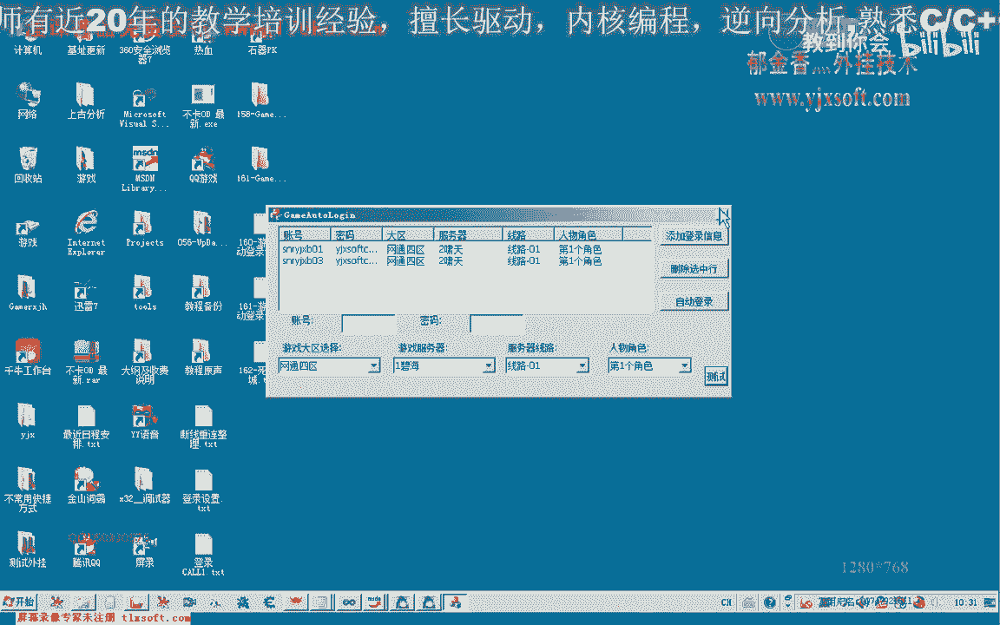

编译并运行程序后，点击测试按钮。如果游戏窗口已打开，你应该能在输出中看到类似以下的信息，这证明我们成功获取了游戏窗口和进程的数据。

```
HWND: 0x000A1B2C, PID: 52988, HPROCESS: 0x00000048, Title: 玩家账号1
HWND: 0x000C3D4E, PID: 3404, HPROCESS: 0x00000052, Title: 玩家账号2
```

**注意**：进程句柄是系统内核对象的一个引用，每次打开都可能不同。窗口标题通常是游戏内显示的账号名，这在多开管理时非常有用。

## 总结 🎯

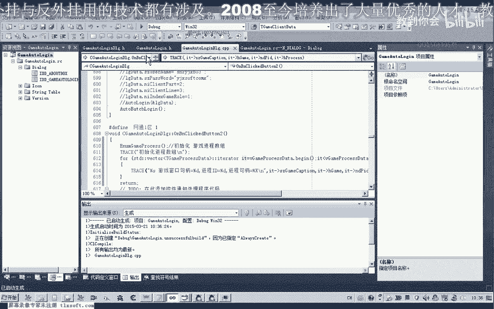

本节课中我们一起学习了如何遍历系统中的游戏窗口和进程。我们掌握了以下核心步骤：

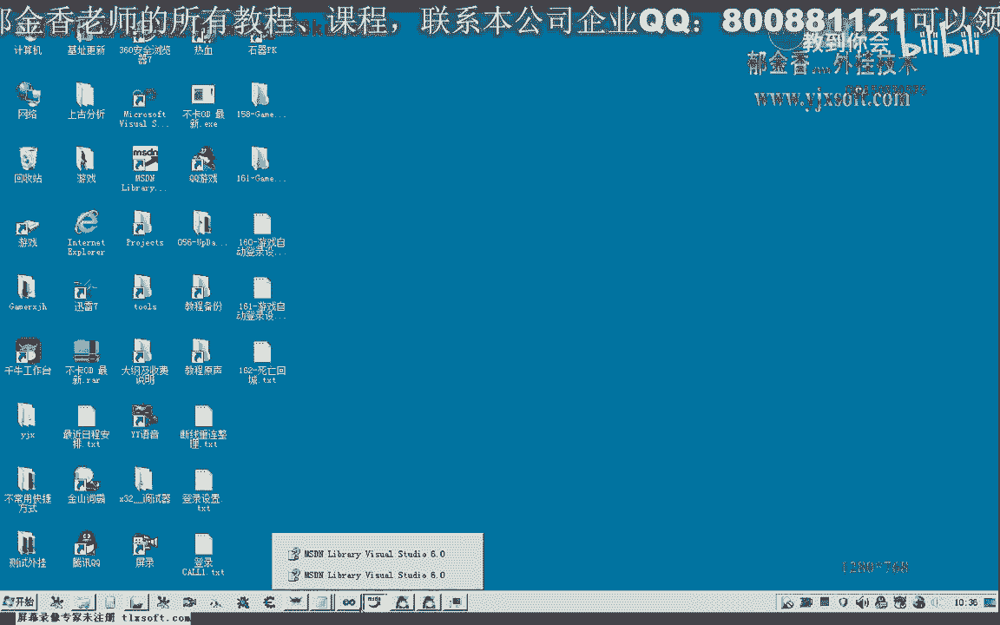

1.  **定义数据结构**：创建结构体来存储窗口句柄、进程ID、进程句柄和窗口标题。
2.  **使用Windows API**：利用 `EnumWindows` 函数和其回调函数遍历所有顶层窗口。
3.  **筛选目标窗口**：在回调函数中，通过比较窗口类名来识别出特定的游戏窗口。
4.  **获取进程信息**：使用 `GetWindowThreadProcessId` 和 `OpenProcess` 获取与窗口关联的进程详细信息。
5.  **存储与测试**：将信息存入全局动态数组，并通过测试函数验证结果。

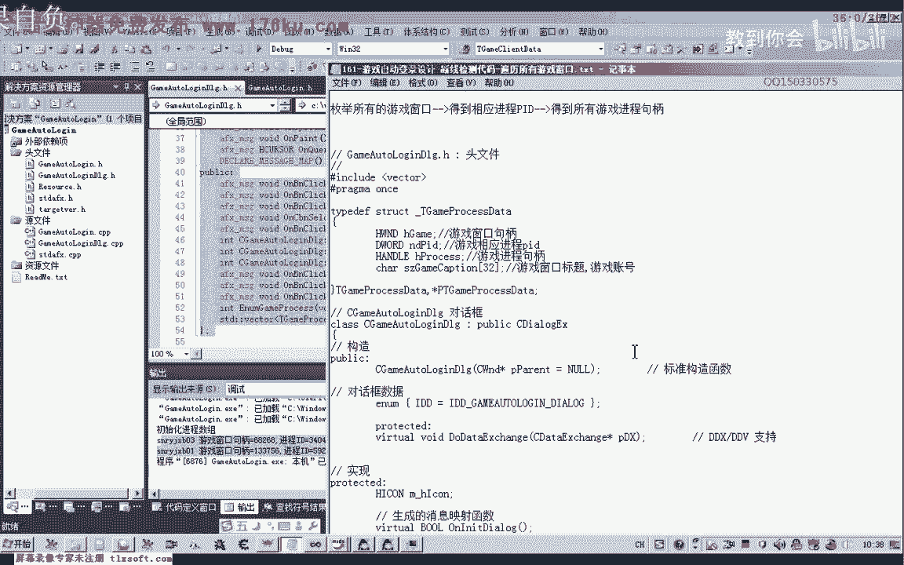

通过本课的学习，我们已经成功获取了游戏进程的关键句柄信息。下一节课，我们将在此基础上，学习如何读取每个进程的特定内存数据，从而判断其在线状态，完成断线检测的核心功能。