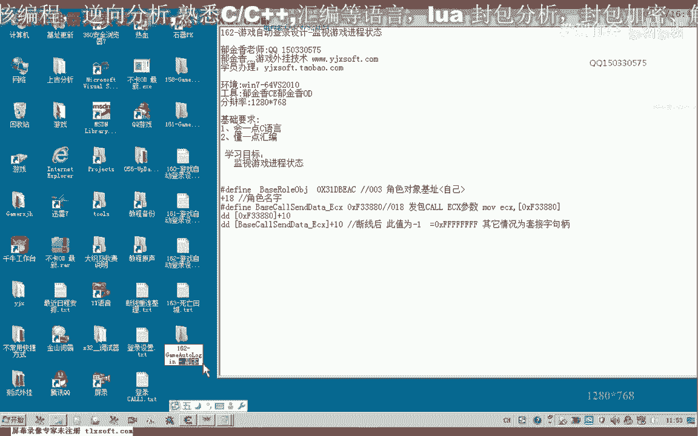
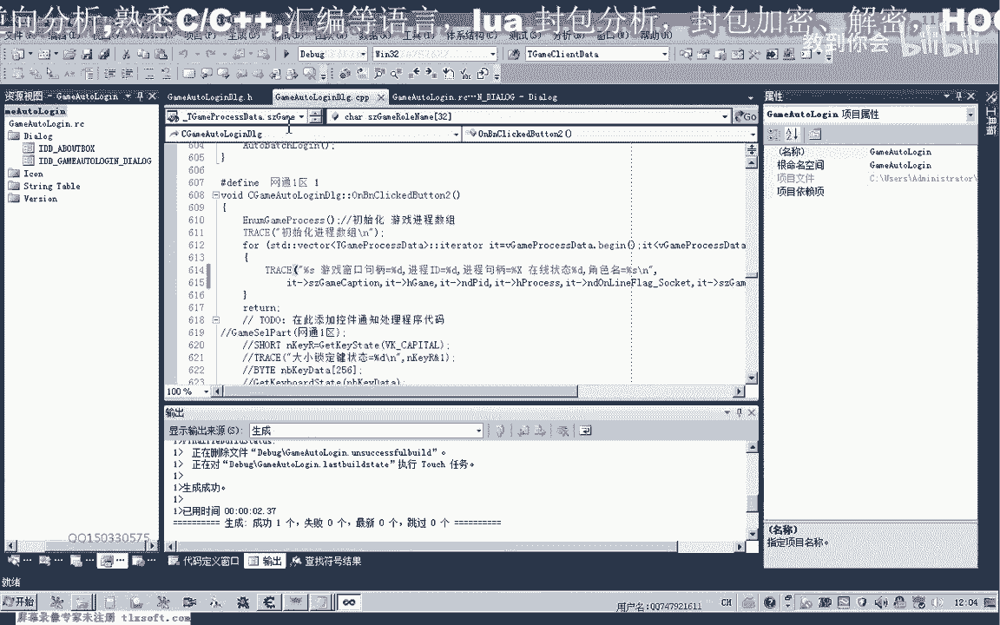
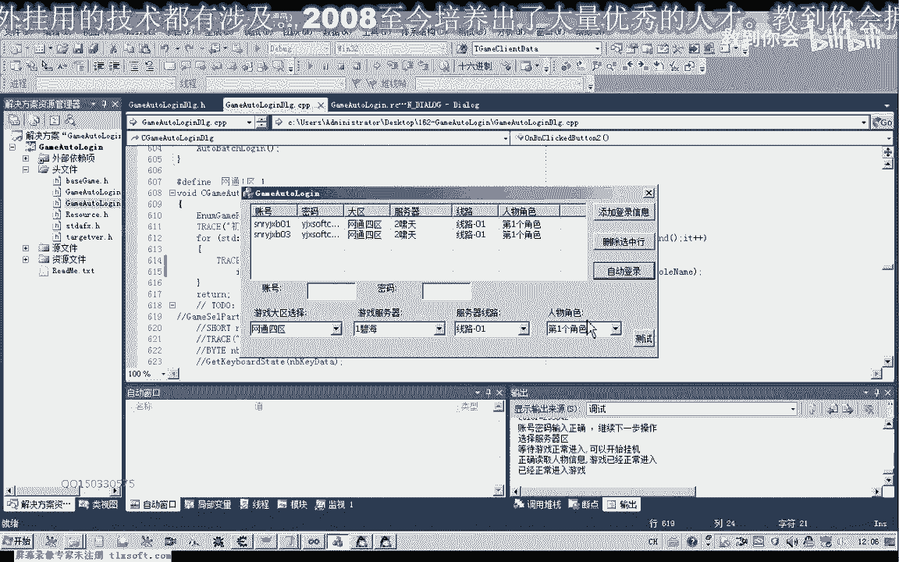
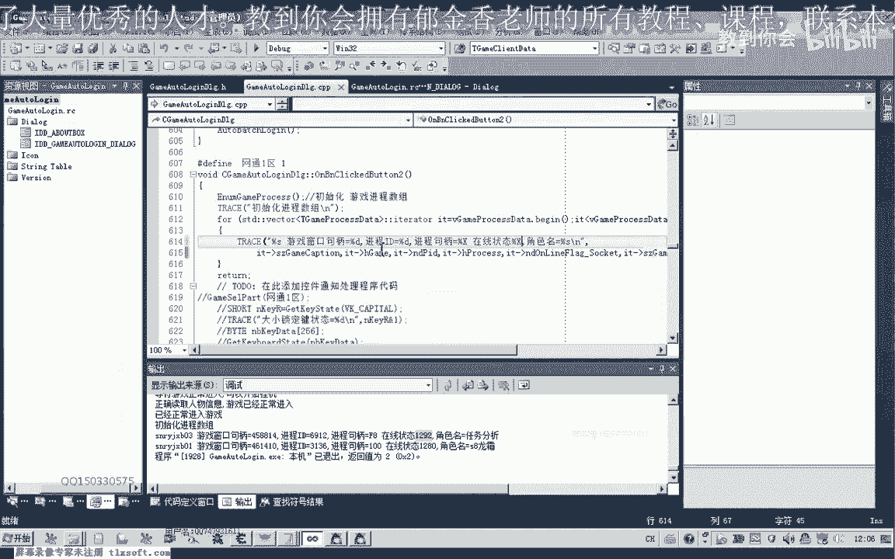
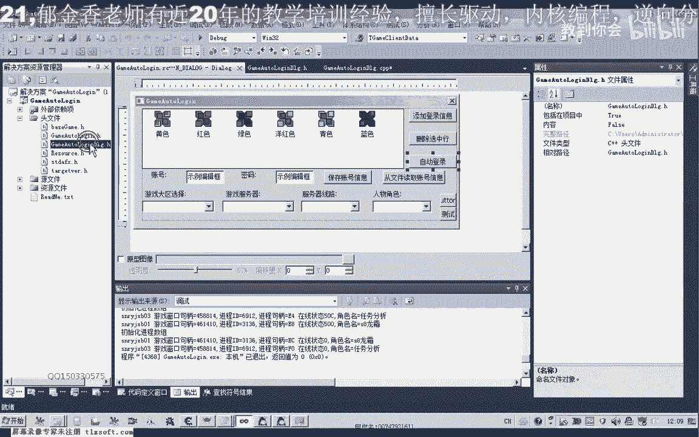
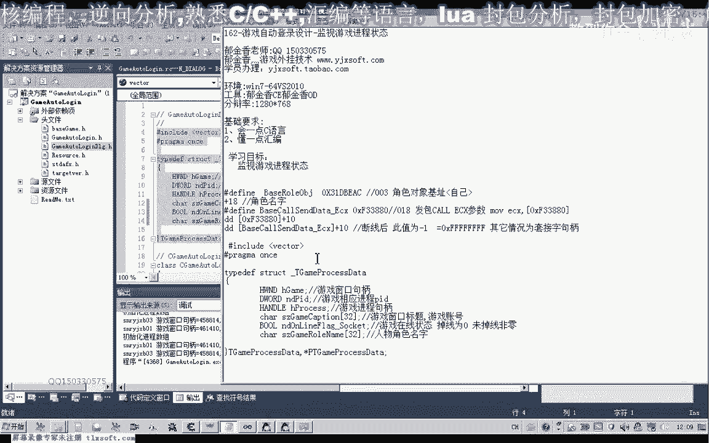

# 课程P151：162-游戏自动登录设计-监视游戏进程状态 🎮




在本节课中，我们将学习如何扩展游戏进程信息结构，并编写代码读取游戏的在线状态和角色名称等关键信息。我们将基于上一节课的代码进行修改，实现更全面的游戏状态监控。

---

## 概述

上一节我们介绍了如何获取游戏进程的基本信息。本节中，我们来看看如何读取游戏内部的特定数据，例如在线状态和角色名称。我们将通过修改数据结构和回调函数来实现这些功能。

## 修改数据结构

首先，我们需要修改存储游戏进程信息的结构体，以容纳新的数据字段。

以下是需要添加的字段：
*   **在线状态**：一个布尔类型或DWORD类型的变量，用于表示游戏是否在线。
*   **角色名称**：一个字符数组，用于存储游戏角色的名字，32字节的长度通常足够。

修改后的结构体定义示例如下（在头文件中）：
```c
typedef struct _GAME_PROCESS_INFO {
    // ... 其他原有字段 ...
    BOOL bIsOnline;     // 在线状态
    CHAR szRoleName[32]; // 角色名称
    // 可根据需要添加更多字段，如血量、死亡状态等
} GAME_PROCESS_INFO;
```

## 在回调函数中读取数据

定义了新的结构体成员后，我们需要在枚举窗口的回调函数中进行数据读取。

以下是实现步骤：

1.  **获取基址指针**：使用`ReadProcessMemory`函数读取存储游戏数据的基础内存地址。
    ```c
    DWORD dwBaseAddr = 0;
    ReadProcessMemory(hProcess, (LPCVOID)基址偏移, &dwBaseAddr, sizeof(dwBaseAddr), NULL);
    ```

2.  **读取在线状态**：在线状态的实际地址通常位于基址指针加上某个偏移量（例如0x10）的位置。读取该地址的4字节数据。
    ```c
    DWORD dwSocketStatus = 0;
    ReadProcessMemory(hProcess, (LPCVOID)(dwBaseAddr + 0x10), &dwSocketStatus, sizeof(dwSocketStatus), NULL);
    ```
    根据游戏逻辑，`dwSocketStatus`的值可能为-1表示掉线，其他值表示在线。我们需要将其转换并赋值给结构体的`bIsOnline`成员。

3.  **读取角色名称**：角色名称的地址可能位于另一个偏移量（例如0x18）。我们直接读取32字节到字符缓冲区中。
    ```c
    CHAR szNameBuffer[32] = {0};
    ReadProcessMemory(hProcess, (LPCVOID)(dwBaseAddr + 0x18), szNameBuffer, sizeof(szNameBuffer), NULL);
    strncpy(pInfo->szRoleName, szNameBuffer, sizeof(pInfo->szRoleName) - 1);
    pInfo->szRoleName[sizeof(pInfo->szRoleName) - 1] = '\0'; // 确保字符串终止
    ```

**重要提示**：所有读取操作必须在调用`PostMessage`函数将信息发送到主窗口之前完成。

## 代码测试与验证

完成代码编写后，进行编译并测试。



1.  **启动游戏并登录**：确保目标游戏进程正常运行。
2.  **运行监控程序**：程序应能正确枚举到游戏窗口。
3.  **验证数据**：在调试信息或程序界面中，检查读取到的在线状态（例如，非零值或特定句柄值表示在线）和角色名称是否正确显示。
4.  **测试掉线检测**：可以尝试断开网络连接，观察程序是否能检测到状态变为“离线”（例如，状态值变为0或-1）。



测试时，可以将在线状态以十六进制显示，以便更直观地查看套接字句柄等底层信息。

## 优化建议：使用独立线程




在自动登录或持续监控过程中，如果相关函数直接在主线程中执行，可能会导致程序界面卡顿或无响应。

为了解决这个问题，建议将耗时的操作（如自动登录逻辑）放在独立的线程中执行。可以使用`_beginthread`或`CreateThread`函数来创建线程。


```c
// 示例：创建线程
HANDLE hThread = CreateThread(NULL, 0, AutoLoginThreadFunc, NULL, 0, NULL);
if (hThread) {
    CloseHandle(hThread); // 如果不需等待线程结束，可立即关闭句柄
}
```
这样，后台任务就不会阻塞用户界面，从而提升程序的响应性和用户体验。

---



## 总结




本节课中我们一起学习了如何扩展游戏进程监控功能。我们修改了数据结构以保存在线状态和角色名称，并在回调函数中利用`ReadProcessMemory`读取了这些游戏内存数据。最后，我们讨论了将耗时操作移至独立线程以优化程序性能的方法。通过本课实践，你可以掌握读取游戏特定状态信息的基本流程。