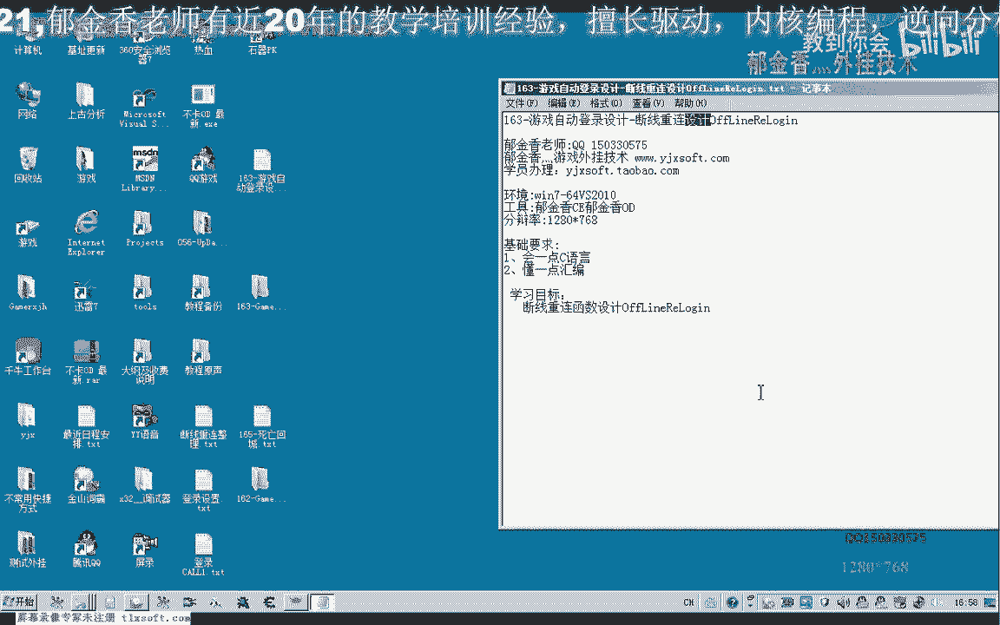
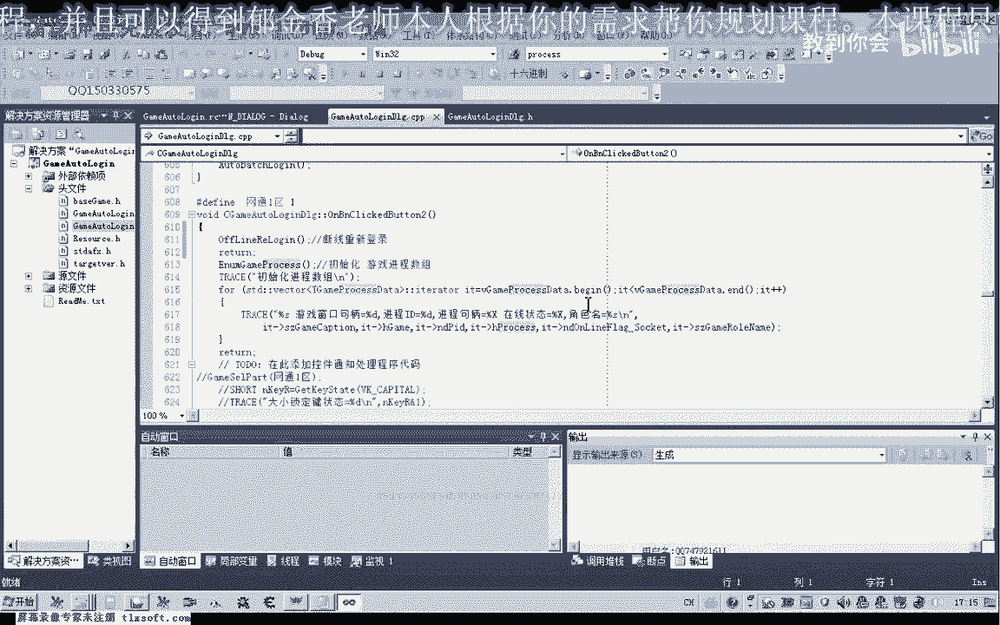
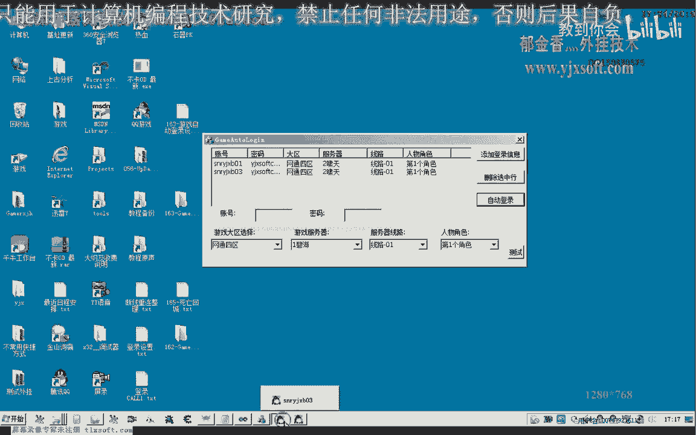
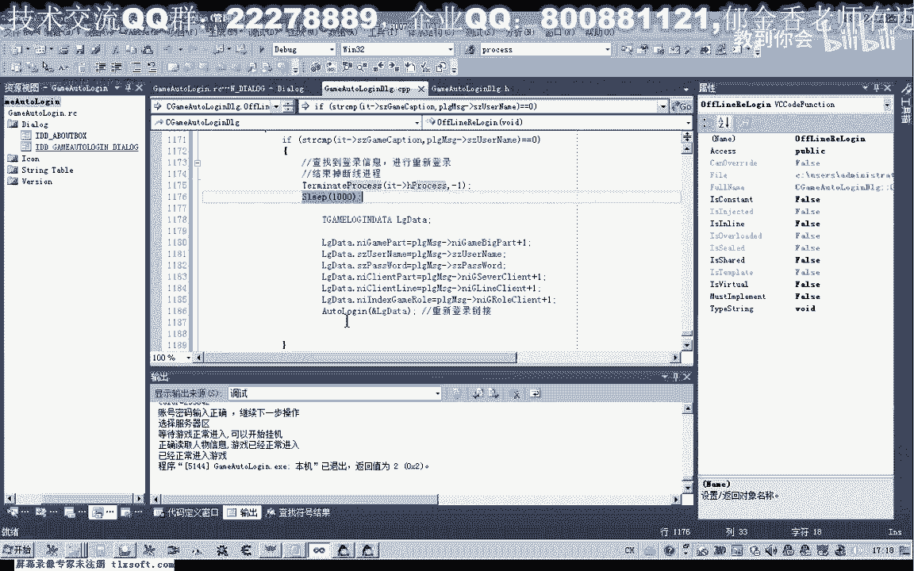
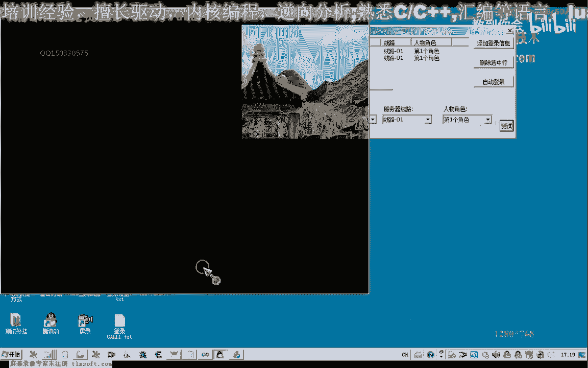
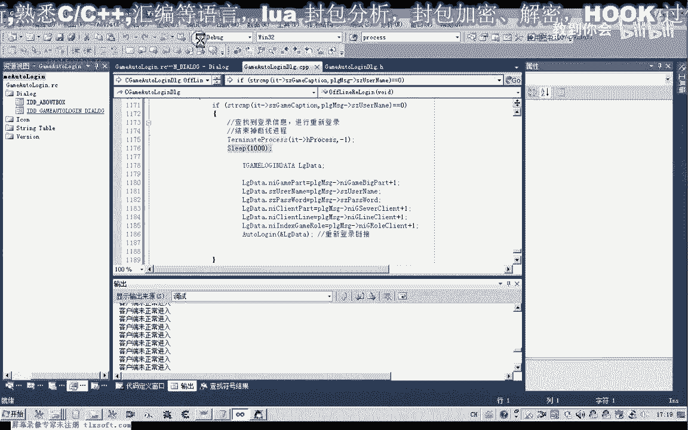
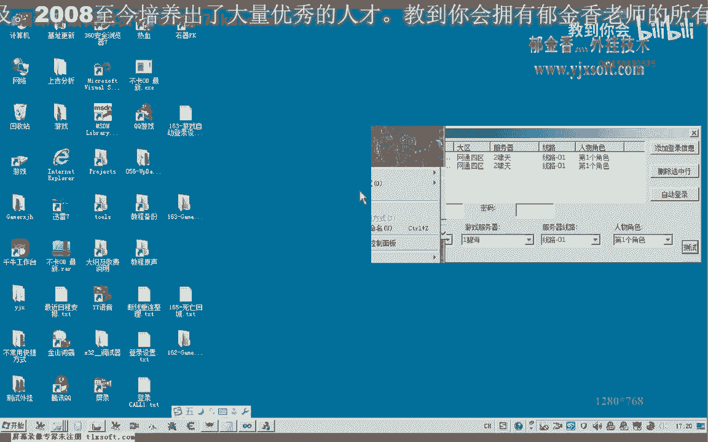
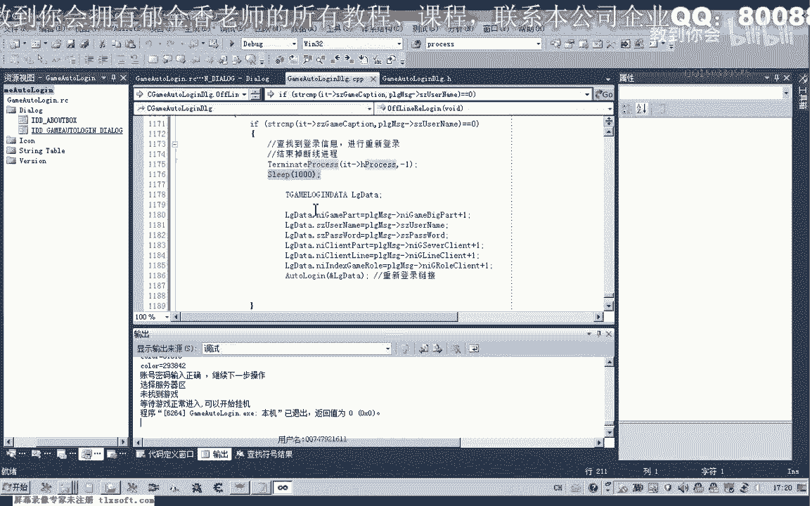

# P152：163-游戏自动登录设计-断线重连设计OffLineReLogin - 教到你会 - BV1DS4y1n7qF

大家好，我是郁金香老师，这节课我们编写断线重连的代码，那么打开了162克的代码，那么首先我们转到内里边添加相关的这个函数。

那么或者我们自己手动的转到投影键里面去添加我们的函数，然后添加我们的函数，那么我们现在可以看到我们的函数都已经添加在内了，我们现在可以看到我们的函数都已经添加在内了。

那么我们现在可以看到我们的函数都已经添加在内了，我们现在可以看到我们的函数都已经添加在内了，那么我们现在可以看到我们的函数都已经添加在内了，那么我们现在可以看到我们的函数都已经添加在内了。

那么我们现在可以看到我们的函数都已经添加在内了，那么我们现在可以看到我们的函数都已经添加在内了，那么我们现在可以看到我们的函数都已经添加在内了，那么我们现在可以看到我们的函数都已经添加在内了。

那么我们现在可以看到我们的函数都已经添加在内了，那么我们现在可以看到我们的函数都已经添加在内了，那么我们现在可以看到我们的函数都已经添加在内了，那么我们现在可以看到我们的函数都已经添加在内了。

那么我们现在可以看到我们的函数都已经添加在内了，那么我们现在可以看到我们的函数都已经添加在内了，那么我们现在可以看到我们的函数都已经添加在内了，那么我们现在可以看到我们的函数都已经添加在内了。

那么首先我们要检测看游戏是否断线，那么首先我们要检测看游戏是否断线，那么首先我们要检测看游戏是否断线，那么在检测的时候，我们首先要对相应的动态数据断线进程数据相关的数据进行初始化。

我们首先要对相应的动态数据断线进程数据相关的数据进行初始化，我们首先要对相应的动态数据断线进程数据相关的数据进行初始化，我们首先要对相应的动态数据断线进程数据相关的数据进行初始化，进行一个初始化。

(音量注意)，(音量注意)，那么初始化这个数据之后，我们就可以开始遍离相关的一个数据，当然我们还有另外的一种写法，我们就是直接在回调函数里面去改它，那么也是可以的，这一种方法。

但是这里我们把它分开的处理，这样的设计我个人觉得可能要好一点，那么这个时候开始遍离我们的进程信息，那么找出断线的掉线的进程，(音量注意)，(音量注意)，(音量注意)，(音量注意)，(音量注意)。

(音量注意)，(音量注意)，(音量注意)，(音量注意)，(音量注意)，那么加上标准库的程序，(音量注意)，(音量注意)，(音量注意)，那么遍离的时候我们就判断一下，看是某个进程有掉线的一个情况。

(音量注意)，那么如果他不在线的话，也就是掉线，(音量注意)，(音量注意)，(音量注意)，(音量注意)，那么如果是掉线的情况，这里我们就进行一个掉线的处理，就重新连接相应的。

重新登录我们相应的账号和密码，那么我们实际上在这里边的话，我们已经保存了他的账号和密码，在这个结构里边我们可以直接用，那么游戏标题这里，实际上就是他的游戏账号，当然我们也可以。

当然这个是通过取得这个标题来获得，他的这个账号，那么另外我们也可以读取这个内存，来获取这个游戏的账号，那么我们有了这个账号之后，再去查询这个表格里边的相应的密码，那么我们就可以实现他的一个登录。

那么暂时我们就用这个SizeK不行了，来充当我们的账号，他本来也是账号，现在这个时候，好，那么我们再倒回来，在这里的话，我们就是查询整个表，那么之前的话我们有一个表，VTUidetab。

那么我们需要骗你这个表去找到账号的，所在的相应的用户信息，所以说我们还要进行一次骗你，那么这个时候，我们主要是用来获取我们用户的一个登录的一个信息，(音樂)，(遊戲畫面)，(遊戲畫面)，好的。

我們先編譯生成一下，看一下代碼有沒有錯誤，如果沒有錯誤的話，我們在這裡就取出它的標題，與我們的用戶名做一個比較，這是我們的用戶名，另外我們的用戶信息裏面的，我們需要它帳號的一個登錄名字。

User Name，這兩個名字實際上如果是相同的話，那麼我們就查找到所要的登錄信息了，那麼重新登錄的時候，我們還需要關掉，首先我們要結束掉這個調線的進程，一個Telemetry進程，之前也有用。

在前邊的時候，(遊戲畫面)，(遊戲畫面)，首先這裡是進程的一個劇本，然後我們這裡退出的代碼，隨便傳一個整數進去就可以了，表示是我們結束的，那麼結束掉進程之後，那麼這裡我們可以有一個等待的時間。

所以一秒鐘左右的一個等待時間，應該是足夠了，那麼結束掉進程之後，我們就可以開始重新的登錄，我們看一下我們的Login，我們可以把自動登錄裏面的代碼，複製一部分過來，應該是批量登錄裏面的代碼。

複製一部分過來，(遊戲畫面)，(遊戲畫面)，那麼我們在頭文件裏面找一下，這個函數名我忘記了，看一下批量登錄的代碼，那麼我們把這段代碼把它複製一下，在這段代碼的基礎上我們進行一下修改。

當然這個地方我們就不用相應的Forge，我們就用不著，只需要對這個數據進行一下LogData，進行一下填充，然後這裏我們也不需要它的一個下標，我們直接替換成我們找到的這個指針，好，那麼這個指針替換之後。

我們就可以在這裏嘗試我們的重新登錄，(遊戲畫面)，我們再來看一下相應的邏輯，然後我們可以把它單獨的放在一個定時器裏面，或者是把它放在一個現成裏面，開啟一個單獨的現成，仿佛的檢測。

然後我們肯定也需要在設計的時候，也需要進行一個時間間隔，比如說10分鐘或者是20分鐘左右，我們來檢測一次，這個時間的話可能就差不多，那麼我們再重新編譯申請一下，(遊戲畫面)，然後我們開始來測試一下。

調現好重新登錄的這個函數，(遊戲畫面)。

好的，那麼我們先自動的登錄兩個遊戲，方便我們做測試，那麼遊戲登錄之後，這個時候我們讓它調現，(遊戲畫面)，那麼再讓它重新連接上，再次的我們這個時候我們才開始測試。

(遊戲畫面)，那麼我們還需要這個代碼還需要一點改動，(遊戲畫面)，到最後，那麼這裏我們重新登錄了之後，登錄完成之後，我們應當還是有一段等待的時間，再進行接下來的一個檢測，當然這個時候。

因為我們很多地方都掉了一個Sleep，那麼所以說它這個現成在這裏是一個主賽的一個模式，在運行相當於，那麼我們的窗口的話，它也會夾死，好的，我們先做一下測試，因為這個Word Login裏面。

它本身有這個延遲相關的判斷。

那麼我們應該可以直接這樣用，先做測試，(遊戲畫面)，那麼這個時候我們發現有一個掉線的已經被檢測到了，那麼它嘗試了去重新登錄它，但是這個時候我們發現了，它不會正常的去輸入我們的賬號和密碼，(遊戲畫面)。

那麼我們再次測試一下，那麼好像是在某個位置來卡住了，它未檢測到我們的客服端，好的，那麼我們再重新來一下，(遊戲畫面)。

那麼剛才這個界面的話，應當是它沒有檢測到我們的服務端，而且這個時候它還會重新的登錄一次，如果我們是循環的檢測的話，(遊戲畫面)。

這個時候應當是我們登錄失敗了，那麼我們大致來這幾個我們先設計在這裏，那麼關於這個代碼的完善，我們在下一集看，我們再具體的來完善它相關的代碼，好的。

那麼我們這節課我們暫時就到這裏，下一節課再見。