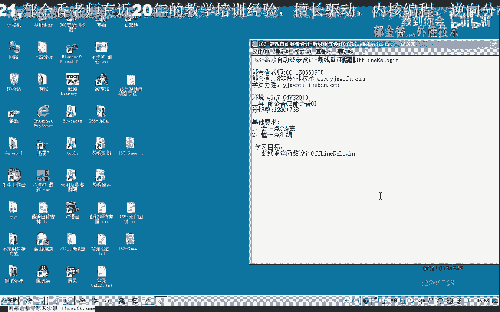
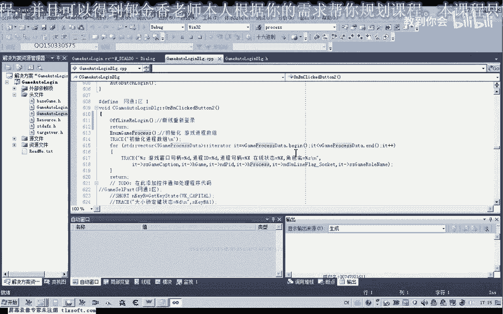
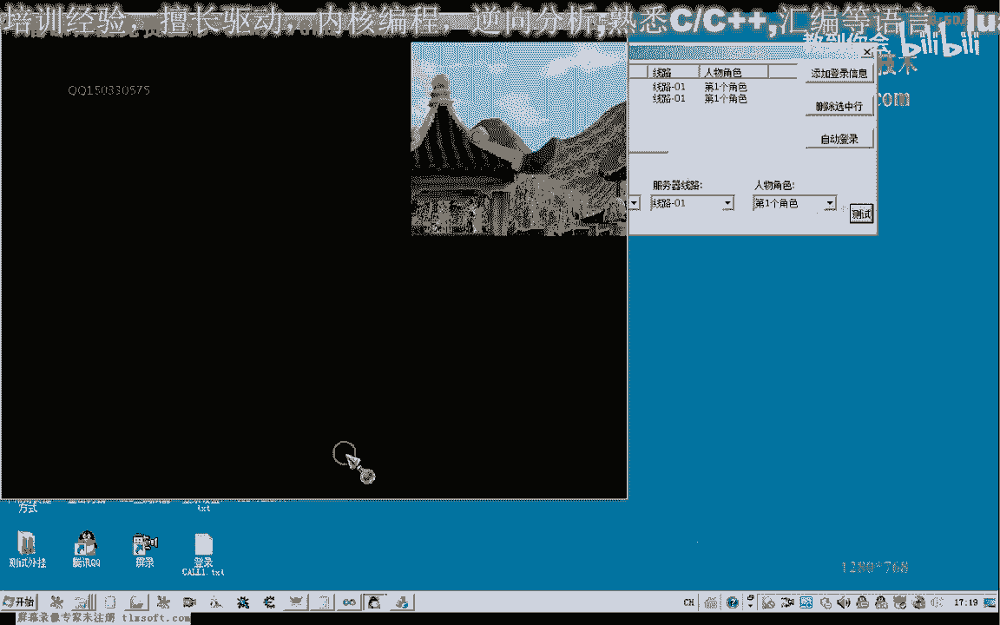
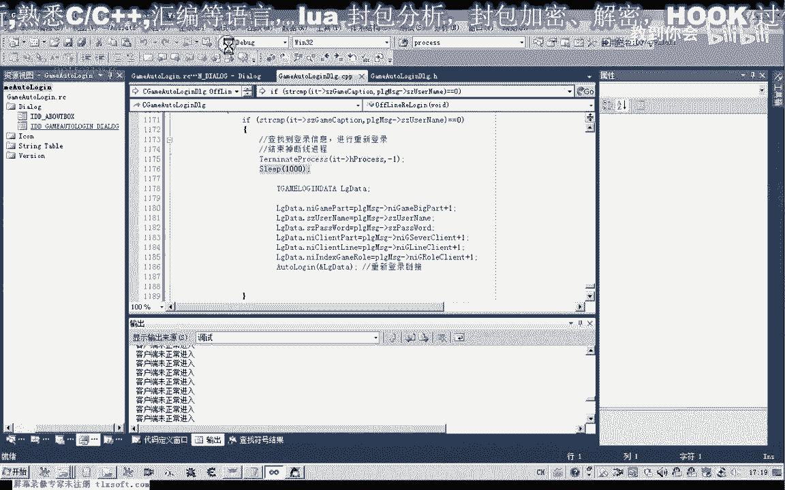

# 课程 P152：163-游戏自动登录设计-断线重连设计 OffLineReLogin 🎮

在本节课中，我们将学习如何为游戏自动登录功能设计和编写断线重连的代码。我们将基于第162课的代码进行扩展，添加检测游戏是否断线以及自动重新登录的功能。

---

## 概述与准备工作

上一节我们介绍了游戏自动登录的基础设计。本节中，我们来看看如何实现断线重连功能。

首先，我们需要打开第162课的代码项目。接着，在项目内部添加实现断线重连所需的函数。

我们可以手动在项目文件中添加这些函数。添加完成后，确保所有函数都已正确包含在项目中。

---

## 检测游戏断线

要实现重连，首先要检测游戏是否已经断线。在开始检测之前，我们需要对相关的动态数据和进程信息进行初始化。

以下是初始化相关数据的步骤：
*   初始化动态数据。
*   初始化断线检测所需的进程信息数据。

初始化数据之后，就可以开始遍历相关的进程数据。另一种写法是直接在回调函数中修改数据，但这里我们采用分离处理的设计，逻辑会更清晰。

此时开始遍历进程信息，目标是找出已经掉线的游戏进程。我们需要引入标准库的相关程序来辅助遍历。

遍历时，我们进行判断：
*   如果某个进程不在线，则判定为掉线。

如果检测到掉线情况，就进入掉线处理流程，即重新连接并登录相应的游戏账号。

---

## 重新登录流程

在掉线处理中，我们需要重新登录账号。实际上，我们已经在程序的结构体中保存了账号和密码信息，可以直接使用。

游戏窗口的标题通常包含账号信息，我们可以通过获取窗口标题来得到账号。此外，也可以通过读取游戏内存来获取账号。

获取账号后，我们需要查询存储密码的表格，以完成登录。目前，我们暂时使用窗口标题作为账号。

接下来，我们需要遍历之前定义的 `VTUidetab` 表格，以找到对应用户的登录信息。这次遍历的目的是获取完整的用户登录凭证。

我们先编译生成一下代码，检查是否有错误。如果没有错误，就继续执行。

我们将取出的窗口标题与用户名进行比较。用户名来自用户信息结构体中的 `User Name` 字段。如果两者相同，就找到了对应的登录信息。

重新登录前，需要先结束掉已经断线的游戏进程。我们使用进程结束函数，并传入一个整数作为退出代码。

结束进程后，可以等待一小段时间，例如一秒钟，以确保进程完全关闭。

进程结束后，就可以开始重新登录。我们可以参考自动登录或批量登录功能中的代码。

在头文件中找到批量登录的函数，将相关代码复制过来，并在此基础上进行修改。

我们不需要使用原有的循环结构，只需对登录数据 `LogData` 进行填充。同时，将代码中对应的下标替换为我们找到的用户信息指针。

替换指针后，就可以在此处尝试重新登录。

---

## 整合与循环检测

我们再来审视一下整体逻辑。可以将断线检测和重连逻辑单独放在一个定时器里，或者开启一个独立的线程来循环执行检测。

在设计时，需要设置一个检测时间间隔，例如每10分钟或20分钟检测一次，这个频率比较合适。

我们再次编译生成代码，然后开始测试断线重连函数。

为了方便测试，我们先自动登录两个游戏客户端。游戏登录成功后，手动让其中一个客户端断线，然后再尝试让它重新连接上。完成这些操作后，我们正式开始测试。

测试发现，代码还需要一些改动。在重新登录完成之后，应该再等待一段时间，才进行下一次检测。因为代码中多处调用了 `Sleep` 函数，如果直接在主线程中运行，可能会导致窗口卡死。

我们先进行测试，因为 `Word Login` 函数内部本身包含一些延迟判断。

测试时，我们发现有一个掉线的客户端被成功检测到，并且程序尝试去重新登录它。但是，它没有正常地输入账号和密码。

我们再次测试，程序似乎在某个位置卡住了，没有检测到游戏客户端。

刚才的界面显示，它没有检测到游戏服务器。如果是在循环检测中，它还会尝试重新登录。

此时应该是登录失败了。我们先将基本框架设计到这里，关于代码的进一步完善，我们将在下一节课中具体进行。

---

## 总结

本节课中，我们一起学习了如何为游戏自动登录程序添加断线重连功能。我们实现了断线检测、进程结束、以及自动重新登录的核心流程，并搭建了基本的测试框架。虽然目前还存在一些需要完善的问题，但核心机制已经建立。下一节课我们将继续完善相关代码。

本节课暂时到这里，下一节课再见。