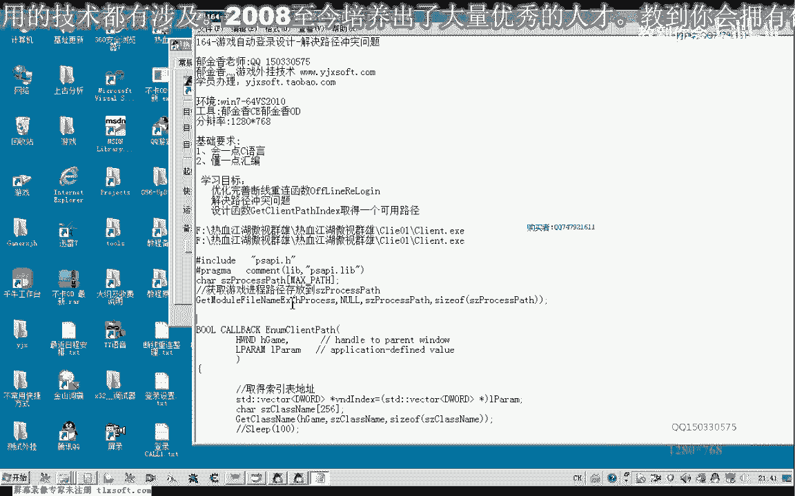
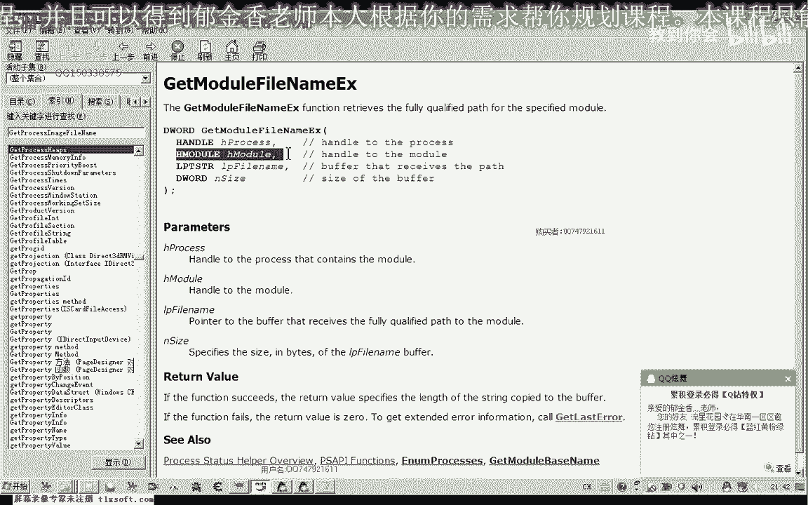
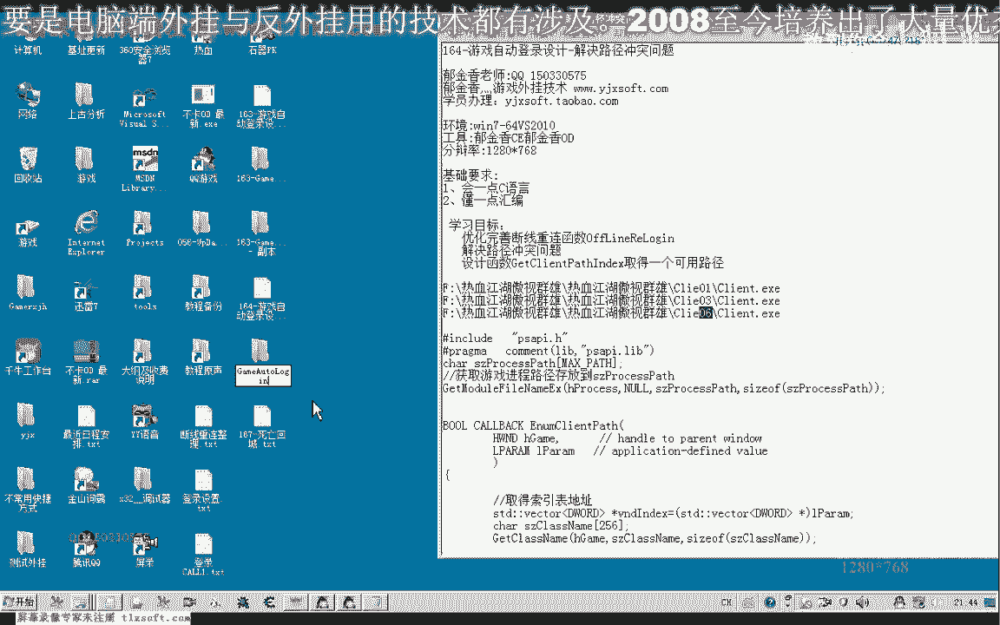
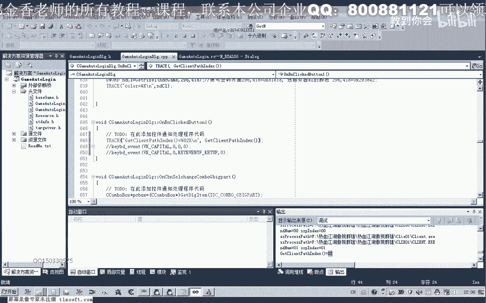
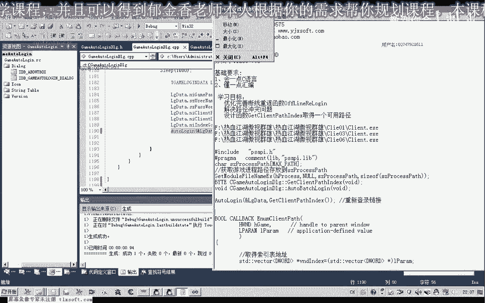

# P153：164-游戏自动登录设计-解决路径冲突问题 - 教到你会 - BV1DS4y1n7qF

大家好，我是郁吉翔老師，這期我們繼續自動登錄的設計，主要是解決斷線之後重新連接的時候，有一個路徑，重複的衝突，我們舉一個例子，因為在這裡我們確保了一些不同的路徑，來登錄我們的遊戲。

那麼這樣才能夠最終的實現一個多開，那麼如果我們的帳號不同的帳號，他在登錄的時候，選擇了一個同樣路徑的客戶端的話，那麼他在啟動的時候，就肯定是不能夠正常登錄的，因為他就不能夠繞過相關的一個檢測。

那麼這個時候我們就需要先檢測一下，指定的相應的編號我們有沒有使用，那麼另外的一種方式，我們也可以檢查路徑，是否在我們的進程列表裡面已經存在了，相應的客戶端他已經運行了，那麼這種思路都是可以的。

那麼今天我講一下，我來解決衝突的一個辦法，那麼首先我們也要重要的是用到一個API，函數，GetMode、FindLane、EX這個函數。

那麼我們先來說一下這個函數的功能，那麼它需要一個進程的一個劇本，那麼第二個是一個模塊的劇本，這個是返回的一個進程的全幕禁名，包含它的進程的EXE，那麼這個是緩衝區的大小，前面這個緩衝區。

這兩個都是與我們的返回值相關的，那麼當我們第二個劇本它為空的時候，我們返回的也就是進程的EXE的路徑，那麼如果我們第二個模塊是動態鏈接庫，這一類的一個劇本的話，那麼返回的就是某個動態鏈接庫。

模塊的一個路徑，那麼這裡當然我們是要組程序的，所以說第二個這個參數我們就為空。

這就是它的一個調用的形式，那麼調用之前我們需要給它分配一塊，緩衝區，支付串流用來存放進程的路徑，然後最後這個是它緩衝區的大小，那麼我們先來認識一下這個函數，等會我們再來編寫相應的函數。

用來獲取一個可用的進程的一個索引ID，比如說這裡的是3，這幾個路徑我們舉個例子，這幾個路徑在我們的進程當中都已經運行，那麼我們就可以來從1到255這樣進行遍領，或者說從1到我們的多開的一個上限。

比如說我們最多用品多開20個，那麼我們就從這裡1到20來做一個判斷，看它相應的索引在我們的進程裡面有沒有打開，那麼比如說我們檢查這個進程之後，我們從1開始檢測，那麼1這個存在，那麼我們跳過再檢查2。

那麼檢查2的時候，我們發現了，與這後面的這些所有進行了一個查詢比較之後，我們發現這個所有可以用，那麼我們就用這個路徑來啟動我們的一個遊戲的一個客服端，大概就是這樣的一個思路，好的。

那麼我們來看一下相應的代碼，那麼這個代碼的設計的話，同樣的是每一局窗口，那麼每一局窗口之後，我們將獲得在這裡來設計了一個動態訴訟的表，那麼這個表就用來獲取已經運行的，這裡是已經運行的這個索引值。

或者是已經運行的路徑，那麼我指的索引值的話，就是這裡的01，這裡的03，這裡的06，06，就是我們的這個索引值，那麼我們先把163個的代碼打開一下，在他的基礎上，我們來進行測試。

比如說現在這裡還運行了兩個01和02，這兩個賬號，那麼我們可以在這裡或者是上面進行測試都是可以的，那麼我們選擇上面一個按鈕進行測試，那麼在測試的時候，我們在這裡編輯了兩個相應的函數。

那麼一個就是用來獲取它的一個反覆一個可用的一個索引號，01，02，03這一類的一個外天籠型的一個索引號，那麼我們先把它複製進來，到最後，當然這個因為是你的內的一個成員函數。

我們在解決方案裡面找到相應的頭文件，添加他的一個說明，這樣我們編譯的話，他不能夠通過的，因為還涉及到一個他的回調函數，那麼這個回調函數，我們還需要給他寫好，這前面就是我們寫的回調函數。

那麼首先我們VD index動態，數據已經運行了一個索引值，是用來存放返回的數值的，這裡建了之後，他本身並沒有數值，那麼在這裡，他的回調函數的時候，我們作為一個參數，把它的指針地址傳送進去。

然後在回調函數裡面，我們對他進行相應的操作，當然我們還要做一點，這個函數的話，現在他不能夠認識他的，那麼我們也需要包含相應的一個頭文件，我相應的這個Apple庫的一個支持。

那麼把這一段兩句代碼加到我們的頭部，好的，那麼我們再次編輯申請一下，那麼我們再來看一下我們剛才的代碼，應當是說到這裡，那麼首先我們在這裡是轉換它的一個類型。

把它轉換成我們Wikipedia動態數據的類型，然後這裡是用一個指針來指向他，那麼等會我們在這後邊計算出相應的數值之後，那麼我們再把這裡已經運行的索引，添加到，那麼這裡我們把相應的這個數據添加到裡面來。

那麼我們來看一下，那麼取得索引號的一個過程，那麼首先我們也要判斷，在沒取窗口的時候，我們要判斷，通過他的內的一個名字，這裡是取得我們指定窗口取的內名，那麼取得窗口的內名之後。

我們保存到我們這個Size Class內裡面，然後與我們的遊戲的窗口論明做比較，那麼如果比較它這裡相等的話，這是0%，那麼就會執行到這個位置，執行到這個位置之後，表明它肯定就是我們的遊戲的窗口。

那麼我們可以通過遊戲窗口的這個劇本，獲得進程的PID，然後再獲得進程的劇品，那麼獲得進程劇品之後，我們再調用這個Get Modify Name，那麼就能夠獲得進程的路徑。

那麼我們可以在這裡把進程的路徑打印出來看一下，那麼我們就從這個位置來載斷之後，我們看一下，那麼從這裡返回之後，讓他繼續片面，我們看一下他執行的一個結果，測試，那麼測試的時候，我們需要調一下這個函數。

那麼我們就把這個函數調到這個位置上，然後我們可以進入這個遊戲的畫面，那麼我們可以在這裡進入這個畫面，然後我們可以進入這個畫面之後，我們可以辨認這個畫面是否正確的，那麼我們進入這個畫面之後。

我們可以看到這個畫面的設定是正確的，那麼我們可以進入這個畫面之後，我們可以看到這個畫面的設定是正確的，那麼我們可以進入這個畫面之後，那麼顯示一下相應的按鈕，那麼我們可以看到這個時候獲得的進程路徑的話。

他就是我們的完整的一個進程路徑，但是我們注意這裡是大寫的，這裡是小寫的，那麼這個路徑裏面的話，他可能有一個大小寫的一個區別，那麼現在我們就是要搜索路徑裏面的取得這兩個字符串。

那麼取得之後再把它轉化成一個整數，那麼這樣就能夠得到我們已經在運行當中的一個索引號，就是要取得這兩個數字把字符串轉換成整數，那麼我們可以在編寫代碼的時候，我們繼續來看一下，那麼我們把這一句給它除掉。

繼續看後面的代碼，那麼後面的代碼，因為我們路徑裏面可能有大寫，可能有小寫，那麼我們先從字符串，你停這個位置到他最長的這個String的位置，我們進行一個什麼大小寫的一個轉換。

那麼我們看一下大小寫轉換之後的一個情況，那麼從這裡，同時我們在後面這個位置再次反映一下相應的字串，那麼我們可以看到，那麼下邊這一行的話，全部都是大寫的，那麼這樣的話就便於我們一會兒的字符串的一個搜索。

那麼我們要搜索的字符串就是CLIE，那麼這個字串，那麼這個時候馬上我們就可以調用一個搜索字串的函數，查找我們的CLIE，那麼就用這個str str來查找這個字串，查找之後，他將定位到這個位置。

也就是他會指向後面這一個字串，但是同樣不是我們所要的，那麼如果我們查找成功，他不為空的話，將執行到最後面這個位置，那麼我們看到CLIE，他佔了四個字節，所以說我們讓這個字加4，往後移。

那麼加4的話就指向了0這個位置，01，或者是00這個位置，那麼到了這個位置之後，我們就可以用我們的A2I，把字串轉換成我們的整數，好的，那麼我們再來看一下轉換成整數之後的情況。

那麼這個時候我們就可以直接運行，再測試，那麼我們可以看到這是轉換成整數之後的一個情況，那麼這前面是這個Number用16進制來格式化的，後面這個是字串，這是字串，我們看兩個的輸出的話，實際上是一致的。

當然我們也可以使用進制，那麼所以說我們取得的我們運行當中縮影的話，他已經成功了，那麼已經成功了之後，我們還要什麼，還要計算一下要取得一個什麼，要取得一個，要取得一個未使用的，ID。

然後返回供我們的登錄函數來使用，那麼所謂說我們動態輸出成功的取得初始化之後，那麼是在這個位置，我們不斷的添加了已經運行的縮影號，那麼所以說我們這個時候需要自己計算出一個縮影號，那麼這個縮影號。

他沒有在我們的進程當中運行過，那麼這個時候，我們可以從0到16來騙你，當然你也可以設為25，或者0xff都可以，那麼也可以設大一點，也可以設小一點，反正就是得多開的上限，你想多少開的時候。

這裡就設置多大，一般來說這個遊戲的話，10開左右可能就幾十開，這個內存數都大的情況下，內存數大的話，那麼像我的電腦的話，可能最多能夠開十多個號，那麼在這裡我們做測試用的話，就設為20就可以了。

或者你要設大一點也是可以的，那麼我們去騙你，他就設為60，那麼我們就從0到59進行一個騙你，這裡因為一個等號就是到60，那麼我們騙你的時候，我們就到這個數據裡面去找，我們編號在裏面是否已經運行。

那麼運行的話，我們動態訴訟裏面相應的元素，那麼取出來，他肯定就有一個與我們當前查詢的，這個相等，那麼如果是相等的話，這裡我們就break，break就會執行到這個地方，那麼這個地方，我們就要判斷判斷他。

這裡是就是說是由於break來退出的，還是由於我們的這個運行完之後，再退出的，那麼如果是他整個剖循環都騙你完成了，那麼這個界在上面這個界，在我們的動態訴訟裏面，他不存在，那麼就像我們這裡有1和2。

這兩個所以已經使用了，那麼如果我們在裏執行到1和2的時候，他直接就會從這個地方，就可能就退出了，在裏面找到了他的一個數字，但是找到的時候，這裡應該說大於，這裡應該是，大於等於的是，都應該是反過一個針子。

那麼也就是說這個循環完了之後，那麼完了之後的話，我們都沒有找到的話，那麼證明這個I的這個數值的話就是可用的，就是可用的，那麼如果我們在這裡，他提前退出了，比如說他本身的數值這兩個的話。

這裡應該是他的大小應該是為2，那麼為2的時候的話，那麼他會查詢到1的時候，1和2的時候，他實際上都能夠查詢到在裏面查詢到這個數字，從這裏他會退出，然後我們到這裏來，就是說0和1的時候，他應該會退出。

在這裏的話，因為他借的值來等於0或者是1，那麼他就不大於這個2，那麼說在這裏的話，他始終不會被執行到，那麼只有這個數值借的數值等於2的時候，也就是說他的下標是第三個下標為2的時候。

那麼我們繼續在裏面來查詢這個數字2，那麼數字2的話，因為他裏面這個數字實際上只包含了0和1，我們在這裏能夠看到他的下標只包含0和1，那麼所以說2這個下標的話，他在裏面都查詢不到，查詢不到了。

這句代碼一直不會被執行，所以說這裏比較完了之後，他的值等於我們size的時候的話，他依然沒有查詢到，那麼所以說他會退出這個循環，會執行到這裏，這個時候就會返回一個可用的一個索引。

那麼我們把它也打印出來看一下，看一下他的一個返回時間，好的，那麼我們再次生存一下，測試一下，那麼我們發現的話，他已經使用的這個索引號有01001，但是可以使用的最小的數字的話就是02。

他肯定是返回最小的一個，那麼實際上可用的話，還有0304 0506，那麼這些索引的話都可以用，但是我們要根據我們的這個遊戲進程的目錄來。

那麼如果我們建的過多的話，他會影響我們的硬盤，因為我們每一個目錄的話都有幾十兆，好的。

那麼這節可能我們暫時就到這裏，那麼下一節可能我們還要解決其他的一些問題，比如說我們的遊戲的客服端進程，他異常的退出了，我們要做這一類的檢測，那麼異常退出的話，我們也要重新登錄，要遍離這個表。

那麼遍離這個表，比如說我們檢測到這個帳號，他所在的這個進程的話已經被關閉了，或者異常的退出了，那麼我們也需要重新登錄這個帳號，好的。

那麼我們下一節再見，當然還有一些值得優化的一個地方，那麼比如說我們在測試的時候來發現，我們在登錄的時候看一下，在PIN上登錄的時候，我們最後如果他是帳號重新登錄的話，他也會斷開鏈接。

那麼可能他就會異常的退出，那麼異常的退出之後，我們在這個位置的時候，那麼在讀取人物信息的時候，在這裏是60，那麼這裏是2000，足足要等待兩分鐘的時間了，他才能夠退出，但是這個時候可能進程他已經退出了。

所以說他始終不可能讀到人物信息的，那麼我們可以在這個位置編輯優化的函數，檢測，那麼如果指定的進程，我們通過這個劇本去判斷他，如果他都沒有，已經沒有運行的話，那麼我們就可以來什麼，就可以退出了。

就可以直接的退出這個區塊，那麼我們可以給寫個函數，可以寫一個函數，那麼也可以通過這個ReaderProcess Memory，他的返回值來做一個判斷，那麼如果他是讀取不成功的話，他的返回值將會是0。

好像，我們可以查詢一下，看一下他的一個返回值，那麼如果這個函數成功的話，他返回來是一個非0的值，那麼失敗的話，就是返回一個0值，所以說我們只需要判斷他的一個返回值就可以了，如果讀取失敗的話。

直接我們就退出這個循環，不用再等待了，那麼我們也可以寫出這個函數的信息，那麼可能更方便判斷一些，好的，那麼我們下一節課再討論這一類的問題，那麼這節課我們暫時就到這裡，下一節課再見，對了。

我們還有一個地方可以改進的，再退回，那麼我們剛才已經寫了這個函數，那麼寫了這個函數的話，我們在批量登錄的時候，我們就應該要用，Votanlog，那麼這裡我們就需要改，我們需要把我們計算的可用的數字。

把它替換掉這個NP index，這兩行我們就需要注釋掉，因為這個值不是像這樣來，累加計算的話很容易做錯，很容易就是說造成登錄的失敗，那麼我們把這個值提到它的前邊，作為一個參數，傳送性的，好的。

那麼我們看什麼地方調用到了這個數值，那麼在這裡的時候，我們就直接的每次來可以用我們的，getty，剛才我們寫的這個函數叫什麼名字，我們看一下，那麼就可以直接用這個來返回一個，鎖引值，來檢測一下。

那麼這樣的話就可以避免相應的問題，當然我們還需要了把這個做一個前置的，一個說明，看一下，這個不是我們的綠成員函數，賬號平台登錄的，那麼我們還需要來把它也寫成綠成員函數，才能夠訪問我們的綠。

那麼在投文件裡面，加一下，還有一個地方，好的，那麼這樣的話就不會有我們的一個，就解決了一個路徑的一個衝突，好的，那麼我們下一節課再見，嗯，请不吝点赞 订阅 转发 打赏支持明镜与点点栏目。

请不吝点赞 订阅 转发 打赏支持明镜与点点栏目，请不吝点赞 订阅 转发 打赏支持明镜与点点栏目，请不吝点赞 订阅 转发 打赏支持明镜与点点栏目。

