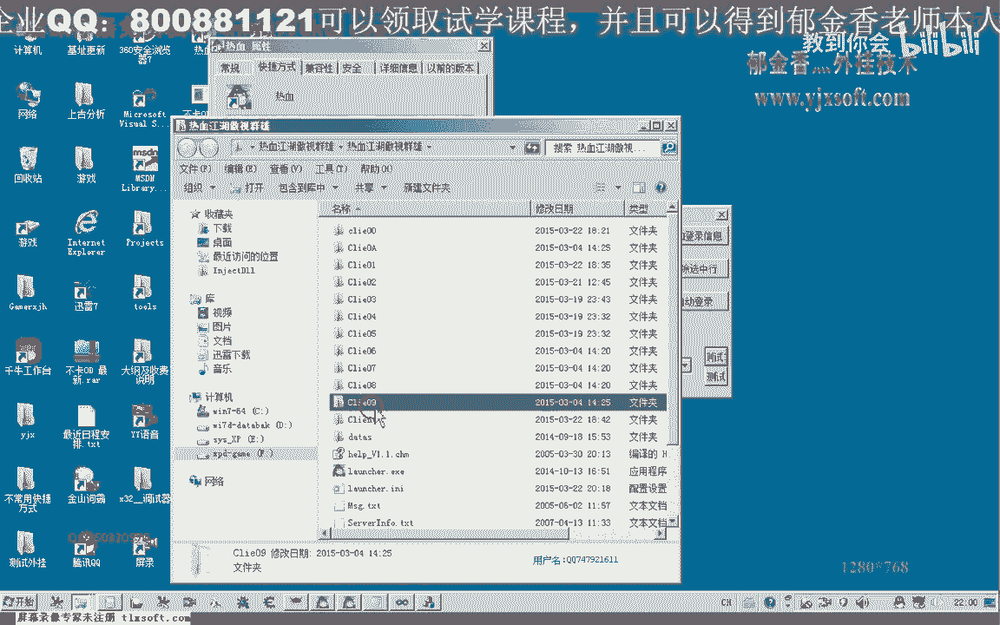
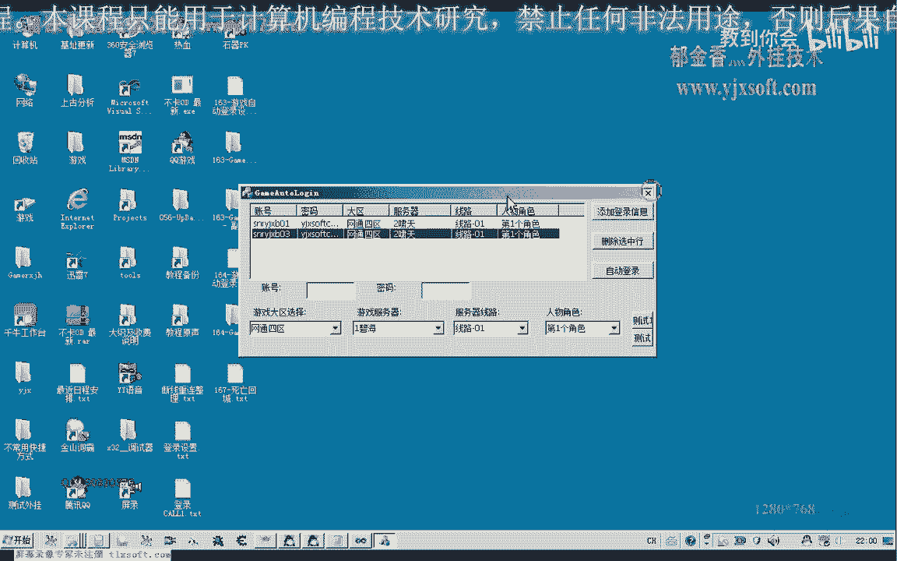

# 课程 P153：游戏自动登录设计 - 解决路径冲突问题 🎮

在本节课中，我们将学习如何解决游戏多开时，因客户端路径冲突导致登录失败的问题。我们将通过检测已运行进程的路径，动态分配一个未使用的客户端索引，从而实现稳定、无冲突的自动多开登录。


---

## 问题背景与解决思路


上一节我们介绍了自动登录的基本框架。本节中我们来看看一个具体问题：当多个游戏账号尝试使用同一个客户端路径登录时，会发生冲突，导致登录失败。

为了解决这个问题，我们需要在启动新客户端前，检查目标路径是否已被占用。核心思路是遍历所有已运行的特定游戏进程，获取它们的完整路径，并从中解析出使用的索引号（例如路径中的`01`、`02`）。然后，我们选择一个未被占用的最小索引号，用于启动新的客户端。

以下是两种可行的检测思路：
*   检查指定的客户端编号是否已被使用。
*   检查目标路径是否已存在于当前进程列表中。


本节课将采用第二种思路，并介绍实现所需的关键API函数。

---

## 核心API：`GetModuleFileNameEx`

我们解决冲突的办法，核心是使用一个Windows API函数：`GetModuleFileNameEx`。

这个函数的功能是获取指定进程中某个模块的完整路径文件名。它的参数如下：
*   `hProcess`: 进程句柄。
*   `hModule`: 模块句柄。当此参数为`NULL`时，函数返回进程的可执行文件（.exe）路径。
*   `lpFilename`: 指向缓冲区的指针，用于接收路径字符串。
*   `nSize`: 缓冲区的大小。

因为我们需要获取的是主程序的路径，所以第二个参数`hModule`设置为`NULL`即可。

其调用形式类似于：
```cpp
DWORD GetModuleFileNameEx(
  HANDLE  hProcess,
  HMODULE hModule,
  LPTSTR  lpFilename,
  DWORD   nSize
);
```
在调用此函数前，我们需要为其分配一块字符串缓冲区来存放获取到的进程路径。

---

## 实现流程详解

认识了核心函数后，我们来编写相应的函数，用于获取一个可用的进程索引ID。

假设当前已有索引为`01`、`03`、`06`的客户端在运行。我们的流程是：
1.  枚举所有游戏窗口，获取其对应进程的完整路径。
2.  从路径中解析出已使用的索引号（如`01`, `03`, `06`），并存入一个列表。
3.  在一个预设的范围内（例如从`1`到`20`，代表支持最多20开）进行遍历。
4.  检查当前遍历的数字是否存在于已使用的索引列表中。
5.  返回第一个未在列表中找到的数字，即为可用的最小索引号。

例如，已使用列表为`[1, 3, 6]`。我们从1开始检查，1存在则跳过；检查2，发现不在列表中，则返回2作为可用索引。

---

## 代码实现与解析

我们将在原有代码基础上增加冲突检测功能。主要新增两个函数：一个回调函数用于枚举窗口并收集已运行的索引；另一个函数用于计算并返回一个可用的索引号。

首先，需要在代码头部包含必要的头文件和库：
```cpp
#include <TlHelp32.h>
#include <Psapi.h>
#pragma comment(lib, "Psapi.lib")
```

以下是核心步骤的代码逻辑：

**1. 枚举窗口与收集索引**
我们通过`EnumWindows`函数遍历所有顶层窗口。在回调函数中：
*   获取窗口类名，与游戏窗口类名进行比较，确认是目标游戏窗口。
*   通过窗口句柄获得进程ID（PID），再打开进程获得进程句柄。
*   调用`GetModuleFileNameEx`函数，获取该进程的完整可执行文件路径。
*   将路径统一转换为大写，便于后续字符串处理。
*   在路径中搜索特定子串（如`"CLIENT"`），定位到其后的索引数字部分。
*   使用`atoi`函数将数字字符串转换为整数，这就是已运行的索引号，将其添加到一个动态数组（如`std::vector`）中。

**2. 计算可用索引**
在收集完所有已运行索引后，我们编写函数`GetAvailableIndex`来计算可用索引：
*   预设一个多开上限，例如`60`。
*   从`1`开始循环到这个上限值。
*   对于每个循环值`i`，在已运行索引数组中查找是否存在。
*   如果找不到，则`i`就是可用的索引，立即返回。
*   如果循环结束都未返回，说明所有索引都已占用（理论上不应发生在上限设置合理的情况下）。

**3. 集成到登录流程**
在批量登录的函数中，不再使用简单的累加来分配索引，而是改为调用`GetAvailableIndex`函数，获取一个确保未冲突的索引号，用于构建客户端路径并启动进程。

---


## 优化与后续计划



本节课我们实现了基本的路径冲突检测。然而，一个健壮的自动登录系统还需要处理更多异常情况。



例如，游戏客户端进程可能异常退出。我们需要能够检测到这种情况，并自动重新登录该账号。这要求我们维护一个账号-进程的映射表，并定期检查进程是否存在。

此外，在登录等待环节（如读取人物信息时），如果进程已经异常退出，代码不应长时间等待。我们可以通过检查`ReadProcessMemory`等函数的返回值来判断目标进程是否存活。如果读取失败，应立即退出等待循环，进行错误处理或重试。

在下一节课中，我们将探讨如何实现进程存活性监控和异常重启机制。

---

## 总结

本节课中，我们一起学习了如何解决游戏多开自动登录时的路径冲突问题。

我们首先分析了问题根源：多个实例使用相同路径会导致冲突。接着，引入了`GetModuleFileNameEx`这个关键API来获取运行中进程的路径。然后，详细阐述了“枚举进程 -> 解析已用索引 -> 计算可用索引”的实现流程，并集成了到自动登录逻辑中。最后，我们讨论了当前方案的优化点，如增加进程异常退出的检测，为构建更稳定的自动化脚本奠定了基础。


通过本课的学习，你应该能够为自己的多开脚本增加智能的路径选择功能，避免手动管理客户端目录的麻烦。