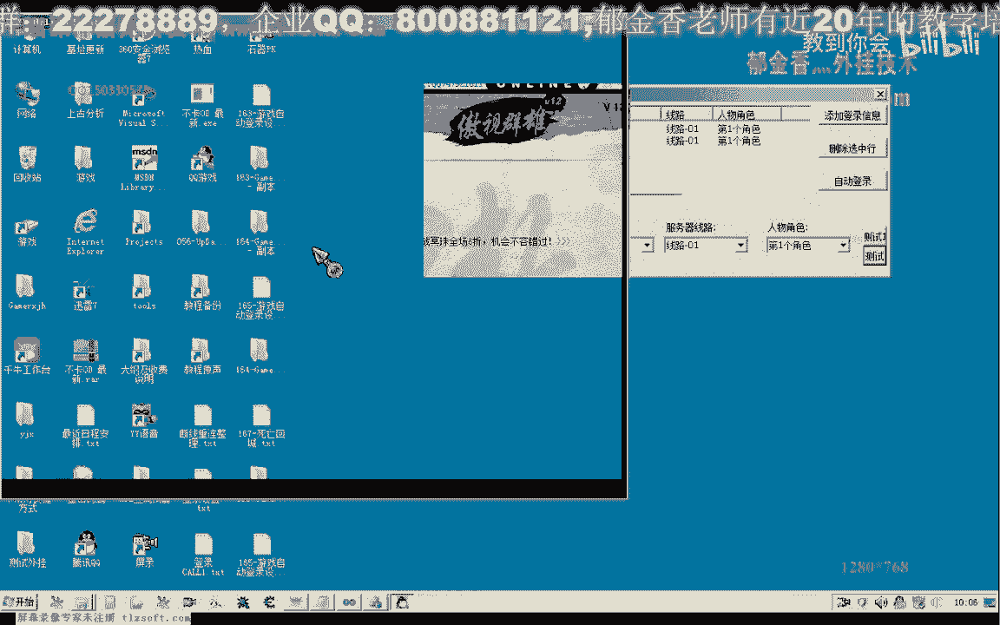

# 课程 P154：游戏自动登录设计 - 完善掉线重连功能 - 进程退出检测 🎮


在本节课中，我们将学习如何为游戏自动登录系统增加进程退出检测功能。我们将完善掉线重连逻辑，使其不仅能检测账号掉线，还能检测游戏进程是否异常退出，从而确保所有指定账号都能保持在线状态。

---

## 概述

上一节我们实现了基础的掉线检测与重连。本节中，我们来看看另一种需要处理的情况：游戏进程本身已异常退出。这意味着账号并未正常登录，我们需要检测到这种情况并重新启动登录流程。

## 检测进程异常退出

我们需要在现有的离线登录函数中增加对进程状态的检测。之前的代码主要检测账号是否已登录但掉线。现在，我们需要额外判断指定账号对应的游戏进程是否仍在运行。

以下是实现此功能的核心步骤。

### 1. 定义状态标记数组

首先，我们需要一个数组来标记每个指定账号的运行状态。

```cpp
bool bAccountRunning[MAX_ACCOUNT]; // 假设 MAX_ACCOUNT 是最大账号数
```

遍历所有正在运行的进程，并与我们的账号列表进行比较。如果某个账号的进程存在，则在数组中将其标记为 `true`（在线）；如果不存在，则标记为 `false`（异常退出或未登录）。

### 2. 遍历与比较账号

接下来，我们遍历需要登录的账号数组。

```cpp
for (int i = 0; i < accountList.size(); ++i) {
    User* pUser = accountList[i];
    bool bFound = false;

    // 与当前运行中的进程列表进行比较
    for (int j = 0; j < runningProcessList.size(); ++j) {
        if (IsSameAccount(pUser, runningProcessList[j])) {
            bFound = true;
            bAccountRunning[i] = true; // 标记为正常登录（进程在运行）
            break;
        }
    }

    if (!bFound) {
        bAccountRunning[i] = false; // 标记为异常退出或未登录
    }
}
```

这段代码完成后，`bAccountRunning` 数组就准确反映了每个账号的进程状态。

### 3. 处理异常退出的账号

得到状态数组后，我们再次循环检查。对于标记为 `false`（即进程已退出）的账号，我们需要重新获取其账号密码信息，并调用登录函数。

```cpp
for (int i = 0; i < accountList.size(); ++i) {
    if (bAccountRunning[i] == false) {
        // 该账号进程已异常退出，需要重新登录
        LoginData data;
        data.username = accountList[i]->GetUsername();
        data.password = accountList[i]->GetPassword();

        // 调用登录函数（需使用上节课改进的、能获取可用客户端路径的版本）
        LoginAccount(data);
    }
}
```

通过以上步骤，系统便能自动发现并重新登录那些进程已退出的账号。

---

## 优化：进程运行状态检测函数

为了更优雅地判断进程是否存在，我们可以封装一个专用函数。其原理是尝试读取游戏窗口的句柄。


```cpp
bool IsProcessRunning(HWND hWnd) {
    if (hWnd == NULL || hWnd == INVALID_HANDLE_VALUE) {
        // 句柄无效，进程已关闭
        return false;
    }
    // 可选的：获取更详细的错误信息
    // DWORD dwError = GetLastError();
    // if (dwError == ERROR_INVALID_WINDOW_HANDLE) {...}
    return true;
}
```

我们可以在读取人物信息等操作前调用此函数。如果检测到进程已退出，则立即返回，避免无谓的长时间等待。

---


## 功能测试与整合


将上述代码整合到离线登录函数后，我们进行测试。

1.  **测试进程退出检测**：手动关闭一个已登录账号的游戏进程，然后触发离线检测。系统应能识别到该账号进程已退出，并自动重新登录该账号。
2.  **测试掉线检测**：让一个账号网络断开（掉线）。系统应能检测到掉线状态并尝试重连。注意，在掉线状态下操作游戏界面可能导致客户端关闭，因此重连过程可能需要多次尝试。
3.  **正常状态测试**：当所有账号均正常在线时，触发离线检测函数，系统应不做任何操作。

测试时需注意，**离线检测函数最好运行在单独的线程中**，否则在执行检测和重连时可能会阻塞主线程，导致程序界面“假死”。

---



## 总结


本节课中我们一起学习了如何完善游戏自动登录系统的掉线重连功能。我们新增了对游戏进程异常退出的检测机制，确保即使进程意外关闭，系统也能自动重新登录账号。

我们主要完成了以下工作：
1.  设计了状态标记数组来追踪每个账号的进程运行状态。
2.  通过遍历比较，区分出正常在线、掉线以及进程已退出的账号。
3.  对进程已退出的账号，自动提取其信息并重新调用登录流程。
4.  封装了进程状态检测函数以优化代码结构。
5.  强调了将耗时检测逻辑放入独立线程的重要性，以保持程序响应流畅。

至此，我们的自动登录系统具备了更健壮的账号状态维护能力。