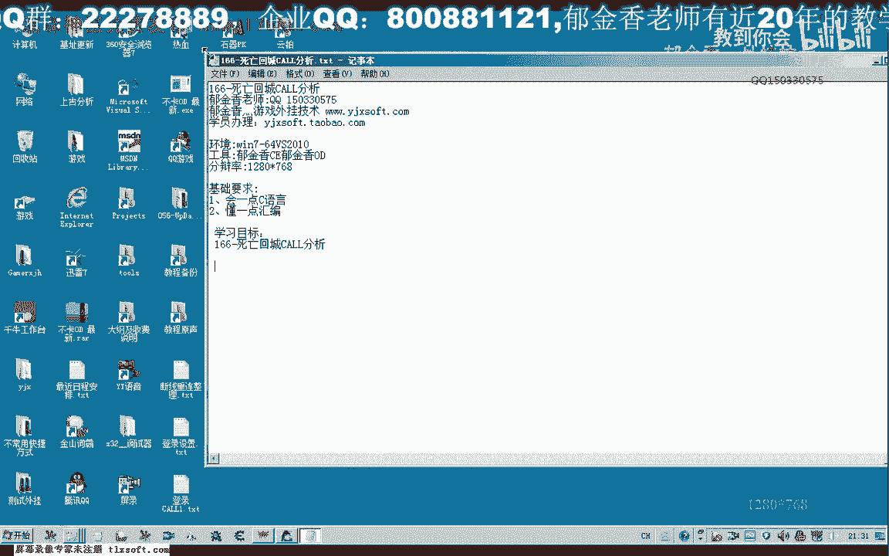
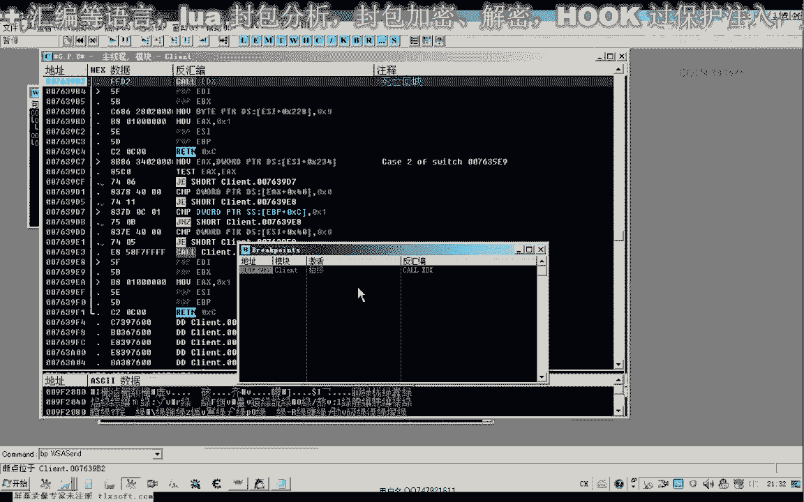
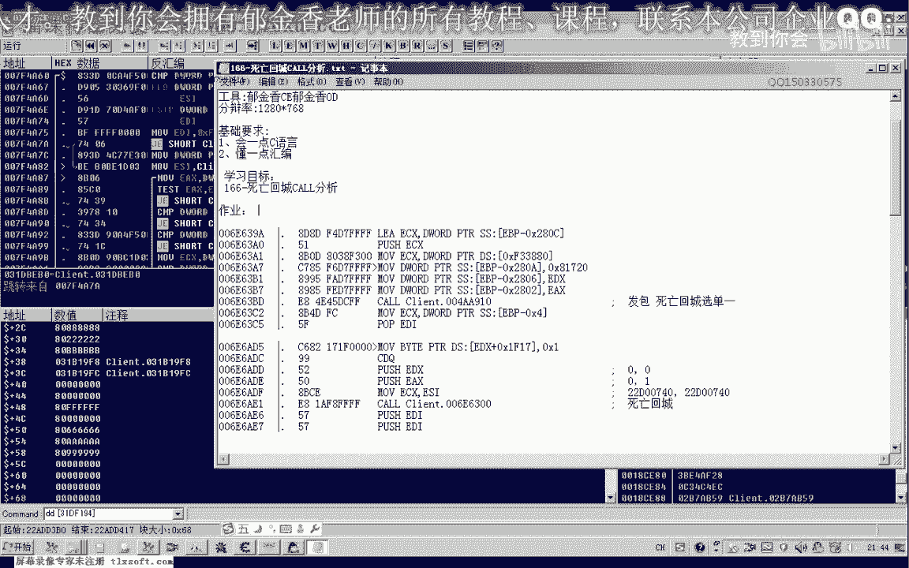
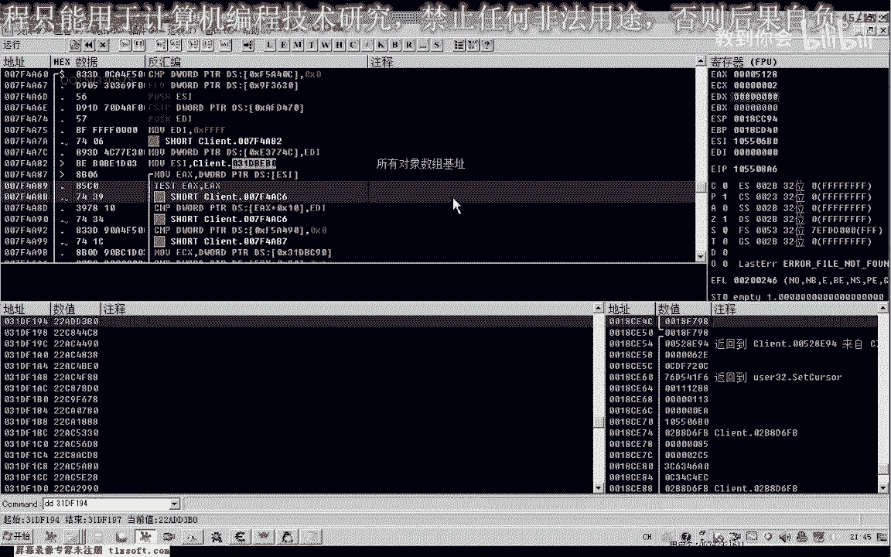

# 课程P155：166-死亡回城CALL分析 🎮



在本节课中，我们将学习如何分析游戏中的“死亡回城”功能调用（CALL）。我们将通过逆向工程工具（如OD）来定位和测试相关的函数调用，并理解其参数传递机制，特别是如何动态获取关键对象地址。


---

## 概述



“死亡回城”是游戏中的一项功能，当角色死亡后，玩家可以选择消耗元宝立即回城。此功能需要向游戏服务器发送特定指令。本节课的目标是分析触发此功能的代码调用点，并理解其参数结构。

---


## 分析准备

首先，我们需要使用逆向工具（如OD）附加到游戏进程。为了准确分析，应暂时取消其他无关的断点，避免干扰。

---

## 定位发包函数

游戏在执行回城操作时，会向服务器发送数据包。无论回城成功、取消还是因元宝不足触发保护，都会发送相应指令。

我们首先关注通过游戏菜单触发回城的情况。菜单中应包含回城选项，选择后游戏会调用一个函数向服务器发送指令。

通过逐步执行（如使用 `Ctrl+F9` 执行到返回），我们可以定位到负责发送菜单指令的函数。这个函数是分析的关键点之一。

---

## 分析菜单指令参数

在分析调用点时，我们发现函数通过一个窗口ID来区分不同的菜单操作。例如：
*   选择菜单1时，传递的ID是 `0x385`。
*   选择菜单2时，ID是 `0x386`。
*   选择菜单3时，ID是 `0x387`。
*   取消操作时，ID是 `0x38B`。

这表明，通过调用同一个函数并传入不同的ID参数，可以模拟各种菜单操作。

以下是调用示例代码：
```cpp
// 假设 ecx 是对象地址，ID 是菜单操作码
call DeathRecallFunction // 内部会根据 ID 处理不同逻辑
```

---

## 测试与验证

我们将找到的函数地址和参数代入代码注入器进行测试。

1.  初始化正确的 `ECX` 参数（一个对象地址）。
2.  分别传入ID `0x385`、`0x386`、`0x387` 来模拟选择回城。
3.  传入ID `0x38B` 来模拟取消操作。

测试发现，当元宝充足时，传入回城ID可使角色成功回城；当元宝不足时，游戏会提示“元宝不足”。这验证了该调用点的有效性。

---

## 寻找关键对象地址（ECX）


上一节我们定位了调用函数和参数ID，本节中我们来看看最关键的部分：如何动态获取 `ECX` 寄存器的值，即函数所需的**对象地址**。

分析表明，这个对象地址来源于游戏的“所有对象数组”。在本次分析中找到的静态地址 `0x31DB1B0` 就是这个数组的基址。然而，这个基址在游戏重启后会发生变化。


在对象数组中，每个对象都有固定结构：
*   `+0x08` 偏移处存放对象类型。
*   `+0x0C` 偏移处存放对象ID。
*   其他偏移存放对象相关数据。

我们需要编写代码，从这个动态的“所有对象数组”中遍历并找到我们角色对应的对象，从而获得正确的 `ECX` 地址。


---


## 课程总结



本节课中我们一起学习了：
1.  如何定位游戏内“死亡回城”功能的发包调用函数。
2.  如何分析并测试该函数的参数（菜单操作ID）。
3.  理解了关键参数 `ECX` 来源于游戏的对象数组。
4.  明确了下一步目标是编写自动化脚本来动态获取正确的对象地址。

---

## 课后作业 📝



请尝试编写一个函数或使用其他方法，动态获取“死亡回城”CALL所需的 `ECX` 对象地址。
*   提示：可以从“所有对象数组”基址出发，遍历数组，根据对象类型或ID筛选出玩家角色对象。
*   目标：确保每次调用都能传入正确的 `ECX` 值，使回城功能稳定工作。