# 课程 P156：死亡回城CALL参数分析（定位动态基址）及函数封装 🎮

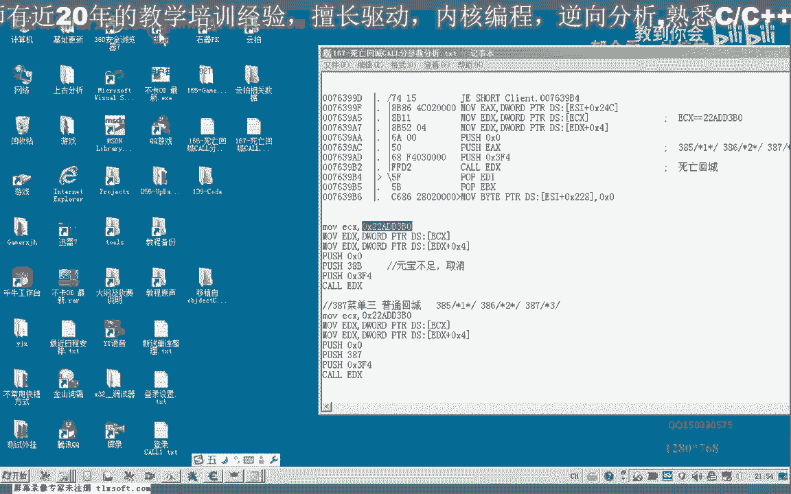

在本节课中，我们将学习如何分析游戏中的“死亡回城”功能，并定位其动态变化的参数基址。我们将通过对比不同游戏状态下的数据，找出稳定的特征值，并最终编写一个函数来动态获取正确的参数。

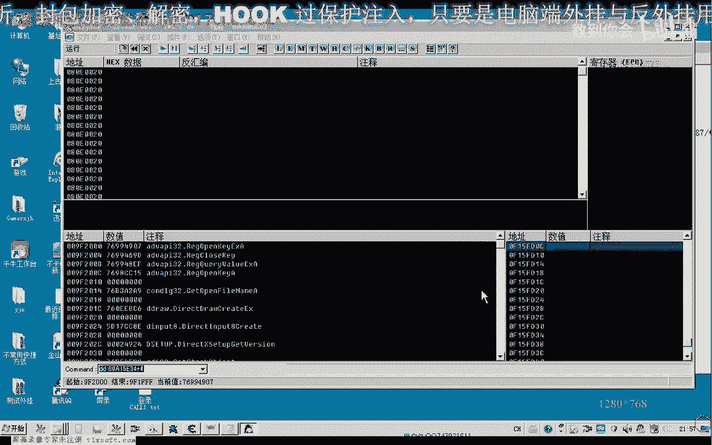


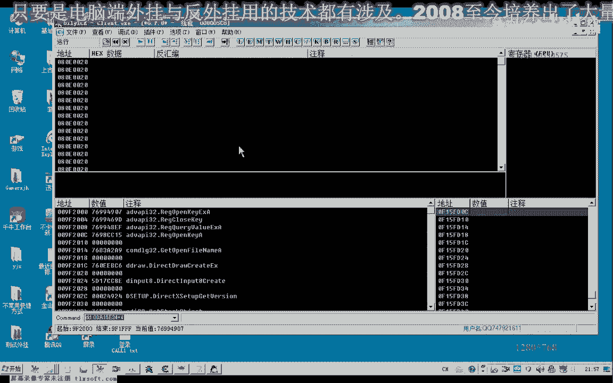

---

## 概述

上一节我们分析了死亡回城CALL的参数结构，发现其中一个关键参数 `ECX` 的地址会随着游戏重启而改变。本节我们将深入分析这个动态地址，找出其内存中的特征，并编写代码来动态定位它。

---

## 分析动态变化的ECX地址

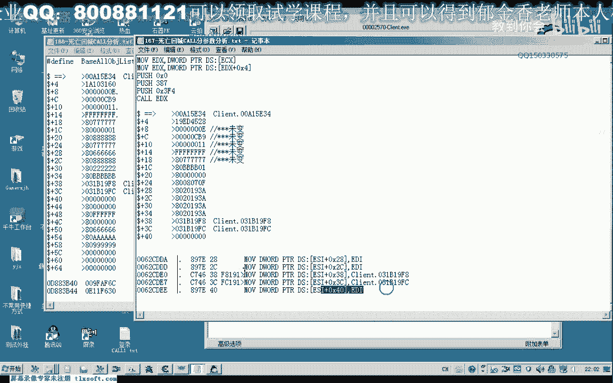

重新登录游戏后，我们使用调试器附加到游戏进程，并转到死亡回城CALL的地址。

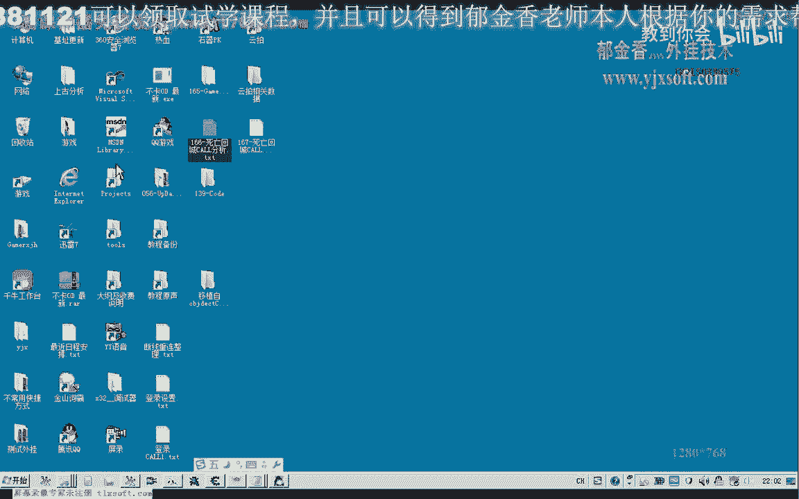

观察此时 `ECX` 寄存器指向的数据，会发现其数值与上一节课记录的值不同。我们需要找出这些数据中不变的部分，作为定位特征。

以下是对象数据的对比分析：

*   **未变化的区域**：数据块起始部分的一行代码、对象类型标识、以及“摇摇”这个偏移位置的数据保持不变。
*   **可能变化的区域**：`+4` 偏移处的数据发生了变化。
*   **两个基址**：数据中存在两个基址（例如 `31118`），它们本身也是动态的，但可以作为中间跳板来定位我们的目标。

我们判断，开头的几个未变化区域是比较稳定的特征。虽然游戏更新后这些特征也可能改变，但目前我们可以利用它们进行定位。

---

## 寻找更稳定的定位特征

为了找到更可靠的定位方法，我们尝试将当前对象数据与已知的游戏基址进行关联。

通过回溯调用代码发现，`ECX` 地址来源于一段指令，该指令从某个地址取出值并加上4，最终得到的就是我们需要的 `Core` 地址。这个 `Core` 地址与游戏角色对象的 `Core` 地址是相等的。

我们进入 `Core` 地址指向的内存，发现其头部有一个常数值 `280`。这个值很可能代表某个数据结构的大小，可以作为稳定的特征码。

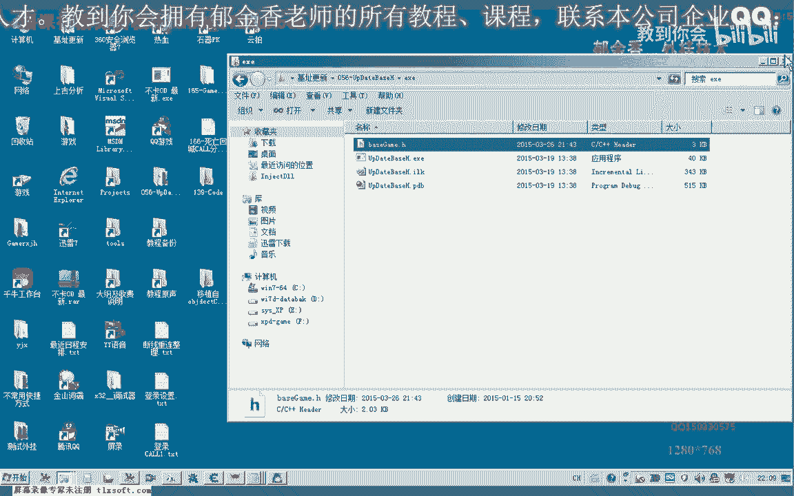

如何获取这个 `280`？
通过分析汇编指令，我们发现它可以通过 `[[ECX+4]+4]` 这个偏移读取到。这为我们提供了一个关键的判断条件：`[[ECX+4]+4] == 280`。

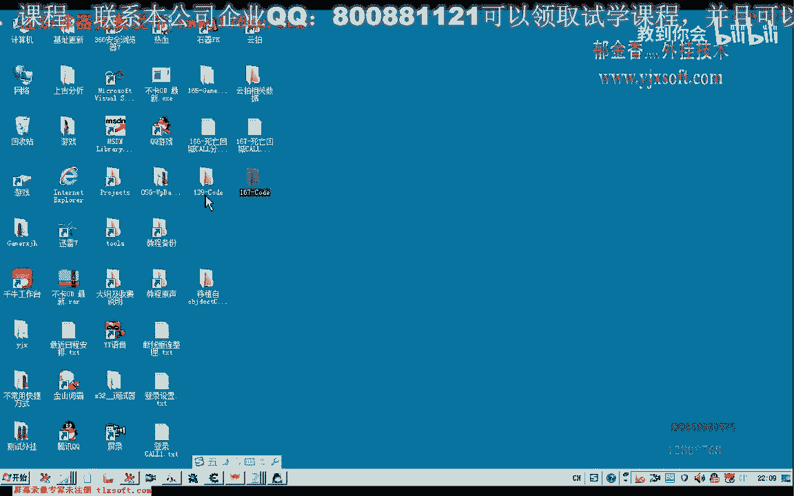


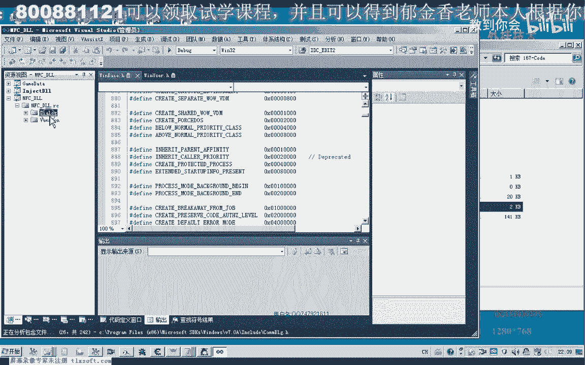

此外，`ECX+8` 偏移处的值可能对应角色的ID，但ID可能会变，不如 `280` 这个常量稳定。

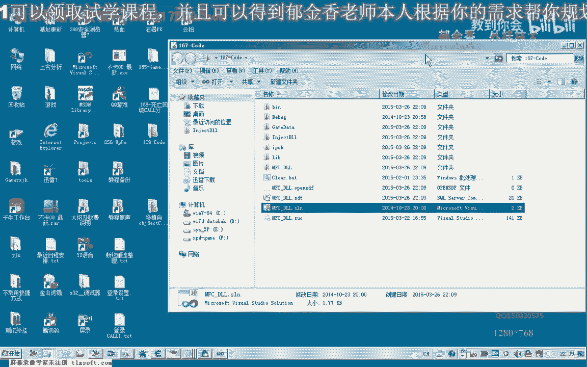


因此，最可靠的定位特征是：
1.  `[[ECX+4]+4]` 的值等于 `280`。
2.  结合其他一两个稳定偏移值（如 `+0` 或 `+8` 处的特征）进行综合判断。

我们将尝试编写代码，用这些特征来唯一确定正确的 `ECX` 地址。

---

## 编写动态定位函数

现在，我们打开项目代码，开始编写定位函数。

首先，我们需要遍历游戏中的所有对象列表。已知对象列表的大小为 `0x2700`。

以下是函数的核心逻辑步骤：

1.  **遍历对象列表**：循环遍历所有游戏对象。
2.  **读取候选ECX**：从对象列表中取出一个地址作为候选的 `ECX`。
3.  **进行特征校验**：
    *   计算 `[[ECX+4]+4]` 的值。
    *   判断该值是否等于特征值 `280`。
    *   可以附加判断 `ECX+0` 或 `ECX+8` 等偏移处的值是否符合预期特征。
4.  **返回结果**：如果找到满足所有特征的对象，则返回该 `ECX` 地址。如果遍历完都未找到，则定位失败。

我们编写一个函数 `FindDeathRecallECX()` 来实现上述逻辑。在函数内部，通过循环遍历对象数组，对每个候选地址应用我们的特征判断公式。

```cpp
// 伪代码示例
DWORD FindDeathRecallECX() {
    DWORD objectListBase = 0xXXXXXXX; // 对象列表基址
    int objectCount = 0x2700; // 对象数量

    for (int i = 0; i < objectCount; ++i) {
        DWORD candidateECX = ReadMemory<DWORD>(objectListBase + i * 0x4); // 假设每个指针4字节

        // 特征判断：[[ECX+4]+4] == 280
        DWORD tempAddr = ReadMemory<DWORD>(candidateECX + 0x4);
        if (tempAddr == 0) continue;
        DWORD featureValue = ReadMemory<DWORD>(tempAddr + 0x4);

        if (featureValue == 280) {
            // 可附加其他特征检查，如 ReadMemory<DWORD>(candidateECX + 0x8) == someID
            return candidateECX; // 找到目标地址
        }
    }
    return 0; // 未找到
}
```

---

## 测试与优化定位条件

编写完初步函数后，我们进行测试。


测试发现，仅凭 `[[ECX+4]+4] == 280` 这一个条件，可能会匹配到多个对象，说明该特征不具备唯一性。

我们需要增加额外的判断条件来缩小范围。例如，可以检查 `ECX+8` 或 `ECX+0x10` 等偏移处的值。通过对比找到的多个对象，分析它们在这些偏移处的数据差异，选取一个稳定且能区分目标的特征值加入判断逻辑。

优化后的判断条件可能类似于：
`[[ECX+4]+4] == 280 && ReadMemory<WORD/DWORD>(ECX + offset_X) == expectedValue`

通过迭代测试和增加判断条件，直到函数能够稳定、唯一地定位到死亡回城CALL所需的正确 `ECX` 地址。

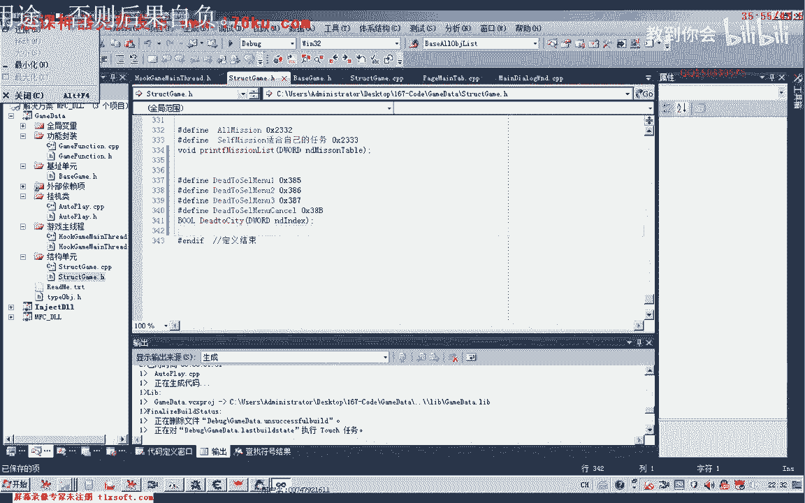

---

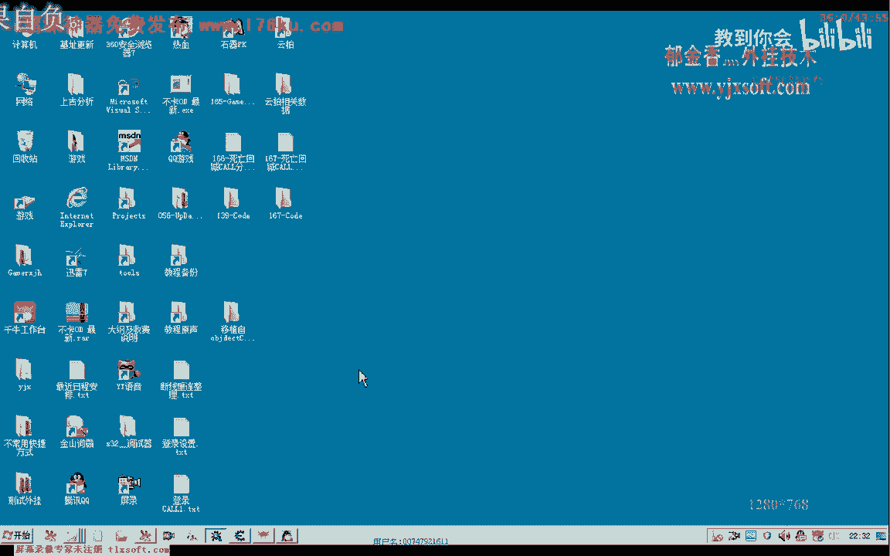

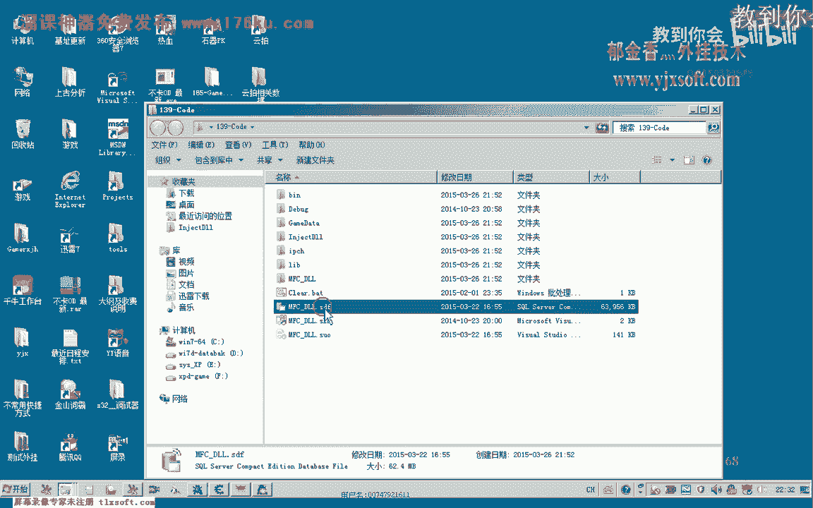


## 总结


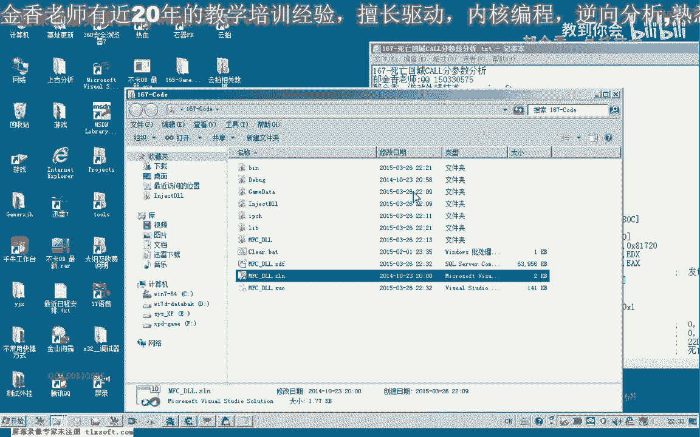

本节课中，我们一起学习了如何分析动态变化的内存地址。

1.  **核心思路**：通过对比数据快照，找出内存中不变的特征值或特征结构。
2.  **关键步骤**：我们发现了 `Core` 结构头部的常量 `280`，并通过公式 `[[ECX+4]+4]` 来访问它，以此作为定位的锚点。
3.  **实现方法**：编写了遍历函数，结合多个特征条件来动态定位正确的参数地址。
4.  **优化过程**：通过测试发现单一条件可能不足，进而引入了额外的偏移检查来确保定位的唯一性和准确性。


通过本课的学习，你掌握了分析动态基址和封装功能函数的基本方法，这对于游戏逆向工程中的许多场景都非常有用。