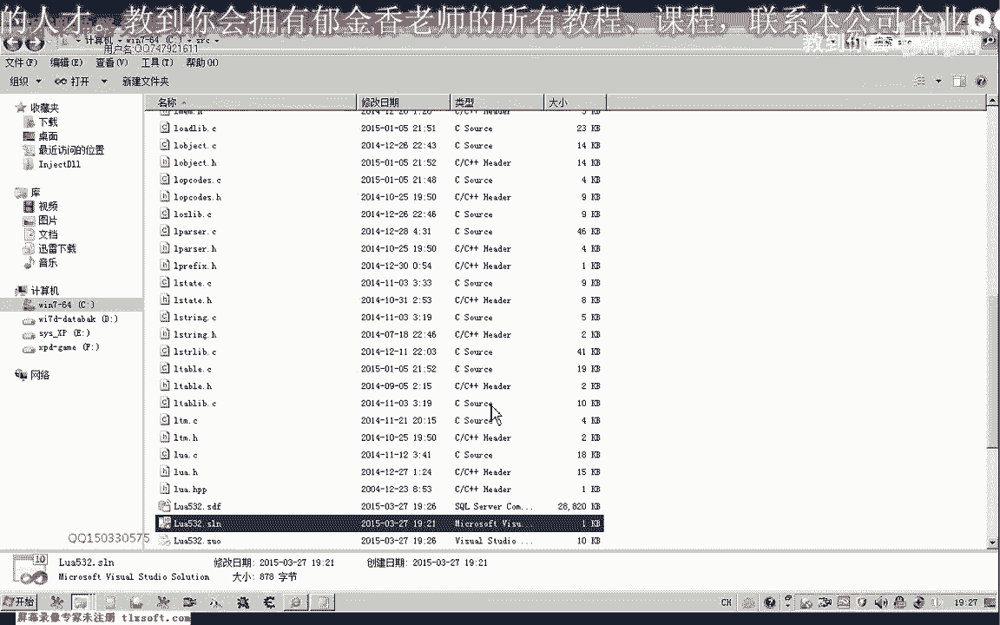

# 课程 P157：认识LUA与编写Hello World 👨‍🏫


在本节课中，我们将学习如何搭建Lua脚本语言的开发环境，并将其与C++程序进行整合，最终编写并运行一个简单的“Hello World”程序。


---

## 概述 📋


Lua是一种简洁、轻量且可扩展的脚本语言。它既可以独立运行，也可以嵌入到C/C++等宿主程序中。本节课我们将重点学习如何获取Lua源码、编译生成静态链接库，并在一个C++控制台项目中调用Lua脚本，实现一个基础的“Hello World”示例。


---


## 获取Lua源码 🔽

首先，我们需要获取Lua的源代码。你可以访问Lua的官方网站下载最新版本（当前为5.3），也可以从相关技术论坛获取。


下载完成后，将压缩包解压到本地目录，例如 `C:\`。我们主要需要其 `src` 目录下的所有源文件。

---

## 编译Lua静态库 🛠️

Lua官方并未直接提供编译好的库文件，因此我们需要自行编译。以下是在Visual Studio环境中编译静态库的步骤。

上一节我们获取了Lua源码，本节中我们来看看如何将其编译为可供C++程序使用的静态链接库。

1.  **创建VS项目**：在Visual Studio中创建一个新的空项目，例如命名为 `lua53`。项目位置可以放在Lua源码目录下以便管理。
2.  **添加源文件**：将 `src` 目录下所有的 `.c` 源文件（除 `lua.c` 和 `luac.c` 外）添加到项目中。这两个文件包含 `main` 函数，会与我们的项目冲突，需要从项目中排除（不是删除）。
3.  **配置项目属性**：
    *   将项目配置类型改为 **“静态库(.lib)”**。
    *   在 `C/C++` -> `常规` -> `附加包含目录` 中，添加Lua头文件所在目录（即 `src` 目录的上一级）。
4.  **生成库文件**：编译项目。成功后在输出目录（如 `Debug`）中即可得到 `lua53.lib`（或根据你的配置名）静态库文件。

为了方便，你也可以直接使用老师提供的已配置好的VS工程文件进行编译。

---



## 创建C++测试项目并整合Lua 🧪

库文件编译完成后，我们就可以创建一个C++项目来调用Lua了。

上一节我们成功生成了Lua的静态库，本节我们将创建一个新的C++项目，并配置环境以使用这个库。

1.  **新建控制台项目**：创建一个新的C++控制台应用程序项目，命名为 `TestLua`。
2.  **配置项目属性**：这是整合的关键步骤，以下是需要配置的项：
    *   **附加包含目录**：在 `C/C++` -> `常规` -> `附加包含目录` 中，添加Lua头文件所在目录。
    *   **附加库目录**：在 `链接器` -> `常规` -> `附加库目录` 中，添加上一步生成的 `lua53.lib` 文件所在目录。
    *   **附加依赖项**：在 `链接器` -> `输入` -> `附加依赖项` 中，添加 `lua53.lib`。
    *   **预处理器定义**：由于Lua是用纯C编写的，为了在C++中正确链接，需要在 `C/C++` -> `预处理器` -> `预处理器定义` 中添加 `_CRT_SECURE_NO_WARNINGS`。
3.  **编写C++主程序**：在 `main.cpp` 中编写以下代码，用于初始化Lua状态并运行脚本。


```cpp
extern "C" {
    #include "lua.h"
    #include "lauxlib.h"
    #include "lualib.h"
}

int main() {
    // 1. 创建Lua状态机
    lua_State* L = luaL_newstate();
    // 2. 打开Lua标准库
    luaL_openlibs(L);
    // 3. 加载并执行指定的Lua脚本文件
    luaL_dofile(L, "test.lua");
    // 4. 关闭状态机
    lua_close(L);
    return 0;
}
```


---


## 编写并运行Lua脚本 📜


C++程序配置好后，我们需要编写一个Lua脚本来被调用。


上一节我们完成了C++端的配置和编码，本节我们来创建Lua脚本文件并完成最终测试。

1.  **确定脚本路径**：C++程序中的 `luaL_dofile(L, "test.lua")` 会在程序的**工作目录**下寻找 `test.lua` 文件。你可以在VS项目属性中 `调试` -> `工作目录` 设置此路径，通常设为 `$(ProjectDir)` 以便在项目目录下查找。
2.  **创建Lua脚本**：在工作目录下，用记事本创建一个新文件，命名为 `test.lua`，并输入以下内容：

```lua
print("Hello World from Lua!")
```
3.  **运行程序**：编译并运行C++项目。如果一切配置正确，控制台将输出Lua脚本中的打印信息。

```
Hello World from Lua!
```

---

## 总结 🎯


本节课我们一起学习了Lua开发环境的完整搭建流程。


我们首先从官网获取了Lua源代码，接着在Visual Studio中将其编译成静态链接库（`.lib`文件）。然后，我们创建了一个新的C++控制台项目，通过配置包含目录、库目录和附加依赖项，成功将Lua库整合到项目中。最后，我们编写了C++主程序来初始化Lua并执行外部的 `test.lua` 脚本文件，实现了经典的“Hello World”输出。


通过这个流程，你已经掌握了在Windows平台下使用C++嵌入Lua脚本的基本方法，为后续更复杂的脚本交互打下了基础。