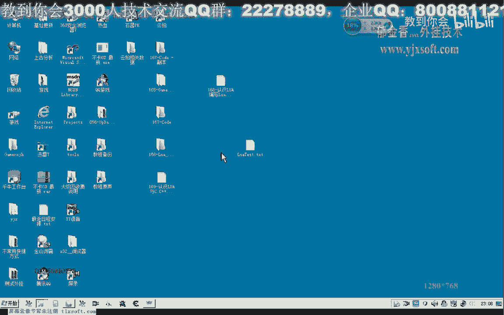
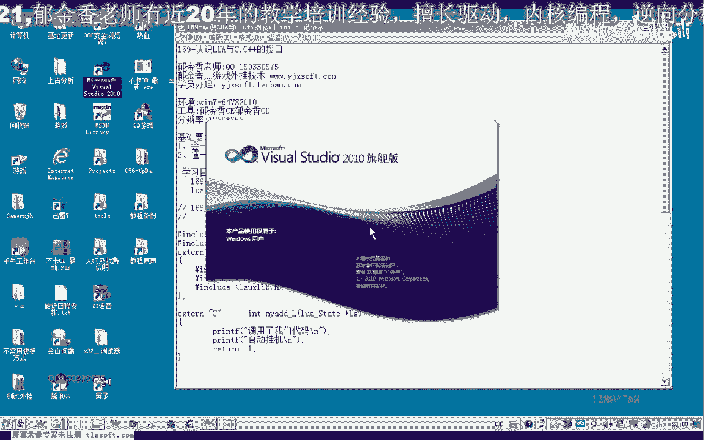
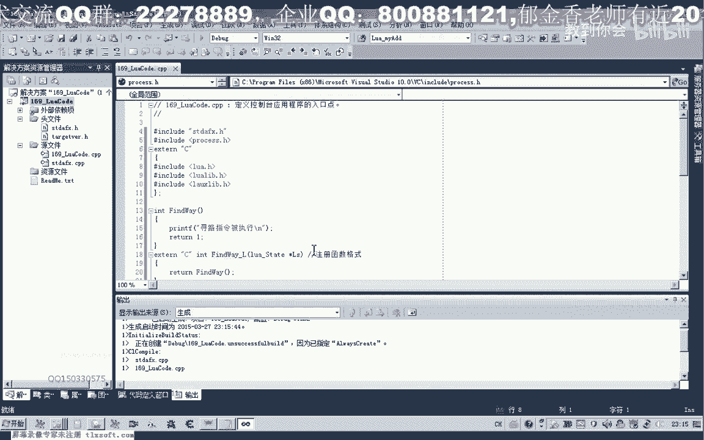
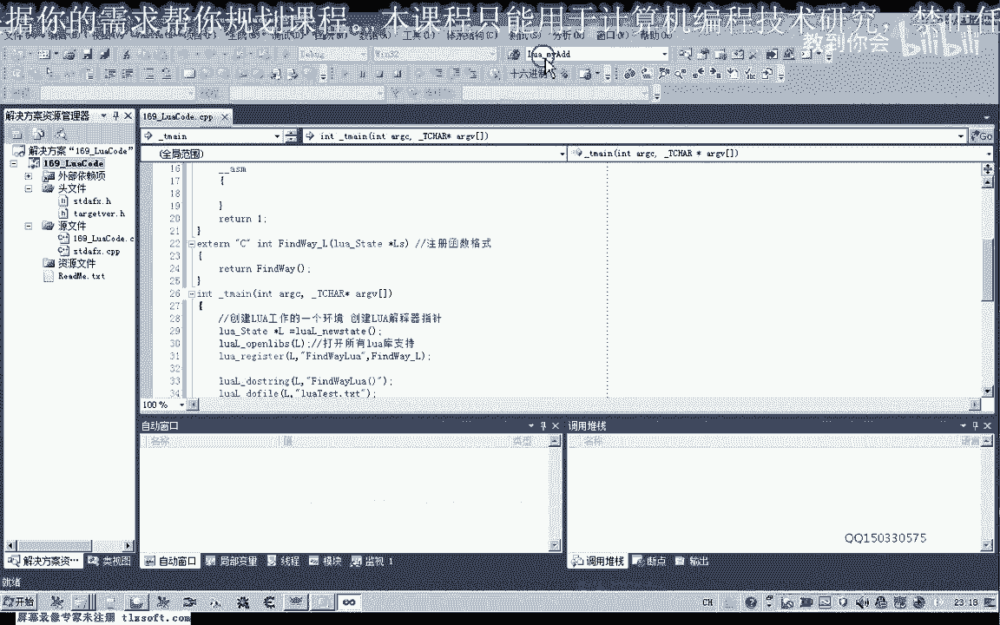
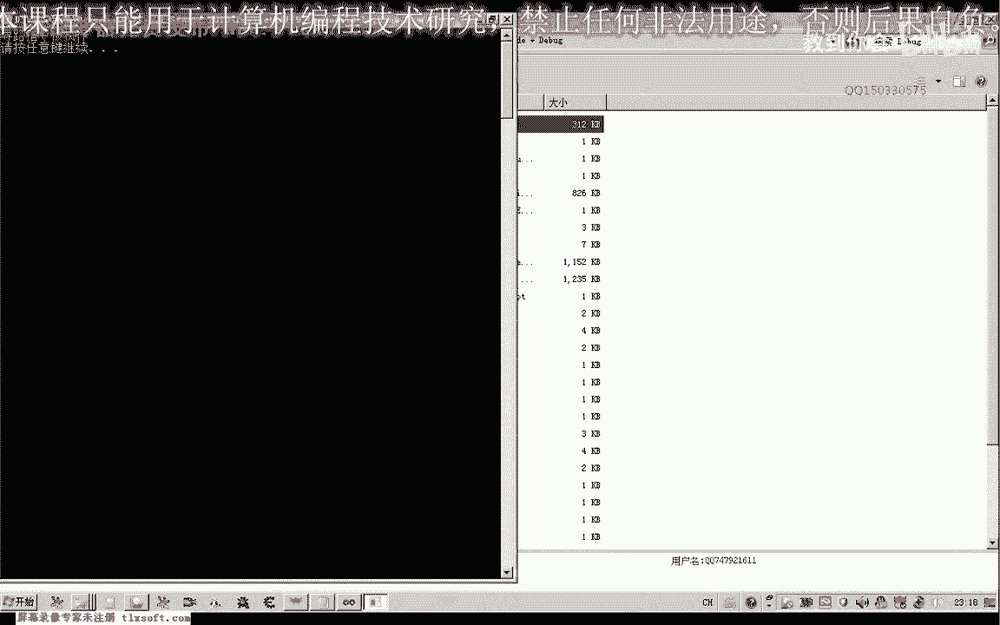
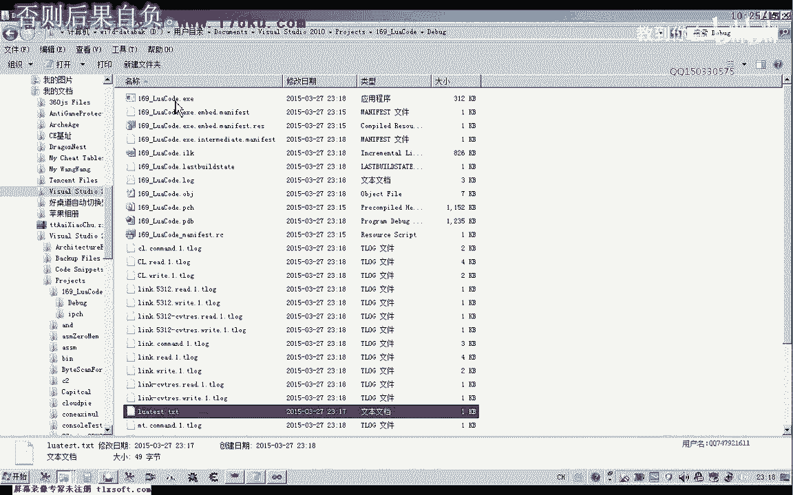
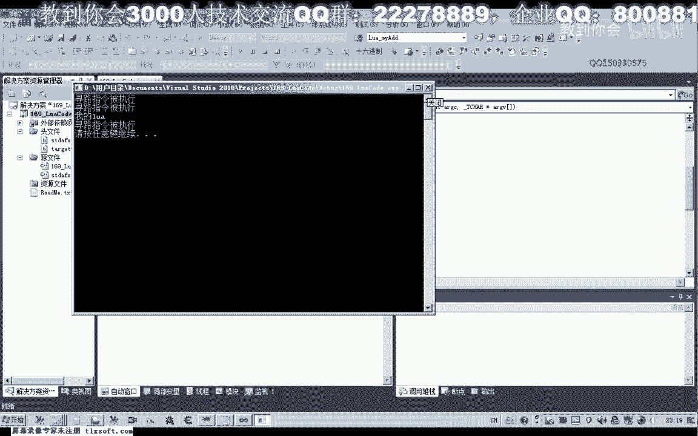
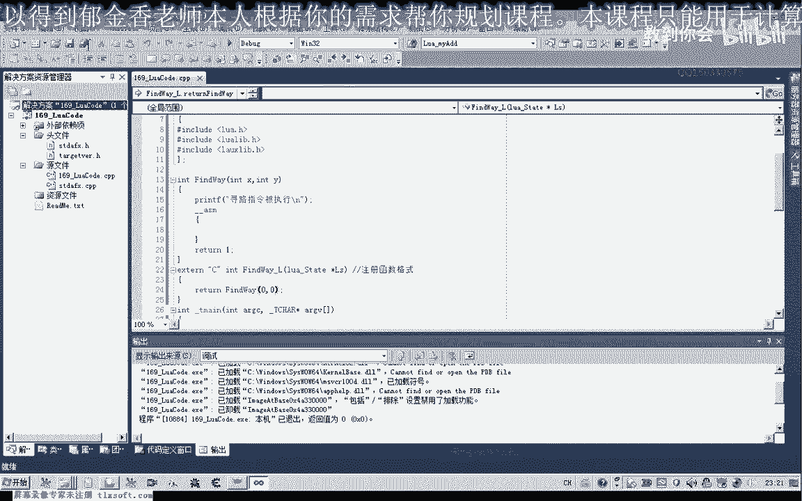

# 课程 P158：Lua 与 C/C++ 接口基础教程 🧩



在本节课中，我们将学习如何在 Lua 脚本中调用 C/C++ 编写的函数。我们将从创建项目开始，逐步讲解如何配置环境、注册函数，并通过 Lua 脚本执行这些函数。



---

## 环境配置与项目创建

首先，我们需要在 Visual Studio 2010 中创建一个新的控制台项目。

项目创建完成后，需要包含必要的头文件和链接库。以下是三个必需的头文件：

*   `lua.h`：包含 Lua 脚本的基础函数。
*   `lualib.h`：提供 Lua 标准库函数的支持。
*   `lauxlib.h`：提供 Lua 辅助库函数的支持。

配置好这些之后，我们就可以开始编写代码了。

---

## 创建 Lua 工作环境

上一节我们配置好了开发环境，本节中我们来看看如何初始化 Lua 的运行环境。

在 C/C++ 程序中，我们首先需要创建一个 Lua 工作环境。通常使用 `lua_State*` 类型的指针来表示这个环境。

```c
lua_State* L = luaL_newstate(); // 创建新的 Lua 状态机
```

创建环境后，一般会打开所有标准库的支持，以便在脚本中使用。

```c
luaL_openlibs(L); // 打开所有标准库
```

程序结束时，需要关闭并销毁这个 Lua 工作环境以释放资源。

```c
lua_close(L); // 关闭 Lua 状态机
```

---

## 注册 C/C++ 函数供 Lua 调用



环境创建好后，我们需要让 Lua 脚本能够调用我们编写的 C/C++ 函数。这需要通过“注册”来实现。


假设我们有一个 C++ 函数 `FindWay`，它模拟游戏中的寻路指令。

```c
void FindWay() {
    printf("寻路指令被执行\n");
}
```

Lua 不能直接调用这个函数。我们需要定义一个符合 Lua C 函数格式的包装函数来注册。该函数必须接收一个 `lua_State*` 参数并返回一个整数。

```c
// 符合 Lua 要求的 C 函数格式
int lua_FindWay(lua_State* L) {
    FindWay(); // 在这里调用我们实际的 C++ 函数
    return 0; // 返回值个数为 0
}
```

有了这个包装函数，我们就可以将其注册到 Lua 环境中。注册时使用的函数名必须是英文字符串。

```c
// 将函数 lua_FindWay 注册到 Lua 中，命名为 "FindWay"
lua_register(L, "FindWay", lua_FindWay);
```


---


## 在 Lua 脚本中调用注册的函数


函数注册成功后，我们就可以在 Lua 脚本中调用它了。有两种主要的方式来执行包含调用的 Lua 代码。

**第一种方式是使用 `luaL_dostring` 直接执行一段 Lua 代码字符串。**



```c
// 执行一段 Lua 代码字符串，调用注册的 FindWay 函数
luaL_dostring(L, "FindWay()");
```


**第二种方式是使用 `luaL_dofile` 执行一个外部的 Lua 脚本文件。**



我们可以创建一个名为 `test.lua` 的脚本文件，内容如下：

```lua
-- test.lua
FindWay()
FindWay()
```



然后在 C++ 程序中加载并执行这个文件：


```c
// 执行外部的 Lua 脚本文件
luaL_dofile(L, "test.lua");
```


此时，`FindWay()` 函数会被调用两次。


---



## 注意事项与路径问题

在使用 `luaL_dofile` 时，需要注意文件路径问题。程序会在其“当前工作目录”下寻找脚本文件。

*   在调试模式下，工作目录通常是项目解决方案目录下的 `Debug` 文件夹。
*   直接运行生成的 `.exe` 文件时，工作目录就是 `.exe` 文件所在的目录。


为了保证脚本文件能被正确找到，你可以：


1.  将 Lua 脚本文件复制到可执行文件（.exe）所在的目录。
2.  或者在 IDE 的调试设置中，将“工作目录”修改为脚本文件所在的路径。

---

## 课程总结

本节课中我们一起学习了 Lua 与 C/C++ 交互的基础知识：

1.  我们学习了如何配置开发环境，包含必要的头文件。
2.  我们掌握了如何创建和销毁 Lua 工作环境（`lua_State`）。
3.  我们理解了如何将 C/C++ 函数包装并注册到 Lua 中，使其能被脚本调用。
4.  我们实践了两种执行 Lua 代码的方式：直接执行字符串（`luaL_dostring`）和执行外部脚本文件（`luaL_dofile`）。
5.  我们注意到了执行外部文件时的路径问题及其解决方法。



通过本节课的学习，你已经能够让 Lua 脚本成功调用简单的 C/C++ 函数了。在后续课程中，我们将探讨如何向这些函数传递参数以及从函数中返回值。