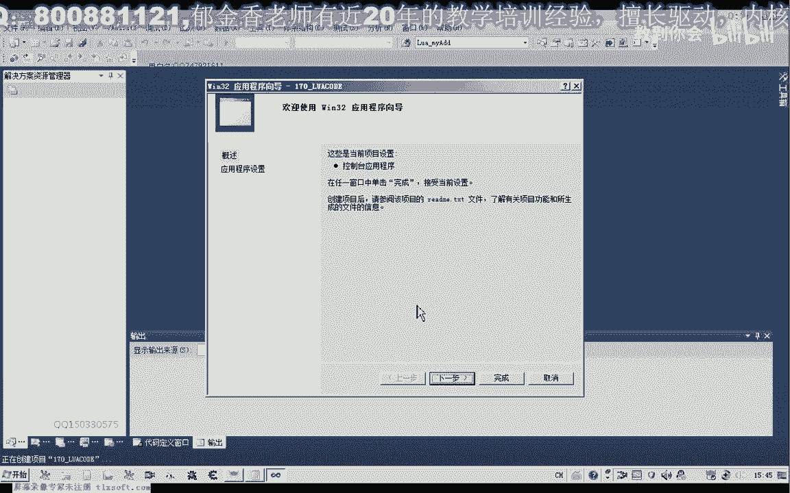
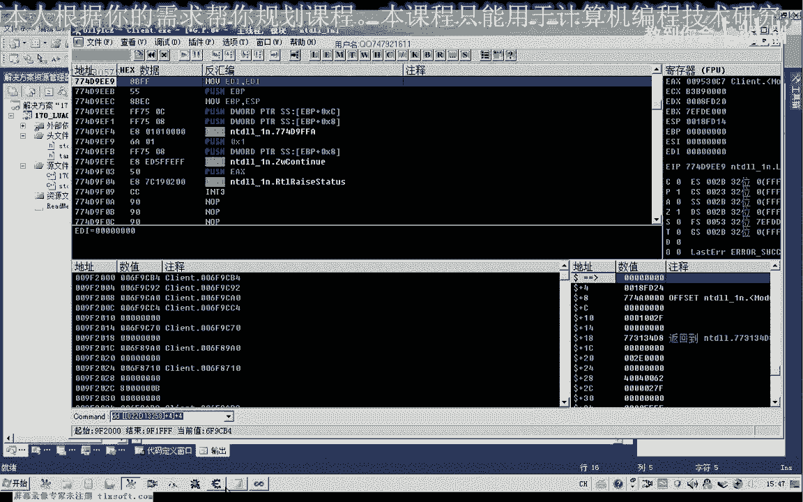
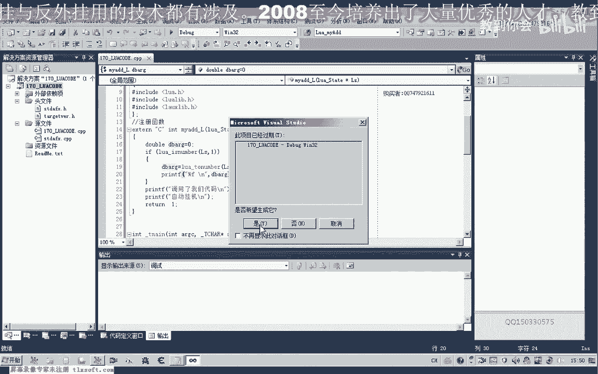
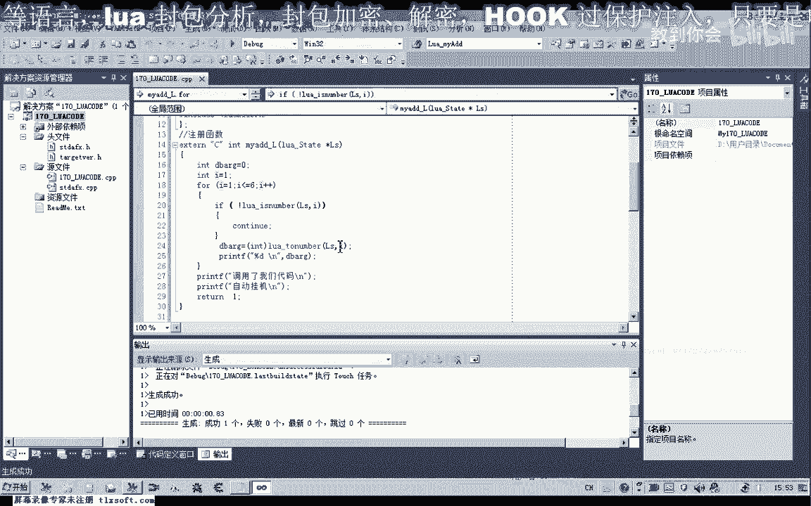
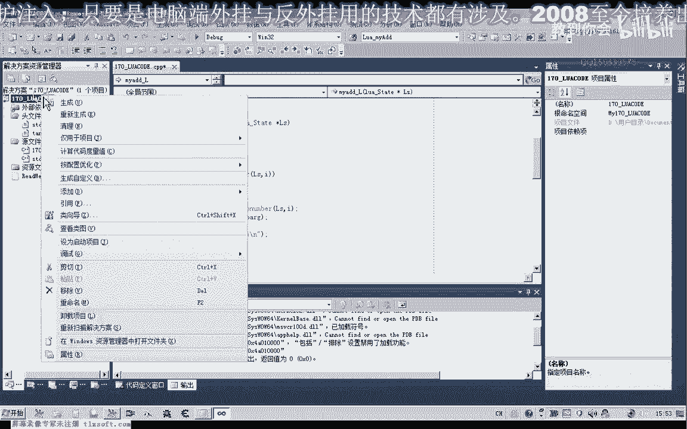
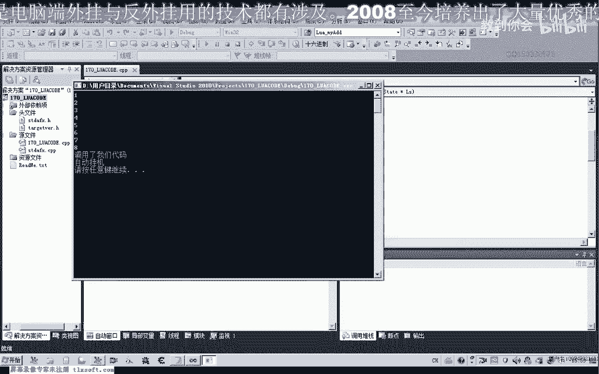

# 课程 P159：Lua与C交互 - 调用带参数的C函数 🧩



在本节课中，我们将学习如何在Lua脚本中调用带参数的C语言函数。我们将重点探讨如何从Lua向C函数传递参数，以及如何在C函数内部接收和处理这些参数，特别是数字类型的参数。

---

## 项目初始化与代码准备

首先，我们需要新建一个项目。

上一节课我们学习了如何调用一个不带参数的C函数。本节课，我们将在此基础上进行修改。很多时候，我们需要从Lua脚本向C函数传递参数，因此我们需要研究如何实现参数的传递与接收。


## 参数传递的基本原理

在Lua调用C函数时，可以传递任意数量的参数。即使C函数不处理这些参数，程序也不会出错，只是参数数据不会被使用。




本节课我们主要研究如何接收数字类型的数据。这需要使用Lua提供的API函数 `lua_tonumber` 来从Lua的“栈”中获取数据。


Lua与C之间的数据交换都是通过一个特殊的“栈”来完成的。这个栈类似于一个堆栈数据结构，数据被压入栈中，然后通过特定的函数来获取。

栈中元素的下标从1开始编号。要获取第几个参数，就使用对应的下标。例如，获取第一个参数，下标就是1。

## 接收单个数字参数

在获取参数之前，最好先判断参数的类型是否符合预期。我们可以使用 `lua_isnumber` 函数来判断指定位置的参数是否为数字类型。

以下是接收并处理第一个数字参数的C代码示例：

```c
// 假设这是注册到Lua的C函数
static int my_add(lua_State *L) {
    // 判断第一个参数是否为数字
    if (lua_isnumber(L, 1)) {
        // 获取第一个参数的值。Lua中所有数字都以双精度浮点数表示。
        double arg1 = lua_tonumber(L, 1);
        // 打印获取到的值
        printf("第一个参数是：%f\n", arg1);
    }
    return 0;
}
```


**注意**：Lua内部不区分整数和浮点数，所有数字都以双精度浮点数（`lua_Number`，通常是 `double`）表示。即使你传递了一个整数，获取到的也是浮点数。如果需要整数，可以强制转换。

## 接收多个数字参数




如果我们传递了多个参数，并且希望全部获取，可以使用循环。前提是我们能确定栈中所有参数都是数字类型。

以下是一个使用 `for` 循环获取所有数字参数的示例：

```c
static int my_add_all(lua_State *L) {
    int i = 1; // 栈下标从1开始
    double sum = 0.0;

    // 循环检查栈中每个位置是否为数字
    while (lua_isnumber(L, i)) {
        double arg = lua_tonumber(L, i);
        sum += arg;
        printf("第%d个参数是：%f\n", i, arg);
        i++; // 检查下一个位置
    }

    printf("所有参数之和为：%f\n", sum);
    // 注意：目前还没有将结果返回给Lua
    return 0;
}
```

在Lua脚本中，我们可以这样调用：
```lua
my_add_all(1, 2, 3, 4, 5, 6, 7, 8)
```
C函数会依次获取并打印每个参数，然后计算总和。

## 实际应用与扩展

掌握了参数传递的方法后，我们就可以在C函数中调用其他更复杂的逻辑。例如，我们可以单独写一个执行加法运算的函数，然后在注册函数中获取Lua参数，调用这个加法函数，最后处理结果。

```c
// 一个独立的加法函数
double add_numbers(double a, double b) {
    return a + b;
}




// 注册到Lua的函数
static int lua_add(lua_State *L) {
    // 获取前两个参数
    double a = lua_tonumber(L, 1);
    double b = lua_tonumber(L, 2);

    // 调用独立的C函数进行计算
    double result = add_numbers(a, b);

    printf("计算结果：%f + %f = %f\n", a, b, result);
    // 如何将result返回给Lua？我们下节课讨论。
    return 0;
}
```



这为将来在游戏等实际项目中，通过Lua调用底层C/C++函数（如寻路算法、渲染指令等）奠定了基础。



---

## 总结

本节课我们一起学习了Lua调用带参数C函数的核心方法：
1.  Lua通过“栈”向C函数传递参数。
2.  使用 `lua_isnumber` 判断参数类型。
3.  使用 `lua_tonumber(L, index)` 获取栈中指定位置（下标从1开始）的数字参数。
4.  可以通过循环获取多个参数。

**关键点**：Lua中所有数字都以双精度浮点数传递，栈索引从1开始。


---


## 下节课预告与作业

本节课我们成功从Lua获取了参数，但函数还没有将计算结果返回给Lua脚本。例如，`my_add_all` 函数计算了总和，但Lua脚本还无法使用这个结果。

**课后作业**：请查阅资料，了解如何将C函数中的结果（例如一个数字）压入Lua栈，并返回给Lua脚本。我们将在下节课详细探讨函数返回值的处理。


我们下节课再见！