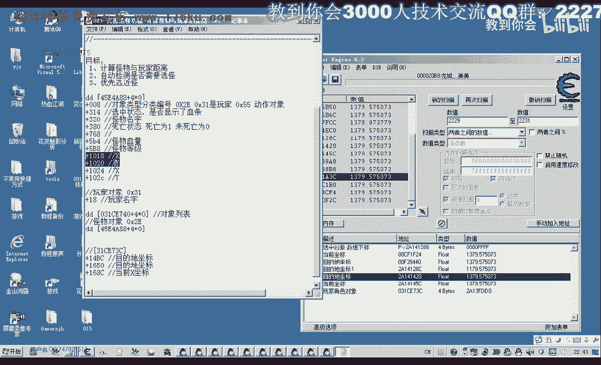
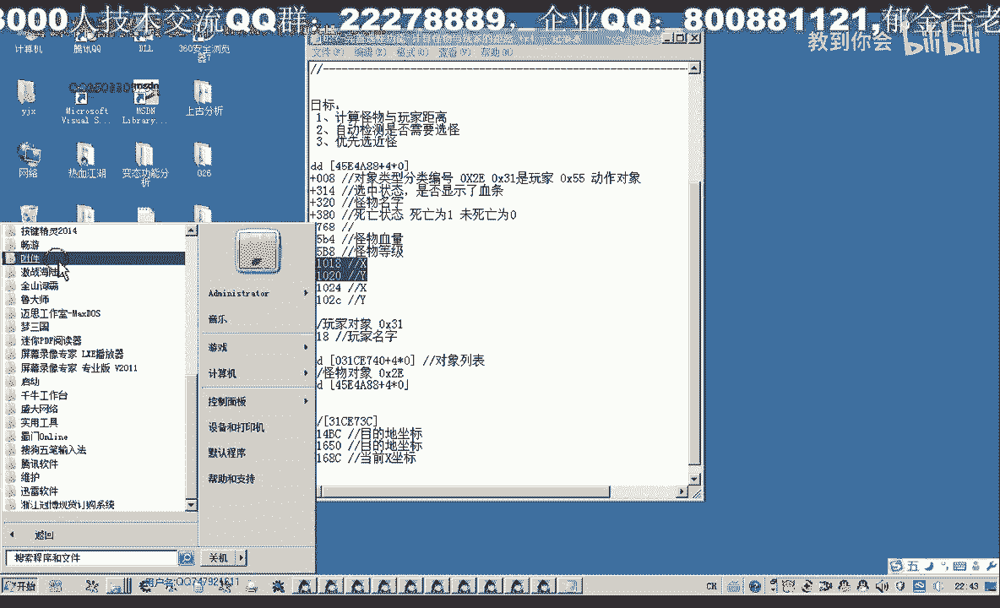

# 课程 P16：027 - 完善选怪功能 - 计算怪物与玩家的距离 📏

在本节课中，我们将学习如何计算游戏内怪物与玩家角色之间的距离。这是实现高效“选怪”功能的关键一步，因为游戏本身并未直接提供这个属性。我们将通过分析并读取怪物与玩家的坐标数据，然后运用数学公式计算出它们之间的距离。


---

## 分析坐标数据

上一节我们介绍了选怪的需求，本节中我们来看看如何获取计算距离所需的基础数据——坐标。

首先，我们需要分析并找到游戏中玩家角色的当前坐标。由于坐标值是浮点数，在内存中搜索时需要使用范围搜索来确保准确性。

以下是分析玩家坐标的步骤：
1.  在游戏中查看当前坐标（例如：2197）。
2.  使用内存扫描工具，以浮点数类型并设定一个范围（例如：2196 到 2198）进行首次搜索。
3.  移动角色改变坐标，根据新坐标值（例如：2211）再次扫描变动的数值。
4.  重复此过程，逐步筛选出与玩家对象地址相关联的、持续变动的坐标值地址。
5.  通过对比移动、静止以及使用小地图传送等操作下数值的变化，可以区分出“当前坐标”和“目的地坐标”。
6.  最终，我们找到了玩家对象基址下的偏移量，用于读取当前坐标：
    *   **当前X坐标偏移**：`对象基址 + 0x16834`
    *   **当前Y坐标偏移**：`对象基址 + 0x16838` (X坐标偏移 + 4)
    *   **当前Z坐标偏移**：`对象基址 + 0x1683C` (Y坐标偏移 + 4)

> 注：本游戏中坐标顺序为 X, Z, Y。怪物对象的坐标偏移已在之前课程中分析获得。


---

## 距离计算原理 🧮

获取了怪物和玩家的坐标后，我们就可以计算它们之间的距离。这需要用到平面直角坐标系中的距离公式。



假设有两个点：
*   点 A，坐标为 **(x1, y1)**
*   点 B，坐标为 **(x2, y2)**



我们可以通过勾股定理来计算它们之间的直线距离。如下图所示，两点在X轴和Y轴方向上的差值构成了一个直角三角形的两条直角边。

```
点A (x1, y1)
    |\
    | \  距离 c
  a |  \
    |___\
        点B (x2, y2)
         b
```

其中：
*   直角边 **a** = |y1 - y2| （Y方向差值绝对值）
*   直角边 **b** = |x1 - x2| （X方向差值绝对值）
*   斜边 **c** 即为我们要求的距离。

根据勾股定理：`c² = a² + b²`。因此，距离 **c** 的计算公式为：

**`距离 = sqrt( (x1-x2)² + (y1-y2)² )`**

在代码中，我们可以这样实现：
```cpp
float CalculateDistance(float x1, float y1, float x2, float y2) {
    float a = fabs(y1 - y2); // Y轴方向差值
    float b = fabs(x1 - x2); // X轴方向差值
    float distance = sqrt(a * a + b * b); // 勾股定理求斜边
    return distance;
}
```
> 对于有Z轴（高度）的3D游戏，距离公式需扩展为：**`距离 = sqrt( (x1-x2)² + (z1-z2)² + (y1-y2)² )`**。本教程暂不考虑Z轴影响。

---


## 代码实现与集成


理解了计算原理后，我们将把距离计算功能集成到我们的辅助工具代码中。

首先，在玩家角色对象的结构体中，添加读取当前坐标的成员变量，并在初始化时从游戏内存中读取相应的值。

```cpp
// 在玩家对象结构体中添加
float currentPosX; // 当前X坐标
float currentPosY; // 当前Y坐标
// 初始化时读取内存
player.currentPosX = ReadMemory<float>(player.baseAddress + 0x16834);
player.currentPosY = ReadMemory<float>(player.baseAddress + 0x1683C); // 注意Y坐标偏移
```

接着，封装一个通用的距离计算函数。

```cpp
// 计算两点间距离的函数
float GetDistanceBetweenPoints(float x1, float y1, float x2, float y2) {
    float deltaX = fabs(x1 - x2);
    float deltaY = fabs(y1 - y2);
    return sqrt(deltaX * deltaX + deltaY * deltaY);
}
```

然后，在遍历怪物列表、初始化每个怪物信息时，调用该函数计算其与玩家的距离，并将结果保存为怪物的一个属性。

```cpp
// 在初始化怪物数据的循环中
for (auto& monster : monsterList) {
    // ... 读取怪物坐标 (monster.x, monster.y) ...
    // 计算距离
    monster.distanceToPlayer = GetDistanceBetweenPoints(
        player.currentPosX, player.currentPosY,
        monster.x, monster.y
    );
    // ... 打印或其他操作 ...
}
```

最后，我们可以在信息显示部分，将每个怪物的ID、坐标和与玩家的距离一并打印出来，以便验证。

---

## 功能测试与验证

代码集成完毕后，需要进行测试以确保功能正确。

我们将工具注入游戏，并观察输出的调试信息。当角色在游戏世界中移动或怪物移动时，每个怪物对应的“距离”属性应该会动态变化。我们可以尝试攻击距离显示最近的怪物，以验证筛选逻辑的有效性。

通过测试，我们能够确认：
1.  坐标读取正确。
2.  距离计算准确，数值随位置改变而实时更新。
3.  基于此距离信息，可以成功标识出离玩家最近的怪物。

这为下一节课实现“自动选择最近怪物”的功能打下了坚实的基础。

---

## 总结

本节课中我们一起学习了如何完善选怪功能的核心步骤——计算距离。

我们首先分析了游戏内存，找到了玩家角色的坐标数据。然后，我们回顾了平面直角坐标系中两点间距离的计算公式（勾股定理），并将其转化为代码实现。最后，我们将距离计算功能集成到怪物信息管理模块中，并进行了成功测试。


现在，我们的程序已经能够知道每个怪物离我们有多远了。在下一节课中，我们将利用这个“距离”属性，来优化我们的选怪逻辑，实现自动优先攻击最近目标的功能。