# P160：171-了解Lua栈及相关操作函数 📚

在本节课中，我们将要学习Lua虚拟栈的基本概念以及如何通过C API对栈进行基础操作，例如压栈、出栈和取值。栈是Lua与C语言之间进行数据交换的核心机制。

## 概述

Lua栈是一个虚拟的栈结构，主要用于函数之间传递参数，或是在Lua脚本与C代码之间传递数值数据。栈上的数据可以是多种类型，例如空类型、数字或字符串等。我们将在后续课程中逐步深入了解。

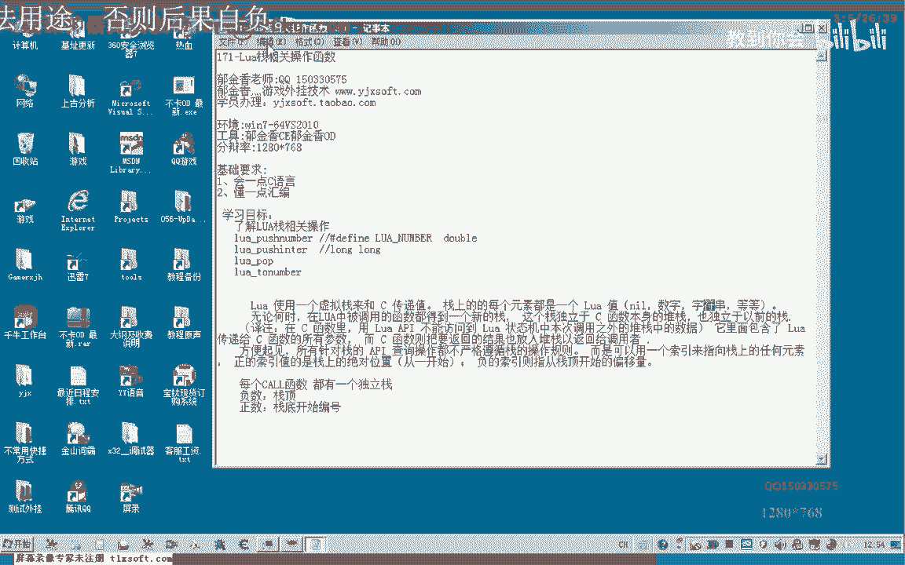


## Lua栈的基本特性


无论何时调用一个函数，都会产生一个新的栈。这与C语言或汇编中的栈概念类似，每个调用都有自己独立的栈帧。Lua栈独立于C函数调用栈。

所有对栈的操作都通过一个索引来指向栈中的元素。正的索引值表示从栈底开始的绝对位置（从1开始），而负的索引值则表示从栈顶开始的偏移量。

## 栈操作的核心函数

以下是本节课将涉及的几个核心栈操作函数。

*   `lua_pushnumber`：将一个双精度浮点数压入栈顶。
*   `lua_pushinteger`：将一个整型数压入栈顶。
*   `lua_pop`：从栈顶弹出指定数量的元素。
*   `lua_tonumber`：根据索引从栈中获取一个双精度浮点数值。


## 实践：数字的入栈与取值


上一节我们介绍了栈的基本概念，本节中我们来看看如何将数字压入栈中并读取它们。

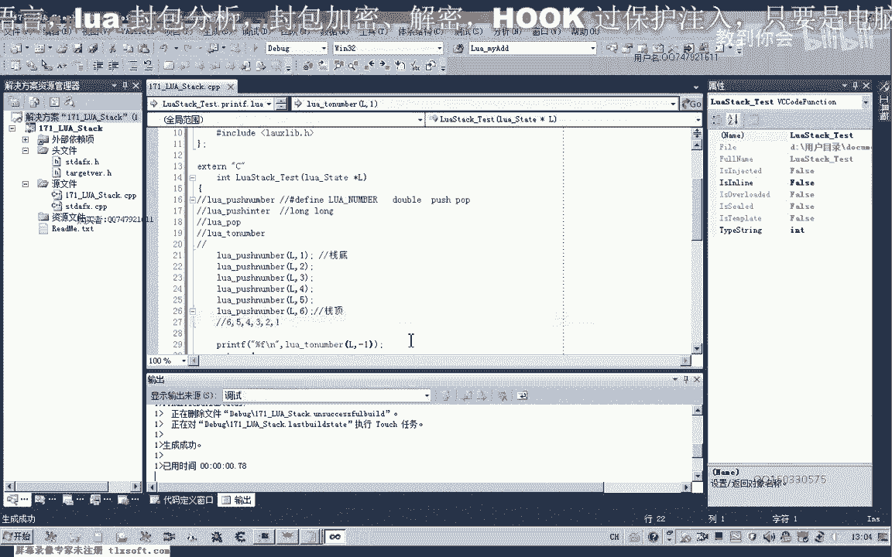


首先，我们创建一个Lua状态并注册一个C函数供测试。在测试函数中，我们将一系列数字压入栈。

```c
// 将数字1到6压入栈
lua_pushnumber(L, 1);
lua_pushnumber(L, 2);
lua_pushnumber(L, 3);
lua_pushnumber(L, 4);
lua_pushnumber(L, 5);
lua_pushnumber(L, 6);
```

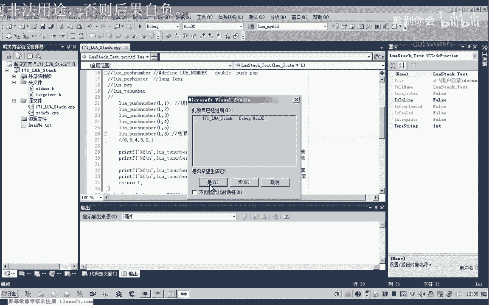

压栈后，栈底（索引1）是数字1，栈顶（索引-1）是数字6。我们可以使用`lua_tonumber`函数并指定索引来获取值。


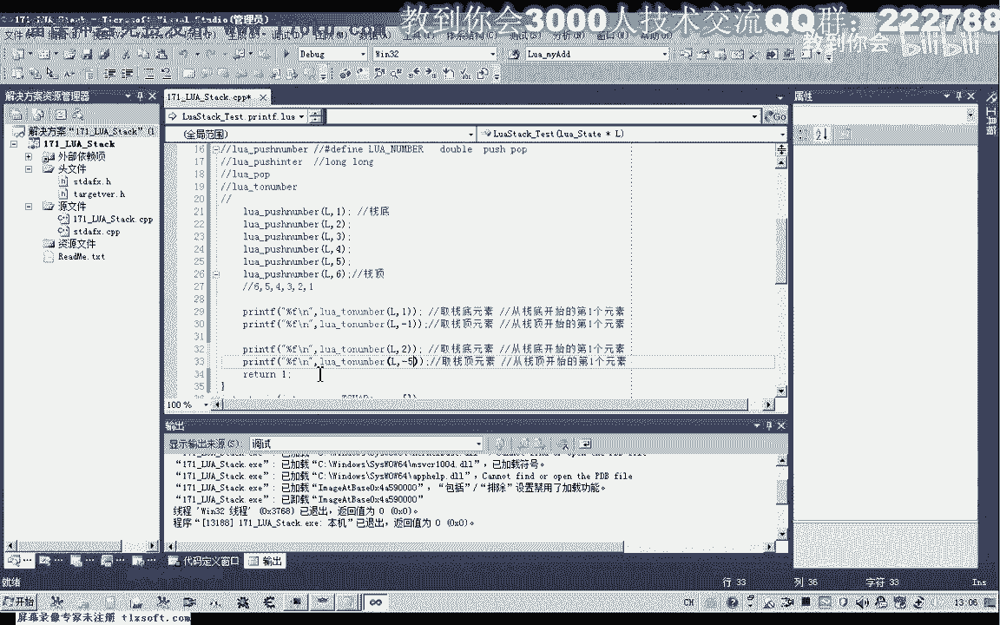

```c
// 获取栈底元素（索引1）
double bottom = lua_tonumber(L, 1); // 值为 1.0
// 获取栈顶元素（索引-1）
double top = lua_tonumber(L, -1); // 值为 6.0
```

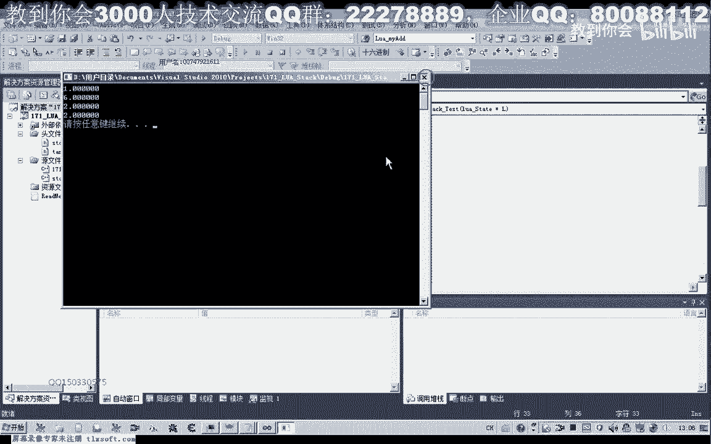

索引规则如下：
*   正索引从栈底（1）开始向上计数。
*   负索引从栈顶（-1）开始向下计数。

例如，要获取数字4，可以使用索引4（从栈底数第4个）或索引-3（从栈顶数第3个）。

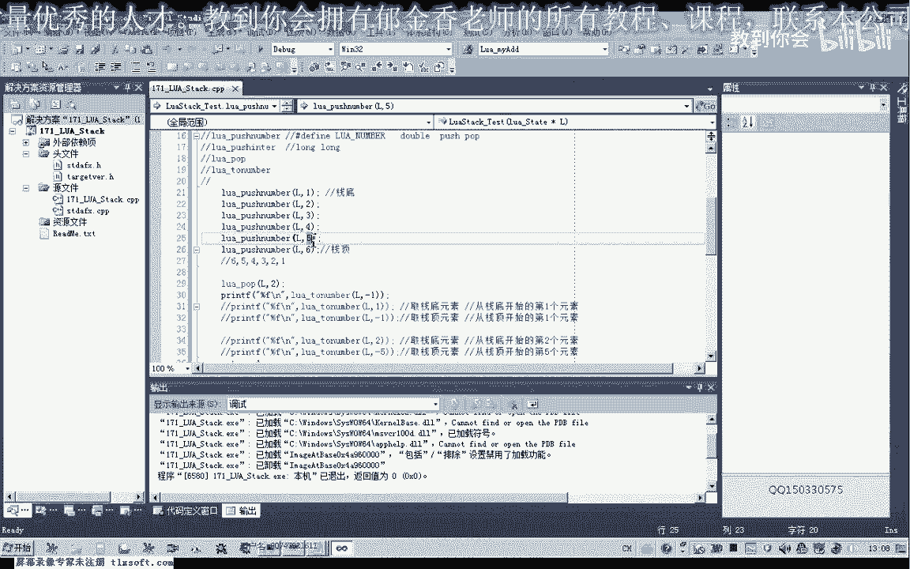

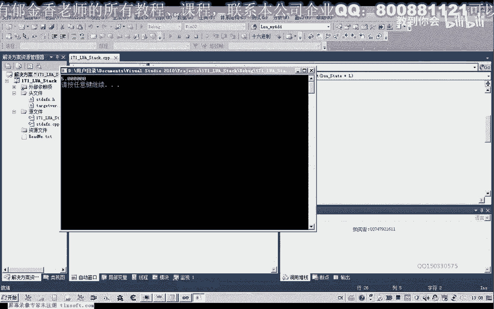

```c
double val1 = lua_tonumber(L, 4);  // 值为 4.0
double val2 = lua_tonumber(L, -3); // 值为 4.0
```


## 实践：出栈操作

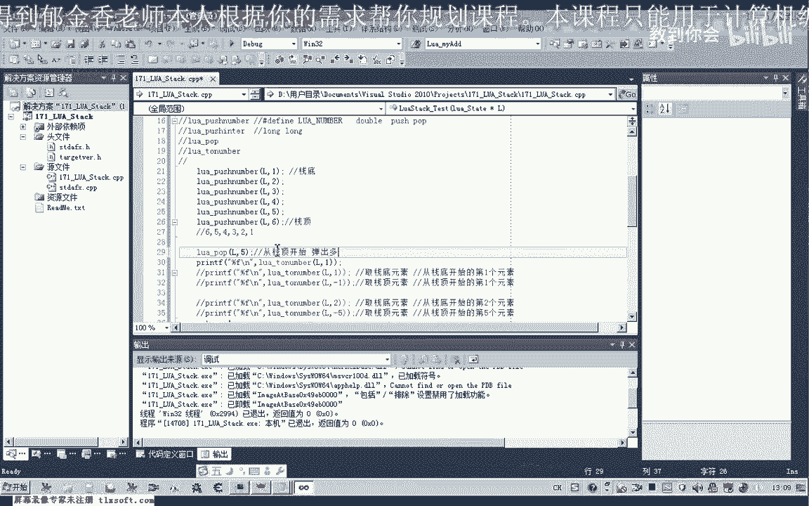

了解了如何向栈中添加和读取数据后，我们来看看如何移除栈顶的元素。这通过`lua_pop`函数实现。


`lua_pop(L, n)`函数从栈顶弹出`n`个元素。例如，初始栈为 `[1, 2, 3, 4, 5, 6]`（栈底到栈顶）。

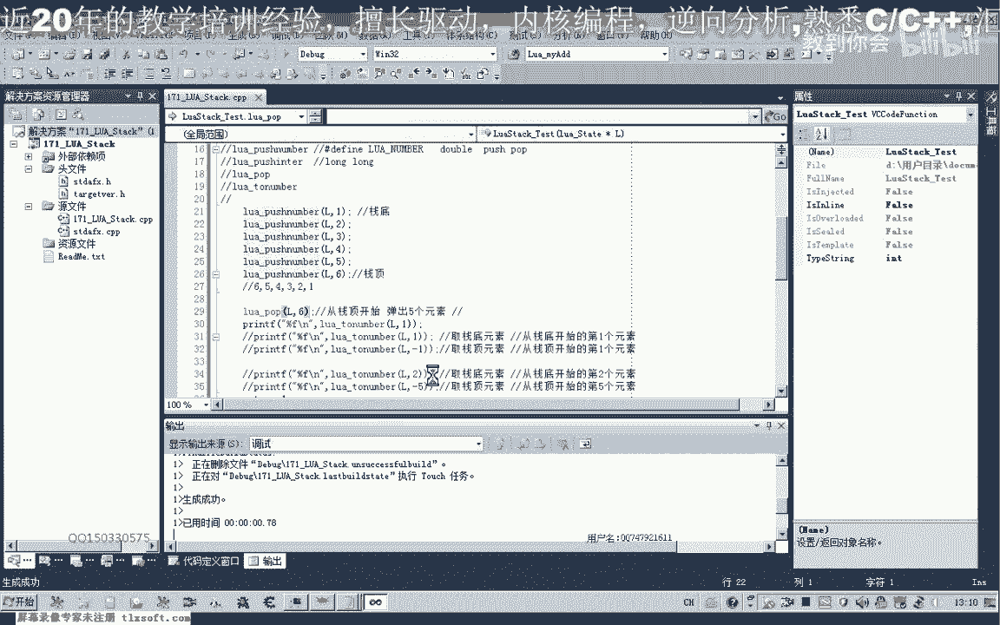

```c
// 弹出2个元素
lua_pop(L, 2);
// 此时栈变为 [1, 2, 3, 4]，栈顶元素是4
double new_top = lua_tonumber(L, -1); // 值为 4.0
```


如果弹出元素的数量等于或超过栈的大小，栈会被清空，此时再尝试取值可能得到未定义的结果（如0）。

```c
lua_pop(L, 6); // 弹出所有元素
// 栈已空，以下操作可能得到0或未定义值
double undefined = lua_tonumber(L, 1);
```


## 整数与浮点数的压栈


Lua提供了不同的函数来压入整数和浮点数，但需要注意它们在栈内的存储最终都会统一为`double`类型。


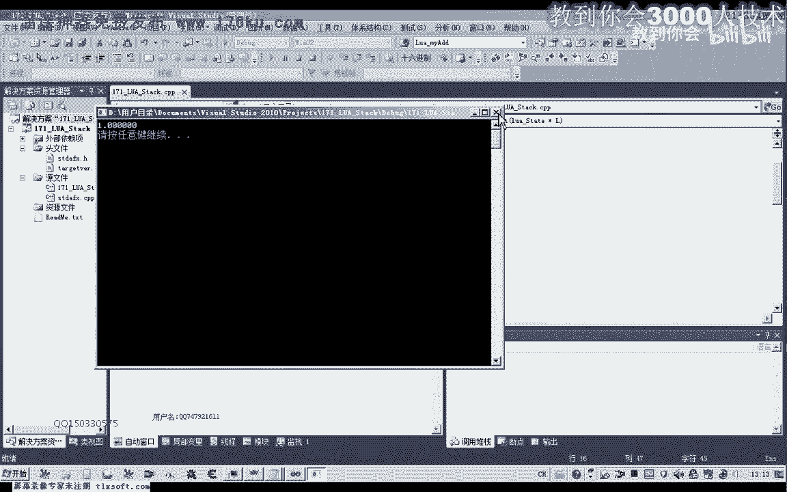

*   `lua_pushinteger(L, ivalue)`: 压入一个`lua_Integer`类型（通常是`long long`）的整数。
*   `lua_pushnumber(L, nvalue)`: 压入一个`lua_Number`类型（通常是`double`）的浮点数。

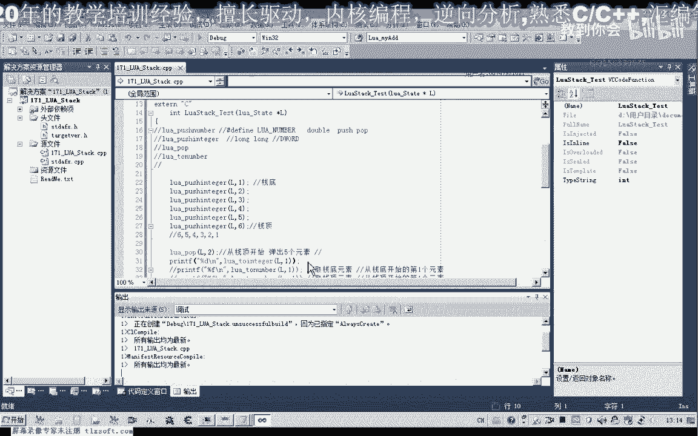

即使使用`lua_pushinteger`压入整数，当使用`lua_tonumber`读取时，返回的仍是`double`类型。如果需要整数，可以进行强制类型转换。


```c
lua_pushinteger(L, 100);
// 读取为浮点数
double dval = lua_tonumber(L, -1);
// 转换为整数
int ival = (int)lua_tonumber(L, -1); // 或者使用 lua_tointeger 函数
```

## 总结

本节课中我们一起学习了Lua栈的基础知识。我们了解到栈是Lua与C交互的桥梁，通过索引（正索引从栈底开始，负索引从栈顶开始）来访问元素。我们实践了四个核心操作：
*   **`lua_pushnumber` / `lua_pushinteger`**：用于将数值压入栈顶。
*   **`lua_pop`**：用于从栈顶弹出指定数量的元素，改变栈顶指针。
*   **`lua_tonumber`**：用于根据索引从栈中获取一个双精度浮点数值。

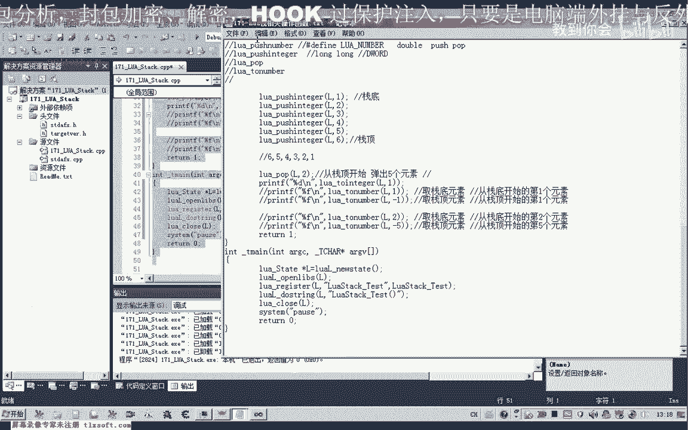

这些是操作Lua栈最基本和常用的函数。在后续课程中，我们将学习如何利用栈来传递函数参数和返回值。