# P161：172-C,C++中获得 LUA函数返回值 - 教到你会 - BV1DS4y1n7qF

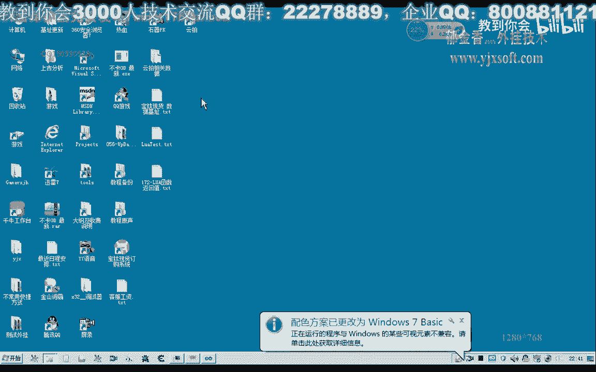

大家好，我是郁金香老师，那么这节课呢我们主要探讨一下啊，如果函数的返回值啊，那么如果函数的返回值的话，它有一些啊要求，那么首先呢我们要获得它的返回值的话，一般呢我们需要用la获得方式来调用。

那么这个扩的方式呢，首先呢它需要遵循一些啊规定，那么首先我们要调用的这个函数呢应该会首先纳入这个堆栈，然后再次把它相应的这个函数的参数呢按正序压战，那么这个站的话是指指得我们上一节课啊。

讨论的这个路网里面的这个虚拟战好，那么这是对我们相应的这个库的调用的一个要求。

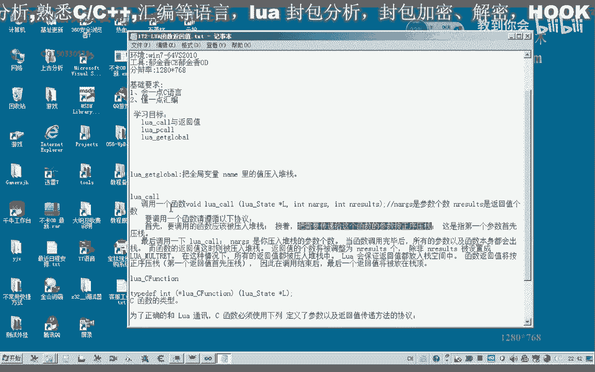

那么另外一个标准的这个路网的这个库，它还有一些呃，也就是lua的函数，它也有一些要求，那么为了正确的与我们的vr通讯呢，那么c函数呢必须使用下列的定义以及返回制的啊传递的一个协议。

那么首先呢我们的参数呢以正序压榨啊，第一个参数呢首先入账，那么因此我们在这个函数开始的时候呢，我们可以用这个lua的get top来获取这个呃参数的个数啊，接受这个参数的个数，好好，那么第一个参数啊。

如果有的话，那么它应当在这个索引之一的地方啊，而最后一个参数呢应当在我们的这个战绩啊，肯定尤其是啊get的拓扑啊，这个地方，一好的，那么我们还是因为他这个的话表示的不是很明确。

那么我们还是以代码啊测试为准，那么我们建立一个啊新的项目工程来测试我们的相关的函数传递的嗯。

这一部分。

那么建立好之后呢，我们可以把上一节课的一些代码呢把它复制进去啊，作为一个测试，当然我们也可以重新写在这里，我们还是找一下171的代。

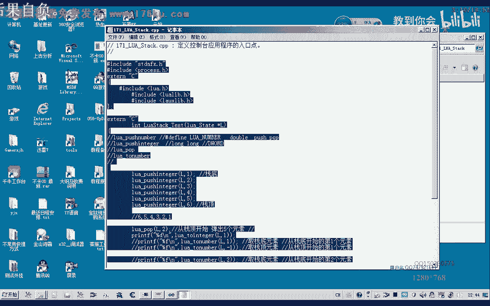

那么我们171的代码写好了之后呢，我们编译生成一下，那么我们在它的基础上呢，把我们上一节课的这个代码呢，把它呃修改标准啊，那么也就是我们在这个，啊这是一个站的一个操作啊，那么我们另外写一个函数。

或者在这里，就写一个连接啊，累加的一个函数，可，那么按照他的标准来写的话，我们最后这里的return的话是返回的，返回值的一个个数，那么我们最后我们要返回的这个数值的话。

它应当呢呃压在我们的这个进行压榨啊，如果只有一个参数的情况啊，比如说我们在这里的话，那就复习一个兰博，图形硬盘，比如说我们在这里他要返回一个数值333这个数值，那么最后呢他返回的这个参数呢只有一个啊。

这就是一个简单的一个标准的呃，la的一个函数，啊，那么标准的格式呢就是这样的，那么我们要来调用它的话，我们把之前的这些代码把它整理一下，在这里呢我们也首先要注册注册我们的，大，一九。

那么注册了函数之后呢，我们调用呢我们可以用lua core的方式来调用，那么这个入库的方式来调用的话呃，它第一个呢也是环境指针，第二个是参数的呃个数，那么这里呢是返回值的个数，它就这样三个子。

那么我们先把它按照它的格式呢，我们来指定啊，那么首先呢是环境指针状态状态即指针，那么第二个呢我们是他要传入参数的个数，那么比如说我们要传输八个参数，那么后边呢它是返回值的参数，比如说啊只有一个返回值。

但是我们这个扩的话，它没有指定我们要调用的呃，究竟是我们这个dd兰兰或者是这个函数呢，所以说这个呢它也需要指定，那么我们看怎么来指定，那么他说的要调用的这个函数呢，应该啊被压入堆栈，应该首先被压入堆栈。

那么实际上是指的这个要调用这个函数的地址来，应该首先入战，那么在接着的话再把这个呃这个相应的参数来按正序压战，也就是第一个参数来要首先压战啊，那比如说我们这个函数哈最后要计算的这个数值啊。

这个数字比如说是计算哈八个数的论加，比如说我们这1234678这几个数字的一个加的这样的一个函数，那么这里呢他参数呢应该有八个，但是呢我们要知道这个路啊，扩它究竟是去调用的某个函数呢。

那么我们先要先把它的这个地址大战，比如说我们调用这个函数，那么我们就需要把这个a d d number的地址，首先压到我们的这个虚拟战里边，那么我们可以用嗯一个相应的函数来压榨啊。

这个get logo啊，它就是用来压榨我们的全局的这个变量或者函数这一类的，那么后后边呢是这个全局变量的名字，那么这里讲的是a d d number。

那么这一句呢他就是把把这个dd lao的这个地址压到啊，放到我们的这个虚拟战里面啊，那么也就是相当于告诉这个网库嗯，也就是说我们就你会要调用的这个货呢，就是这个a d d number。

那么我们这里呢还有八个参数要压战，那么也就是说要执行八个不复习啊这个命令，那么这里的话我们复习了整数啊，不形成，那么这里呢我们纯净的345678这样压战，那么这是第一个，那么这里加上八个数就行，看一下。

这里是第四个啊，这里是第八个，好的，那么这里呢就一一共呢按照它的说明是八个参数，然后它的返回只有一个啊，这样就可以了，那么最终这里压榨的参数呢的个数的话。

我们可以来在这个hd number里边呢用一个相应的指令来获取啊，如果get top暂停，那么就是它参数的这个个数，那么我们可以用point，要不来把它打印出来，好，好的，那么我们可以先测试一下。

那么这个时候呢他可以发现这个参数的个数是八。

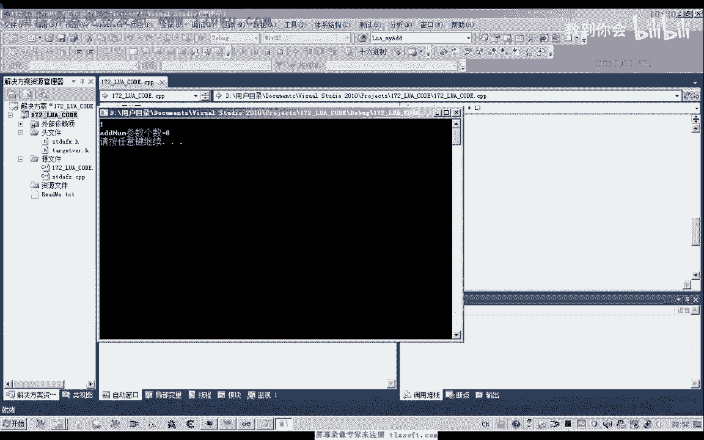

那么为什么这个skt top他能够发现这个呃参数18呢，那么实际上这个参数八呢是从这里传进去的，那么如果我们这里参数改为幺八的话。

我们看这是什么什么样的情况，那么这个时候呢它就会出错了啊。

因为我们实际上没有传入这样多的数字，但是我们可以改小一点，啊这个时候呢我们也会出错啊，所以说我们在这里的话啊，如果只传入了六个参数啊，那么这里呢我们就要呃少复习两个数字。

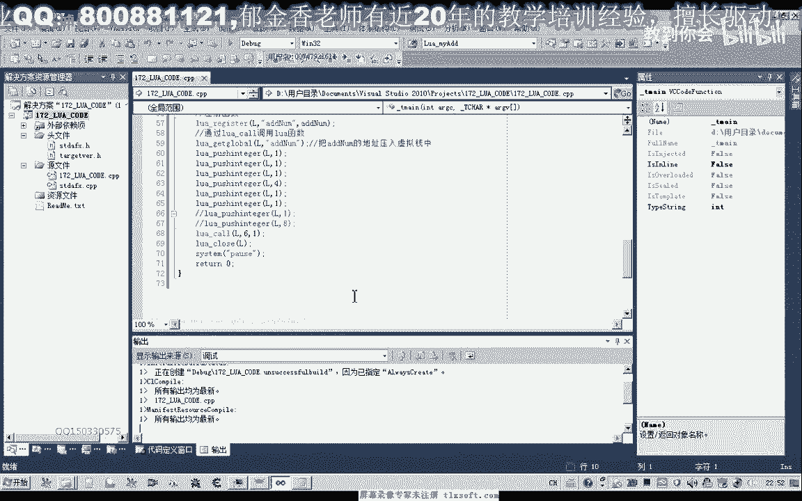

啊这里呢就能够呃发现了它传入的这个参数的个数呢是六五啊。

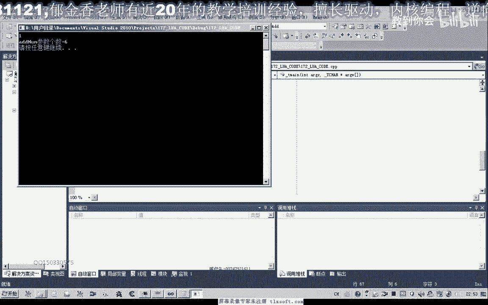

好的参数的个数是六，那么所以说实际上呃它获取的这个参数的个数呢就是我们的嗯，这里这个路a库啊传进去这个参数，因为它在这里的话，这个卢卡库它调用的时候呢，也会把这个数字呢进行最后的一个压战啊。

他也会把它压在这个站顶上面去啊，他也会进行一个压战，那么这里呢是最后它返回数值的一个个数啊，相当于是给它分配一个相应的这个空间，那么这里定义了返回值的个数的话，那么在这里呢我们也返回了相应的数字。

比如说333，那么我们在这个这里的代码怎么去取得这个返回的数字呢，那么我们可以这样啊，在这个地方呢，它因为它返回的数值的话，实际上在这里他也是把这个数据呢放在了他的这个虚拟战的占比啊，那么压力占点的话。

我们在这里的话，实际上呢我们就可以用呃，如果，土狼堡来获取图，或者那我取它的这个序列一啊，这里它的这个下标取一就可以了，按照他的这个说法的话，那么法有返回值的时候，它是正序压到车堆在上面的。

那么我们取返回值的时候呢，我们就可以用to int，如果是返回值是整数的话，那么我们直接你可以把它打印出来，啊，好的，那么我们看一下它的返回值。

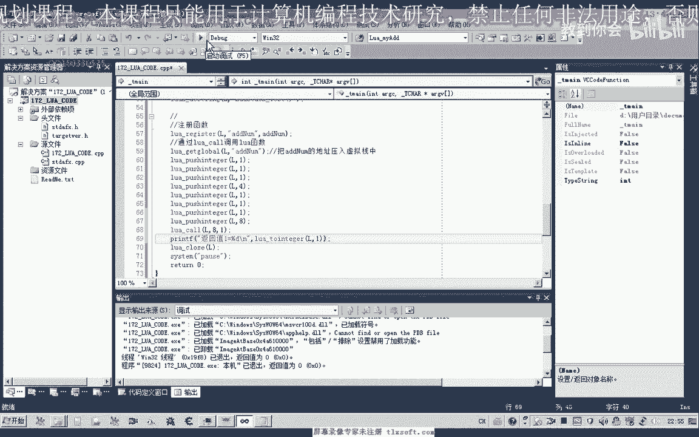

那么我们发现呢返回值是3x3。

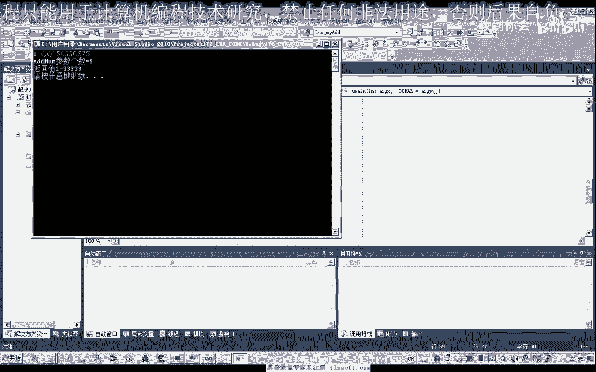

而且它的返回值呢是可以有多个的，那么在这里呢我们也可以另外再传一个返回值啊，或者我们直接传入三个返回值，这里呢111，第一个，第二个，第三个，那么依次加入我们的虚拟战二，最后一个人才是放在我们的呃。

这个占地，那么我们这里正确的话，它是从我们的占比呢呃开始取我们的这个数值，那么也就是说第一个的话它取的是这个一啊，那么这个的话他应该是压在我们的占比，那么如果是取-1的话，才是取这一个好的。

那么我们看一下接触三个返回值的情况，那么呢我们可以分别取123啊，看一下它的三个返回值，当然这个时候呢我们实际上只能够取到一个正确的返回值。

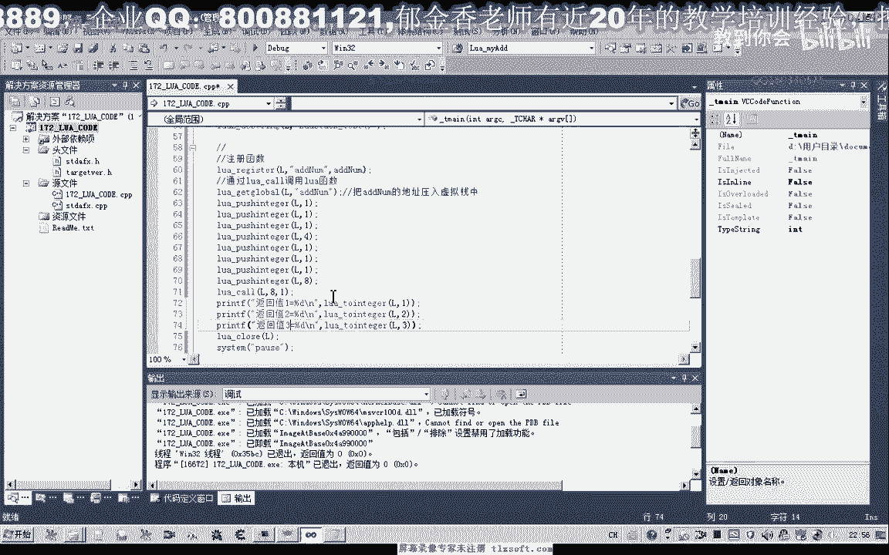

我们来看一下。

那么后边两个是零，为什么没有渠道呢，因为我们在努库的时候来跟他指定它返回的参数个数呢，实际上只有一个啊，所以说不会正确，还有这里的返回值参数呢我们也要改，如果不改的话，我们来看一下啊，它依然不会正确的。

那么所以说这里的参数个数与我们这里的参数个数呢，它一定要保持一致。

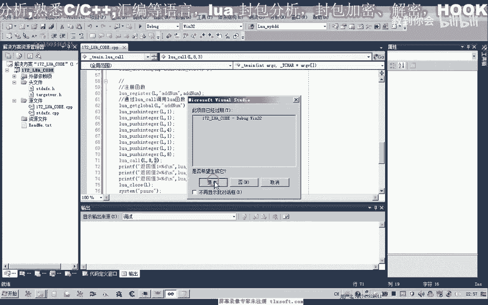

那么呢最后的返回值呢它才是正确的啊。

比如说我们这里只有两个的时候，好的返回之前换回录下来看一下。

那么这里呢也只能够取到两个正确的法分子。

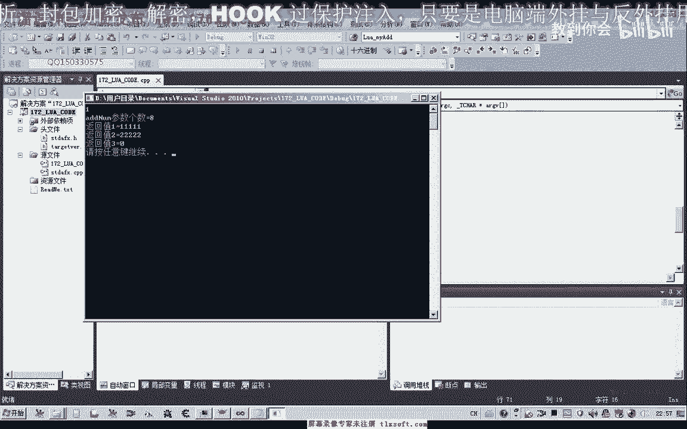

那么比如说我们这里是三个返回值，那么这里呢我们也压在哪三个，但是这里我们如果是只返回两个，我们再来看一下嗯。

他的情况，那么这个时候呢同样的不能够渠道啊正确的这个返回值。

所以说这里呢与我们这里的参数个数要对应，那么这个数量八呢要与我们亚战的这个参数啊要对应，全部都要正确，那么最后它参数的啊传入或返回来才会正确啊。

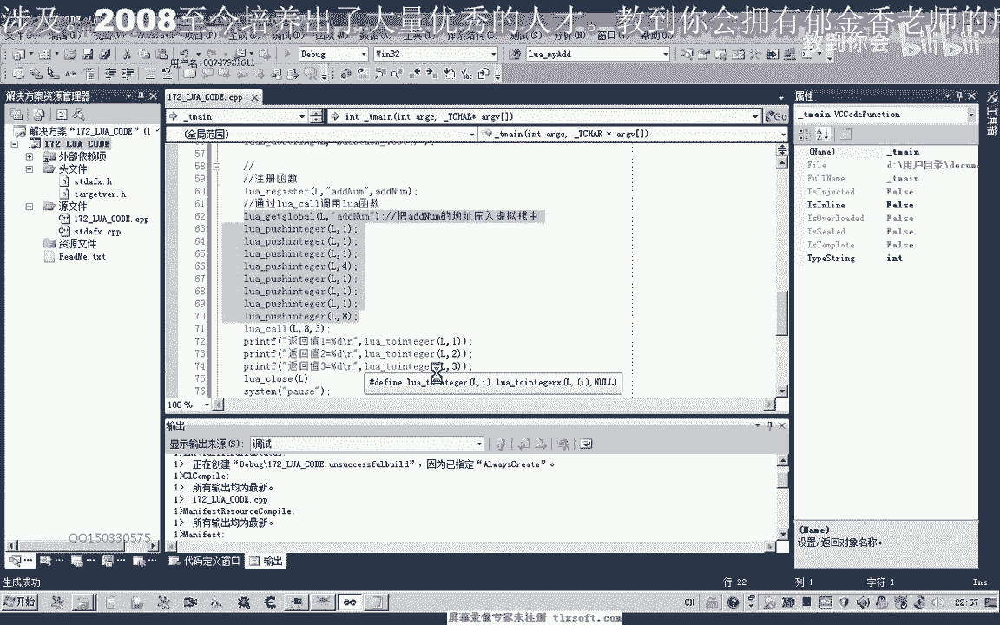

才会正确好的，那么我们把这个函数呢把它改完整，啊这个参数，那么我们最终要实现它的一个累加，那么我们依次来把它的这个相应的数字来取出来，那么再定义一个参数啊，结果，请放他累加的一个结果r。

那么我们要取出里边啊，相应的取出里面所有的这个参数，那么直接用我们的ur再提一个，啊，啊读音口，那么这里呢把它相应的这个下标传进去啊，从一到这个参数的总数，那么这里呢实现一个铝价。

那么最后呢我们把这个数字呢来给它返回，然后到第一个数字这里再改一下，好的，那么这样实现儒家之后，我们再来看一下它相应的这个结果。

啊最后呢我们这里加起来的数字呢呃等于幺八啊，这里我们也可以算出来啊，6+4场，最后来点幺八，那么我们这里再改一下啊，这样的等于要求。

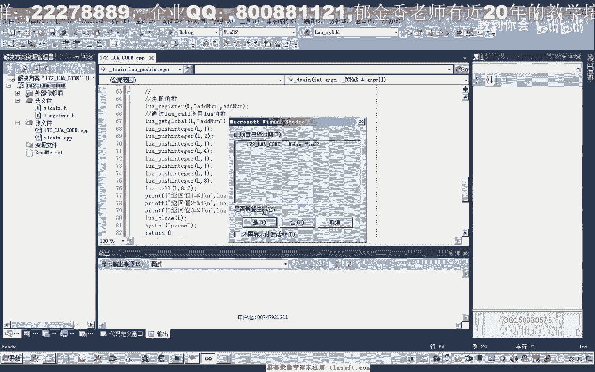

最后努力加到这个数字呢也是正确的。

返回至123啊，都能够返回好的，那么这节课的话我们就，就嗯研究到这里，那么下一节课呢我们再继续探讨哈鲁a其他的呃，这个问题好的。

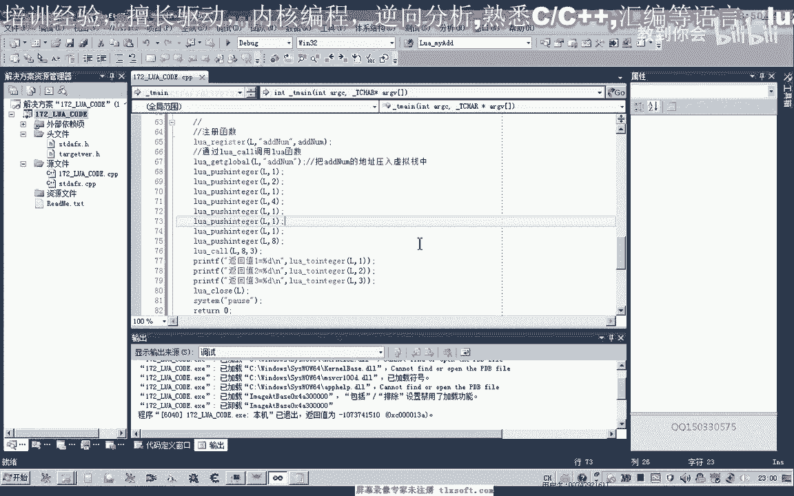