# P162：173-纯LUA函数中的参数与返回值与print函数 - 教到你会 - BV1DS4y1n7qF

大家好，我是郁金香老师，那么这节课呢我们来了解一下成都啊函数中的呃参数与返回值啊，那么我们主要还有就是呃成都啊的这个函数的一些呃标准的定义，应该怎么定义，哈哈那么首先呢我们先建一个lua的这个脚本啊。

比如说我们进校一点txt啊，就是这个记事本里面编辑，当然我们也可以用一些专业的工具啊，那么在编辑的时候呢，还有一些提示，那么我们呃在编辑起来呢会更加的方便啊，那么这节课呢我们暂时来先用记事本来编辑它。

那么这个路啊里边的这个函数的话，它呢是以是以我们的这个fine这个关键字来开始，然后呢以n的结束，那么翻开起后边呢跟的是一个反函数名，比如说这里呢我们是my f u n啊，就是我的函数。

那么后边呢是参数列表，那么注意它的这个参数的话，它不像我们这个c加加里边啊，有一个什么int a int b，那么不是这样显示的声明，那么比如说它是它的这个直接定义两个变量a或者是b。

也可以是呃有参数的或者是无参数的，那么比如说我们第一个函数呃，用参数的一个函数来做一个示例好，那么这个它的这个point这个函数来，与我们c语言当中的这个point tf来也也有一些不一样。

那么首先呢它没有一个格式化字串的一个支持，那么直接打印，那么后边呢呃如果要打印某一个变量的值的话，那么呢它可以只直接是a或者是一个常量啊，但是这个a呢必须得先定义一下，比如说跟他分一个初值啊。

那么这样呢就算定义了一个相应的这个变量，那么这个函数他写好了之后呢，他也要有一个执行的一个主体，那么在我们c语言当中呢，比如说就是我们的这个盲函数啊，那么这两个减号来表示了此行是注释。

那么这个min函数呢，它也就是在图立于独立在这个函数体外边的这个代码呢，它都会被执行啊，比如说在这里呢我调用一下看书，好那么这样呢就是一个罗瓦的脚本文件，那么就在这个地方。

那么我们就可以用它的一些控制台来来调用它，当然我们532日的控制台呢也可以调用它。

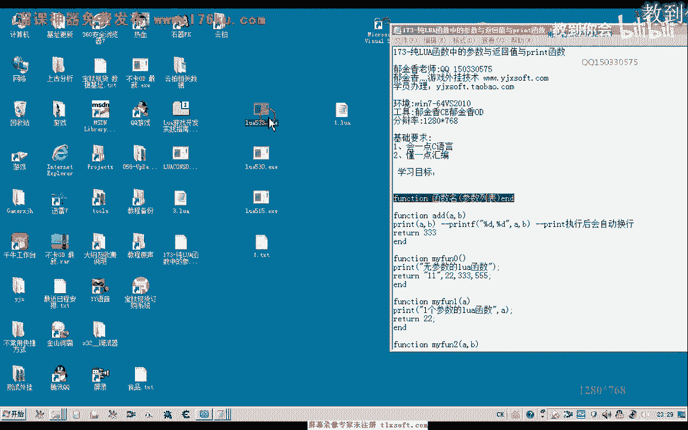

就是用直接用这个do file加文件名的方式，那么我们也可以用515的这个版本，那么网上流传的资料最广的了，也就是这个5。1的这个版本啊，但是呢这两个版本呢有一些差异啊，等一会儿我们可以看到。

那么这个时候呢它的这个结果呢就会被打印出来，就调用了我们相应的这个函数，那么同样的我们可以来再次编辑成这个相应的代码。

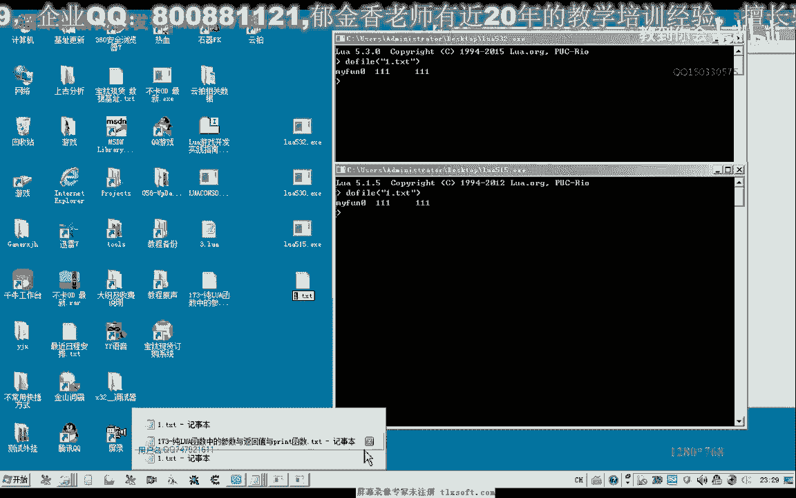

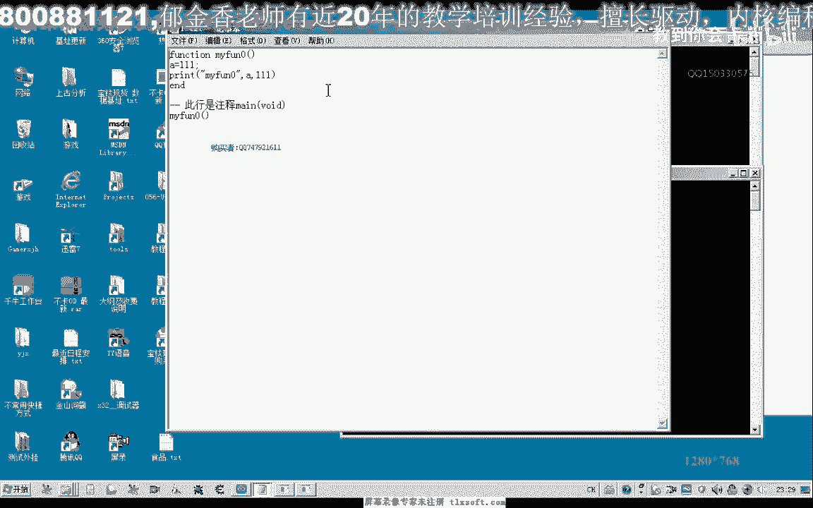

那么我们再编写一个函数，当然我们也可以在这里边呢添加我们的一些代码，它的这个pointer函数来，它会自动换行啊，212112，那么呢他不用这个换行图，这个转移字符换行了也是可以的，但是呢他会换两行。

这个时候那么我们可以仔细看一下，这个时候呢它会多多空一行出来，实际上它自动的就有一个换行的一个功能，自动修理一个换行成功了。

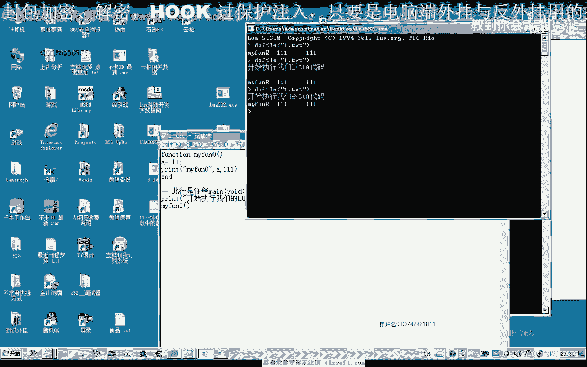

当然这个执行呢啊不同的这个并联行版本呢，它执行呢呃虽然说有些差异，但是大部分它是相同的好。

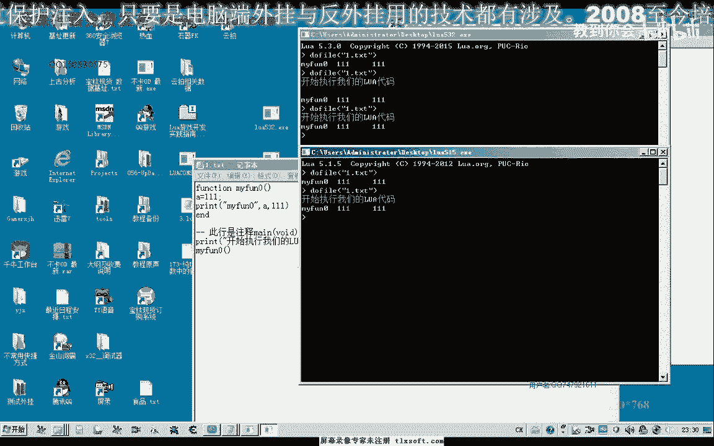

那么我们再来看一下第二种函数的一种形式啊，那么第二种一种是有参数的，一种就是五参数的，那么比如说那么这里呢我们打印几个参数啊，四个参数，那么这四个参数呢它可能是整形的，也可能是字符串型的啊。

也可能是宝典类型的，也可能是其他啊，任任意类型的啊，都有可能，那么具体呢要看我们传什么数据进去啊，那么在这里的话我们要打印出它的话，我们可以直接好你这个相应的变量进来，嗯，嗯cd看看。

那么关键是看我们在传参数的时候会传一些什么参数进去，好那么我们再保存一下，那么这里呢我们传了四个参数性能，那么这是打印我们的相应的这个数字，那么它的这个point f呢。

它就与我们的这个c语言当中的point f呢不一样，首先呢它不用百分之d啊这一类的格式化，那么一般我们要打印的c语言当中的话，我们需要格式化，再次我们相应的这个变量啊。

这里那么它里边不需要它这个变量呢可以是任何类型的，它不不用显示的声明，那么如果是在我们c语言里边的话，这里呢我们可能就会进行整形，那么后边呢我们可能是会定义为字符串的类型这里的，但是它里面都这么定义啊。

它不是显示的，那么所以说这样呢它灵活性更大一些，但是呢这样的程序呢它缺乏一个健壮性啊，好的，那么我们再来看一下另外的一种函数的调用方式，那么函数呢它肯定是可以有返回值的。

那么在这里呢比如说我们给它返回一个值与特111，那么返回值呢在这里呢返回式也可以是任意的类型，那么可以是指针啊，也可以是我们的布尔类型，那么也可以是我们的字串啊，都是可以的。

那么我们来看一下有返回值的情况，那么我们可以把这几行代码先注释掉，那么注释多行代码的时候呢，我们可以用两个减号啊，两个括号，那么这里呢也用两个括号哈。

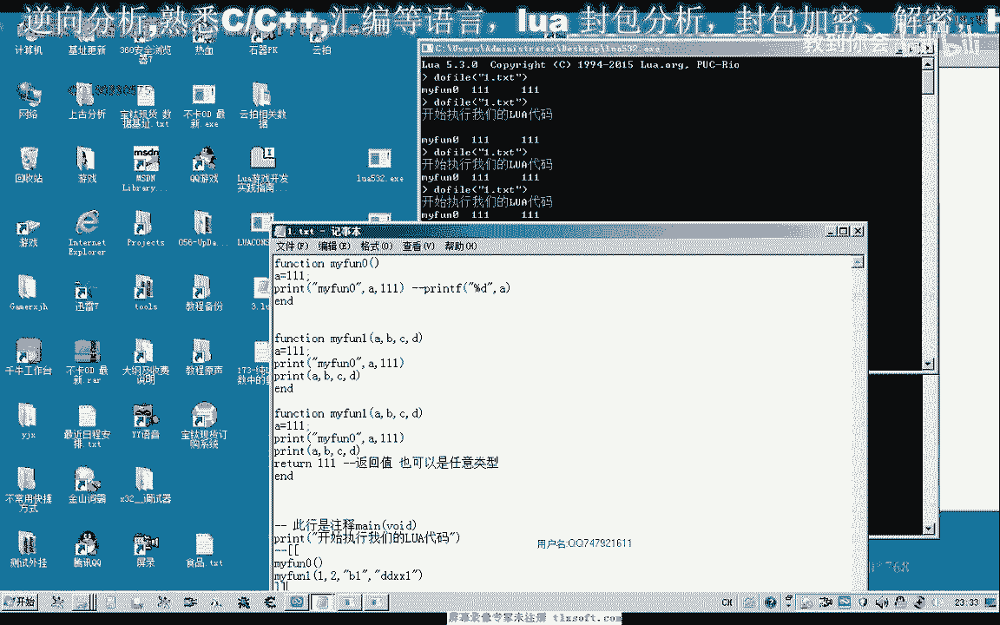

两个减号，这样来达到一个柱石的一个物体代码的一个注释，后面就不会被运行，那么这个时候呢我们测试一下，那这个二是个函数，那么我们要打印它的返回值的话，直接问他，那么后面跟这个函数。

那么这样打印出来的话就会是它的一个返回值，然后我们看一下啊，这样我们就能够把它的一个返回值111打印出来，但是呢它也可以是一个尺寸的一个类型，也是可以的，那么这样呢我们打印出的是它的一个返回值啊。

在这里，那么我们可以来加上一个，再保存一下，再测试一下，但是呢我们注意这个时候呢我们前面呢没有传递我们相应的参数进去，那么所以说呢他在这里的时候呃，在打印的时候我们就打印出来的了，是一个空的一个类型。

n i l呢它表示是空啊，就是没有相应的地方呢，它没有这个相应的这个参数，那么在这里的话我们需要相应的参数呢，我们可以的呃，给他传递我们相应的参数进去，比如说这里我们传递a，b，三啊传递这几个参数进去。

再看一下它的一个法分子，看这个可可不可以清屏嗯，好，那么返回值呢它可以是字串，也可以是任何的数字，那么而且它还有一个特点呢，就是返回值呢可以有多个，那么也可以是整数，那么也可以是字串啊这一类的。

再保存一下看一下，那么我们可以看到啊，它既可以是我们的浮点数，那么也可以是整数，也可以是字串，而且返回指南可以有多个啊，那么还有一种形式呢，就是变成的这种形式，那么比如说我们再举一个例子啊。

那么变成呢就是它的个数呢不确定，啊，好，那么变成了它其中的这个参数的个数呢，放在这个a i g n里面，那么我们看一下它参数的个数，那么在这其他的代码呢，我们也把它移到我们的数字行里边。

那么在这个地方呢我们来调用这个拥有变成的这个函数，打，到，那么它的参数的个数的话是可变的，而且也可以是任意的类型，哈哈咳咳，哈哈哈，那么但是呢我们这个时候我们注意他这里的参数的个数呢，它没有打印出来。

实际上呢它是认不到这个变量啊，在我们的nova里边呢。

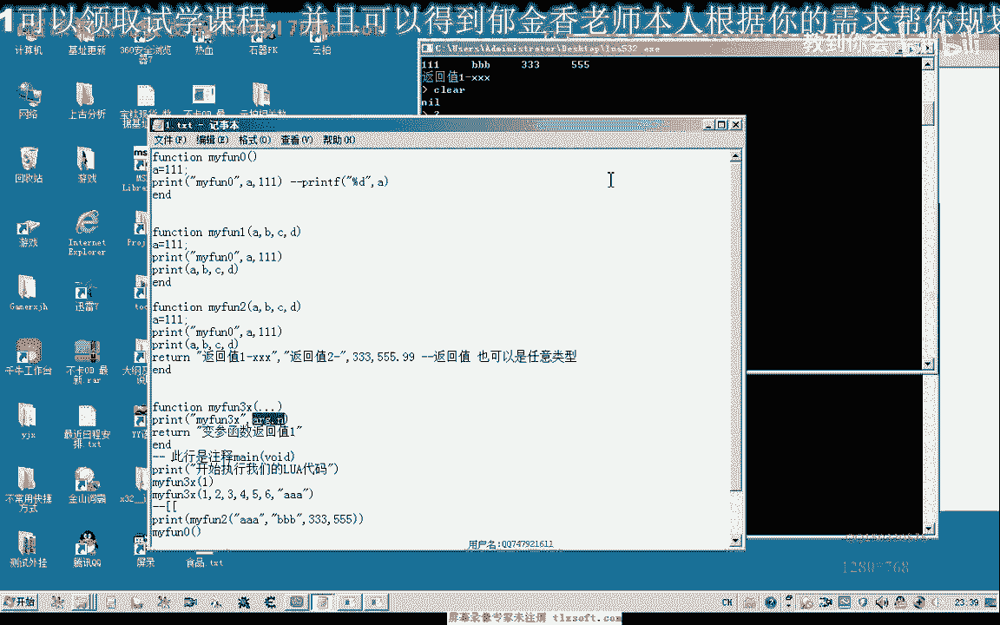

它叫做表，那么我们倒是用下边这个来执行一下，但是这个时候呢它会显示出它参数的个数，这里是一个啊。

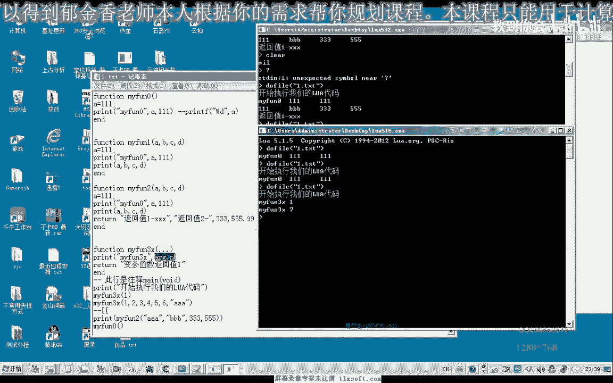

这里是七个参数，123456啊，这里还有一个参数。

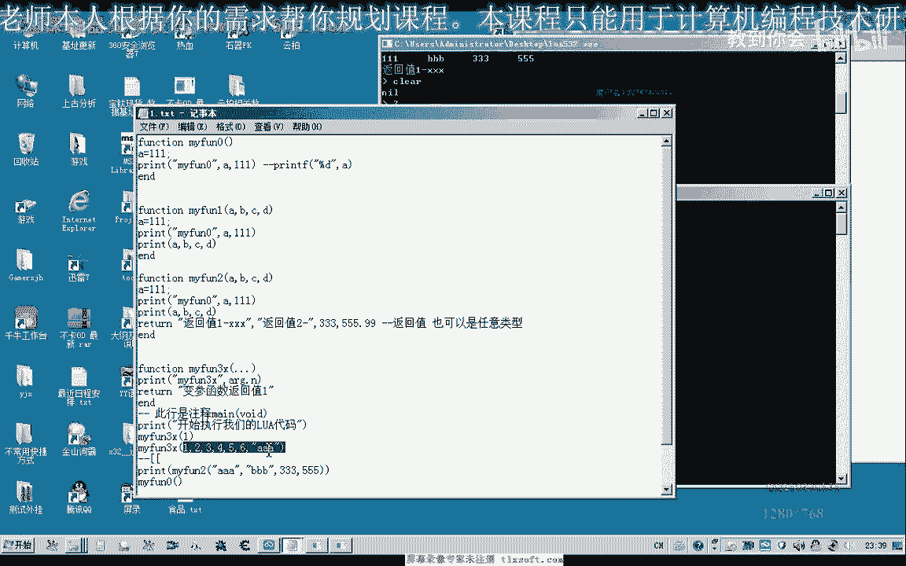

它的数量是七，那么这就是我们的这个所用的这个平台，它不一样啊，平台的版本不一样，那么呃我发现的话这个515之后的这个版本呢，他都不能够认识这个相应的这个表a r g。

它实际上相当于我们c语言里面的一个结构，那么它结构里面的这个成员函数n呢，里边呢存放着这个参数的数量，但是这个版本呢呃他不是不认识。

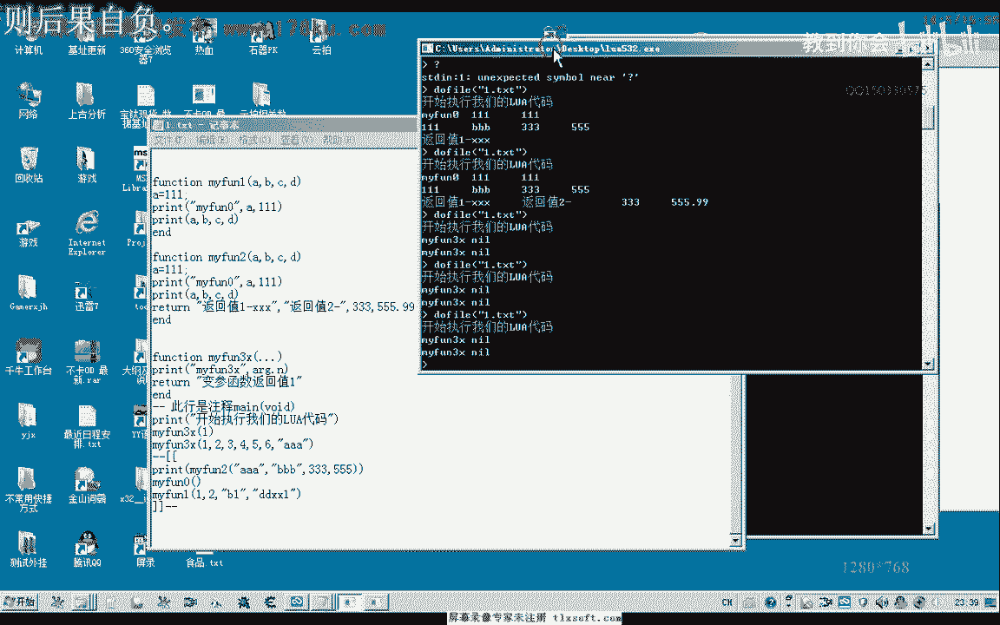

那么所以说我们后面的这个版本的话，我们可能就会以这个路虎妖股的这个版本呢来做相应的这个例子，因为这个呃应当来说的话，这个532的这个版本呢，他也有办法来获取这个变量的这个数。

因为这个532的话它是最新的这个版本，那么网上的话它相应的这些资料呃不是很齐啊，找不到相关的资料，那我不知道他把它保存在某一个地方啊，还没有相应的这个文档做一个参考，好的，那么这一节课的话。

我们就暂时讨论到这里，那么下一节课呢我们在下载515的这个相应的源代码来编译，生成我们的这个静态库啊，那么只有生成了我们的静态库呢，在c语言里面的时候呢，我们这些呃指令呢我们才能够认识。

因为在网上资料最多的也是这个5。7的这个版本的，他的资料呢最多最完善啊，嗯但是这个五三日他可能增加了一些新的功能啊，去掉了一些旧的功能，所以说它的兼容性能向下的一个兼容性能啊，感觉不是很好。

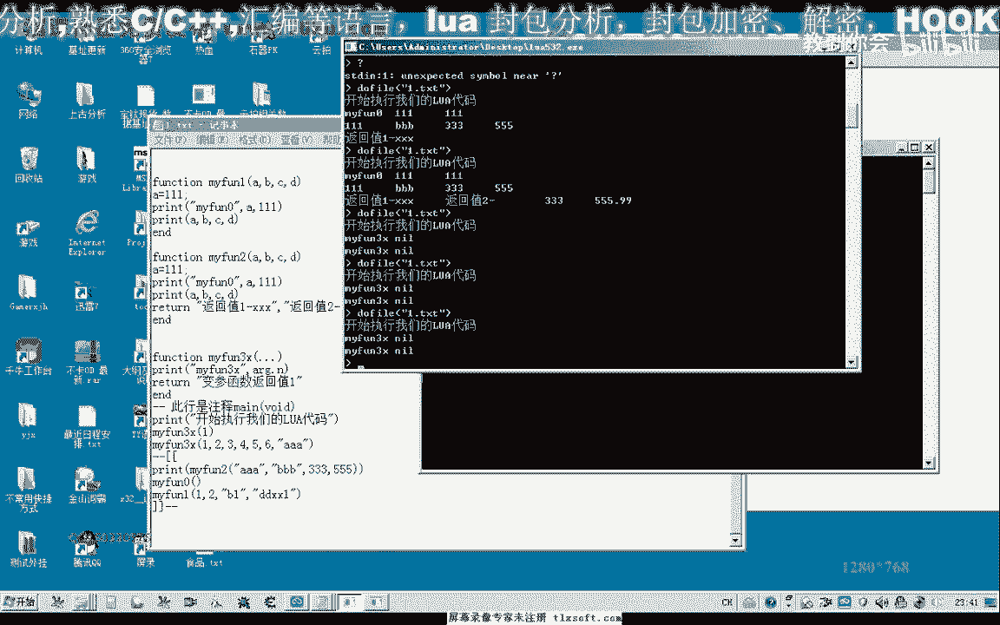

好的，那么这节课呢我们对这个函数的了解呢，呃暂时呢就到这个地方。

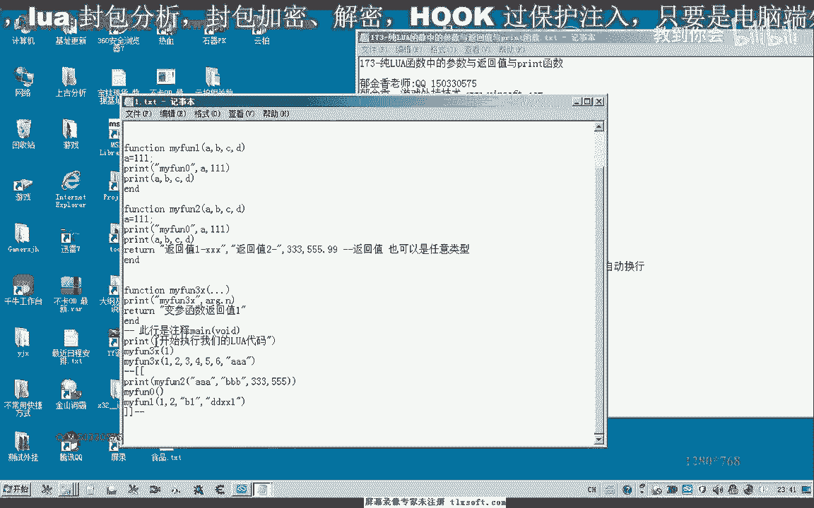

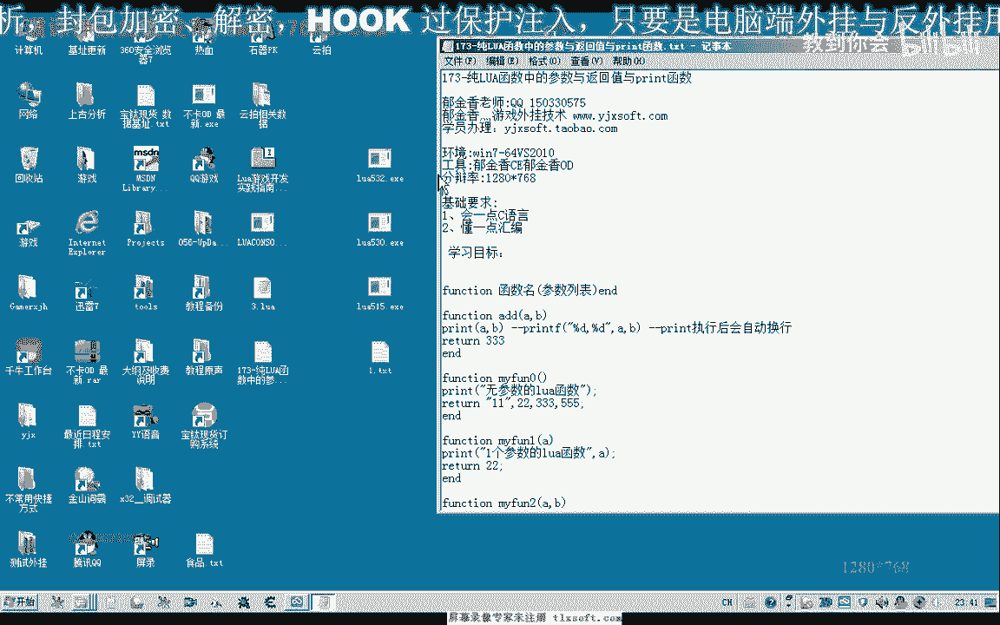

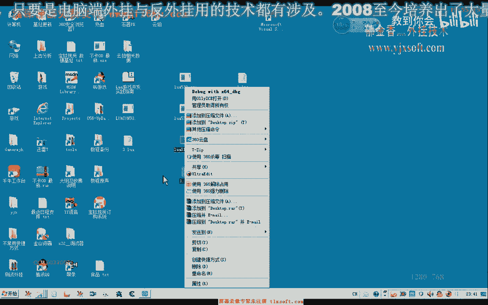