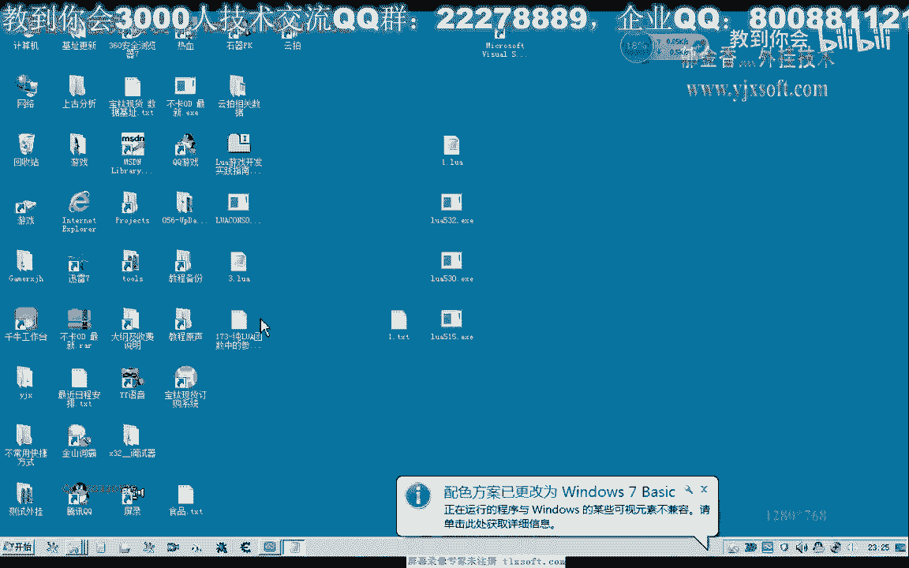
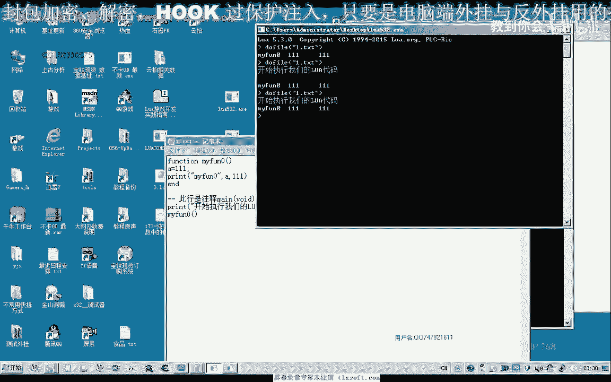
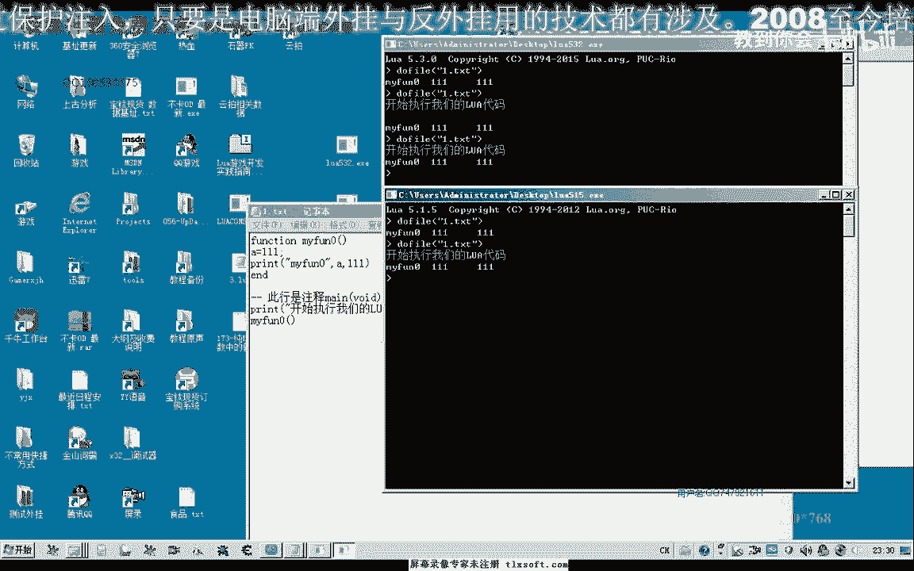
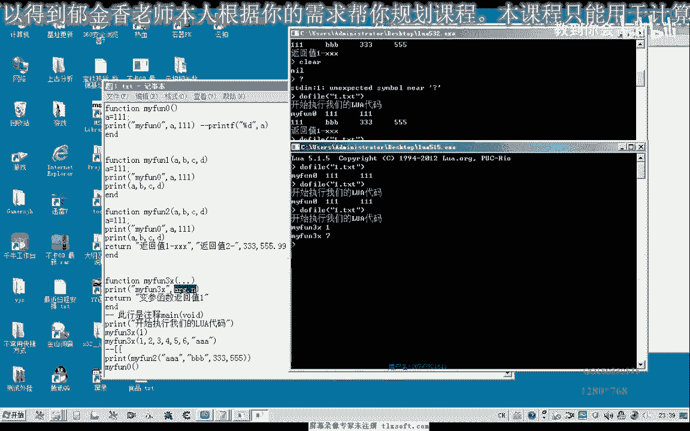
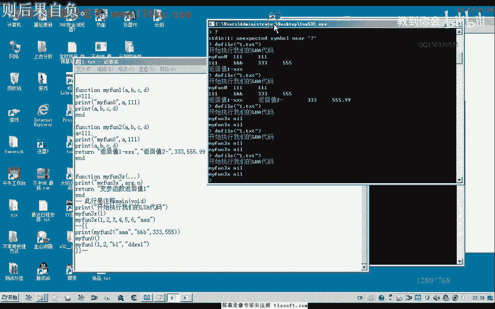
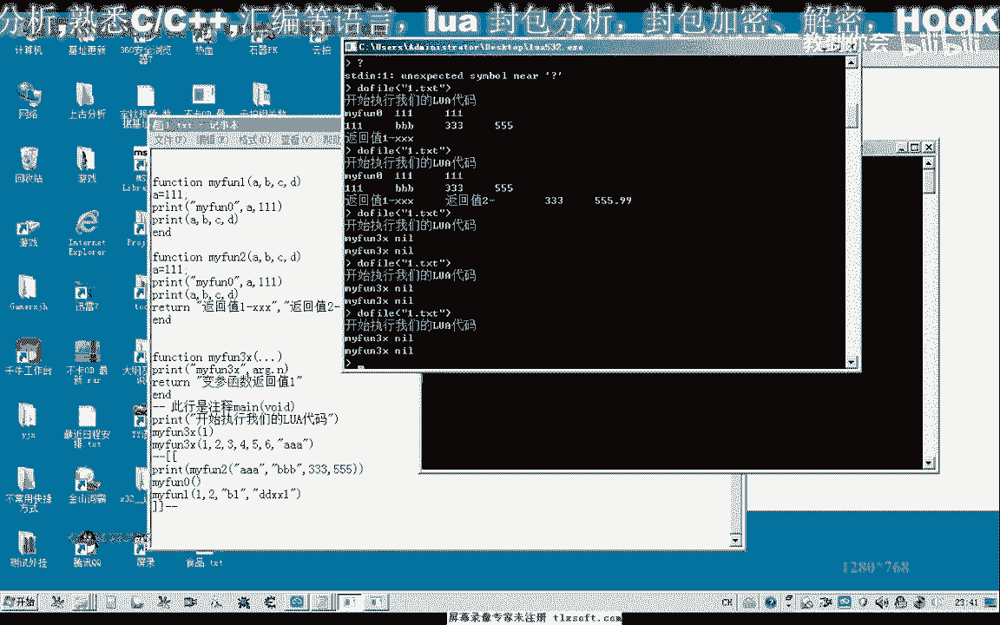
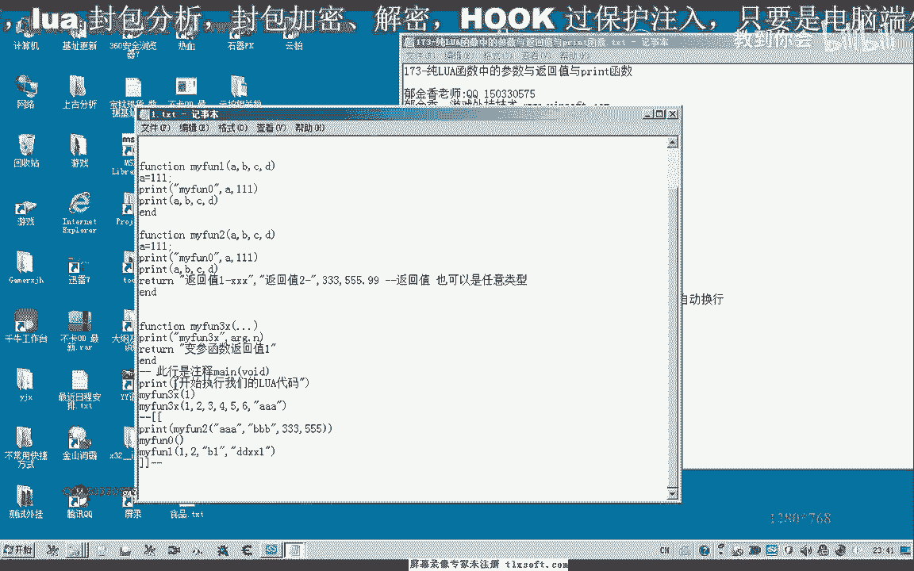
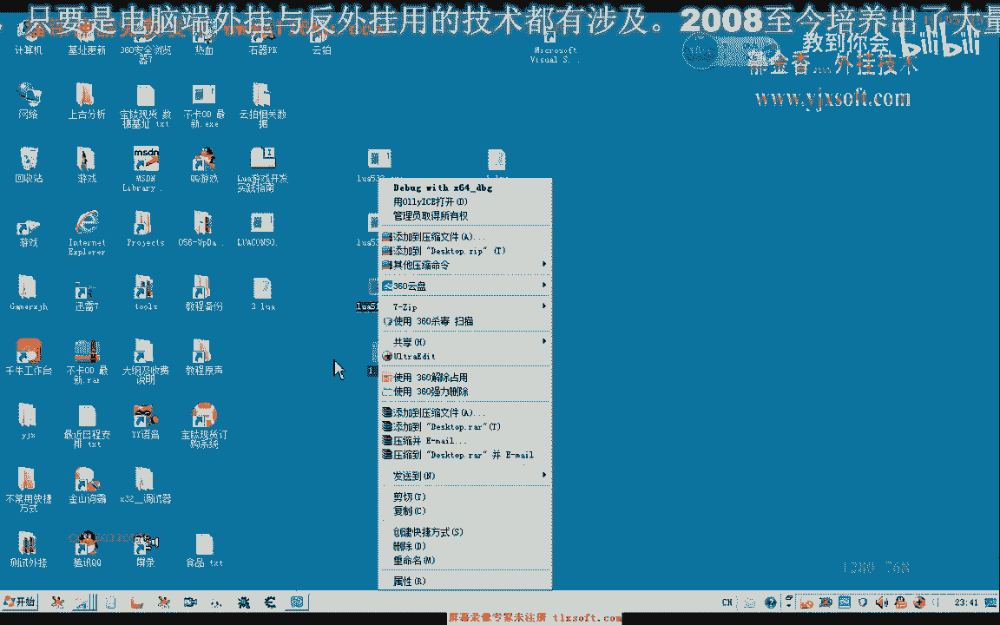

# 课程 P162：纯LUA函数中的参数与返回值与print函数 📚



在本节课中，我们将学习Lua语言中函数的基本概念，包括如何定义函数、传递参数、处理返回值以及使用`print`函数进行输出。课程内容将涵盖无参函数、有参函数、多返回值函数以及变参函数，并通过简单示例帮助初学者理解。

---

## 概述 📖

Lua函数以`function`关键字开始，以`end`结束。函数定义的基本语法是`function 函数名(参数列表)`。与C/C++等语言不同，Lua函数的参数无需声明类型，这增加了灵活性，但也可能影响程序的健壮性。

---

## 函数定义与调用 🔧

上一节我们介绍了Lua函数的基本结构，本节中我们来看看如何具体定义一个函数并调用它。

Lua脚本可以在记事本或专业编辑器中编写。函数体外的代码会被顺序执行，这类似于C语言中的`main`函数。


以下是一个简单的无参函数定义与调用示例：

```lua
function myFun()
    print("Hello from function!")
end


myFun() -- 调用函数
```

使用Lua控制台执行该脚本，例如使用`dofile(“filename.lua”)`命令，即可看到输出结果。

---



## print函数的使用 🖨️



`print`函数用于输出信息到控制台。它与C语言的`printf`不同，不支持格式化字符串，但可以打印任何类型的值，并会自动换行。

以下是`print`函数的使用示例：

```lua
a = 10
print(a)          -- 打印变量
print("Hello")    -- 打印字符串
print(123, 456)   -- 打印多个值，用逗号分隔
```

需要注意的是，不同版本的Lua解释器在`print`输出的换行处理上可能略有差异。

---

## 函数的参数 📦

函数可以接收参数。参数在定义时无需指定类型，其实际类型由调用时传入的值决定。


以下是一个接收多个参数并打印的函数示例：

```lua
function printParams(a, b, c, d)
    print(a, b, c, d)
end

printParams(1, “test”, 3.14, true) -- 传入不同类型的参数
```

---

## 函数的返回值 🔄

函数可以有返回值，使用`return`语句。Lua函数可以返回任意类型和任意数量的值。

以下是返回单个值和多个值的函数示例：

```lua
-- 返回单个值
function getValue()
    return 111
end
print(getValue())

-- 返回多个值
function getMultiValues()
    return 100, “apple”, 3.14
end
local num, str, pi = getMultiValues()
print(num, str, pi)
```


---



## 变参函数 🔄


Lua支持变参函数，即参数数量不确定的函数。在旧版本（如5.1）中，变参通过一个名为`arg`的局部表来访问，其中`arg.n`表示参数个数。

以下是变参函数的示例（适用于Lua 5.1）：



```lua
function varArgsFunc(...)
    print(“Number of arguments:”, arg.n)
    for i=1, arg.n do
        print(arg[i])
    end
end

varArgsFunc(1, “a”, true, 4, 5)
```

**注意**：在新版本Lua（如5.3）中，`arg`表的使用方式可能已改变，建议查阅对应版本的官方文档。

---



## 总结 🎯



本节课我们一起学习了Lua函数的核心知识：
1.  使用 `function` 和 `end` 定义函数。
2.  使用 `print` 函数输出信息，它会自动处理换行。
3.  定义和调用带参数的函数，参数无需类型声明。
4.  使用 `return` 语句让函数返回一个或多个值。
5.  了解了变参函数的基本概念，并注意到不同Lua版本在实现上的差异。




掌握这些基础是编写更复杂Lua程序的关键。下一节课，我们将探讨如何编译Lua源代码并将其集成到C语言项目中。