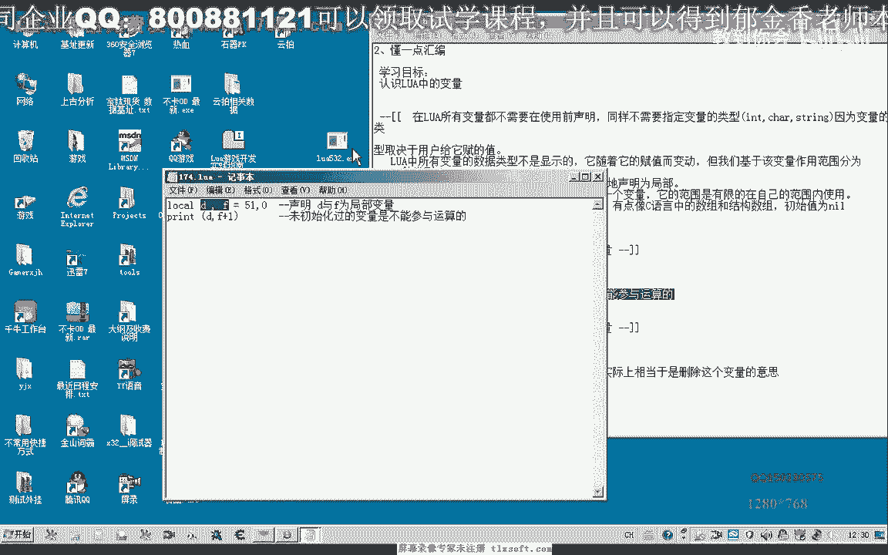
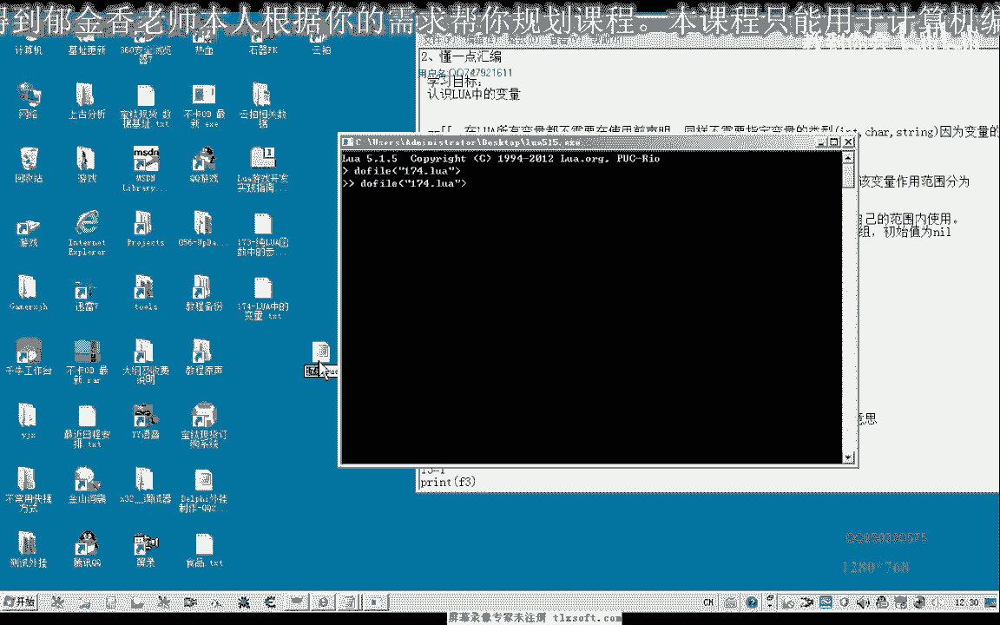
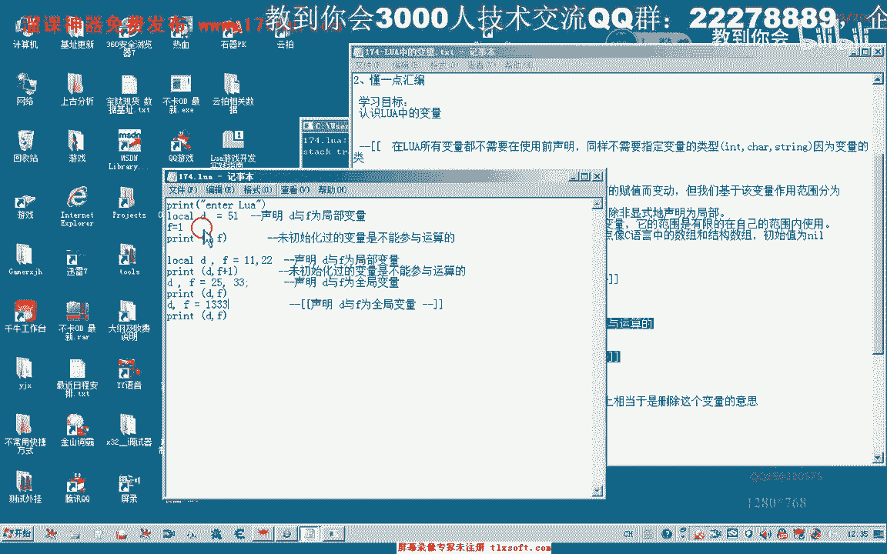
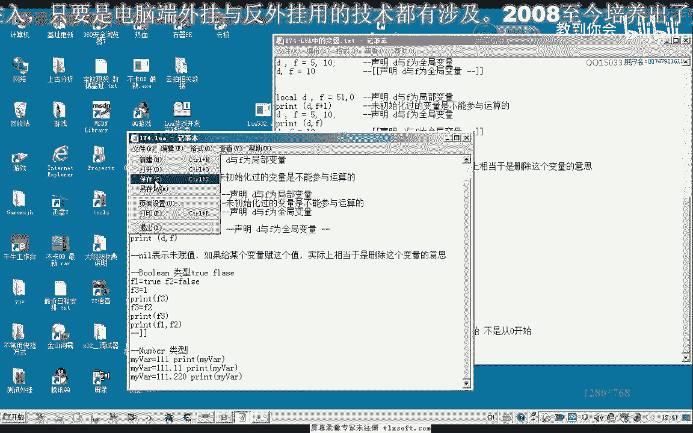
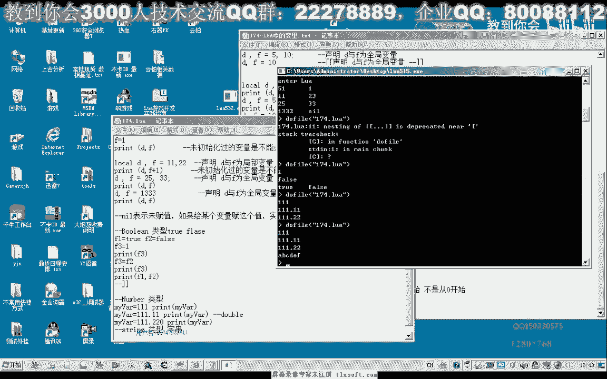
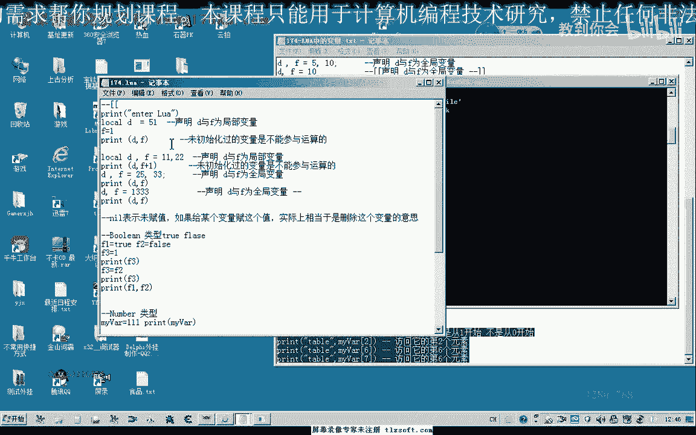
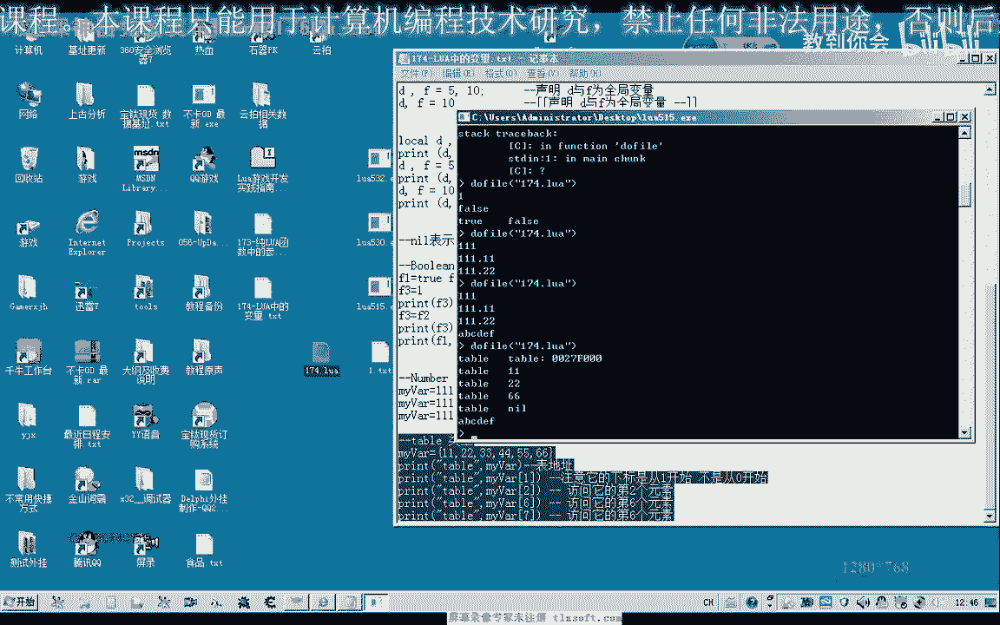
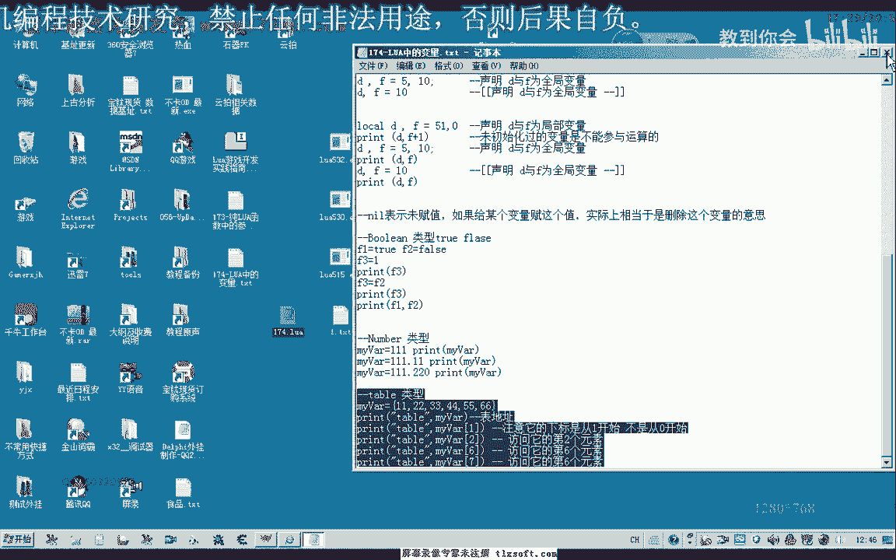
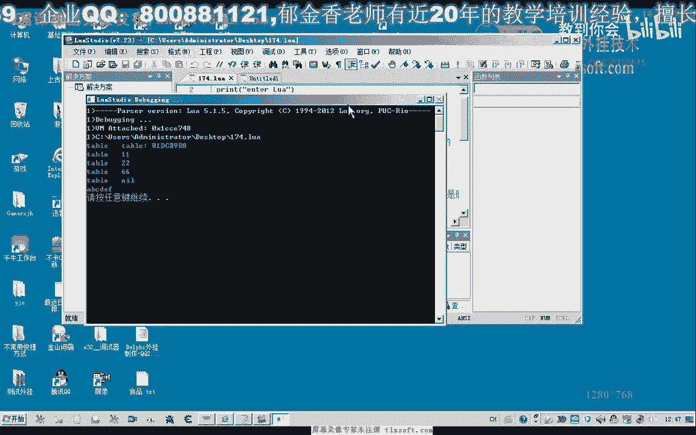

# 课程 P163：LUA中的变量 📚

在本节课中，我们将学习Lua脚本语言中的变量。我们将了解Lua变量的特点、类型、作用域以及它与C/C++等语言中变量的主要区别。课程将通过代码示例来演示这些概念。

---

## 概述 📖



Lua脚本可以独立运行，也可以嵌入到C/C++程序中运行。与C/C++不同，Lua中的变量无需显式声明类型，其类型由赋予它的值动态决定。本节我们将通过实践来理解Lua变量的基本用法。



---

## 变量的定义与作用域 🎯

在Lua中，变量分为全局变量和局部变量。默认情况下，所有变量都是全局的。使用 `local` 关键字可以定义局部变量，其作用域仅限于定义它的代码块（如函数）内。

以下是定义变量的基本语法：

```lua
local a = 10  -- 这是一个局部变量
b = 20        -- 这是一个全局变量
```

上一节我们介绍了变量的基本概念，本节中我们来看看变量的作用域和赋值规则。

---

## 变量的赋值与类型推断 🔄



Lua变量的类型由赋值给它的值决定。变量可以随时被重新赋值为不同类型的值。

以下是变量赋值与类型推断的示例：

```lua
local x = 100      -- x 现在是数字类型
x = "Hello"        -- x 现在是字符串类型
x = true           -- x 现在是布尔类型
```

如果变量未赋值就使用，其值为 `nil`，表示“无”或“未定义”。

---

## 变量作用域示例 📝

为了更清晰地理解局部变量与全局变量，以及“就近原则”，我们来看一段代码。

以下是作用域测试代码：

```lua
local d = 5
f = 1
print(d, f)        -- 输出: 5   1

do
    local d = 11
    local f = 23
    print(d, f)    -- 输出: 11  23 (此处的f是新的局部变量)
end


print(d, f)        -- 输出: 5   1 (回到外层作用域)
```

在这段代码中，`do...end` 块内定义的局部变量 `d` 和 `f` 不会影响外部的同名变量。



---

## Lua的数据类型 🧱

Lua是一种动态类型语言，支持多种基本数据类型。变量的类型会随着赋值而改变。

以下是Lua支持的主要数据类型：

1.  **`nil`**：表示一个无效值或变量未赋值。
2.  **`boolean`**：布尔值，包含 `true` 和 `false`。
3.  **`number`**：数字，包括整数和双精度浮点数。
4.  **`string`**：字符串。
5.  **`table`**：表，是Lua中唯一的数据结构，功能类似数组、字典等。



---

## 数字与字符串类型示例 🔢


数字和字符串是常用的数据类型。Lua中数字不区分整型和浮点型。

以下是数字与字符串的示例：

```lua
local myVar = 111          -- 被当作数字类型
print(myVar)               -- 输出: 111
myVar = 222.333           -- 被当作双精度浮点数
print(myVar)               -- 输出: 222.333
myVar = "I am a string"   -- 类型变为字符串
print(myVar)               -- 输出: I am a string
```

---

## Table类型（类似数组） 📊



Lua没有内置的数组类型，但使用 `table` 可以实现类似数组的功能。Table的下标默认从 **1** 开始。



以下是Table的基本用法：



```lua
local myTable = {11, 22, 33, 44, 55, 665} -- 定义一个表
print(myTable[1])  -- 输出第一个元素: 11
print(myTable[2])  -- 输出第二个元素: 22
print(myTable[6])  -- 输出第六个元素: 665
print(myTable[7])  -- 下标越界，输出: nil
```


Table的功能非常强大，现阶段我们可以先将其理解为可动态增长的数组。


---


## 开发环境建议 💻



使用纯文本编辑器编写Lua脚本效率较低。建议使用集成开发环境（IDE），它们能提供语法高亮、代码提示和调试功能，提升开发效率。


一个可选的工具是 **LuaStudio**，它提供了类似VC++的集成开发体验，方便代码编写和测试。

---


## 总结 ✨


本节课中我们一起学习了Lua中变量的核心知识：

1.  Lua变量无需显式声明类型，类型由赋值决定。
2.  使用 `local` 定义局部变量，否则为全局变量。
3.  变量作用域遵循“就近原则”。
4.  未赋值的变量值为 `nil`。
5.  Lua的主要数据类型包括 `nil`, `boolean`, `number`, `string`, `table`。
6.  `table` 是Lua中核心的数据结构，可当作数组使用，下标从1开始。


理解这些基础概念是掌握Lua编程的第一步。建议多编写代码并在控制台测试，以加深理解。