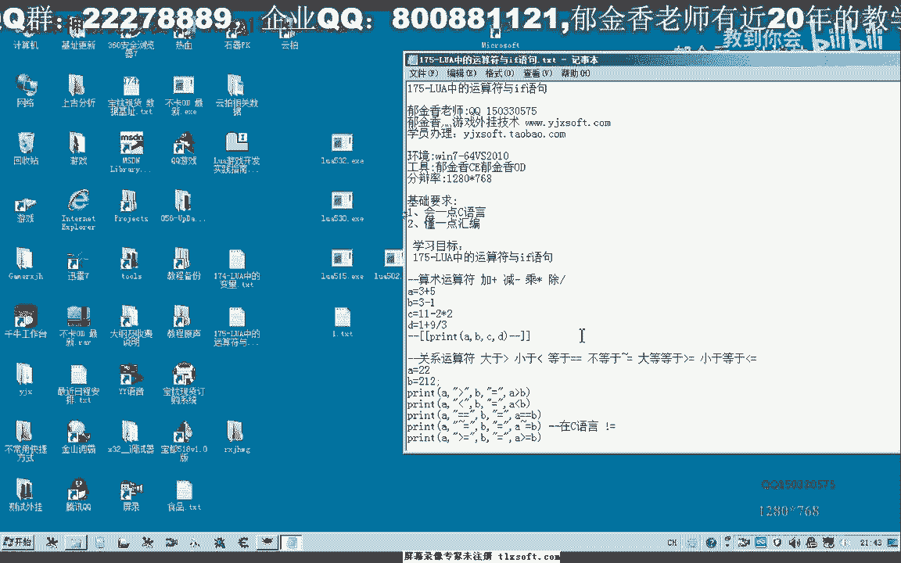
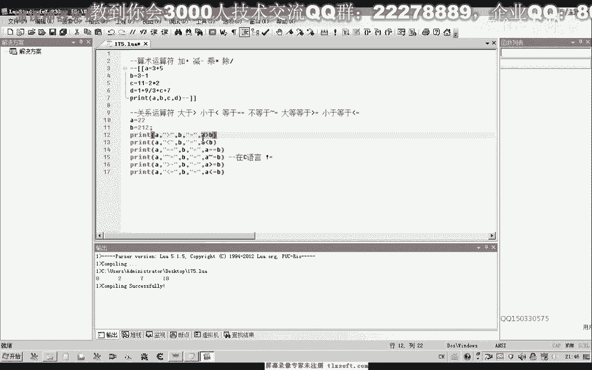
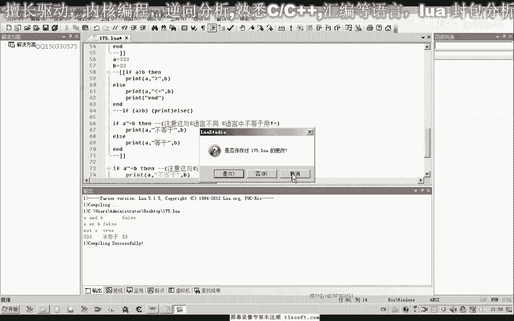
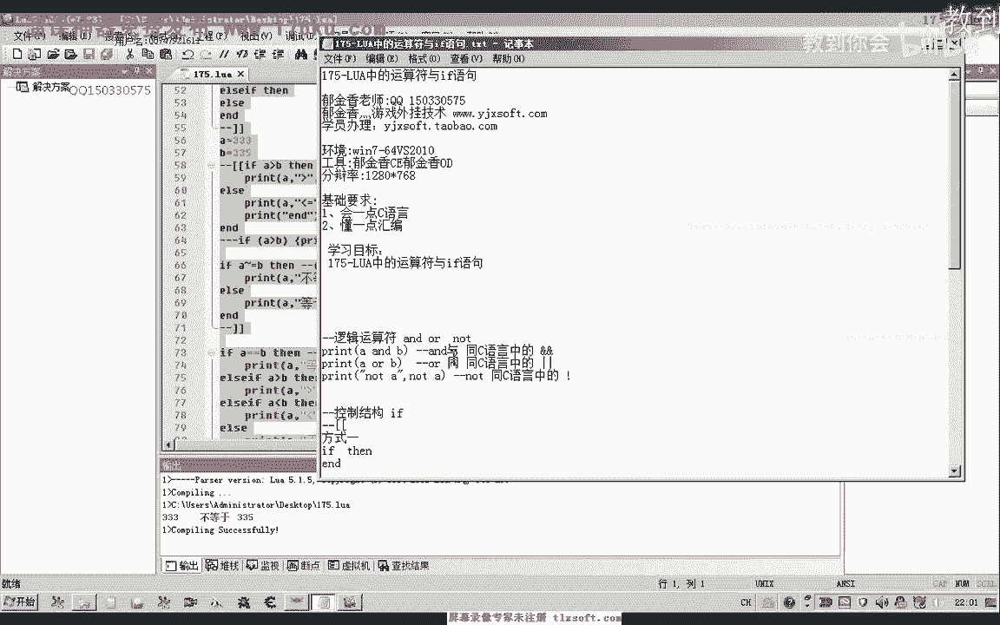
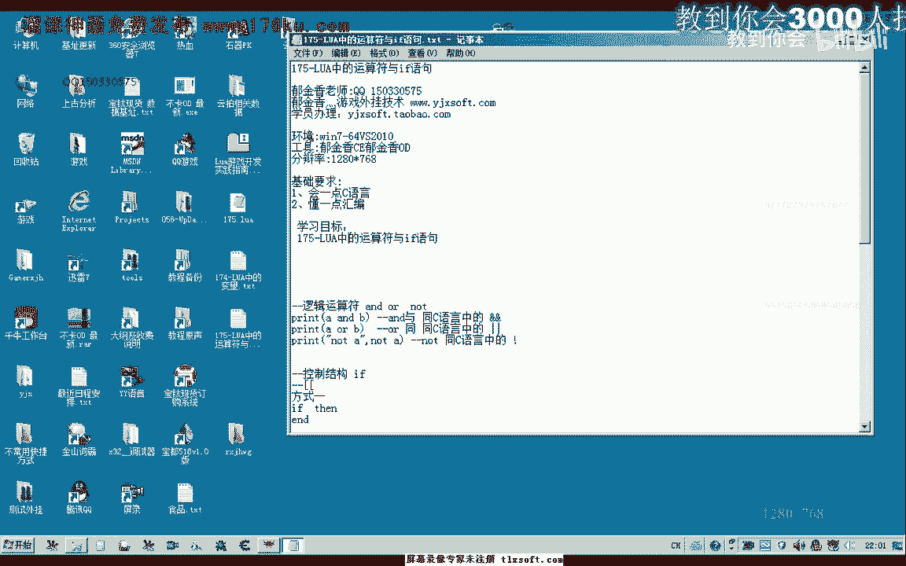

# P164：175-LUA中的运算符与if语句 - 教到你会 - BV1DS4y1n7qF

大家好，我是郁金香老师，那么这一节课我们一起来了解一下，Lua当中的运算服，以及它的衣服语句，那么首先我们来看一下。

那么运算服的话，包括我们的算术运算服，加减乘除主要是这4个运算，那么关系运算服就是大于小于等于以及不等于，这一类的，逻辑运算服就是Underworld，那么这个与我们C语言当中。

Under就相当于在C语言当中，用这两个符号来表示，那么我在C语言当中，用这两个符号来表示，那用感叹号来表示，当然还有控制结构，也与我们的C语言有一些不一样，还有代码块，这些都有一定的不同。

那么另外我们的关系运算服，只有不等于，它不一样，不等于它是用符号加上等号来表示的，那么符号在数字1的旁边，就是数字1前面的这一个，数字1键盘上前面的这个键，用这个来表示一个不等于，好的。

那么我们接下来打开我们的集成环境，来做一个相应的测试，那么我们先做试着运算的一个测试，那么我们这个时候运行一下，运行之前它需要先保存，那么这个时候我们能够看到它的一个结果，大致的一个结果。

那么这就是我们的一个市场运算，那在后面是一个表达式，它的复制方式，因为我们的C语言是类似的，都是用一个等号后面跟一个表达式，那么它也支持一个变量的一个运算，比如说在这里，我们本来它的结果是4。

那么4我们再加上它之前的结果7，那么最后来等于11这个地方，加C可以支持一个变量的一个相加，好的，那么这就是我们的市场运算，市场运算它与我们的C语言的，里面的运算是一致的。

那么我们再来看一下关系的一个运算，关系运算，那么调整一下输出这里，那么我们来看一下，这里我们也定义了两个整形的变量，然后我们对它做一个关系的一个运算，关系它有大于小于，那么首先我们在这里来输出这个变量。

这里输出一个字符类型的大于符号，然后它们两个比较，比较的一个结果，我们最后这里是一个关系的一个表达式，大于小于，那么它们的一个结果最终是一个Bool。

那么我们运行一下，那么最后它是一个Bool字。

这里出现的，那么首先我们A=22，B=212，那么我们可以看到这两个22显然是要小于212的，所以说这里是False，那么这里它本身是小于，它这个关系成立，那么是true，那么22=不成立。

这里是False，那么22=不等于，这个是成立的，只有两个，一个为真值，一个为假值，只有这两个数字关系表达式，这个与我们的C云也是类似的，那么需要注意的就是不等于，它需要用这个来表示。

如果你写成C云的不等于的话，那么这个时候在这里它会有提示，但是在我们C云，如果是集成在我们C云的开发环境当中的话，它是检测不到错误的，好的，那么这里我们可以做一些集成环境的一个好处。

它就是可以检测这一些相应的错误，那么这就是我们的一个逻辑的一个表达式，那么除了一个逻辑的一个表达，上面的是一个关系的一个运算图，接下来我们要看的才是一个逻辑的一个表达式，那么逻辑的逻辑运算图。

以及逻辑的一个表达式的话，它与我们的C云也有一些不同，主要是它的注记符不一样，那么其他的意义上它是一样的，那么这个"under"它在我们C云当中是用这两个符号来表示，这个"under"运算的。

而这个"work"在C云当中用这两个符号来表示，而"not"在C云当中用我们的感叹号来表示，那么同样的是之前的这两个数值，那么我们可以对它做一个相应的一个运算，先把它注释掉，那么我们看一下。

首先看一下它运算的一个结果，那么首先我们在这里看一下，"b"最后它的一个数值21222，"not"，那么这是最终的它的一个数值，"not"这里它表现的最后是一个不二值，而我们"a"和"b"。

那么这里它等于22，那么我们这里为了一个可读性，我们也可以把它修改一下，然后我们再来申请一下，那么这个时候我们看一下"under"的数值，它应该是做的一个二进制的一个位的运算，那么我们可以把这里为1。

这里为2这样来运算一下，那么我们可以发现了"under"的操作的话，它实际上应该是一个位运算在这里面，那么它实际上相当于我们把计算器打开看一下，二进制的"1"与我们二进制的"2"。

它加起来了就是一个"11"，就是说相应的这个位它进行一个相加的操作，那么这是对我们的一个对一个二进制位的一个运算，但是它用来做一个关系表达式的话，比如说这两个是一个真值或假值的时候，看一下这种情况。

关键是那么"under"的时候，它必须是两个同时为真的时候，那么这个值才为真，那么其中有一个值为真的时候，在进行这个"work"操作的时候，那么它就为真，那么主要逻辑运算服。

我们主要是用于这个误人类型的一个运算，在这个"Lua"里面，那么我们可以改变一下它的数值，如果这两个同时为真的时候，那么这个"under"它最终的结果才是一个真值，这里才是一个真值。

那么也只有这两个都为一个假值的时候，那么这个"work"它才为一个假值，那么再有一个假值，但是这几个操作服的话，在"Lua"里面很少用于我们的一个数字的一个运算，是很少的。

一般是用来做一个逻辑的一个运算服，那么另外我们来看一下衣服语句，衣服语句它一般有三种形式控制结构，那么一般是这三种形式，一个就是衣服，然后"under"，然后这种形式最复杂。

那么我们先来看一下方式1的一个应用，那么这个时候它有一个条件，比如说我们3也可以定义两个变量，A=33，B=1，那么比如说我们A>B的时候，打印一个字串，A>B，或者是这样来打印，A>B。

我们来看一下后边我们写有一些测试语句，直接用来测试一下，那么如果有A和B两个字，那么我们来看一下它最终的一个运算结果，那么后边我们先注释掉，那么这个时候我们可以看到，33>1，也就是A>B。

那么如果是另外一种情况，这个是111<=，那么我们就是输入<=，那么这就是一个关系运算符，那么上面这一句就相当于我们C云的，然后这里的PointA，其他的都是类似的，那么在这里只是我们C云当中的。

一幅二次，它有一些不一样，那么它这里是用under来代表相应的，这个括号，这里中间可以包含多个语句，代码块，好，那么这是其中的一种形式，一种形式，那么我们注释一下，再来看一下另外一种形式。

那么实际上的另外一种形式，与我们刚才的类似，我们这里用不等于来代替的，那么我们再来看一下它的一个结果，那么最后33就不等于我们这个数字，那么如果等于的时候看一下，它选择的执行的语句就是这上面的这一句。

当然它也可以包含只包含一句简单的，那么就没有这下面这一句，这样的结构也是可以，这是最简单的一种形式，那么这个条件成立了，它就打印这个语句，那么不成立的时候，它就不打印，那么当然我们可以把条件给它改一下。

这个时候条件成立之后将会打印语句，那么我们接着来看一下后面的，那么最后这种形式相对要复杂一点，它有几个分支条件，那么如果这个条件不满足的时候，接着执行这个条件的一个判断，但是它只会这几个语句当中。

它只会执行其中的一个，不可能都会执行，那么可能这个是盗版的原因。

它过一段时间它就会自动的把它关掉。

好的，那么我们再来看一下，那么这个时候它会走不等于的分支，那么如果我们大于的时候，不等于的时候条件成立了，那么后面大于条件它也是成立的，但是前面的条件成立了之后，它就会退出分支了。

就不会再做相应的后面的判断，那么只有我们在这里把它改一下，这里改为等于，那么我们再做一个判断，那么这个时候来能够判断出来是大于，另外一种小于的时候，我们再来看一下，那么它也走了分支结构。

那么另外它实际上也是不等于的，但是前面条件它执行了之后，它实际上就退出整个Event的语句快软，那么后面这一句也不会被执行，那么实际上的话，这个语句的话，基本上它永远都不会被执行。

那么除非到我们这个条件再跟它改一下，或者是这个条件不要，我们把这一段把它注释掉，那么最后的才有可能被执行，这个时候会执行不等于，因为前面这两个条件都没有满足，一个是大于没有满足，一个是等于没有满足。

然后才走到最后，这个不等于，这一节课我们就了解了一下，它的一个关系运算服以及它的一个市值运算，当然了我也没有做更多的测试，那么如果有一些这个遗漏的地方，大家自己下去测试的结果为准，好的。

那么我们下一节课再见，多謝您，(音樂停止)，(音樂停止)，(音樂停止)，(音樂停止)。

(音樂停止)，(音樂停止)，(音樂停止)。

(字幕製作人：十分難聽，請用音樂方式翻譯)。