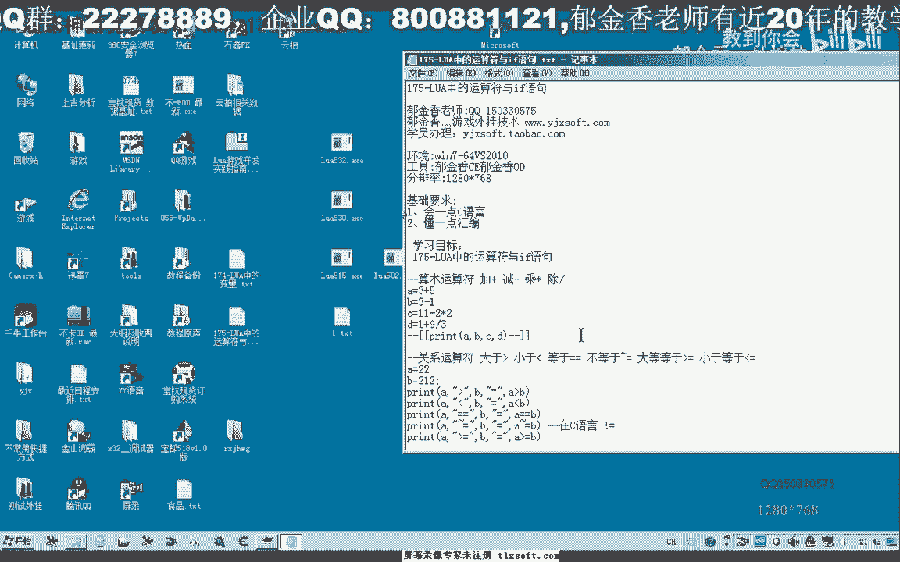
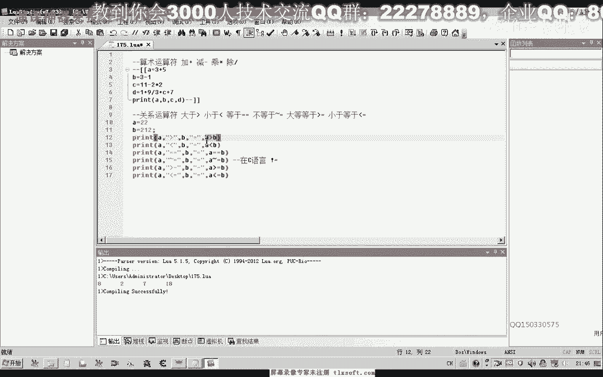
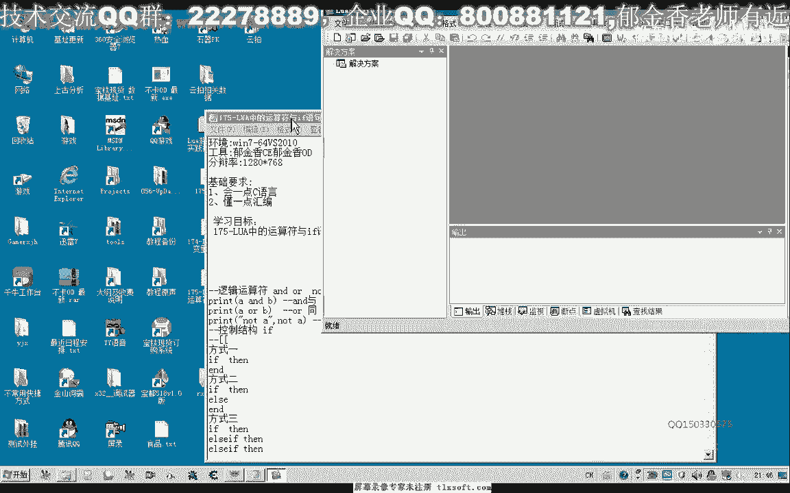
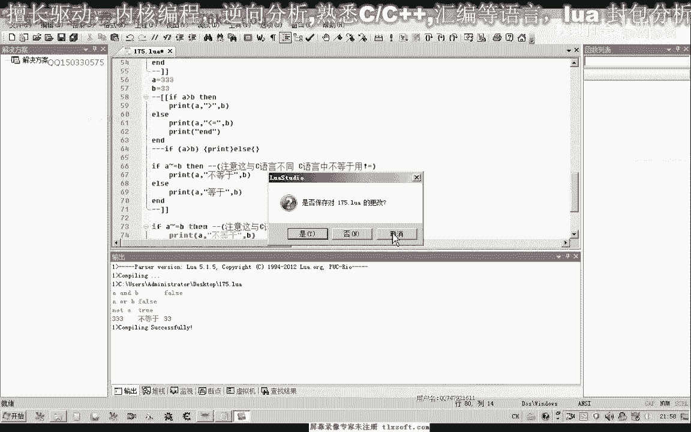
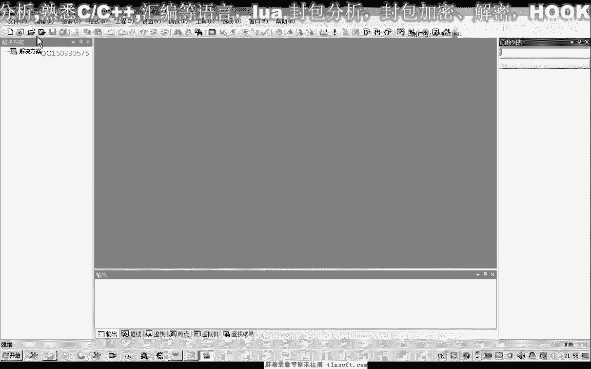
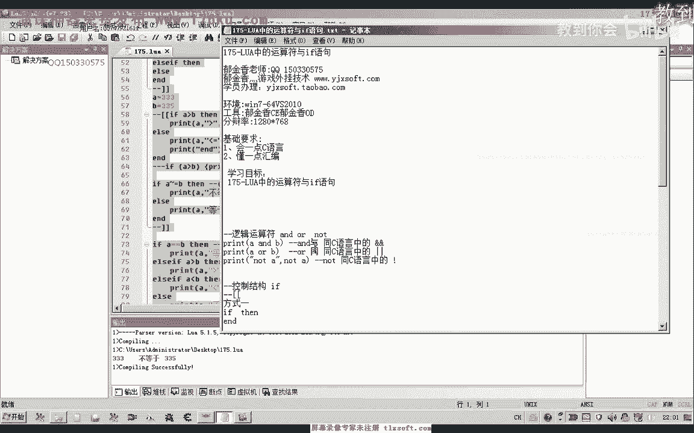
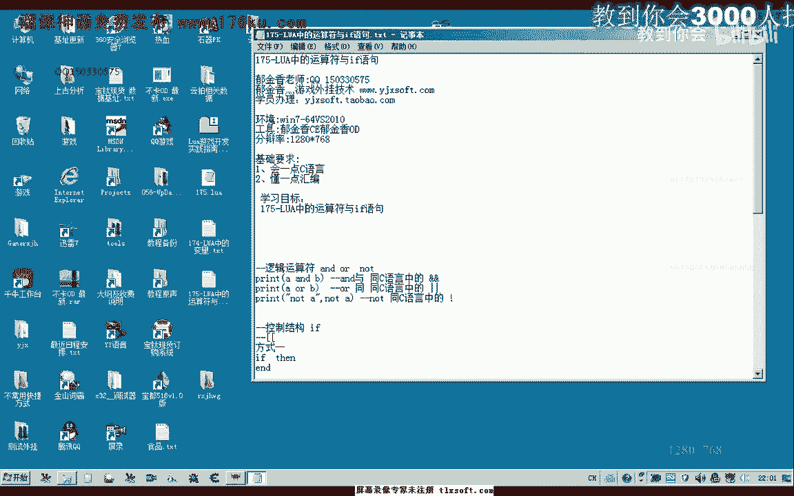

# 课程 P164：Lua 中的运算符与 if 语句 🧮



在本节课中，我们将学习 Lua 语言中的运算符和 `if` 条件语句。我们将了解算术、关系和逻辑运算符的用法，并掌握如何使用 `if` 语句来控制程序的执行流程。

---

## 概述 📋

Lua 中的运算符用于执行计算和比较，而 `if` 语句则用于根据条件决定执行哪部分代码。理解这些基础概念是编写逻辑程序的关键。

---

## 算术运算符 ➕➖✖️➗

算术运算符用于执行基本的数学运算。Lua 中的算术运算符与 C 语言类似。

以下是主要的算术运算符：
*   `+`：加法
*   `-`：减法
*   `*`：乘法
*   `/`：除法



赋值方式也与 C 语言类似，使用单个等号 `=`。变量可以参与运算。



```lua
local a = 5 + 2  -- a 的值为 7
local b = a * 2  -- b 的值为 14
```

---

## 关系运算符 ⚖️

关系运算符用于比较两个值，其结果为布尔值（`true` 或 `false`）。

以下是主要的关系运算符：
*   `>`：大于
*   `<`：小于
*   `>=`：大于等于
*   `<=`：小于等于
*   `==`：等于
*   **`~=`**：不等于

**注意**：Lua 中的“不等于”运算符是 `~=`，这与 C 语言中的 `!=` 不同。

```lua
local x = 22
local y = 212
print(x > y)   -- 输出 false
print(x < y)   -- 输出 true
print(x == y)  -- 输出 false
print(x ~= y)  -- 输出 true
```

---

## 逻辑运算符 🔗

逻辑运算符用于操作布尔值，进行逻辑判断。Lua 的逻辑运算符在书写上与 C 语言不同，但逻辑意义相同。

以下是主要的逻辑运算符：
*   **`and`**：逻辑与（C 语言中为 `&&`）
*   **`or`**：逻辑或（C 语言中为 `||`）
*   **`not`**：逻辑非（C 语言中为 `!`）

逻辑运算符主要用于布尔值的运算：
*   `and`：两边的操作数都为 `true` 时，结果才为 `true`。
*   `or`：两边的操作数有一个为 `true` 时，结果就为 `true`。
*   `not`：对布尔值取反。

```lua
local isTrue = true
local isFalse = false

print(isTrue and isFalse) -- 输出 false
print(isTrue or isFalse)  -- 输出 true
print(not isTrue)         -- 输出 false
```

---

## If 条件语句 🚦

`if` 语句是主要的流程控制结构，用于根据条件执行不同的代码块。Lua 中的 `if` 语句有三种基本形式。

### 形式一：简单的 if 语句

当条件成立时，执行一段代码。

```lua
local a = 33
local b = 1

if a > b then
    print("a 大于 b")
end
```

### 形式二：if...else 语句

当条件成立时执行一个代码块，不成立时执行另一个代码块。



```lua
local a = 33
local b = 33


if a == b then
    print("a 等于 b")
else
    print("a 不等于 b")
end
```



### 形式三：if...elseif...else 语句

用于处理多个分支条件。程序会从上到下判断条件，一旦某个条件满足，就执行对应的代码块，然后跳出整个 `if` 结构。

```lua
local score = 85

if score >= 90 then
    print("优秀")
elseif score >= 60 then
    print("及格") -- 当 score 为 85 时，会执行这里
else
    print("不及格")
end
```

---

## 总结 🎯



本节课我们一起学习了 Lua 语言的基础运算符和 `if` 条件语句。
*   我们了解了用于计算的**算术运算符**（`+`, `-`, `*`, `/`）。
*   我们掌握了用于比较的**关系运算符**（`>`, `<`, `==`, `~=` 等），特别注意了 Lua 中“不等于”是 `~=`。
*   我们认识了用于逻辑判断的**逻辑运算符**（`and`, `or`, `not`）。
*   最后，我们学习了三种形式的 **`if` 语句**，它们是我们控制程序流程的重要工具。



掌握这些基础知识是编写更复杂 Lua 程序的第一步。建议你通过实际编写代码来加深理解。