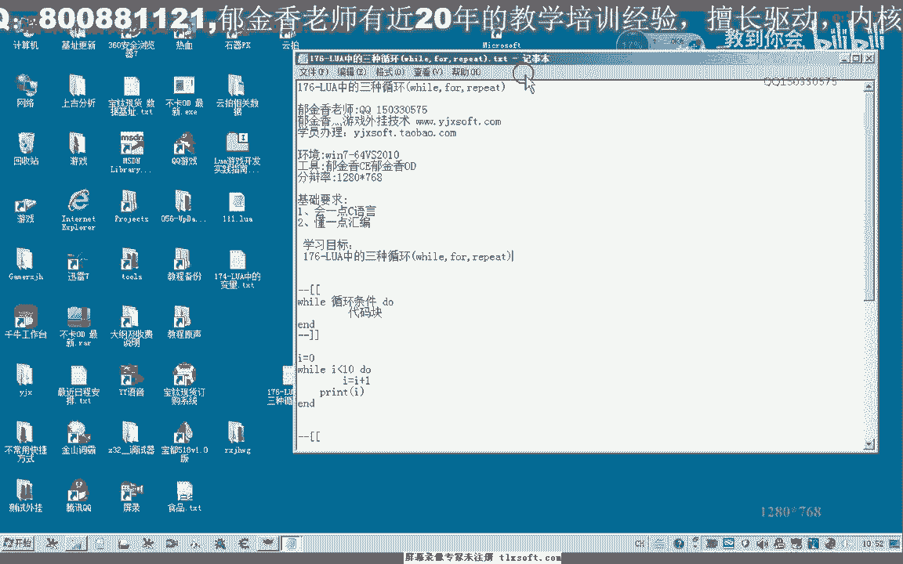
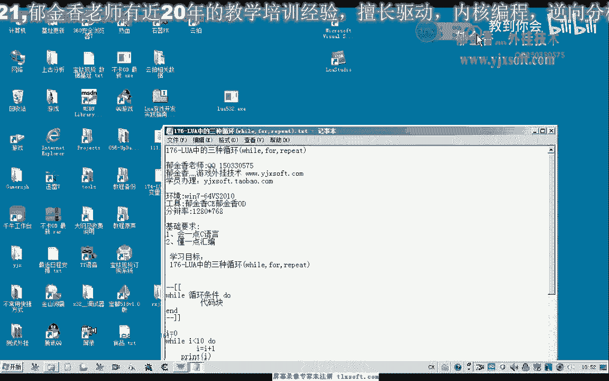
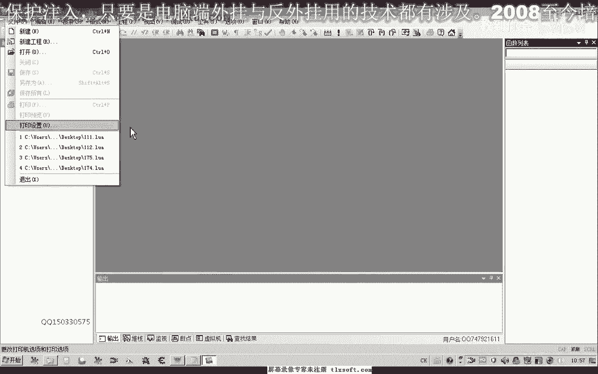
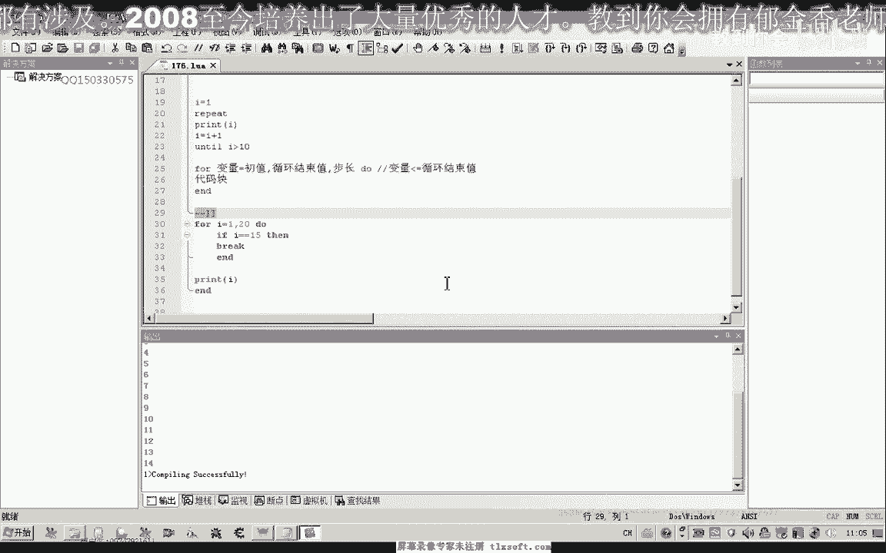

# 课程 P165：Lua中的三种循环（while, for, repeat）🔄

在本节课中，我们将学习Lua编程语言中的三种循环结构：`while`循环、`for`循环和`repeat`循环。我们将通过简单的示例来理解它们的语法、执行规则以及它们之间的区别。



---



## 概述

Lua中的循环结构与C语言类似，但在语法规则上略有不同。本节课将借助Lua的集成环境，逐一测试并讲解这三种循环的使用方法。

---

## 1. while循环 🔄

上一节我们介绍了课程概述，本节中我们来看看第一种循环结构：`while`循环。

`while`循环首先判断一个条件。当条件为真（`true`）时，执行循环体内的代码块。当条件变为假（`false`）时，则退出循环。

以下是`while`循环的基本语法结构：
```lua
while 条件 do
    -- 代码块
end
```

例如，我们定义一个变量`i`，初始值为0。当`i`小于等于10时，执行循环体，每次循环打印`i`的值并将`i`加1。
```lua
local i = 0
while i <= 10 do
    print(i)
    i = i + 1
end
```
这段代码会输出从0到10的整数。

如果初始条件为假，例如`i`初始值为0，但条件是`i >= 1`，那么循环体一次都不会执行。

---

## 2. repeat循环 🔁


上一节我们介绍了`while`循环，本节中我们来看看第二种循环：`repeat`循环。




`repeat`循环的特点是循环体**至少会被执行一次**。它的结束条件在循环体之后判断。当条件为真（`true`）时，循环结束。

以下是`repeat`循环的基本语法结构：
```lua
repeat
    -- 代码块
until 条件
```


例如，要输出1到10的整数，可以这样写：
```lua
local i = 1
repeat
    print(i)
    i = i + 1
until i > 10
```
这段代码会输出从1到10的整数。

需要注意的是，`until`后面的条件是**结束条件**。当条件成立时，退出循环。这与`while`循环的**继续执行条件**正好相反。在`repeat`循环中，如果没有在循环体内改变变量的值，可能会导致死循环。

---

## 3. for循环 🔂

上一节我们介绍了`repeat`循环，本节中我们来看看第三种，也是最常见的循环：`for`循环。

Lua的`for`循环有两种形式：数值`for`循环和泛型`for`循环。本节课我们主要讲解数值`for`循环。它包含一个起始值、一个结束值和一个可选的步长。

以下是数值`for`循环的基本语法结构：
```lua
for 变量 = 起始值, 结束值, 步长 do
    -- 代码块
end
```

循环会从起始值开始，每次循环后变量增加一个步长，直到变量的值**大于**结束值时停止。当步长为1时，可以省略。

例如，输出1到10的整数：
```lua
for i = 1, 10 do
    print(i)
end
```

如果指定步长为2，则输出1, 3, 5, 7, 9：
```lua
for i = 1, 10, 2 do
    print(i)
end
```

---

## 4. 循环控制：break关键字 🛑

在循环体中，我们可以使用`break`关键字来立即终止整个循环。

例如，在`for`循环中，当`i`大于5时跳出循环：
```lua
for i = 1, 10 do
    if i > 5 then
        break
    end
    print(i)
end
```
这段代码只会输出1到5。

Lua中没有`continue`关键字。如果需要跳过某次循环，可以使用`if`语句进行条件控制。

---

## 总结



本节课中我们一起学习了Lua中的三种循环结构：
*   **`while`循环**：先判断条件，条件为真时执行循环体。
*   **`repeat`循环**：先执行一次循环体，再判断结束条件。
*   **`for`循环**：常用于按数值范围进行迭代，可以指定起始值、结束值和步长。


我们还学习了使用`break`关键字来提前退出循环。理解这些循环的区别和适用场景，是编写Lua程序的基础。建议课后多加练习和测试以巩固理解。