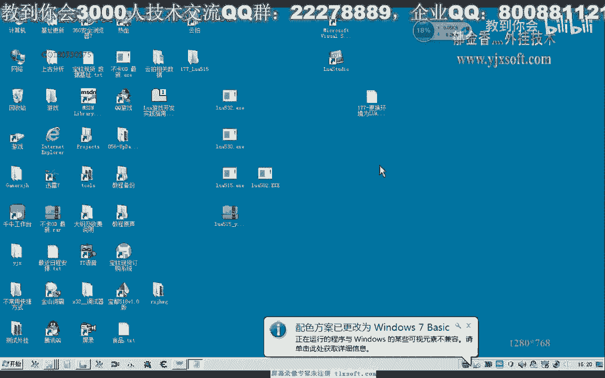

# 课程 P166：将Lua环境更换为5.1.5版本 📦


在本节课中，我们将学习如何将Lua脚本的运行环境从5.3.2版本更换为5.1.5版本。我们将了解更换的原因、具体操作步骤，并完成一个简单的代码测试。


---


## 概述：为何需要更换版本？🔍


上一节我们介绍了Lua的基本使用。本节中我们来看看版本兼容性问题。

Lua 5.3.2版本对某些脚本的支持不够完善，尤其是在处理变参（可变参数）时。这可能是由于版本升级后进行了较大修改。为了确保脚本的兼容性和稳定性，我们将环境更换为资料更丰富、兼容性更好的Lua 5.1.5版本。

为了说明问题，我们首先编写一段使用变参的Lua脚本。

以下是示例脚本代码：
```lua
-- 这是一个支持变参的累加函数
function sum(...)
    local total = 0
    -- 使用for循环遍历所有变参
    for i = 1, arg.n do
        total = total + arg[i]
    end
    return total
end


-- 在主程序中调用并打印结果
print(sum(1, 3, 5, 9))
```
这段脚本定义了一个`sum`函数，它接受可变数量的参数并将它们累加。`arg`是一个隐藏的数组，用于存储所有传入的变参。`arg.n`表示变参的数量。


在Lua 5.1.5环境中，这段脚本可以正常运行并输出结果`18`（即1+3+5+9）。然而，在5.3.2版本中运行相同的脚本，则会提示语法错误，无法得到正确结果。同样，在C++中调用时，如果链接的是5.2版本之前的库，也可能无法正常工作。

因此，为了获得最佳的兼容性和最多的学习资料支持，我们决定将开发环境更换为Lua 5.1.5。


---

## 第一步：下载并准备Lua 5.1.5库文件 📥


首先，我们需要获取Lua 5.1.5的预编译库文件。这些文件通常可以在相关的开发者论坛或资源网站找到。


下载完成后，你会得到一个压缩包。将其解压到一个固定的目录中，例如`C:\lua515`。解压后的目录结构应包含以下关键部分：
*   `include/`： 存放Lua头文件（如`lua.h`）。
*   `lib/`： 存放静态链接库文件（`.lib`）。通常包含两个版本：
    *   `lua515.lib`： 发布（Release）版本。
    *   `lua515d.lib`： 调试（Debug）版本。


请确保你清楚这些文件的位置，因为在下一步的Visual Studio配置中需要用到这些路径。


---


## 第二步：在Visual Studio 2010中配置项目 ⚙️

上一节我们准备好了库文件，本节中我们来看看如何在开发环境中进行配置。


1.  打开或创建一个新的Visual Studio 2010 C++项目（例如，项目名为`P166`）。
2.  在解决方案资源管理器中，切换到“属性管理器”视图。
3.  展开你的项目，找到`Debug | Win32`和`Release | Win32`配置下的`Microsoft.Cpp.Win32.user`条目。


以下是针对`Debug`配置的详细设置步骤：


*   **配置C++包含目录：**
    *   右键点击`Debug | Win32`下的`Microsoft.Cpp.Win32.user`，选择“属性”。
    *   在“通用属性” -> “VC++ 目录” -> “包含目录”中，点击编辑。
    *   删除旧的路径，添加你解压的Lua头文件目录，例如：`C:\lua515\include`。点击确定。

*   **配置库目录：**
    *   在同一个属性页，找到“库目录”。
    *   点击编辑，添加Lua库文件所在的目录，例如：`C:\lua515\lib`。点击确定。

*   **配置链接器输入：**
    *   在左侧选择“链接器” -> “输入”。
    *   在“附加依赖项”中，点击编辑。
    *   确保添加了调试版的库文件名：`lua515d.lib`。点击确定并应用。

4.  对`Release | Win32`配置重复上述步骤。**注意**：在“链接器” -> “输入” -> “附加依赖项”中，应添加发布版的库文件名：`lua515.lib`。

完成这些配置后，你的项目就具备了链接Lua 5.1.5库的能力。

---

## 第三步：编写并测试C++调用代码 💻


环境配置完成后，我们可以编写一个简单的C++程序来加载并执行Lua脚本。


以下是调用Lua脚本的C++示例代码：
```cpp
// 包含必要的头文件
extern "C" {
    #include "lua.h"
    #include "lualib.h"
    #include "lauxlib.h"
}

int main() {
    // 1. 创建Lua状态机（环境指针）
    lua_State* L = luaL_newstate();
    // 2. 打开Lua标准库
    luaL_openlibs(L);
    // 3. 加载并执行指定的Lua脚本文件
    luaL_dofile(L, "177.lua");
    // 4. 关闭Lua状态机
    lua_close(L);

    // 防止控制台窗口一闪而过
    getchar();
    return 0;
}
```
**代码说明：**
*   `luaL_newstate()`: 创建一个新的Lua环境。
*   `luaL_openlibs(L)`: 打开所有Lua标准库，以便在脚本中使用`print`等函数。
*   `luaL_dofile(L, “177.lua”)`: 加载并执行名为`177.lua`的脚本文件。
*   `lua_close(L)`: 最后关闭环境，释放资源。
*   `getchar()`: 让程序暂停，等待用户按回车键，以便观察控制台输出。

**重要提示：**
确保你编写的`177.lua`脚本文件与最终生成的可执行文件（`.exe`）位于同一目录下。你可以在项目属性中配置输出目录，使其与调试工作目录一致，这样可以避免“找不到文件”的错误。

编译并运行此C++程序。如果一切配置正确，控制台将成功输出Lua脚本`177.lua`的执行结果（例如，数字`18`），这证明Lua 5.1.5环境已成功集成并正常工作。


---

## 总结 📝


本节课中我们一起学习了如何将Lua开发环境从5.3.2版本更换为5.1.5版本。

我们首先通过一个变参脚本示例，理解了版本不兼容可能导致的问题。接着，我们分步操作：下载Lua 5.1.5的库文件、在Visual Studio 2010中正确配置项目的包含目录、库目录和链接器设置。最后，我们编写了一个简单的C++程序来创建Lua状态机、执行外部脚本，并验证了环境配置的成功。


通过本次课程，你掌握了在特定开发环境中管理和切换第三方库版本的基本流程，这是解决依赖兼容性问题的重要技能。