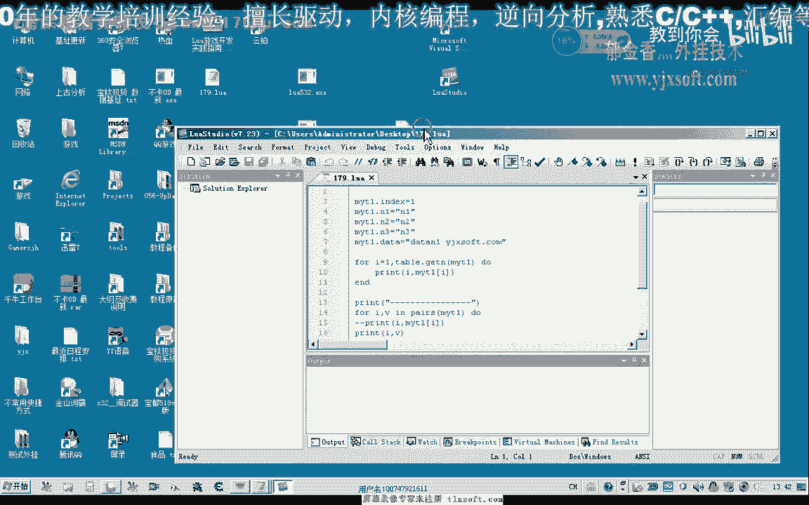

# P168：179-Talbe结构高级运用-多维数组及pairs函数 - 教到你会 - BV1DS4y1n7qF

大家好，我是俞其鑫老师，那么这节课我们继续来看一下，Table结构的一个运用，那么首先我们来了解一下，它有一个叫Pairs的函数，那么这个函数，当然还有一个叫IPairs，那么这两个函数的话。

它都可以用来骗你一张表，它但是要截获我们的，这个FOR循环来使用。

那么我们一起来看一下，这个函数，比如说我们在这里建一张表叫myTable，那么这里边我们可以给它随便，付一些数值，然后我们之前的话，我们要骗你这张表的话，我们可以这样的去骗你。

那么我们需要用Table里面的，GTN这个函数来获取表的一个元素的一个个数，然后我们再对它进行一个骗你，那么我们可以用这种形式去进行一个骗你，那么这个时候我们看到前面是它的一个下标。

后边是它元素的一个数值，但是我们还可以用另外的一种形式来，就是IPairs，这里也是一个变量，那么这里的语句的话，我们也可以用相同的语句，那么它们的功能的话是一样的，当然这里我们也需要把这张表传进来。

那么我们把它分隔一下，好的，再来对比一下，那么我们发现的话，这两个接口的话实际上是一样的，当然这一句我们还可以用另外的更简便的方式来写，第一个是下标，第二个是它取出的元素的值，那么直接可以用位来代替。

那么位来取出来的就是它元素的数值，那么这样来用的话就比较有用，但是我们还有另外的一种情况，就是说这个表它本身是一个无序的一个表，比如说我们把上面的这一句注释掉，也可以不注释都可以。

那么相当于我们把这个结构跟它重定义一下，那么这种表它就是一个无序的一个表，它要通过一个相应的一个，有一点像我们C源里面的结构的形式来对它进行一个，访问，好的，比如说当然这里边它也可以包含整数，这里也行。

那么这种情况的话我们看一下，再来骗你的话会出现什么样的情况，那么这个时候我们发现的话骗你的话，它都不会有任何的结果，关键是它只对有序的这种表进行一个骗你，我们要把前缀跟它去掉，这个Pulse。

然后我们发现的话后面它就能够对它进行一个骗你，然后按1，然后这个是1，最后也是按1，因为这里边的数据的话，我们没有给它进行一个相应的，要把它区别出来，分别进行复制，那么我们可以看到这里，按1231。

这里是一个Dirt，那么在前面，这个爱它就不是它的下标了，而是它元素无序的元素的后面的数字，电量的一个数字相当于是，所以说我们Pulse它主要的话是运用于我们这种无序表的一个进行的骗你。

那么我们可以发现这个时候骗你的话，它也是有用的，那么这个时候骗你，如果它本身这里是一个有序的一个表，再加上无序的话，它也会正常的对它进行所有的元素，都进行一个相应的骗你，那么但是前面的话，这个骗你的话。

分割线之前的，它就只能对有序的这一部分进行一个骗你，那么所以说要完整的骗你的话，很多时候我们还要借助于Pulse这个函数，好的，当然过有过的优点也过有过的缺点，大家下去之后可以多做一下相关的测试。

那么我们把这段注释掉，接下来我们来看一下，多维的一个数字，那么我们知道我们C园里面都有多维的数字，那么实际上在Lua里面，它也可以用这个表来构建一个多维的一个数字，那么比如说我们有一个表1，A。

那么里面它包含了一些元素，比如说是串，A1，A2，A3，那么有这样的一张表，那么有一张，另外有一张表，表B，那么它里面也是，比如说是7，8，9，那么这两张表，那么又一张表来，C，那么这张表里面的话。

它就包含了我们的A和B，那么或者还有其他的表，C，那么这个时候的话，我们的C的话就是一张多维的表，也可以看成是多维数，那么这个时候我们就可以这样的形式去访问它，那么首先是C1，然后再是C2。

那么我们看打印出来的元素是多少。

那么这个时候打印出来的是A1。

那么如果我们这里选2，那么我们打印出来的就是它的元素是7，那么如果是24，就是打印的元素，那么这就是我们的一个多维的一个表，当然也可以对它进行一个片里，可以进行一个分开的一个片里，那么多维这个表的话。

当然还有其他的一种形式，比如说无序的表，它也可以做一个多维的表，当然这种形式的话要更加的复杂一些，那么我们再来看一段代码，比如说看一下，那么这种也是一个表的一个形式，那么我们把这段代码也把它注销掉。

那么这种我们用上一节课的一个函数来进行一个片里，那么上一节课我们在这里写了一个片里有序表的一个函数，那么我们看一下它的一个结果，那么实际上它也片里了这两张表，一个是列这个表，一个是代替，这个表。

那么我们也可以分别的来片里它，但是这个函数的话，这个表的话它就是一个无序的一个表，它里面也包含多个成分，也算是一种多维数组的一种形式，当然像前面这种多维数组的话，可能运用的要多一些。

当然这些如果有不理解的地方，大家下去之后多做一些相关的测试，要多测试多练，好的，那么这一期课我们暂时了就了解到这里，謝謝大家。

不太能回頭。