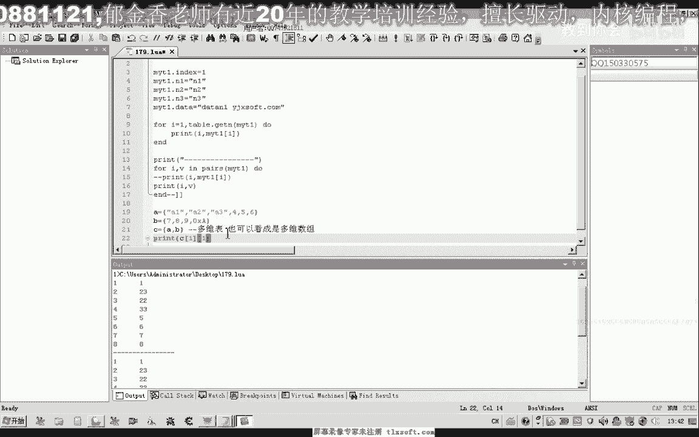

# 📚 课程 P168：Table结构高级运用 - 多维数组及pairs函数


在本节课中，我们将学习Lua中Table结构的两个高级主题：用于遍历表的`pairs`和`ipairs`函数，以及如何构建和访问多维数组。掌握这些知识将帮助你更灵活地处理复杂的数据结构。

---

## 🔍 遍历函数：pairs 与 ipairs

上一节我们介绍了Table的基本操作，本节中我们来看看如何遍历Table。Lua提供了`pairs`和`ipairs`两个函数，它们都用于配合`for`循环来遍历一张表。

以下是两种遍历有序数组式Table的方法对比：

```lua
-- 创建一个表
local myTable = {10, 20, 30}

-- 方法1：使用 # 获取长度和数字索引遍历
for i = 1, #myTable do
    print(i, myTable[i])
end

-- 方法2：使用 ipairs 函数遍历
for i, v in ipairs(myTable) do
    print(i, v)
end
```
这两种方式遍历有序表（数组部分）的结果是相同的。`ipairs`函数会依次返回索引`i`和对应的值`v`。

然而，当Table是一个**键值对无序表**（或称字典）时，`ipairs`将无法遍历其所有元素。

```lua
-- 创建一个无序表
local myUnorderedTable = {name = "Alice", age = 25, [10] = "ten"}

-- 使用 ipairs 遍历（无效）
for i, v in ipairs(myUnorderedTable) do
    print(i, v) -- 不会输出任何内容
end

-- 使用 pairs 遍历（有效）
for k, v in pairs(myUnorderedTable) do
    print(k, v) -- 会输出所有键值对，如 "name Alice", "age 25", "10 ten"
end
```
`pairs`函数可以遍历表中的**所有元素**，无论其键是数字还是字符串，无论是否有序。而`ipairs`仅遍历从1开始的连续整数索引部分。

**核心概念**：`ipairs(t)` 遍历 **t[1], t[2], ...** 直到遇到第一个`nil`。`pairs(t)` 遍历表 **t** 中的所有键值对。

---

## 🧱 构建多维数组




了解了遍历方法后，我们来看如何用Table构建更复杂的数据结构。在Lua中，我们可以通过让Table的元素也是Table来创建多维数组。


假设我们有两个一维数组（Table）：
```lua
local tableA = {"A1", "A2", "A3"}
local tableB = {7, 8, 9}
```
现在，我们可以创建另一个Table来包含它们，从而形成一个二维数组：
```lua
local multiTable = {tableA, tableB}
```
访问这个二维数组中的元素，需要使用多个索引：
```lua
print(multiTable[1][1]) -- 输出: A1 （访问tableA的第一个元素）
print(multiTable[2][1]) -- 输出: 7  （访问tableB的第一个元素）
print(multiTable[2][4]) -- 输出: nil （索引超出范围）
```
`multiTable[1]`获取到的是`tableA`这个子表，再通过`[1]`索引就访问到了`tableA`中的第一个元素“A1”。

多维数组同样可以包含无序表，结构会更复杂，但访问原理相通，都是通过层层索引。

---

## 📝 本节总结

本节课中我们一起学习了：
1.  **`pairs` 与 `ipairs` 函数**：`ipairs`用于遍历有序的数组部分；`pairs`用于遍历整个表的所有键值对，适用于无序字典。
2.  **多维数组的构建与访问**：通过将Table嵌套在另一个Table中，可以创建多维数据结构，并使用连续索引（如`t[1][2]`）进行访问。


理解这些概念的关键在于多练习和测试。你可以尝试创建不同的表结构，分别用`pairs`和`ipairs`遍历，并构建自己的二维、三维数组来加深理解。