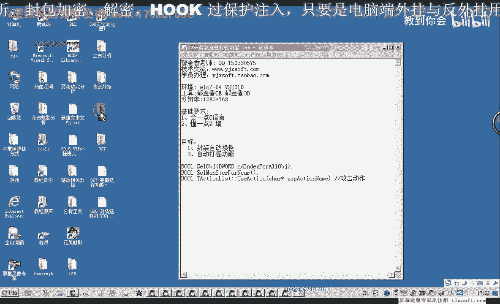
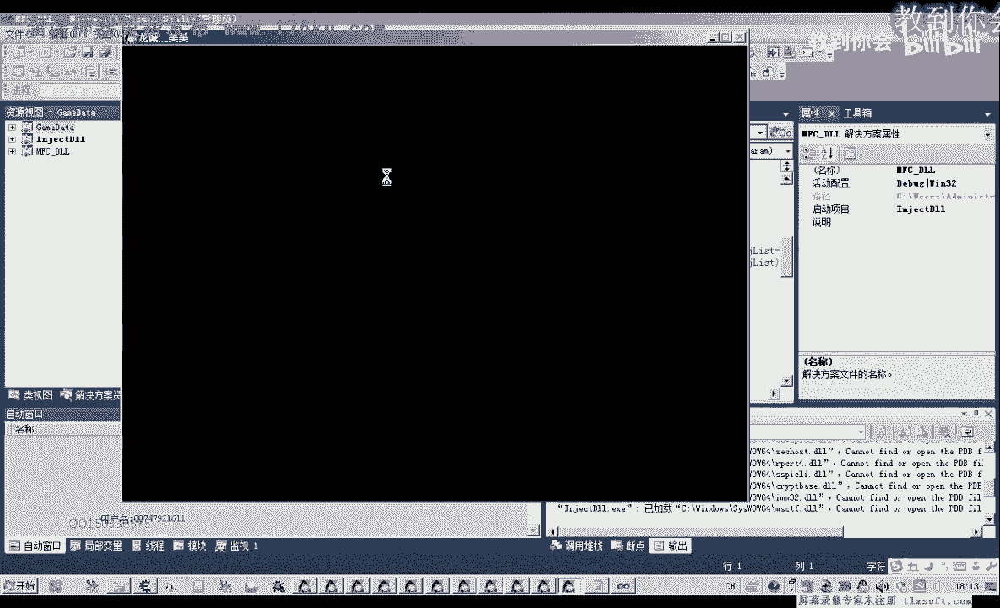
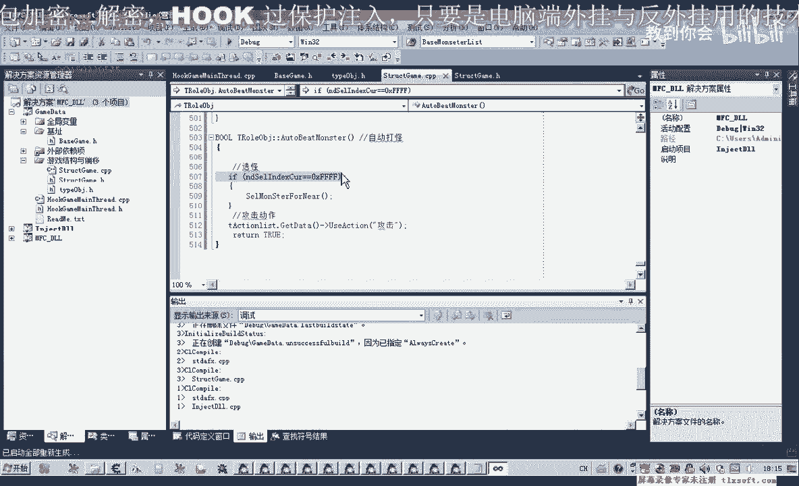

# 课程 P17：028-封装选怪打怪功能 🎮

在本节课中，我们将学习如何封装两个核心函数：一个用于自动选择附近的怪物，另一个用于实现自动攻击。通过将之前学到的知识模块化，我们将构建出自动挂机打怪功能的雏形。



---

## 封装自动选怪函数 🎯

上一节我们介绍了根据下标选中对象的功能。本节中，我们来看看如何封装一个更智能的函数，使其能自动选择距离角色最近的怪物。

首先，我们需要在角色的结构体中添加新的函数。这个函数的核心逻辑是：遍历附近的对象列表，筛选出怪物，并计算距离，最终选中最近的那一个。

以下是实现此功能的关键步骤：

1.  **遍历附近对象列表**：该列表不仅包含怪物，也包含玩家等其他对象。
2.  **判断对象类型**：筛选出类型为“怪物”的对象。
3.  **计算并比较距离**：计算每个怪物与角色的距离，并记录最小值。
4.  **选中目标**：调用之前封装的函数，选中距离最近的怪物。

为了实现上述逻辑，我们需要定义两个全局变量：
*   `nIndex`：用于存储找到的怪物下标。
*   `nDistance`：用于存储当前找到的最小距离，初始值可设为一个很大的数（如 `0xFFFFFF`）。

在遍历列表前，我们需要对数据进行预处理。原“怪物列表”名称并不准确，因为它包含了多种对象。我们应将其重命名为“附近对象列表”，并在初始化时过滤数据，例如通过对象类型（如类型ID为2）来标识怪物。

以下是核心代码逻辑的伪代码描述：

```cpp
int nIndex = 0xFF; // 初始化为无效值
int nDistance = 0xFFFFFF; // 初始化为一个很大的距离

for (int i = 0; i < nearbyObjectCount; i++) {
    // 1. 检查对象数据是否有效（非零）
    if (object[i].isValid == false) {
        continue; // 跳过无效对象，继续下一次循环
    }
    
    // 2. 判断对象类型是否为怪物（例如 type == 2）
    if (object[i].type != MONSTER_TYPE) {
        continue; // 跳过非怪物对象
    }
    
    // 3. 计算距离
    int currentDistance = CalculateDistance(player, object[i]);
    
    // 4. 比较并更新最小距离及对应下标
    if (currentDistance < nDistance) {
        nDistance = currentDistance;
        nIndex = i; // 记录最近怪物的下标
    }
}

// 5. 如果找到了有效的怪物下标，则选中它
if (nIndex != 0xFF) {
    SetTarget(nIndex); // 调用选中函数
    return true; // 选怪成功
} else {
    return false; // 选怪失败，附近无怪物
}
```

完成循环后，`nDistance` 中存储的就是最小距离，`nIndex` 中存储的就是对应怪物的下标。最后，调用 `SetTarget` 函数即可选中目标。如果遍历完列表后 `nIndex` 值未改变（仍为初始值 `0xFF`），则说明选怪失败，附近没有符合条件的怪物。

---

## 封装自动打怪函数 ⚔️

选怪功能封装完成后，我们就可以在此基础上构建自动打怪函数了。自动打怪主要包含两个动作：选怪和攻击。

然而，直接连续执行这两个动作可能效率不高。例如，如果当前已经选中了一个怪物且它尚未被击败，此时立即重新选怪是不合理的。因此，我们需要增加一个判断条件：仅当角色当前没有选中任何有效的怪物目标时，才执行选怪逻辑。

以下是实现自动打怪的关键步骤：

1.  **检查当前目标状态**：获取角色当前选中的目标ID。
2.  **判断是否需要选怪**：如果当前目标ID无效（例如为 `0xFF` 或 `-1`，代表空目标或选中自己），则执行选怪函数。
3.  **执行攻击动作**：选怪成功后（或已有有效目标），调用攻击命令。

以下是简化的代码逻辑：

```cpp
void AutoFight() {
    // 1. 获取当前选中的目标ID
    int currentTargetId = GetCurrentTarget();
    
    // 2. 判断是否需要重新选怪（例如目标无效或为空）
    if (currentTargetId == INVALID_TARGET_ID) {
        // 调用我们封装的自动选怪函数
        if (SelectNearestMonster() == true) {
            // 选怪成功，执行攻击
            ExecuteAttack();
        } else {
            // 选怪失败，可能附近无怪
            // 可以等待或执行其他逻辑
        }
    } else {
        // 3. 当前已有有效目标，直接攻击
        ExecuteAttack();
    }
}
```

将 `AutoFight` 函数绑定到测试按钮上，即可进行点击测试。点击按钮后，函数会检查当前状态：若无目标则选怪并攻击；若有目标则直接攻击。

需要注意的是，目前的判断条件（`currentTargetId == INVALID_TARGET_ID`）还比较粗略。在实际游戏中，角色可能选中自己或其他玩家，这些情况都应被视为“无效战斗目标”。更完善的判断应检查当前选中对象的类型是否为怪物。我们将在后续课程中对此进行优化。

若要实现真正意义上的“自动”挂机，需要配合定时器或线程来循环调用 `AutoFight` 函数，而不是依靠手动点击。

---


## 总结 📝



本节课中我们一起学习了如何封装两个关键的游戏自动化功能。

首先，我们封装了 **`SelectNearestMonster`（自动选怪）函数**。它通过遍历附近对象列表、筛选怪物类型、计算并比较距离，最终自动选中最近的怪物。这个函数是智能战斗的基础。

接着，我们基于选怪函数封装了 **`AutoFight`（自动打怪）函数**。它加入了简单的状态判断，只在没有有效攻击目标时才执行选怪，然后发起攻击，从而构成了自动战斗循环的雏形。



目前实现的版本已能完成基本流程，但判断逻辑还可以更加精确（例如排除选中玩家自身的情况）。我们将在下一节课中继续完善这些细节。通过本节课的实践，你已经掌握了将复杂操作模块化封装的核心思路，这是编写高效、可维护游戏辅助程序的重要一步。