# 课程 P170：181 - 修改Lua文件让它支持中文函数 🛠️

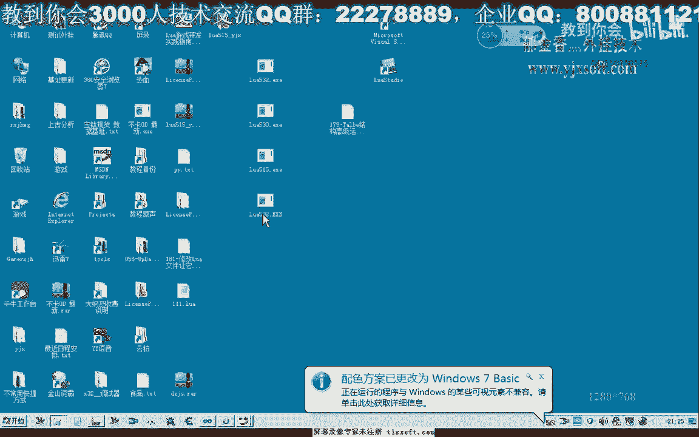

在本节课中，我们将学习如何通过修改Lua解释器的源代码，使其能够识别和注册中文函数名。这对于希望在脚本中使用中文标识符的开发者来说非常有用。

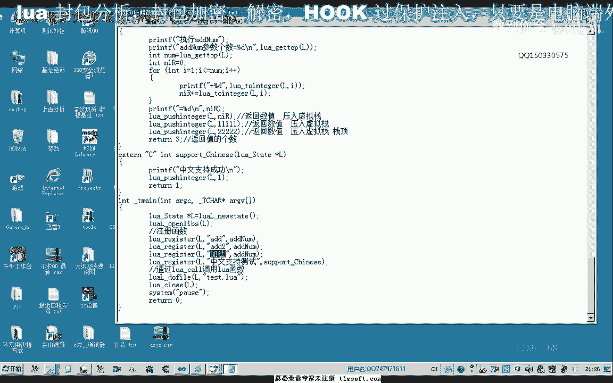


---

## 概述

默认情况下，Lua解释器在编译脚本时，只支持由字母、数字和下划线组成的标识符。这意味着我们无法直接注册或调用名为“加法”或“累加”这样的中文函数。本节课的目标就是修改Lua的词法分析器，使其能够正确处理中文字符，从而支持中文函数名。

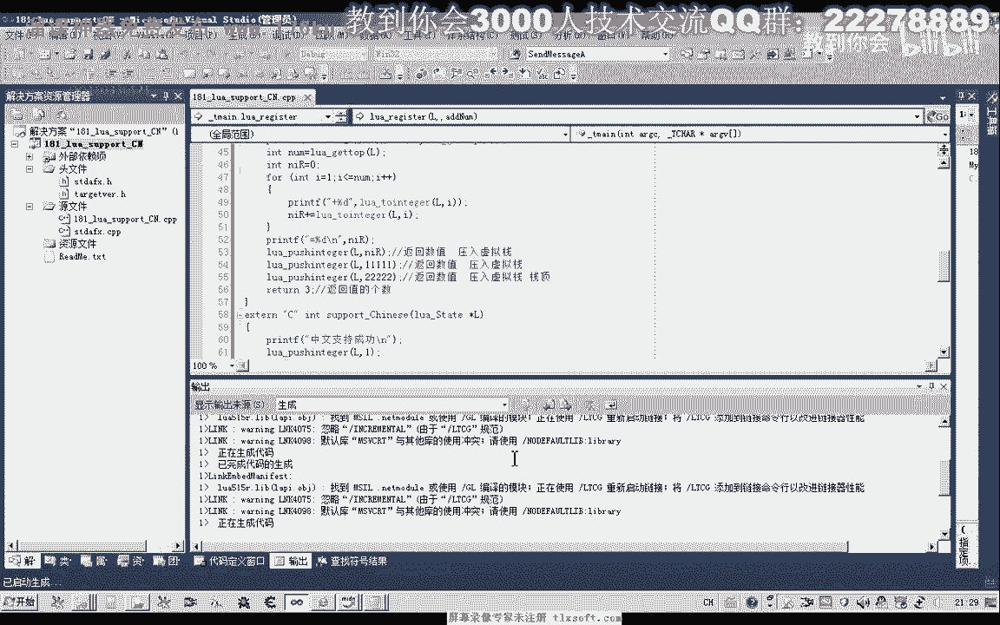

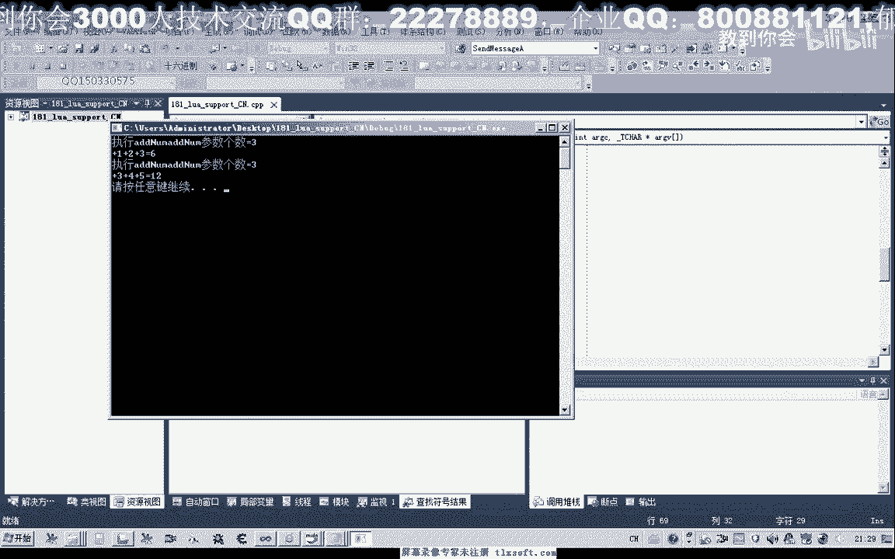

---

## 问题演示


首先，我们通过一个简单的测试工程来演示问题。

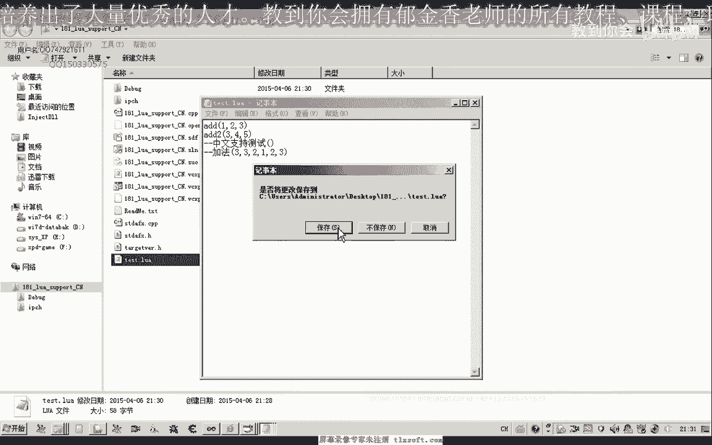

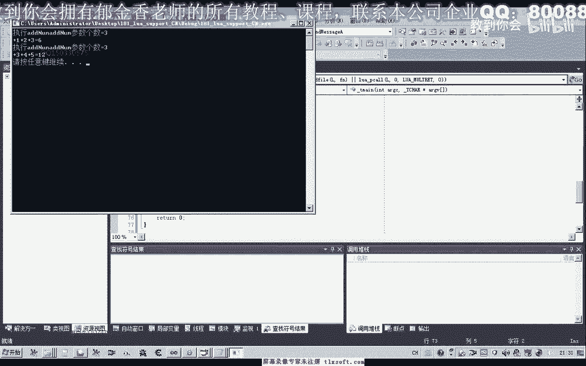

我们创建一个测试工程，并编写以下测试代码。这段代码尝试用英文和中文两种方式注册同一个函数。

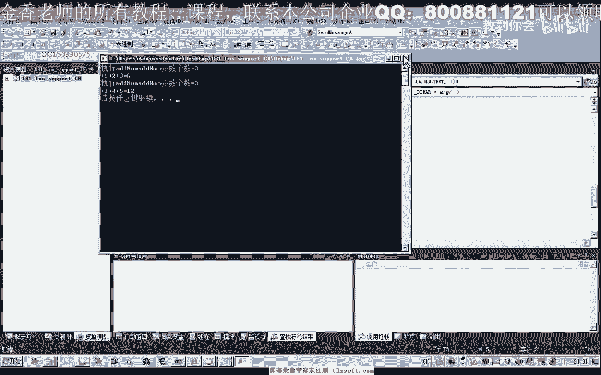

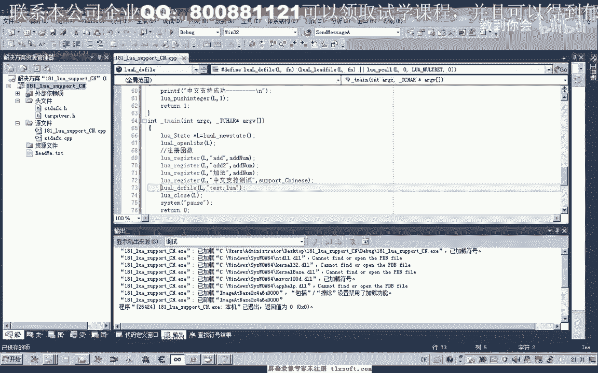


```c
// 示例：注册英文函数名（正常）
lua_register(L, "add123", id_number);
lua_register(L, "add345", id_number);

// 示例：尝试注册中文函数名（修改前会失败）
lua_register(L, "加法", id_number);
lua_register(L, "累加", id_number);
```

在未修改的Lua库中，执行包含`加法()`调用的脚本不会有任何输出，因为解释器无法识别中文函数名，导致编译失败。

---

## 解决方案：修改源代码

上一节我们演示了问题所在，本节中我们来看看如何通过修改Lua的源代码来解决它。

核心思路是修改Lua的词法分析器（lexer），具体是`llex.c`文件中的`llex`函数。该函数负责读取并识别源代码中的标识符（如变量名、函数名）。我们需要让它能够识别中文字符。

### 关键修改点

中文字符通常占两个字节（UTF-8编码），且其首字节的值大于`0x80`。我们需要在判断标识符字符的地方加入这个条件。

以下是需要修改的代码段，位于`llex.c`文件的`llex`函数中：

1.  **首先，我们添加一个辅助宏或函数来判断是否为中文字符首字节。** 为了简单起见，我们可以在文件顶部附近添加一个宏定义：
    ```c
    #define isChinese(c)  ((c) >= 0x80)
    ```
    *（注意：这是一个简化的判断，适用于GBK等编码。对于完整的UTF-8支持需要更复杂的逻辑，但本例旨在说明原理。）*

2.  **接着，找到标识符识别的循环部分。** 在`llex`函数中，寻找处理标识符（名称）的代码块，通常包含一个`while`循环，条件类似：
    ```c
    while (isalpha(c) || isdigit(c) || c == '_') {
        // ... 保存字符并读取下一个
    }
    ```

3.  **修改循环条件，将中文字符判断加入。** 将其修改为：
    ```c
    while (isalpha(c) || isdigit(c) || c == '_' || isChinese(c)) {
        // ... 保存字符并读取下一个
    }
    ```

4.  **确保字符读取正确。** 由于中文字符占多个字节，在`Save`和读取下一个字符(`next`)时，需要确保逻辑能处理多字节字符。原始的`llex`函数可能使用`next(ls)`读取单个字节。如果我们的源文件编码是GBK，一个中文字符需要连续读取两个字节。这可能需要调整`save`和`next`的调用次数，但基本的Lua源码结构通常能通过循环自动处理。

**核心修改公式**：标识符字符的判断条件从 **`isalpha(c) || isdigit(c) || c == '_'`** 扩展为 **`isalpha(c) || isdigit(c) || c == '_' || (c >= 0x80)`**。

---


## 实施步骤

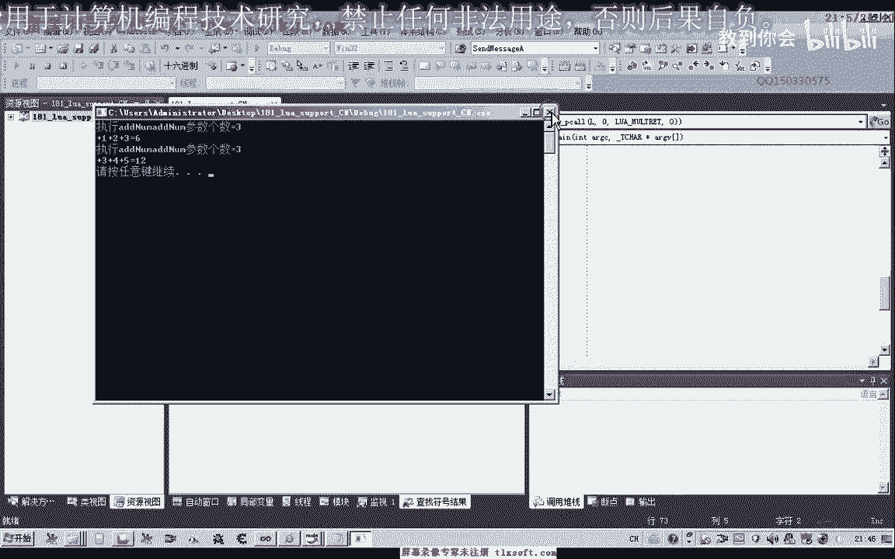


以下是具体的操作步骤：

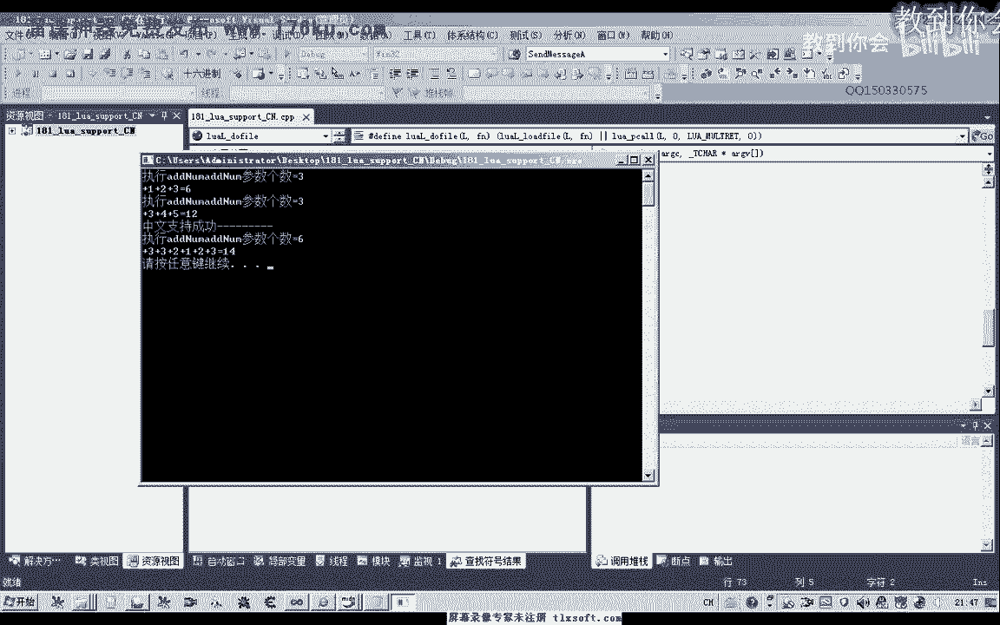

1.  **备份原文件**：在修改前，备份`llex.c`文件。
2.  **打开源代码**：用文本编辑器或IDE打开Lua源码中的`llex.c`文件。
3.  **定位函数**：搜索`llex`函数。
4.  **添加判断宏**：在文件开头合适位置添加`#define isChinese(c) ((c) >= 0x80)`。
5.  **修改循环条件**：找到标识符读取的`while`循环，将其条件修改为包含`isChinese(c)`。
6.  **编译测试**：重新编译Lua库（生成`lua5.1.lib`、`lua5.1.dll`等）。
7.  **更新项目**：将新编译的库文件链接到你的测试工程中。
8.  **运行测试**：再次运行之前的测试代码，现在调用`加法()`或`累加()`应该能成功执行并输出结果。

---

## 测试结果

修改并重新编译Lua库后，运行相同的测试工程。

此时，执行包含中文函数调用的脚本，例如：
```lua
加法()
```
程序能够正确识别“加法”这个函数名，并跳转到对应的C函数`id_number`执行，输出预期结果。这表明我们的修改成功了。

---

## 总结

本节课中我们一起学习了如何让Lua脚本支持中文函数名。

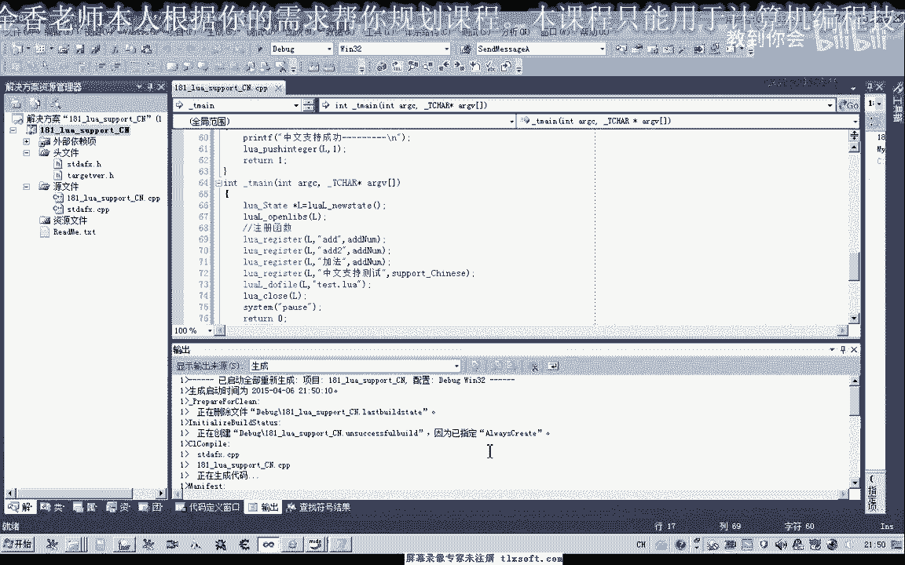

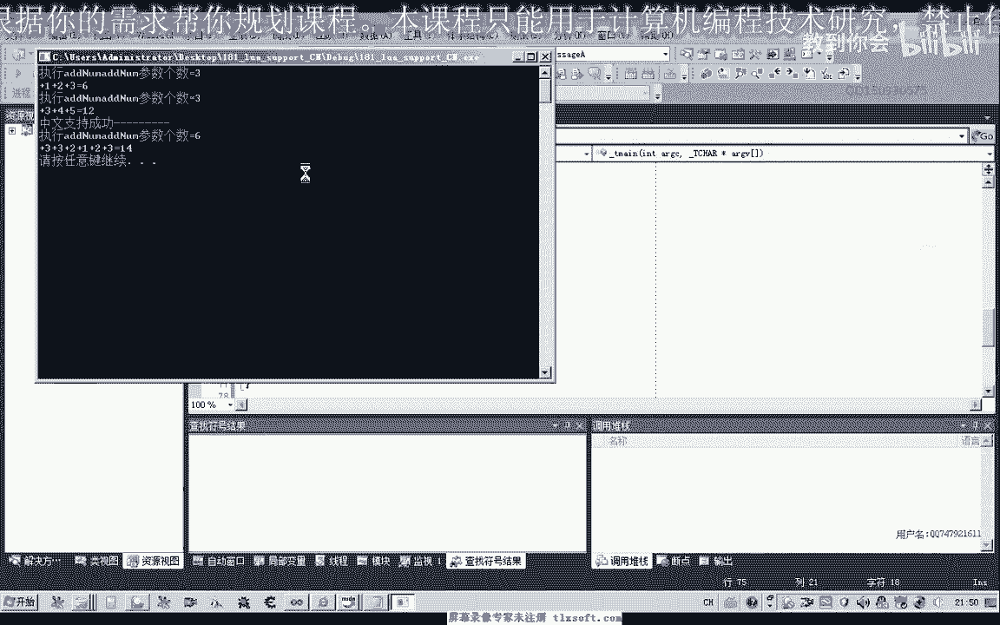

1.  **我们分析了问题**：原版Lua的词法分析器不支持中文字符作为标识符。
2.  **我们找到了解决方案**：通过修改`llex.c`源文件，在标识符识别逻辑中加入对中文字符（首字节>0x80）的判断。
3.  **我们实施了修改**：添加判断宏并修改了关键的`while`循环条件。
4.  **我们验证了结果**：重新编译库后，中文函数名可以被正常注册和调用。

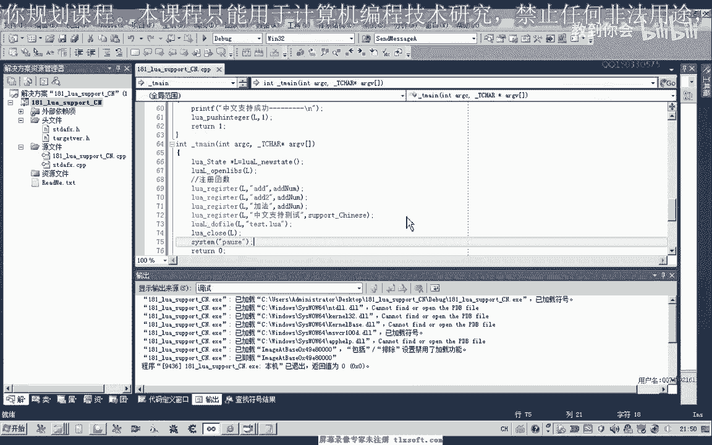


通过这个修改，你可以更自由地在Lua脚本中使用中文命名，提高代码对中文使用者的可读性。请注意，本例使用的是简单的GBK编码判断原则，在实际项目中如需支持UTF-8，可能需要更细致的字符处理逻辑。