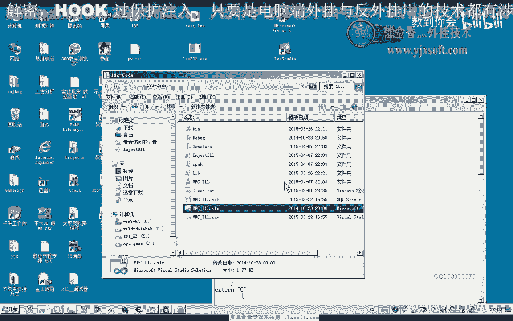
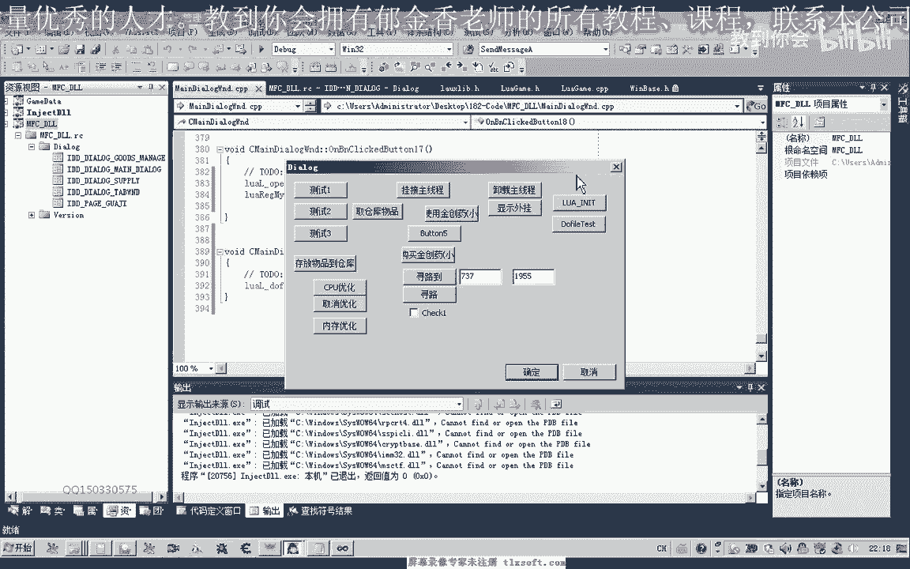
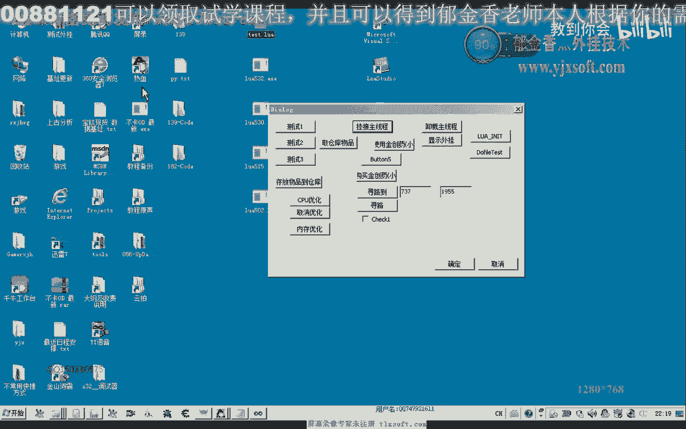
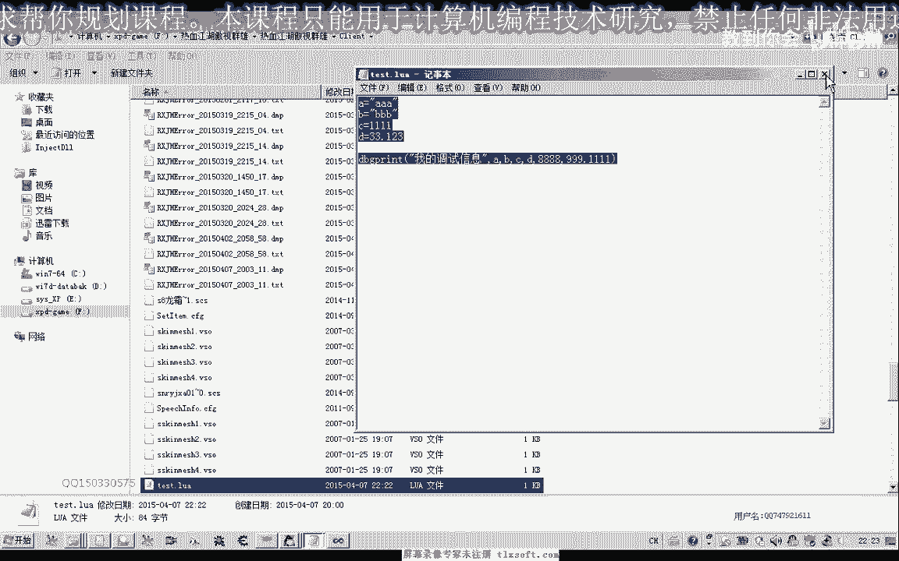

# 课程 P171：为LUA封装调试函数dbgprint_mine 🐛

在本节课中，我们将学习如何为Lua脚本环境封装一个自定义的调试打印函数 `dbgprint_mine`。这个函数可以将脚本中的调试信息输出到调试查看器中，方便我们观察脚本运行状态。


---



## 1. 准备工作与项目结构

上一节我们介绍了Lua脚本的基本调用。本节中，我们来看看如何为脚本环境添加一个实用的调试工具。

首先，我们需要打开第139课的代码项目。

在解决方案资源管理器中，添加一个新的筛选器，可以命名为“LuaScript”或类似名称，用于存放与脚本相关的文件。

在该筛选器下，添加两个新项：
1.  一个头文件（`.h`）
2.  一个源文件（`.cpp`）

在头文件中，我们需要包含Lua相关的头文件，并将我们即将编写的函数进行前置声明。

```cpp
// LuaScript.h
#pragma once
extern "C" {
    #include "lua.h"
    #include "lualib.h"
    #include "lauxlib.h"
}

// 前置声明调试打印函数
int dbgprint_mine(lua_State* L);
```

---

## 2. 实现调试打印函数

准备工作完成后，现在我们来具体实现 `dbgprint_mine` 函数。这个函数的核心功能是接收Lua脚本传入的多个参数，并将它们格式化成字符串后输出。

在源文件中，我们首先需要包含必要的头文件。

```cpp
// LuaScript.cpp
#include “LuaScript.h”
#include <windows.h> // 用于OutputDebugString函数
```

接下来，我们实现 `dbgprint_mine` 函数。

```cpp
int dbgprint_mine(lua_State* L) {
    // 1. 获取传入参数的个数
    int n = lua_gettop(L);
    if (n == 0) {
        // 没有参数，直接返回
        return 0;
    }

    // 2. 分配一个缓冲区来存放格式化后的字符串
    char szBuffer[1024] = {0};
    char* cptr = szBuffer;

    // 3. 添加自定义前缀，便于在调试信息中识别
    strcpy(cptr, “[MyDebug] “);
    cptr += strlen(“[MyDebug] “);

    // 4. 转换并拼接第一个参数
    const char* str = lua_tostring(L, 1);
    if (str) {
        strcpy(cptr, str);
        cptr += strlen(str);
    }

    // 5. 循环处理剩余参数（从第2个开始）
    for (int i = 2; i <= n; ++i) {
        strcpy(cptr, “, “); // 用逗号分隔
        cptr += 2;

        const char* strParam = lua_tostring(L, i);
        if (strParam) {
            strcpy(cptr, strParam);
            cptr += strlen(strParam);
        }
    }

    // 6. 将最终字符串输出到调试器
    OutputDebugStringA(szBuffer);

    // 7. 函数返回值的个数（这里返回0个）
    return 0;
}
```

**核心概念解释**：
*   `lua_gettop(L)`：获取Lua栈顶的索引，即传入参数的个数。
*   `lua_tostring(L, index)`：将Lua栈中指定索引的值转换为C语言风格的字符串（`const char*`）。无论原值是数字、布尔值还是字符串，此函数都能进行转换。
*   `OutputDebugStringA()`：Windows API，将字符串输出到调试器的输出窗口。

---

## 3. 注册函数到Lua环境

函数实现后，需要将其注册到Lua虚拟机中，脚本才能调用。以下是注册该函数的方法。

首先，定义一个结构体数组，用于描述要注册的函数。

```cpp
// 定义函数注册结构数组
static const struct luaL_Reg mylib[] = {
    {“dbgprint”, dbgprint_mine},   // 注册为 dbgprint
    {“print_debug”, dbgprint_mine}, // 注册为 print_debug
    {“调试打印”, dbgprint_mine},    // 甚至可以注册中文名
    {NULL, NULL} // 数组结束标志
};
```

然后，创建一个注册函数，在初始化Lua环境时调用它。

```cpp
void RegisterMyFunctions(lua_State* L) {
    // 计算数组中实际函数的个数
    int count = sizeof(mylib) / sizeof(luaL_Reg) - 1; // 减去末尾的{NULL， NULL}

    // 循环注册每一个函数
    for (int i = 0; i < count; ++i) {
        lua_register(L, mylib[i].name, mylib[i].func);
    }
}
```

**代码说明**：
*   `luaL_Reg` 结构体包含 `name`（函数在Lua中的名字）和 `func`（对应的C函数指针）。
*   `lua_register(L, name, func)` 将C函数 `func` 以名称 `name` 注册为Lua的全局函数。

---

## 4. 在MFC界面中进行测试

函数注册好后，我们可以在MFC应用程序的界面中添加按钮进行测试。

在对话框的头文件中，包含我们的Lua脚本头文件，并声明Lua状态机和相关函数。

```cpp
// YourDlg.h
#include “LuaScript.h”
class CYourDlg : public CDialogEx {
    // ...
private:
    lua_State* m_pLuaState;
    void InitLua();
    void DoLuaFile();
};
```

在对话框的源文件中，实现初始化和执行脚本的功能。

```cpp
// YourDlg.cpp
void CYourDlg::InitLua() {
    if (!m_pLuaState) {
        m_pLuaState = luaL_newstate(); // 创建新的Lua状态机
        luaL_openlibs(m_pLuaState);    // 打开标准库
        RegisterMyFunctions(m_pLuaState); // 注册我们的自定义函数
    }
}



void CYourDlg::DoLuaFile() {
    if (m_pLuaState) {
        // 假设脚本文件放在游戏客户端目录下
        int result = luaL_dofile(m_pLuaState, “test.lua”);
        if (result != LUA_OK) {
            CString err = lua_tostring(m_pLuaState, -1);
            AfxMessageBox(err);
        }
    }
}
```


为两个按钮（例如“初始化Lua”和“执行脚本”）分别绑定 `InitLua()` 和 `DoLuaFile()` 函数。



---

## 5. 编写测试脚本并运行

最后，我们创建一个Lua测试脚本来验证调试函数是否工作正常。

创建一个名为 `test.lua` 的文件，内容如下：

```lua
-- test.lua
local a = “Hello”
local b = “World”
local c = 123
local d = 45.67

-- 使用我们注册的任何一个名字调用调试函数
dbgprint(a, b, c, d, 999, 88.88)
-- 或者 print_debug(a, b)
-- 或者 调试打印(a, b)
```


将 `test.lua` 文件复制到你的游戏客户端应用程序的同一目录下。运行你的MFC程序，点击“初始化Lua”按钮，然后点击“执行脚本”按钮。


打开调试器（如Visual Studio的输出窗口或DebugView工具），你应该能看到类似以下的输出：

```
[MyDebug] Hello, World, 123, 45.67, 999, 88.88
```

这表明我们的调试打印函数封装成功，能够正确接收并输出Lua脚本中的各种类型参数。



---


## 6. 课程总结与作业

本节课中我们一起学习了如何为Lua环境封装一个自定义的调试打印函数。我们完成了从函数实现、注册到MFC界面集成测试的完整流程。关键点在于使用 `lua_tostring` 进行参数转换，以及通过 `lua_register` 将C函数暴露给Lua脚本。

**课后作业**：
请尝试封装一个寻路功能的函数到Lua中。目标是在Lua脚本里可以这样调用：


```lua
MoveTo(100, 200) -- 移动到坐标(100， 200)
local x = 300
local y = 400
MoveTo(x, y) -- 移动到变量指定的坐标
dbgprint(“正在移动到位置：”， x, y) -- 结合本节课的调试函数输出信息
```

**作业要求**：
1.  在C++中实现 `MoveTo` 函数（内部可以暂时用 `dbgprint` 模拟寻路逻辑）。
2.  将该函数注册到Lua环境。
3.  编写一个Lua测试脚本，调用 `MoveTo` 并打印调试信息。
4.  确保脚本能正常执行，并在调试器中看到预期的输出。

下一节课，我们将具体讲解如何封装这个寻路函数的脚本接口。本节课就到这里。