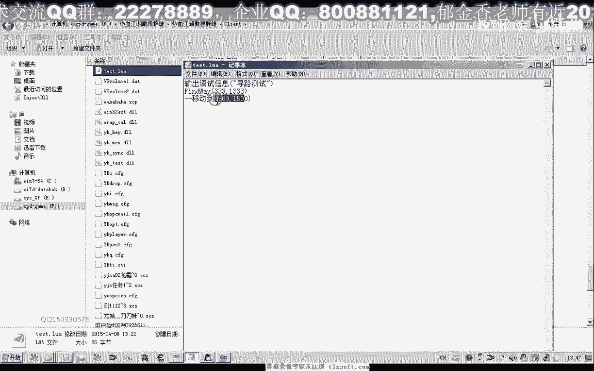
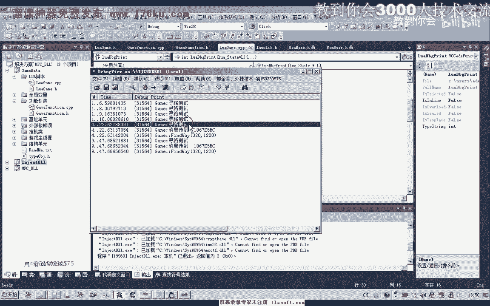

# P172：183-LUA封装寻路函数FindWay - 教到你会 - BV1DS4y1n7qF

大家好，我是欲擒相老師，那麼這期我們一起來封裝一下，尋路函數，首先我們打開182克的代碼。

那麼首先我們轉到我們的Lua單元，在cpp裏面添加我們的尋路函數的代碼，那麼我們可以按照它的標準來寫一個，Lua的尋路代碼，Reget，那麼最後我們有一個返回詞，那麼如果是成功執行的話。

我們給它複習一個返回詞，那麼如果是成功，我們給它複習一個返回詞，當然在這裏我們需要先獲得，從我們的Lua腳本傳進來的參數，我們先獲得它參數的一個個數，那麼我們定一個變量。

Number來獲得參數的一個個數，通過一個函數LuaGetTable來獲得，那麼我們首先來對參數的個數進行一下判斷，因為我們如果是尋路的參數的話，至少是兩個參數多餘的，我們把它省略掉。

那麼我們需要了前面的兩個參數，X座標和Y座標，那麼所以說如果它的參數小於兩個的話，我們直接就返回，那麼直接返回的時候，我們給它返回一個數字0，或者是一個不認識，那麼如果是剛好參數的個數是正確的話。

那麼我們就把它轉換成我們的X和Y座標，那麼還有一個座標，它在它的位置在裏面的第二個位置，當然有了這兩個座標，實際上我們就可以調用我們的MSGFundXY，但是為了我們這裏的一個統一的規範。

我們都把相關的函數，我們在Lua腳本裏面調用的函數，都把它封裝在功能封裝的函數裏面，這個規範，那麼我們在功能封裝這個函數裏面，我們默認把它取名為FundCatal，Fcatal小寫。

那麼這個函數暫時還沒有封裝，我們在這個單元裏面進行相應的功能封裝，然後在CPP裏面，我們直接原代碼裏面，我們直接調用無線程單元的MSGFundXY，好，那麼經過封裝之後，我們點擊生成，那麼現在的話。

代碼的話看起來是沒有錯，然後我們再把剛才的出車函數，前置一下，在頭文件裏面，那麼這個函數，我們把它放在第一的位置，因為這是一個註冊函數，那麼這裏我們全部小寫了第一個字母，好。

然後我們對這個函數來進行註冊，到它的註冊函數裏面，那麼首先，這裏是它註冊的名字，也就是我們在編寫腳本代碼的時候，我們以怎樣的方式來調用它，這裏我們直接是移動到，那麼我們也可以給它註冊一個英文的名字。

好的，然後我們再次編輯生成，那麼這個註冊的英文名字，我們就把這個註冊的英文名字，給它註冊到這個英文的名字裏面，然後我們就給它註冊一個英文的名字，這個英文名字的註冊名字是，英文的註冊名字。

然後這個註冊名字的註冊名字是，英文的註冊名字，那麼這個註冊的英文名字，我們就把它註冊到這個英文的註冊名字裏面，然後我們切換到我們的遊戲的客服端目錄下面。

修改我們的腳本，那麼首先我們也輸出一個調試信息，然後這裏調用Finder位，比如說我們要移動到333，然後333這個位置，保存一下。

輸入成功之後先掛接我們的出現程。

初始化，然後我們看一下我們的調試信息，再看一下我們的人物角色，測試一下，那麼這個時候我們發現了，它就移到了指定位置的附近，但是沒有具體的移動到指定位置，那麼可能是指定位置了，它不能夠達到。

那麼我們看一下現在的位置大概是361230，1223，我們設定為目的地的地址，為這個地址再來測試一下。

那麼我們先移動一下，移動到這個位置，然後再做一個測試，那麼這個時候我們發現了，它可以移動到我們指定的地址，321220，那麼我們改變一下，看它對大小寫是否敏感。

然後我們再次移動一下。

那麼我們發現的話，如果是大小寫不正確的話，它也不能夠執行，所以說如果我們是註冊為英文腳本的時候，一定要注意大小寫。

那麼我們再次執行，那麼我們發現的話，是大小寫正確的話，它就能夠正常的執行，那麼我們再試一下中文的腳本，把上面這一行註實掉，那麼我們就用下邊這一個移動到，好的，我們再次測試，讀反了，那麼這個時候。

它也能夠正確的執行，最終到達我們的目的地地址，321220，好的，那麼這一節我們暫時就討論到這個地方，那麼我們下一節討論再見，那麼這幾個也跟大家佈置了一個座列。

那麼座列就是獲得當前的這兩個座標，那麼它的大致的函數的形式框架，我都跟大家寫好了，那麼大家自己需要在這個位置添加自己的代碼，那麼以及註冊函數，好的，那麼我們下一節再見，主要是我們這裡需要回傳這個函數。

那麼怎麼在我們的腳本端，把這個函數打印出來，好。

那麼我們下一節可能再探討，再會。