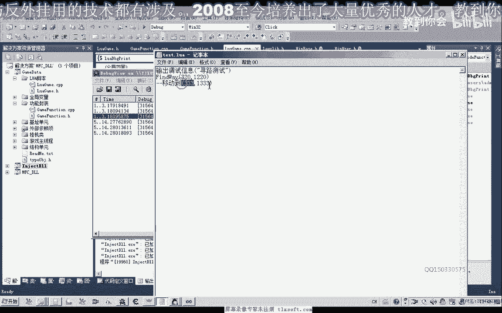

# 课程 P172：183-LUA封装寻路函数FindWay 🧭

在本节课中，我们将学习如何将一个C++中的寻路功能封装成Lua脚本可以调用的函数。我们将从现有代码出发，逐步完成函数的添加、参数处理、功能封装以及最终的注册和测试。


---

## 概述与准备工作

首先，我们打开第182课的代码作为基础。


上一节我们介绍了基础框架，本节中我们来看看如何具体封装一个寻路函数。

## 在C++中添加Lua函数

我们转到Lua单元，在CPP文件中添加寻路函数的代码。我们需要按照Lua C API的标准来编写这个函数。

以下是函数的基本框架，我们将其命名为 `FindWay`：

```cpp
static int FindWay(lua_State* L) {
    // 函数实现
}
```

函数执行成功时，我们需要返回一个值。

## 处理Lua传入的参数

在函数内部，我们首先需要获取从Lua脚本传进来的参数。

我们定义一个变量来获取参数的个数，使用 `lua_gettop` 函数：

```cpp
int numArgs = lua_gettop(L);
```

接下来对参数个数进行判断。因为寻路至少需要两个参数（X坐标和Y坐标），多余的参数我们将忽略。

如果参数小于两个，我们直接返回一个数字0或一个nil值。

```cpp
if (numArgs < 2) {
    lua_pushnumber(L, 0); // 或 lua_pushnil(L);
    return 1;
}
```

如果参数个数正确，我们就将它们转换为X和Y坐标。参数在栈中的位置是第一个和第二个。

```cpp
int targetX = (int)lua_tonumber(L, 1);
int targetY = (int)lua_tonumber(L, 2);
```

## 调用核心寻路功能

有了这两个坐标，理论上我们就可以直接调用主线程单元中的 `MSG_FindXY` 函数。

但为了保持统一的代码规范，我们将所有在Lua脚本中调用的函数都封装在一个专门的功能封装函数里。我们把这个函数命名为 `Func_Call`。

这个 `Func_Call` 函数目前尚未封装，我们将在本单元内实现它。在CPP的 `FindWay` 函数中，我们不再直接调用 `MSG_FindXY`，而是调用这个封装函数。

```cpp
// 在 FindWay 函数内部
Func_Call(/* 传递必要的参数，如 targetX, targetY */);
```

封装完成后，我们点击生成，确保代码没有编译错误。

## 声明与注册函数

接下来，我们需要将刚才编写的 `FindWay` 函数在头文件中进行前置声明。

这个函数是一个注册函数，我们将其放在靠前的位置。注意，我们使用小写字母开头命名。

```cpp
// 在头文件中声明
int FindWay(lua_State* L);
```

然后，我们把这个函数注册到Lua中。在注册函数里，我们需要指定它在Lua脚本中被调用时的名字。

例如，我们可以注册一个中文名字“移动到”，也可以同时或单独注册一个英文名字 `MoveTo`。


```cpp
// 注册函数列表中添加
{“移动到”, FindWay},
{“MoveTo”, FindWay},
```

再次编辑并生成项目。

## 测试封装好的函数

我们切换到游戏的客户端目录下，修改Lua脚本来测试新函数。


首先，我们输出一条调试信息。然后调用 `FindWay` 函数，尝试移动到坐标 (333, 333)。


```lua
print(“开始寻路测试”)
移动到(333, 333) -- 或使用 MoveTo(333, 333)
```


保存脚本。


注入成功之后，挂接我们的进程并初始化。


观察调试信息和控制台输出，同时查看游戏角色是否移动。

测试发现，角色移动到了指定位置附近，但并非精确的点 (333, 333)。这可能是因为该坐标点无法到达。



我们记录下角色当前的实际坐标，例如 (361, 230)，并将其设为目标地址再次测试。


修改脚本中的目标坐标并测试。这次角色成功移动到了精确的指定地址 (321, 220)。

## 测试函数名大小写敏感性


我们改变一下调用时函数名的大小写，测试其是否敏感。


再次移动并观察。


测试发现，如果大小写不正确，函数将无法执行。因此，如果注册的是英文函数名，在Lua脚本中调用时必须注意大小写完全一致。


当大小写正确时，函数能够正常执行。

我们再测试一下中文函数名。将脚本中英文调用注释掉，使用中文“移动到”进行测试。

测试结果显示，中文函数名也能正确执行，使角色到达目的地 (321, 220)。

## 课程总结与作业

本节课中，我们一起学习了如何将C++的寻路功能封装给Lua调用。主要步骤包括：在C++中添加Lua函数、处理参数、通过封装函数调用核心逻辑、以及最终在Lua中注册和测试函数。


本节暂时讨论到这里。下一节我们将继续探讨其他内容。

最后，布置一个课后作业：


**作业**：编写一个Lua可调用的函数，用于获取游戏角色当前的X和Y坐标。

函数的大致框架已经提供，大家需要在自己代码的指定位置添加实现逻辑，并完成函数的注册。

主要思考点是如何在C++端获取坐标，并将这两个值回传给Lua脚本端，最终在脚本中打印出来。


我们下一节可能会探讨这个问题的解决方案。再见。