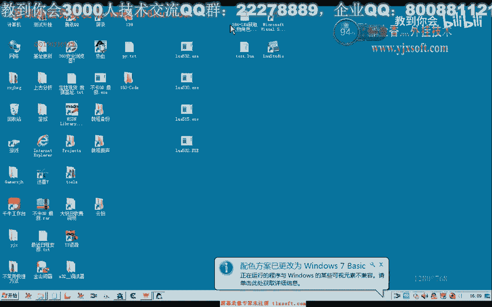
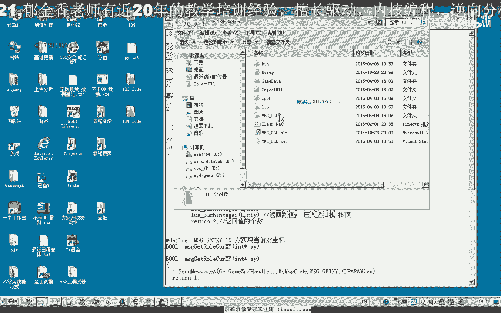
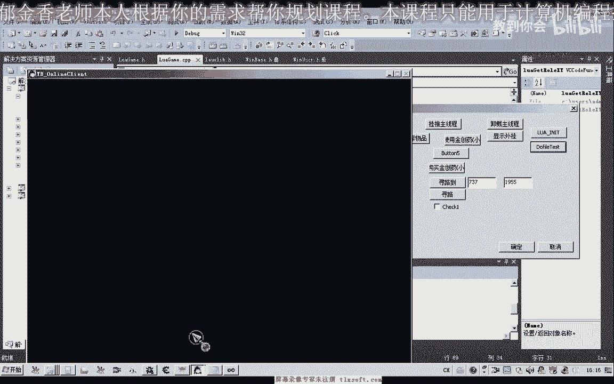

# 课程 P173：184-LUA获取人物角色坐标GetXy 📍

在本节课中，我们将学习如何编写一个LUA脚本接口，用于安全地获取游戏中人物角色的坐标。我们将从一种简单的实现方法开始，然后探讨其潜在问题，并最终实现一个更安全、更规范的线程安全版本。



---

## 概述

我们将基于上一节课（183课）的代码进行扩展。目标是创建一个名为 `getxy` 的LUA函数，它能返回人物角色的X和Y坐标。我们将首先尝试一种利用全局变量的简单方法，然后改进为通过主线程消息传递的安全方法。

---

## 第一步：在头文件中声明函数

首先，我们需要在项目的头文件中声明我们的新函数。按照统一的命名习惯，我们为其添加前缀。

**代码示例：**
```cpp
// 在相应的头文件中添加声明
int getxy(lua_State* L);
```

声明完成后，我们移动到对应的CPP实现单元准备添加代码。

---

## 第二步：实现简单的坐标获取（非线程安全）

上一节我们介绍了函数的声明，本节中我们来看看如何实现一个基础版本。我们可以直接读取游戏中存储角色坐标的全局变量。

这是一种简单的写法，但存在风险。如果我们在非主线程（例如脚本线程）中读取坐标，而主线程正在更新这个坐标，就可能读到不完整或错误的数据。不过，在非挂机且操作不频繁的情况下，出错的几率较小。

**代码示例：**
```cpp
int getxy(lua_State* L) {
    // 假设 g_Character 是包含坐标的全局结构体
    lua_pushnumber(L, g_Character.x); // 将X坐标压入LUA栈
    lua_pushnumber(L, g_Character.y); // 将Y坐标压入LUA栈
    return 2; // 返回两个值
}
```


写好函数后，我们需要在LUA引擎中注册它，以便脚本可以调用。

---

## 第三步：注册LUA函数

为了在LUA脚本中使用，我们必须注册这个函数。为了避免因大小写导致的难以排查的语法错误，建议统一使用小写函数名。

以下是注册函数的步骤：

1.  在LUA状态机初始化部分，添加注册代码。
2.  可以同时注册一个中文函数名作为别名，方便使用。


**代码示例：**
```cpp
lua_register(L, "getxy", getxy); // 注册英文函数名
lua_register(L, "获取坐标", getxy); // 注册中文函数名（可选）
```

注册完成后，编译并生成解决方案。

---

## 第四步：在LUA脚本中测试


函数注册成功后，我们就可以在LUA脚本中调用它了。由于我们的函数返回两个值，在LUA中需要用两个变量来接收。



以下是调用方法：

```lua
-- 调用函数，用两个变量接收返回值
local x, y = getxy()
-- 或者使用中文别名
local 横坐标, 纵坐标 = 获取坐标()

-- 打印坐标进行调试
print("X坐标: " .. x)
print("Y坐标: " .. y)
```

将脚本注入游戏并运行，观察控制台输出的坐标是否正确。通过移动角色，可以验证坐标是否实时更新。

---

## 第五步：实现线程安全的坐标获取

上一节我们实现的简单方法存在数据竞争的风险。本节中我们来看看如何实现一个更安全的版本，确保坐标读取操作在主线程中执行。

核心思路是：当LUA脚本调用 `getxy` 时，不直接读取全局变量，而是向游戏的主线程发送一个自定义消息。主线程处理该消息时，安全地读取当前坐标，并通过消息参数将结果传回。

**实现步骤如下：**

1.  **定义消息和数据结构：** 在CPP单元中定义一个消息标识符和一个用于传递坐标的结构体（例如包含两个浮点数的数组）。
2.  **修改getxy函数：** 在新的 `getxy` 函数中，创建结构体，向主线程发送消息并等待结果。
3.  **在主线程消息循环中处理：** 在主线程的消息处理代码中，添加对我们自定义消息的处理。收到消息后，将当前角色的X和Y坐标写入传来的结构体中。
4.  **封装功能函数：** 在功能封装单元，创建两个独立的函数（如 `fGetX` 和 `fGetY`）来安全地获取坐标，它们内部调用上述线程安全机制。

**安全版本的核心代码示意：**
```cpp
// 1. 定义消息和结构
struct Point2D { float x; float y; };
#define WM_GET_CHAR_POS (WM_USER + 100)

// 2. 修改后的getxy函数（发送消息）
int getxy_safe(lua_State* L) {
    Point2D pos;
    // 发送消息到主窗口，主线程处理后会填充pos
    SendMessage(hGameWnd, WM_GET_CHAR_POS, (WPARAM)&pos, 0);
    lua_pushnumber(L, pos.x);
    lua_pushnumber(L, pos.y);
    return 2;
}

// 3. 主线程消息处理（部分代码）
case WM_GET_CHAR_POS: {
    Point2D* pPos = (Point2D*)wParam;
    if(pPos) {
        pPos->x = g_Character.x; // 安全读取
        pPos->y = g_Character.y;
    }
    break;
}
```

使用此方法后，无论从哪个线程调用，坐标读取都在主线程同步完成，彻底避免了数据冲突。

---

## 第六步：最终测试与验证

实现线程安全版本后，重新编译项目并更新脚本。再次运行脚本，进行如下测试：

1.  角色静止时，获取坐标并与游戏内显示坐标对比。
2.  角色移动时，连续获取坐标，确认其变化流畅且正确。
3.  可以尝试在复杂的多线程脚本环境中调用，验证其稳定性。

通过对比，确认新的 `getxy` 函数工作正常，且比最初版本更可靠。

---

## 总结

本节课中我们一起学习了如何为LUA脚本创建获取角色坐标的接口。


1.  我们首先实现了一个**简单的直接读取全局变量**的方法，但认识到它在多线程下可能不安全。
2.  接着，我们改进了方法，通过**向主线程发送消息**来安全地获取坐标，这是更推荐的做法。
3.  我们完成了从**函数声明、实现、注册到脚本调用**的完整流程。
4.  最后，我们进行了测试，验证了两种方法的有效性，并理解了线程安全编程的重要性。


掌握这种方法后，你可以安全地为游戏扩展各种需要读取核心数据的脚本功能。