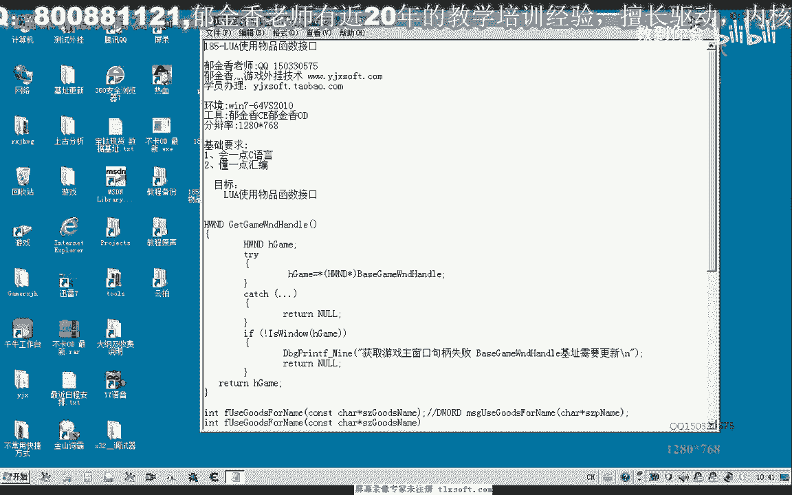
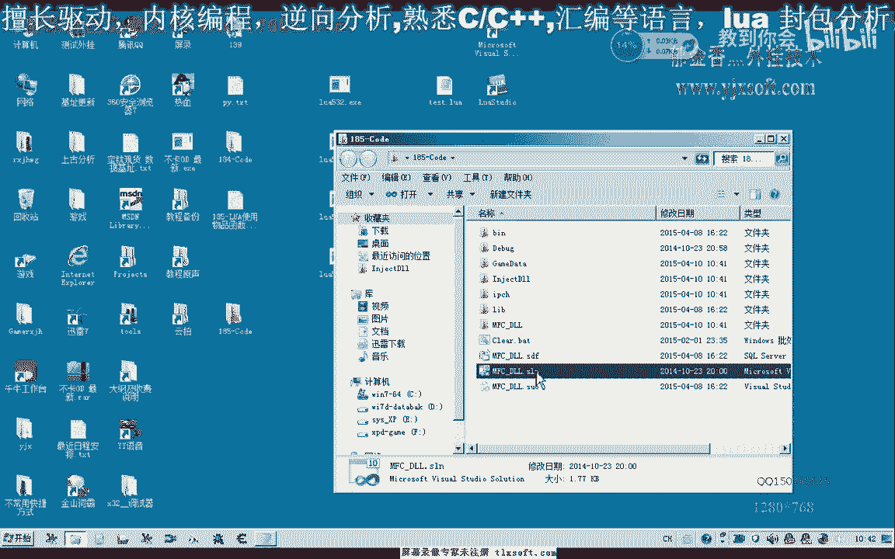
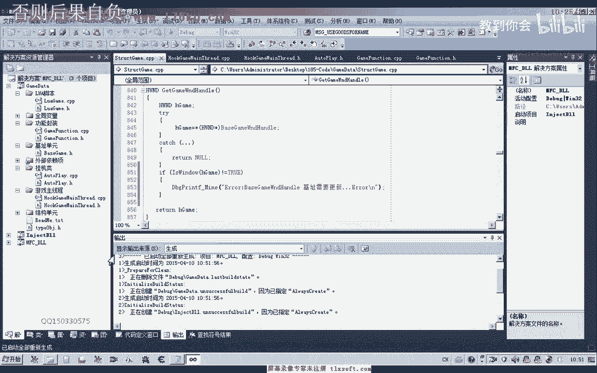
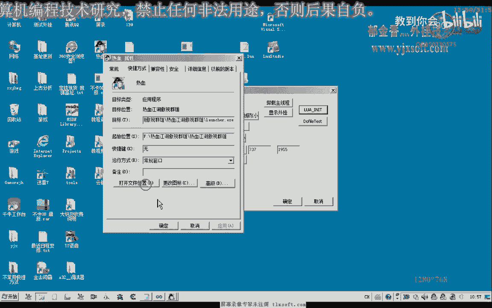
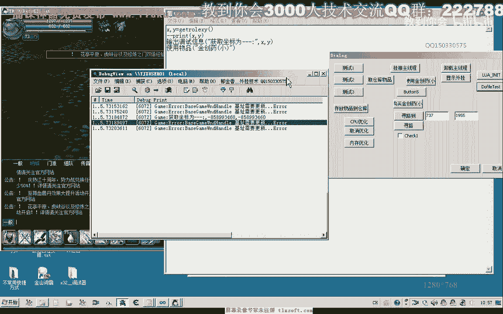
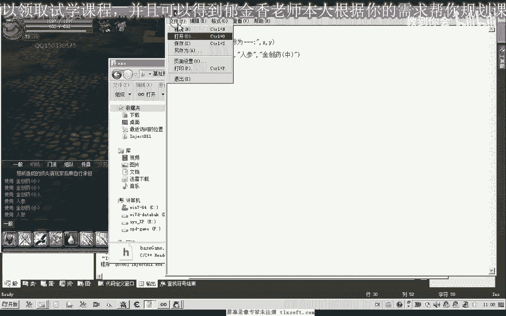

# 课程 P174：LUA使用物品函数接口教程 🧪




在本节课中，我们将学习如何使用Lua脚本编写一个调用游戏内“使用物品”功能的函数接口。我们将从现有代码开始，逐步添加功能，处理参数，并最终实现一个可以按名称使用背包中物品的脚本函数。


---



## 打开并查看现有代码

首先，我们打开上一节课（第184课）的代码作为基础。

上一节我们介绍了代码结构，本节中我们来看看如何在此基础上添加新功能。

## 在Lua脚本单元注册函数

我们需要在Lua脚本单元中编写一个新的函数。这个函数将作为我们使用物品的接口。

以下是创建函数的基本步骤：

1.  在Lua脚本单元中，声明一个名为 `useItem` 的函数。
2.  这个函数需要接收参数，参数将是我们要使用的物品名称。

## 在C++单元添加对应源代码

Lua函数需要调用底层的C++功能。因此，我们需要在对应的C++单元中添加源代码。

上一节我们创建了Lua函数框架，本节中我们来看看如何将其与C++功能连接。

1.  在C++单元中，添加一个与Lua函数对应的功能函数。
2.  在这个C++函数内部，调用游戏功能封装模块中已有的“使用物品”函数。
3.  为该函数设置一个返回值，用于向Lua脚本反馈操作结果（例如，成功或失败）。

## 在功能封装模块实现核心逻辑

真正的“使用物品”操作逻辑位于功能封装模块中。

以下是实现步骤：

1.  在功能封装模块中，创建一个新的函数。
2.  在这个函数内部，调用游戏内存结构（`ms`）中与物品操作相关的分类函数。
3.  直接返回该内存操作函数的返回值。

完成以上步骤后，我们先编译生成一次程序，确保没有语法错误。

## 在Lua函数中处理参数




回到Lua脚本单元，我们需要完善 `useItem` 函数，使其能够接收并处理传入的物品名称参数。

上一节我们连接了底层功能，本节中我们来看看如何在Lua层处理用户输入。


在编写脚本时，我们期望以 `useItem(“物品名字”)` 的格式调用函数。因此，函数需要能够提取传入的字符串参数。



以下是参数处理逻辑：

1.  使用 `lua_gettop` 函数确定传入参数的个数。
2.  如果参数个数小于1，说明没有传入物品名，函数应直接返回一个表示失败的数值（例如 `0` 或 `-1`）。
3.  如果参数个数大于等于1，我们只取第一个参数作为要使用的物品名。后续参数可被忽略，或设计为支持一次性使用多个物品。
4.  可以使用循环依次取出多个参数，实现批量使用物品的功能。
5.  在取出每个参数后，应检查其类型是否为字符串（`LUA_TSTRING`）。如果不是，则跳过该参数，继续处理下一个。
6.  对于每个有效的字符串参数，调用前面编写好的C++功能函数。



处理完参数逻辑后，再次编译生成程序。

## 注册Lua函数并命名


函数编写完成后，需要将其注册到Lua环境中，脚本才能调用。

以下是注册步骤：

1.  将注册代码移动到Lua初始化部分。
2.  为函数注册一个英文名称（如 `useitem`），注意使用小写字母和英文符号。
3.  同时，也可以注册一个中文名称（如 `使用物品`），以支持双语调用。

注册完成后，再次编译生成程序。



## 优化游戏句柄获取逻辑

在主线程单元中，优化获取游戏窗口句柄的代码，增加健壮性检查。

有时获取的游戏机制（句柄）可能已过期，虽然能读到数据，但可能不是正确的主窗口句柄。

以下是优化方法：

1.  使用Windows API函数 `IsWindow` 来判断获取到的句柄是否有效。
2.  如果 `IsWindow` 返回假（`false`），则说明当前句柄已失效。
3.  此时，可以打印一段调试信息，提示需要更新游戏机制。

添加此检查后，重新编译程序。

## 测试与调试

编译成功后，运行程序并进行测试。

上一节我们完成了所有代码编写，本节中我们来看看如何进行实际测试并解决遇到的问题。

### 首次测试与机制更新

1.  运行游戏和我们的程序。
2.  挂接主线程，进行初始化。
3.  在游戏目录下创建一个测试Lua脚本（例如 `test.lua`），内容为调用 `useItem(“金疮药小”)`。
4.  执行测试脚本（`dofile`）。
5.  测试时，可能会遇到错误提示“机子需要更新”。这表明游戏版本更新后，我们使用的内存地址（机制）已失效。
6.  使用机制更新工具，找到最新的正确内存地址，并替换代码中的旧地址。
7.  替换后，重新编译程序。

### 测试批量使用功能

我们的函数设计支持传入多个参数，批量使用物品。

1.  修改测试脚本，尝试同时使用多个物品，例如：`useItem(“人参”, “金疮药小”, “金疮药中”)`。
2.  执行脚本，观察游戏内物品是否被正确使用。
3.  可能会发现只有部分物品被使用。这可能是因为：
    *   **参数下标错误**：Lua中表的下标通常从1开始，如果循环从0开始，会少执行一次。确保循环变量初始值为 `1`。
    *   **游戏使用间隔限制**：游戏可能对同一类物品的连续使用设有时间间隔（冷却时间）。短时间内频繁使用会被服务器忽略。

### 处理游戏使用间隔

如果确认是游戏服务器的使用间隔限制，需要在脚本中增加延迟。

以下是解决方法：

1.  在Lua脚本中，在连续使用两个物品之间调用 `Sleep` 函数添加延迟。
2.  通过测试，确定大致的间隔时间（例如，可能是200-300毫秒）。
3.  将延迟时间加入到批量使用的逻辑中。

**核心延迟代码示例：**
```lua
function useItems(...)
    local items = {...}
    for i, name in ipairs(items) do
        useItem(name) -- 调用我们编写的C++接口函数
        Sleep(300)    -- 延迟300毫秒，避免服务器限制
    end
end
```

### 深入分析间隔限制（可选）

如果想进一步了解限制是本地检测还是服务器检测，可以进行分析：

1.  **思路**：直接调用底层“发送数据包”的函数来使用物品，绕过常规函数调用。
2.  **判断**：如果通过发包方式没有时间限制，则说明限制在服务器端；如果仍有限制，则可能本地也有检测逻辑。
3.  此分析有助于更底层地优化脚本行为。


---

## 总结

本节课中我们一起学习了如何为游戏辅助工具创建一个Lua脚本接口，用于使用背包中的物品。

我们完成的主要工作包括：
1.  **在Lua层**：编写了 `useItem` 函数框架，并实现了多参数处理和错误检查。
2.  **在C++层**：添加了对应的功能函数，桥接了Lua脚本与游戏核心功能。
3.  **在功能模块**：实现了调用游戏内存函数以操作物品的核心逻辑。
4.  **在工程层面**：注册了函数，并优化了句柄获取的健壮性。
5.  **在测试中**：发现了游戏服务器的物品使用间隔限制，并通过在脚本中添加 `Sleep` 延迟来解决该问题。

通过本教程，你掌握了为Lua脚本扩展游戏功能接口的基本流程，以及如何处理实际测试中遇到的常见问题。