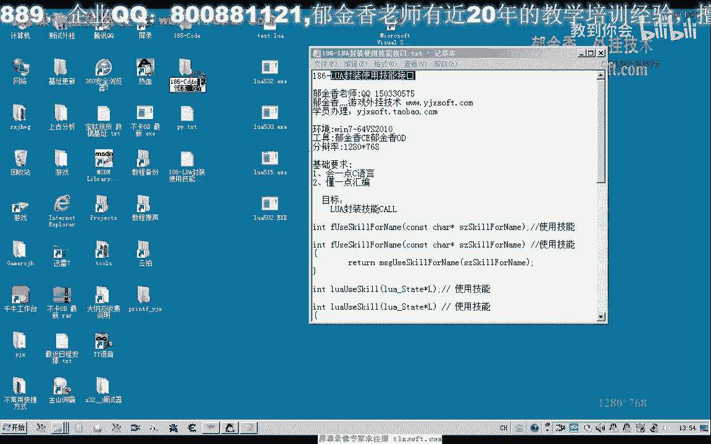
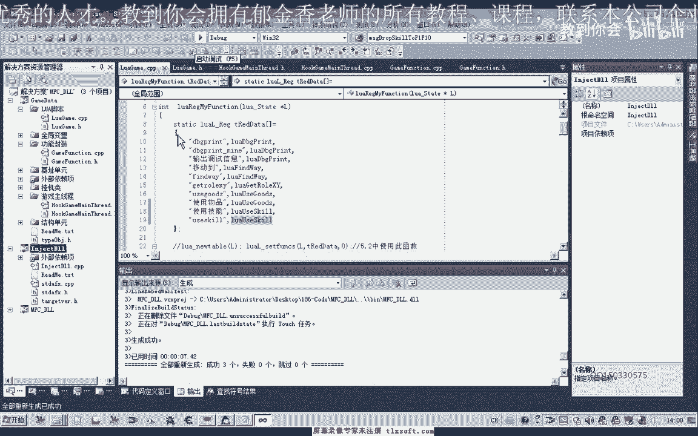
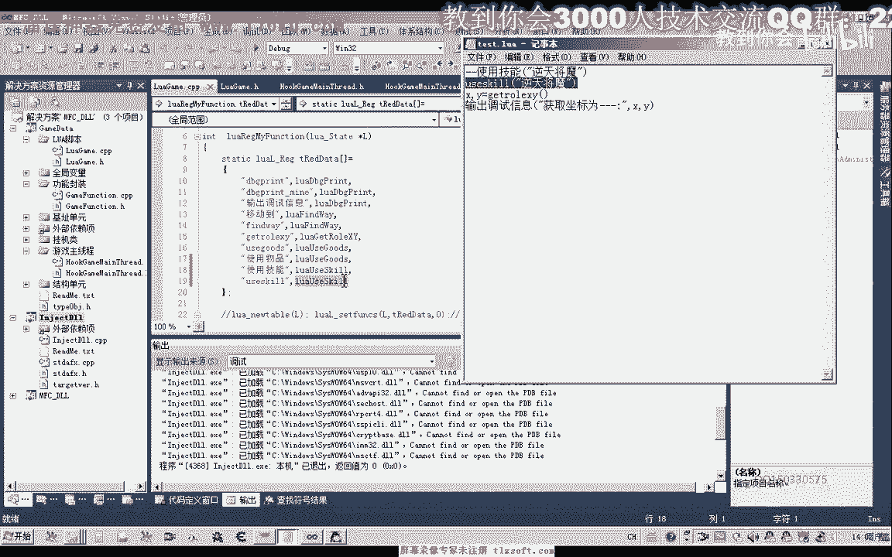
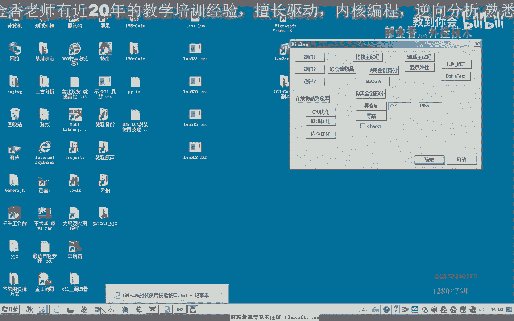

# 课程 P175：186-LUA封装使用技能接口 🛠️



在本节课中，我们将学习如何使用Lua脚本封装一个调用游戏内技能的接口。我们将从修改现有代码开始，逐步完成接口的封装、注册与测试，最终实现通过Lua脚本控制角色释放指定技能的功能。


---

## 一、准备工作 📂

上一节我们完成了基础框架的搭建，本节中我们来看看如何封装具体的功能接口。

首先，打开上一节课（P185）的工程代码。我们需要在三个核心单元中进行修改：Lua脚本单元、功能封装单元以及主线程单元。

以下是需要修改的单元文件：
*   `LuaScriptUnit`：负责Lua脚本的解析与函数注册。
*   `FunctionWrapperUnit`：负责封装具体的游戏功能调用。
*   `MainThreadUnit`：负责在主线程中执行具体的功能操作。

---

## 二、封装功能函数 ⚙️

我们首先在功能封装单元中添加技能使用的核心函数。

1.  **在头文件中声明函数**
    在 `FunctionWrapperUnit.h` 文件中，添加一个用于使用技能的函数的声明。注意，为了通过编译，需要为其添加 `const` 前缀修饰。

    ```cpp
    // 在 FunctionWrapperUnit.h 中添加
    void UseSkill(const char* skillName);
    ```

2.  **在源文件中实现函数**
    转到 `FunctionWrapperUnit.cpp` 文件，实现这个函数。其内部将调用主线程单元中实际执行技能操作的函数（例如 `mg_qe` 或 `radar`）。

    ```cpp
    // 在 FunctionWrapperUnit.cpp 中实现
    void UseSkill(const char* skillName) {
        // 这里将技能名参数传递给主线程的执行函数
        // 例如：CallMainThreadToUseSkill(skillName);
    }
    ```
    同时，需要确保该函数在头文件中的声明与在源文件中的实现保持一致，都包含 `const` 修饰。

完成以上步骤后，编译一下工程，确保没有语法错误。如果有错误，通常需要检查头文件是否被正确包含，以及函数签名是否完全一致。

---

## 三、暴露接口给Lua 📝

在功能单元封装好后，我们需要将其暴露给Lua脚本调用。

上一节我们介绍了如何在C++中封装功能，本节中我们来看看如何将其与Lua桥接。

1.  **在Lua单元的头文件中注册函数**
    在 `LuaScriptUnit.h` 中，声明我们即将为Lua提供的函数。函数名可以自定义，例如 `lua_UseSkill`。

2.  **在Lua单元的源文件中实现桥接函数**
    转到 `LuaScriptUnit.cpp`，添加以下代码：

    ```cpp
    // Lua调用使用技能的接口函数
    int lua_UseSkill(lua_State* L) {
        // 1. 获取参数个数
        int argc = lua_gettop(L);
        if (argc == 0) {
            // 如果没有参数，可以返回0或做默认处理
            lua_pushnumber(L, 0);
            return 1;
        }

        // 2. 获取第一个参数（技能名）
        const char* skillName = lua_tostring(L, 1);

        // 3. 调用我们封装好的功能函数
        UseSkill(skillName);

        // 4. 返回结果（例如1表示成功）
        lua_pushnumber(L, 1);
        return 1;
    }
    ```
    这个函数的作用是作为Lua与C++功能之间的桥梁：从Lua栈中取得参数，然后调用第二步中封装的 `UseSkill` 函数。

3.  **将函数注册到Lua状态机**
    在 `LuaScriptUnit.cpp` 初始化Lua环境的地方（通常是某个 `RegisterFunctions` 函数内），添加注册代码。可以为同一个功能注册多个名字，方便调用。

    ```cpp
    // 注册函数到Lua
    lua_register(L, "使用技能", lua_UseSkill); // 中文名
    lua_register(L, "useSkill", lua_UseSkill);  // 英文名
    ```



再次编译整个工程，确保所有修改都能通过编译。

---

## 四、测试与验证 🧪

接口封装并注册完成后，我们需要编写Lua脚本来测试功能是否正常。


以下是测试步骤：
1.  在游戏客户端目录下，找到或创建一个Lua脚本文件（例如 `test.lua`）。
2.  在脚本中调用我们注册的函数，并传入技能名称参数。

    ```lua
    -- 测试脚本：对当前目标使用技能
    -- 方式一：使用中文函数名
    使用技能("逆天降魔")

    -- 方式二：使用英文函数名
    -- useSkill("逆天降魔")
    ```
3.  启动游戏，选中一个目标怪物。
4.  将我们的动态链接库注入到游戏进程，并执行初始化。
5.  运行Lua脚本（例如通过 `dofile("test.lua")`）。
6.  观察游戏角色是否对目标释放了指定的技能“逆天降魔”。可以更换技能名称（如“逆天煞星”）和目标进行多次测试，以验证接口的通用性和稳定性。

测试过程中，如果遇到游戏断开连接，可能是技能调用频率或逻辑问题，需要根据实际情况调整功能函数内部的实现。



---

## 五、课程总结 📚

本节课中我们一起学习了如何为一个具体的游戏功能（使用技能）封装Lua接口。



我们回顾一下核心步骤：
1.  **功能层封装**：在C++的功能单元中，实现具体的 `UseSkill` 函数。
2.  **桥接层实现**：在Lua单元中，编写 `lua_UseSkill` 函数，负责参数传递和调用功能函数。
3.  **接口层注册**：将桥接函数以自定义名称（如“使用技能”）注册到Lua状态机，使其能被脚本识别。
4.  **脚本层调用**：在Lua脚本中直接调用注册的函数名，并传入参数，从而驱动整个功能链。

这种“功能封装 -> Lua桥接 -> 脚本调用”的模式，是扩展脚本功能的核心方法。


---


## 六、课后作业 💡

为了巩固本节课的知识，请尝试完成以下作业：

**作业要求**：封装一个“选择怪物”的Lua脚本接口。

以下是具体功能要求：
*   函数在没有参数时，自动选择角色周围的任意一只怪物。
*   函数在带有参数时，参数应为一个怪物名称的列表（如 `{"怪物A", "怪物B"}`）。
*   带参数时，函数应按照列表中的顺序，优先选择列表中存在的怪物。


请参照本节课的技能接口封装流程，实现这个选怪功能。