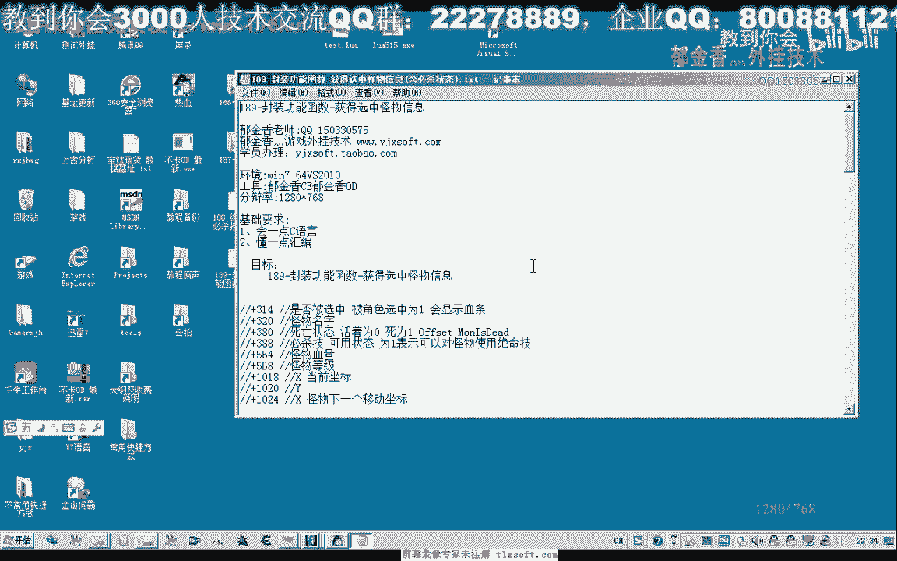

# 课程 P176：封装功能函数 - 获取选中怪物信息（含必杀状态） 🧙‍♂️

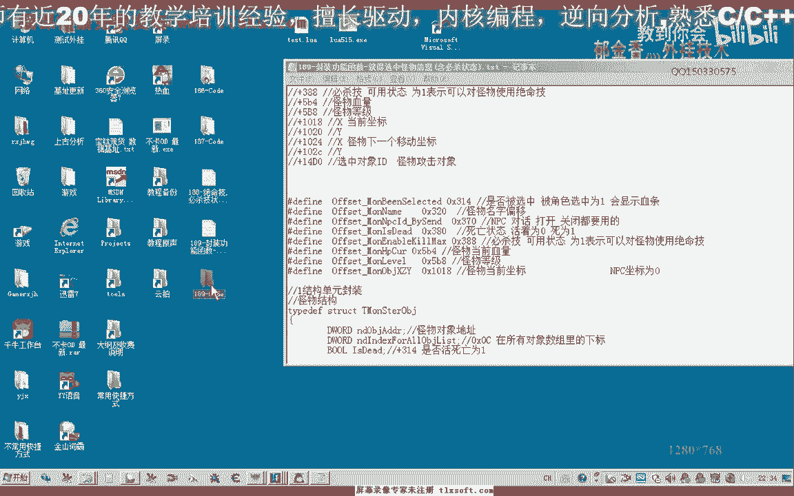

在本节课中，我们将学习如何封装一个功能函数，用于获取当前选中怪物的详细信息，包括其是否可以使用必杀技的状态。我们将对现有代码进行规范和整理，使用宏定义来管理偏移地址，并创建一个结构化的函数来安全地读取和返回怪物数据。

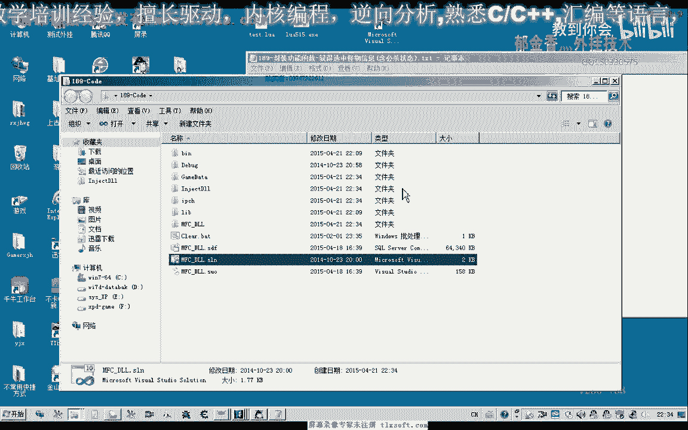

---

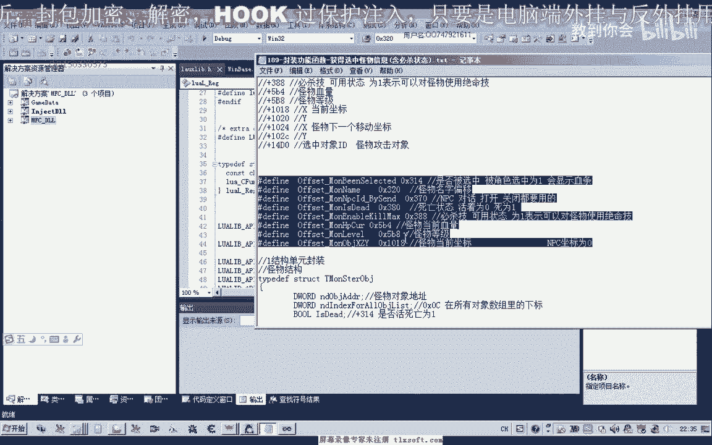

## 代码整理与宏定义

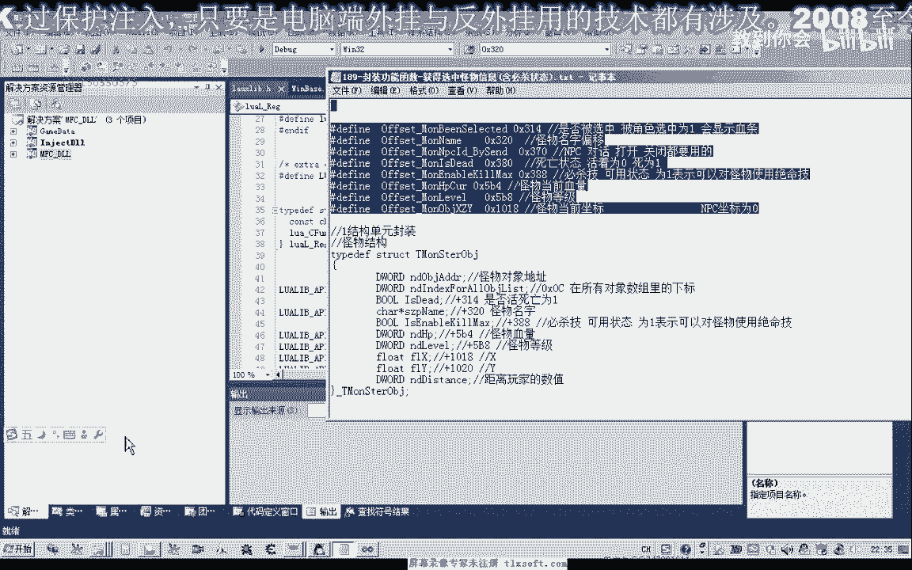

上一节我们介绍了怪物列表的基本结构。本节中，我们首先对代码进行整理，将硬编码的偏移地址替换为宏定义，以提高代码的可维护性。

我们将以下偏移量定义为宏，通常可以放在头文件或对应的 `.cpp` 文件顶部。

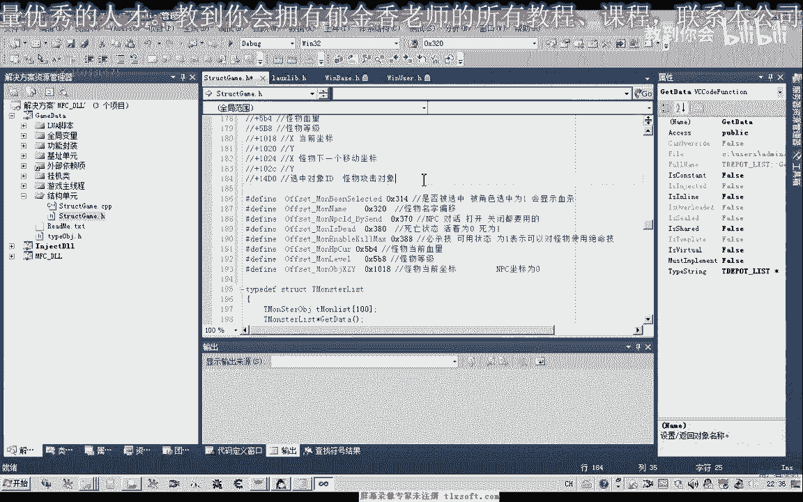

```cpp
#define OFFSET_MONSTER_ID 0x00
#define OFFSET_MONSTER_HP 0x04
#define OFFSET_MONSTER_MAX_HP 0x08
#define OFFSET_MONSTER_TYPE 0x0C
#define OFFSET_MONSTER_CAN_ULT 0x10 // 新增：必杀技状态偏移
#define MONSTER_LIST_SIZE 100 // 附近对象列表的大小
```

同时，我们更新怪物信息结构体，增加一个成员变量来存储必杀技可用状态。

```cpp
struct MonsterInfo {
    DWORD dwID;
    DWORD dwHP;
    DWORD dwMaxHP;
    DWORD dwType;
    BOOL bCanUseUltimate; // 新增：是否可以使用必杀技
};
```

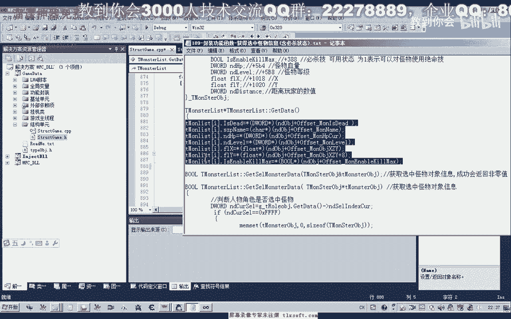

---

## 封装获取选中怪物信息的函数

接下来，我们将在怪物列表管理类中，添加一个成员函数 `GetSelectedMonsterInfo`。这个函数的目标是安全地获取玩家当前选中怪物的完整信息。

以下是实现该函数的核心步骤：

1.  **获取选中对象ID**：首先读取内存中存储的当前选中对象的ID。
2.  **有效性检查**：检查ID是否有效（例如，不等于 `0xFFFFFFFF` 表示未选中任何对象）。
3.  **遍历列表匹配**：遍历初始化好的附近怪物列表，寻找ID匹配的怪物对象。
4.  **类型验证**：找到对象后，读取其类型字段，确认它确实是怪物类型（例如，类型值为1）。
5.  **信息填充与返回**：如果验证通过，则将该对象的内存信息读取并填充到 `MonsterInfo` 结构体中返回。

我们在函数中加入了异常处理机制，以确保内存读取的安全性。

```cpp
BOOL CMonsterManager::GetSelectedMonsterInfo(MonsterInfo& outInfo) {
    // 1. 获取选中ID
    DWORD dwSelectedID = ReadMemory<DWORD>(g_dwBaseAddr + OFFSET_SELECTED_OBJ_ID);
    if (dwSelectedID == 0xFFFFFFFF) {
        return FALSE; // 未选中任何对象
    }

    // 2. 初始化输出结构
    memset(&outInfo, 0, sizeof(MonsterInfo));

    // 3. 遍历怪物列表进行匹配
    for (int i = 0; i < m_nMonsterCount; ++i) {
        if (m_MonsterList[i].dwID == dwSelectedID) {
            // 4. 验证对象类型是否为怪物
            DWORD dwType = ReadMemory<DWORD>((DWORD)m_MonsterList[i].pObject + OFFSET_MONSTER_TYPE);
            if (dwType != 1) { // 假设1代表怪物类型
                return FALSE;
            }

            // 5. 安全读取并填充信息
            __try {
                outInfo.dwID = m_MonsterList[i].dwID;
                outInfo.dwHP = ReadMemory<DWORD>((DWORD)m_MonsterList[i].pObject + OFFSET_MONSTER_HP);
                outInfo.dwMaxHP = ReadMemory<DWORD>((DWORD)m_MonsterList[i].pObject + OFFSET_MONSTER_MAX_HP);
                outInfo.dwType = dwType;
                outInfo.bCanUseUltimate = ReadMemory<BOOL>((DWORD)m_MonsterList[i].pObject + OFFSET_MONSTER_CAN_ULT);
                return TRUE; // 成功获取
            }
            __except(EXCEPTION_EXECUTE_HANDLER) {
                return FALSE; // 内存读取异常
            }
        }
    }
    return FALSE; // 列表中未找到该ID
}
```

---

## 主线程通信与接口封装

为了让脚本或其他模块能方便地调用这个功能，我们需要在主线程单元（通常是窗口过程）中封装一个接口。

首先，定义一个自定义消息和对应的消息处理函数。

```cpp
#define WM_GET_SELECTED_MONSTER (WM_USER + 101)
```

然后，在窗口过程 (`WndProc`) 中处理此消息，调用我们刚写好的 `GetSelectedMonsterInfo` 函数。

```cpp
LRESULT CALLBACK WndProc(HWND hWnd, UINT message, WPARAM wParam, LPARAM lParam) {
    switch (message) {
        case WM_GET_SELECTED_MONSTER: {
            MonsterInfo* pInfo = (MonsterInfo*)lParam;
            if (pInfo != nullptr) {
                // 调用功能单元的函数
                BOOL bSuccess = g_pMonsterMgr->GetSelectedMonsterInfo(*pInfo);
                // 可以通过返回值或设置结构体特定字段（如dwID是否为0）来传递成功状态
                return bSuccess ? 1 : 0;
            }
            break;
        }
        // ... 其他消息处理
    }
    return DefWindowProc(hWnd, message, wParam, lParam);
}
```

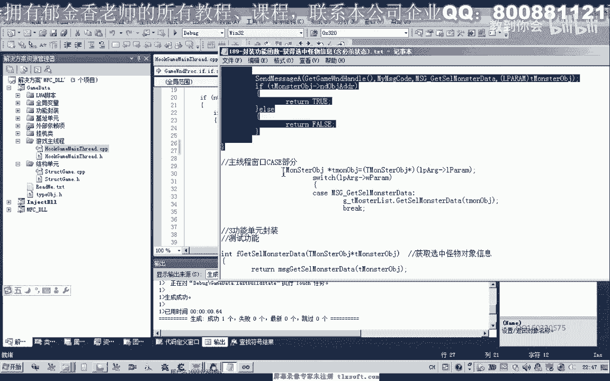

最后，在功能单元的公共接口头文件中，提供一个简单的内联函数或静态方法，供外部直接调用。

```cpp
// 在公共头文件中声明
inline BOOL GetSelectedMonster(MonsterInfo& info) {
    return SendMessage(g_hMainWnd, WM_GET_SELECTED_MONSTER, 0, (LPARAM)&info);
}
```

---

## 功能测试

函数封装完成后，我们编写简单的测试代码来验证其功能。

```cpp
void TestSelectedMonster() {
    MonsterInfo info = {0};
    if (GetSelectedMonster(info)) {
        printf("[成功] 选中怪物信息：\n");
        printf("  ID: %d\n", info.dwID);
        printf("  HP: %d/%d\n", info.dwHP, info.dwMaxHP);
        printf("  可释放必杀: %s\n", info.bCanUseUltimate ? "是" : "否");
    } else {
        printf("[提示] 未选中有效怪物。\n");
    }
}
```

运行测试，当选中一个怪物时，控制台会正确打印其信息；未选中或选中非怪物对象时，会给出相应提示。

---

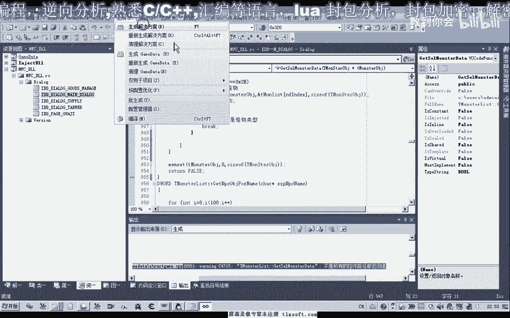

## 总结与作业

本节课中，我们一起学习了如何封装一个健壮的功能函数来获取选中怪物的信息。我们通过使用宏定义提高了代码可维护性，通过结构体组织数据，并通过异常处理和类型验证保证了函数的稳定性。最后，我们建立了主线程通信机制，并提供了简洁的调用接口。

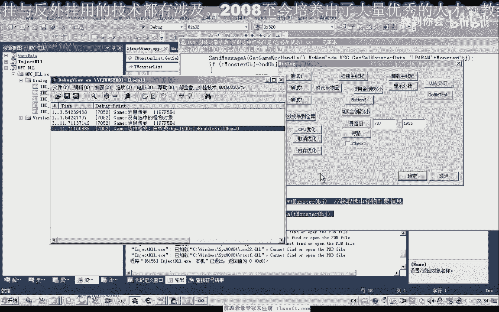

**课后作业**：基于本节课获取的怪物信息（特别是 `bCanUseUltimate` 字段），尝试编写一个函数，在满足条件时（例如怪物可被必杀、玩家能量足够等），自动向游戏发送指令，释放角色的必杀技。

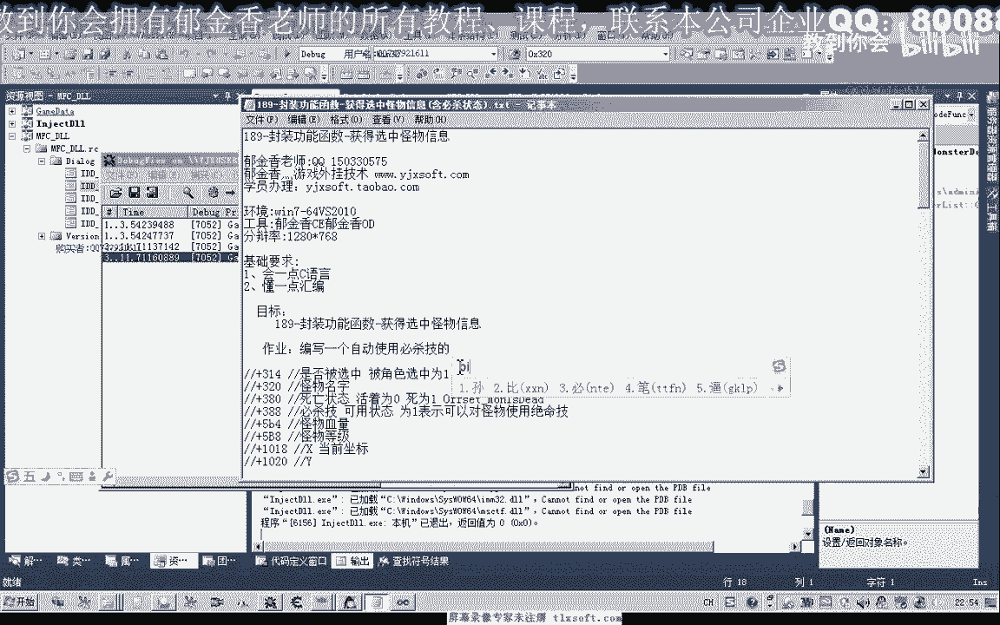

---
**下一节预告**：我们将利用本节课的成果，实现自动判断并施放必杀技的功能。