# P177：190-LUA接口封装-延时函数-等待函数 - 教到你会 - BV1DS4y1n7qF

大家好，我是俞其鑫老師，那麼在這一期。

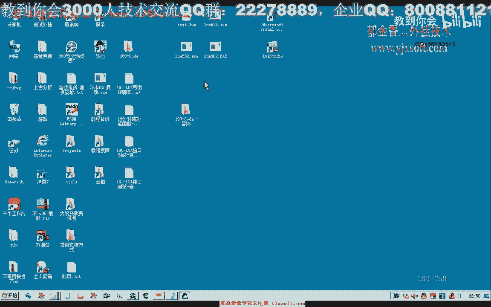

我們簡單的封裝一個Lua延時的一個接口，有時候我們要用到等待，類似於Sleep的功能，在我們的腳本裏面，那麼我們也需要一個等待的時間。

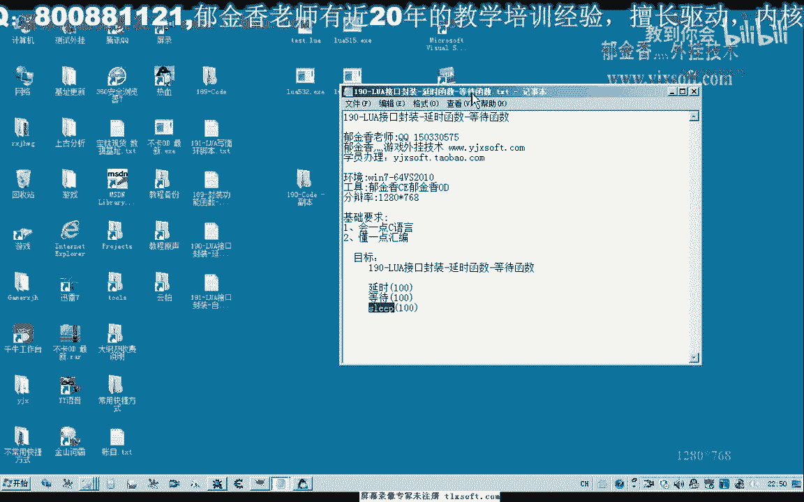

比如說是放技能，或者是其他的一些操作，那麼延遲等待的功能的話。

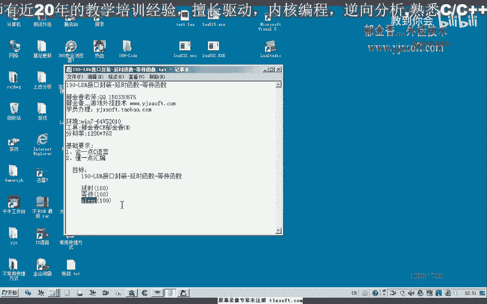

我們用的比較的多，首先我們打開189克的代碼，然後我們直接展開我們的腳本單元。

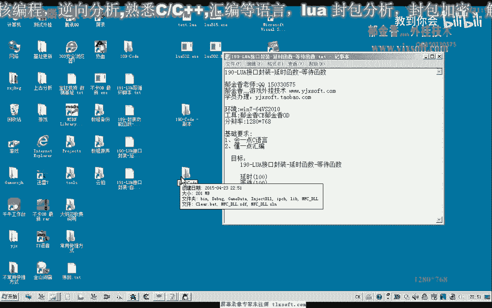

在這裏添加一個等待的函數，接著我們就開始做一個Lua的接口了，接著我們就開始做一個Lua的接口了，那麼首先我們對它的參數的個數來進行一個判斷，那麼如果沒有參數傳入的情況下，我們給它默認的等待100毫秒。

直接調用我們的Sleep函數，那麼如果是另外的情況的話，我們就接著執行後面的操作，接著我們就開始做一個Lua的接口了，那麼我們就開始做一個Lua的接口了，那麼如果是在後面我們有一個參數的情況下。

我們就取出參數的數字，那麼或者是直接調用Sleep，Lua推進，那麼這個接口寫好之後，我們把它註冊到相應的環境裏面，那麼在註冊的時候，我們可以寫成小寫的，全部我們小寫，或者是等待或者是延遲，都是可以的。

好的，那麼註冊好了之後，接下來我們進行一下測試，首先我們編寫一個相應的腳本。

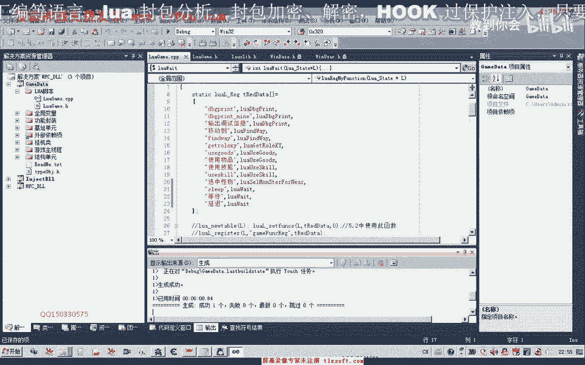

Test Lua，比如說我們編寫這樣的一個腳本，一個自動攻擊的這樣的一個循環的腳本，那麼在這裏我們需要等待一段時間，另外我們給它定一個全局的一個變量，用來計數，好，好的，那麼我們接下來測試一下。

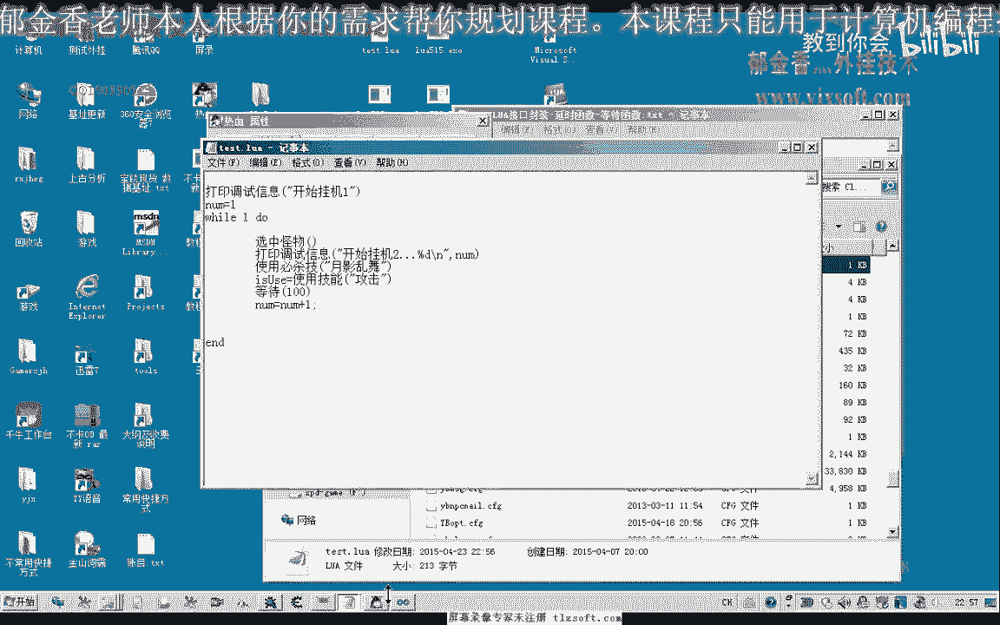

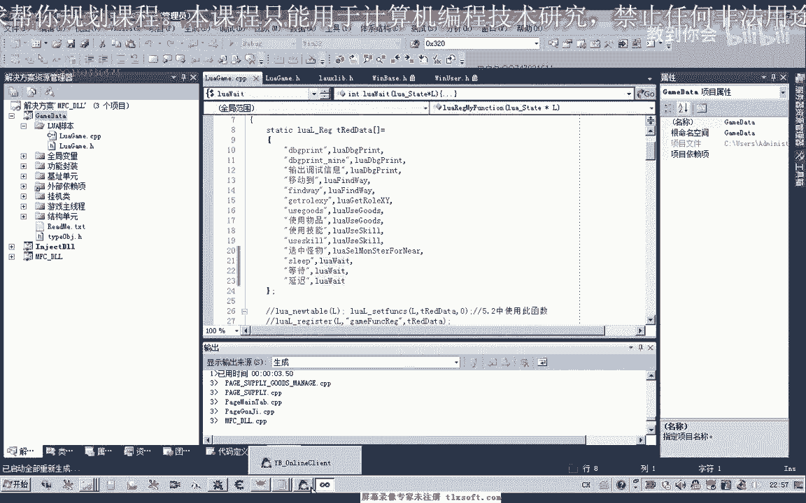

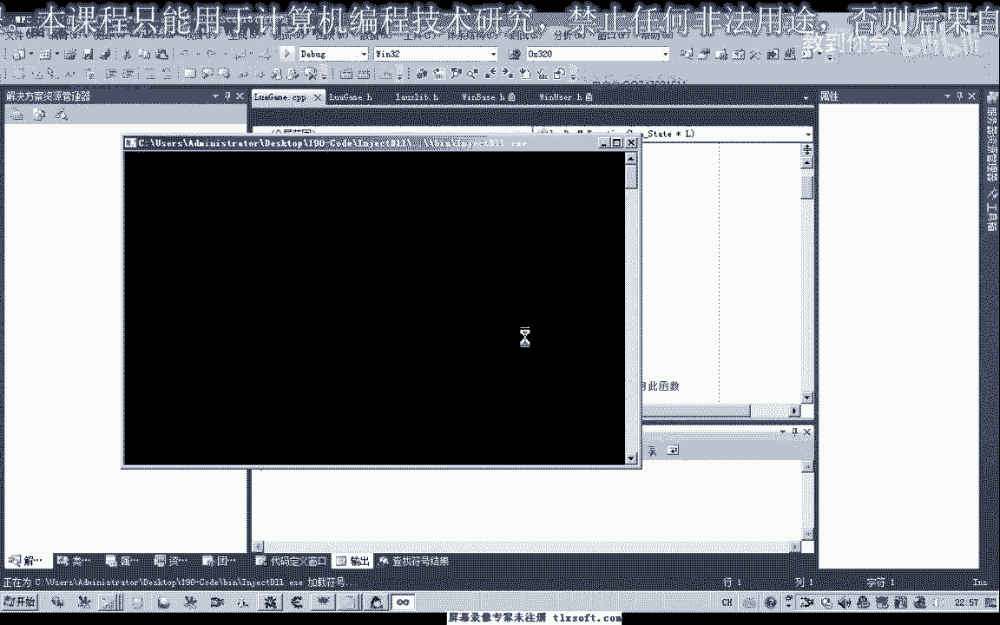

那麼在這裏了，我們首先掛接我們的主線程，那麼這個時候來顯示我們的機子來需要更新，那麼我們首先更新一下我們的機子。

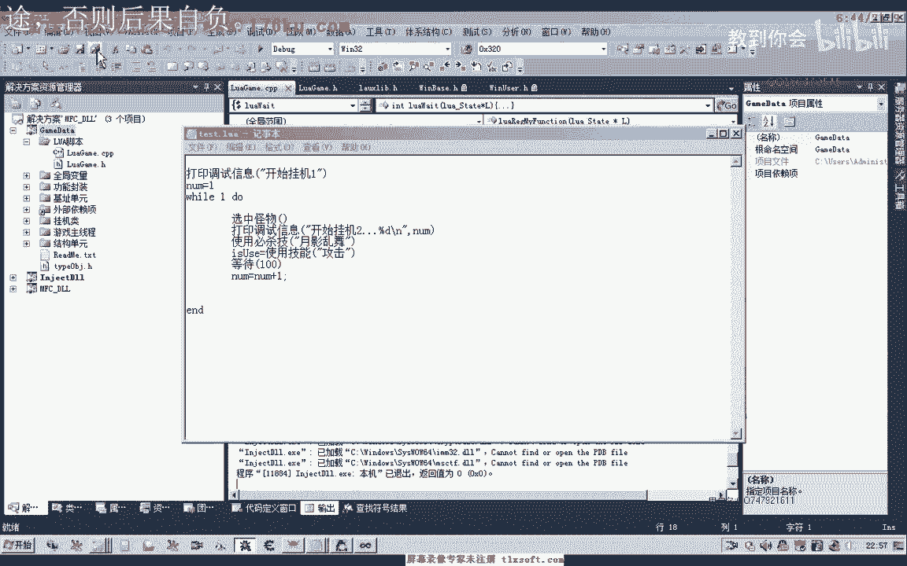

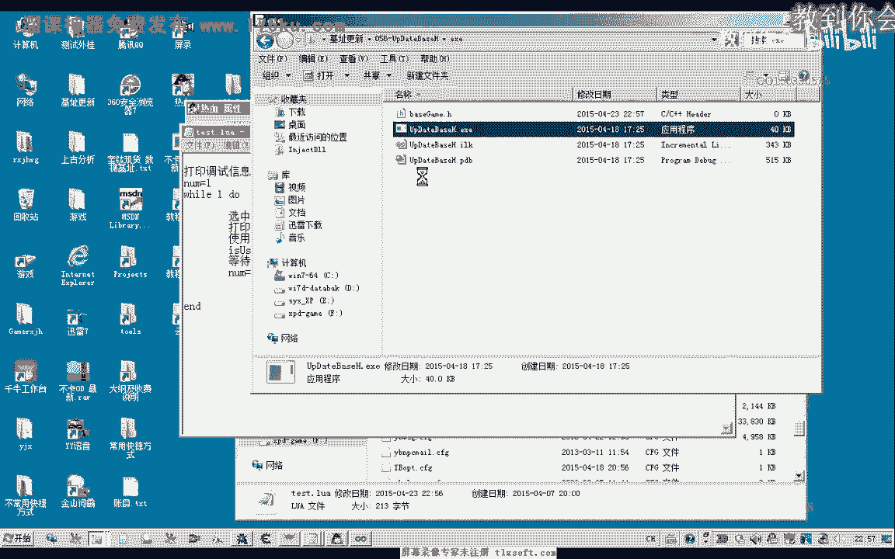

然後把相應的機子的生成的同文件複製過來，再重新編輯生成一下，那麼從這個時候來看的話，我們的腳本應當是沒有執行成功，我們再來看一下，打印調試信息，那麼我們這裏是輸出調試信息，這個相應的函數沒有註冊。

然後我們把腳本改一下，好，但是這個，(音量注意)，(音量注意)，(音量注意)，(音量注意)，(音量注意)，(音量注意)，(音量注意)，(音量注意)，(音量注意)，(音量注意)，(音量注意)。

(音量注意)，(音量注意)，這個動態面積庫，現在之後我們再重新編譯一下，好的，我們重新測試，這個時候它會執行到開始掛機二這個位置，我們看一下，說明這個地方它已經執行了，但是在後邊這一段的腳本，因為沒有。

所以說它不會被執行，那麼執行到這裡出錯了，我們寫的腳本出錯了，所以說它不會接著執行，那麼我們再重新執行一下，那麼這個時候它就會顯示，我們看一下，相應的數字，它會用每個一秒的時間重新的執行一次。

但是這個時候我們可以循環的輸出相應的信息，那麼在這裡我們可以看到每隔一秒鐘的時間，它會打印相應的調試信息出來，說明的我們的功能的話是完善的，但是這個時候執行的話，我們的相應的窗口。

它由於Sleep的一個阻塞，所以說它會停止，停止響應，那麼這個時候我們要解決這個問題的話，我們就需要把它放到一個單獨的線程裡面，來執行我們的腳本，那麼也就是說我們這一句代碼需要進行修改。

DoFile也就是執行腳本，我們需要放在一個獨立的線程裡面，那麼我們先把這一句注釋掉，在這裡我們給它創建一個線程，(音樂)，(音樂)，(音樂)，(音樂)，(音樂)，(音樂)，(音樂)，(音樂)。

(音樂)，(音樂)，(音樂)，在Define的話，我們就把它放到獨立的現場裏面來執行，當然這裏我們簡單的討論一下，在後面的這個過程裏面，我們再深入的來討論，怎麼控制這個現場，這幾個我們就先測試到這裏。

我們再次打開遊戲測試一下。

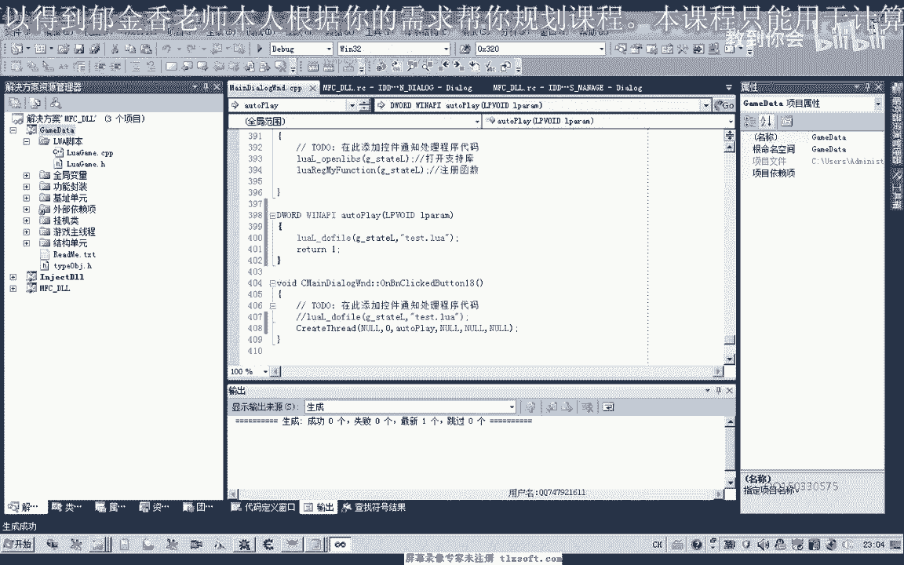

同時我們修改一下腳本，這裏剛才是0。1秒，這個時候我們改為2秒的時間，(音樂)。

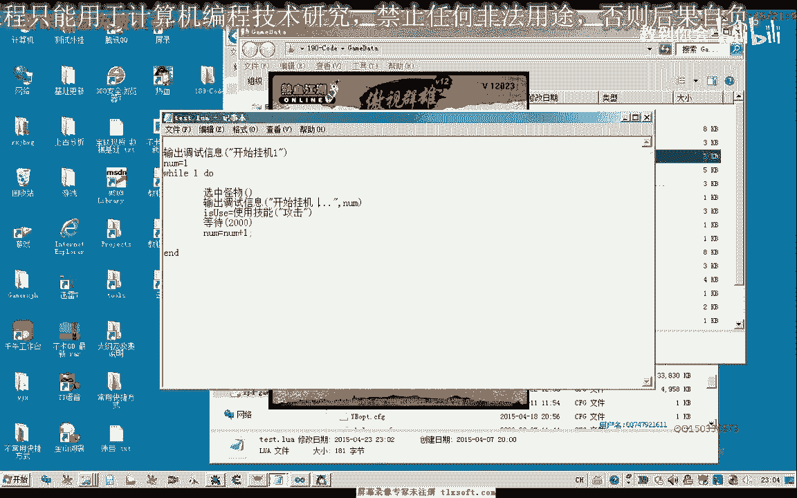

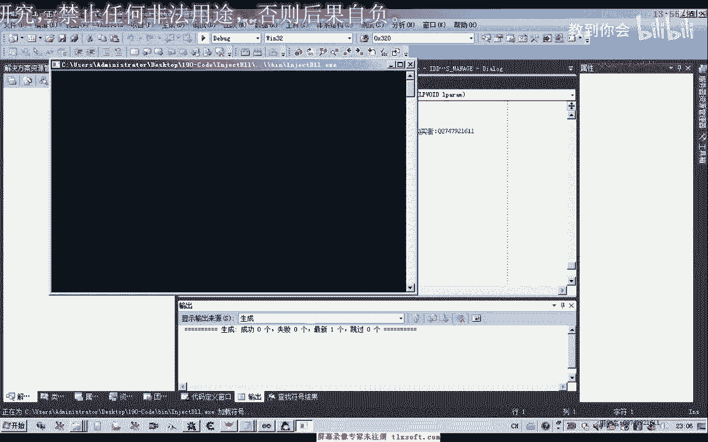

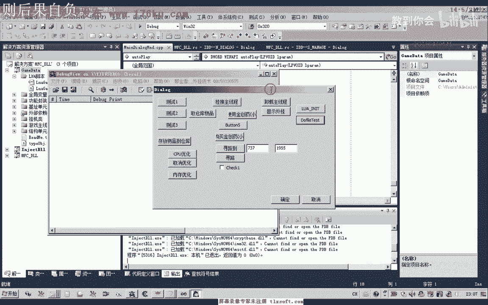

這時候我們就要來測試一下，我們先打開遊戲測試，我們先打開遊戲測試，我們先打開遊戲測試，我們先打開遊戲測試，我們先打開遊戲測試，我們先打開遊戲測試，我們先打開遊戲測試，我們先打開遊戲測試。

我們先打開遊戲測試，我們先打開遊戲測試，我們先打開遊戲測試，我們先打開遊戲測試，我們先打開遊戲測試，我們先打開遊戲測試，我們先打開遊戲測試，我們先打開遊戲測試，我們先打開遊戲測試。

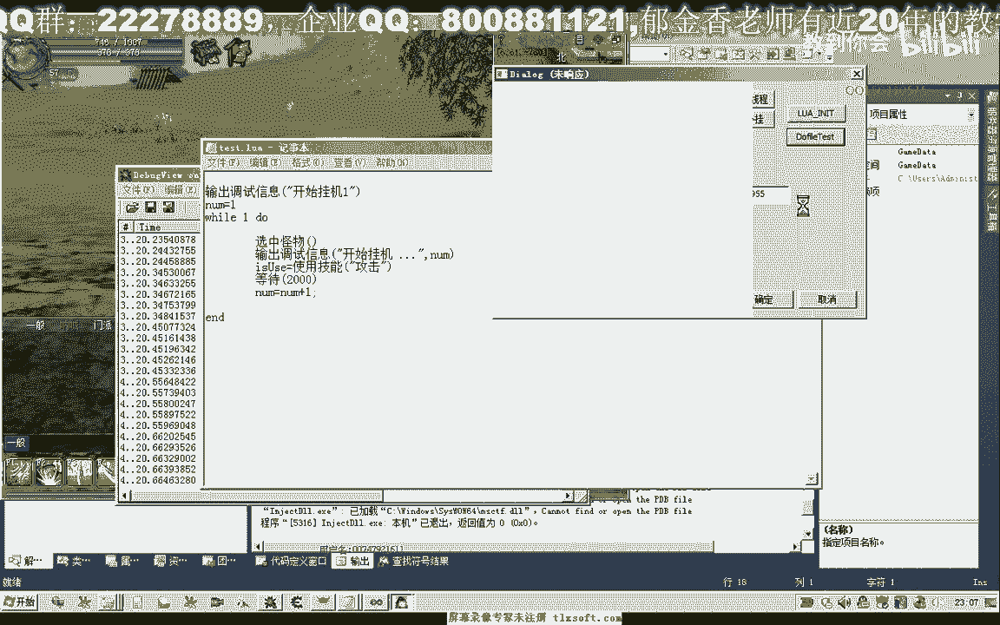

我們先打開遊戲測試，我們先打開遊戲測試，我們先打開遊戲測試，我們先打開遊戲測試，我們先打開遊戲測試，我們先打開遊戲測試，我們先打開遊戲測試，我們先打開遊戲測試，我們先打開遊戲測試，我們先打開遊戲測試。

我們先打開遊戲測試，我們先打開遊戲測試，我們先打開遊戲測試，我們先打開遊戲測試，我們先打開遊戲測試，我們先打開遊戲測試，我們先打開遊戲測試，我們先打開遊戲測試，我們先打開遊戲測試，我們先打開遊戲測試。

我們先打開遊戲測試，我們先打開遊戲測試，我們先打開遊戲測試，我們先打開遊戲測試，我們先打開遊戲測試，我們先打開遊戲測試，我們先打開遊戲測試，我們先打開遊戲測試，我們先打開遊戲測試，我們先打開遊戲測試。

我們先打開遊戲測試，我們先打開遊戲測試，我們先打開遊戲測試，我們先打開遊戲測試，我們先打開遊戲測試，我們先打開遊戲測試，我們先打開遊戲測試，我們先打開遊戲測試，我們先打開遊戲測試，我們先打開遊戲測試。

我們先打開遊戲測試，我們先打開遊戲測試，我們先打開遊戲測試，我們先打開遊戲測試，我們先打開遊戲測試，我們先打開遊戲測試，我們先打開遊戲測試，我們先打開遊戲測試，我們先打開遊戲測試，我們先打開遊戲測試。

我們先打開遊戲測試，我們先打開遊戲測試，我們先打開遊戲測試，我們先打開遊戲測試，我們先打開遊戲測試，我們先打開遊戲測試，我們先打開遊戲測試，我們先打開遊戲測試，我們先打開遊戲測試，我們先打開遊戲測試。

我們先打開遊戲測試，我們先打開遊戲測試，我們先打開遊戲測試，我們先打開遊戲測試，我們先打開遊戲測試，我們先打開遊戲測試，我們先打開遊戲測試，我們先打開遊戲測試，我們先打開遊戲測試，我們先打開遊戲測試。

我們先打開遊戲測試，我們先打開遊戲測試，我們先打開遊戲測試，我們先打開遊戲測試，我們先打開遊戲測試，我們先打開遊戲測試，我們先打開遊戲測試，我們先打開遊戲測試，我們先打開遊戲測試，我們先打開遊戲測試。

我們先打開遊戲測試，我們先打開遊戲測試，我們先打開遊戲測試，我們先打開遊戲測試，我們先打開遊戲測試，我們先打開遊戲測試，我們先打開遊戲測試，我們先打開遊戲測試，我們先打開遊戲測試，我們先打開遊戲測試。

我們先打開遊戲測試，我們先打開遊戲測試，我們先打開遊戲測試，我們先打開遊戲測試，我們先打開遊戲測試，我們先打開遊戲測試，我們先打開遊戲測試，我們先打開遊戲測試，我們先打開遊戲測試，我們先打開遊戲測試。

我們先打開遊戲測試，我們先打開遊戲測試，我們先打開遊戲測試，我們先打開遊戲測試，我們先打開遊戲測試，我們先打開遊戲測試，我們先打開遊戲測試，我們先打開遊戲測試，我們先打開遊戲測試，我們先打開遊戲測試。

我們先打開遊戲測試，我們先打開遊戲測試，我們先打開遊戲測試，我們先打開遊戲測試，我們先打開遊戲測試，我們先打開遊戲測試，我們先打開遊戲測試，我們先打開遊戲測試，我們先打開遊戲測試，我們先打開遊戲測試。

我們先打開遊戲測試，我們先打開遊戲測試，我們先打開遊戲測試，我們先打開遊戲測試，我們先打開遊戲測試，我們先打開遊戲測試，我們先打開遊戲測試，我們先打開遊戲測試，我們先打開遊戲測試，我們先打開遊戲測試。

我們先打開遊戲測試，我們先打開遊戲測試，我們先打開遊戲測試，我們先打開遊戲測試，我們先打開遊戲測試，我們先打開遊戲測試，我們先打開遊戲測試，我們先打開遊戲測試，我們先打開遊戲測試，我們先打開遊戲測試。

我們先打開遊戲測試，我們先打開遊戲測試，我們先打開遊戲測試，我們先打開遊戲測試，我們先打開遊戲測試，我們先打開遊戲測試，我們先打開遊戲測試，我們先打開遊戲測試，我們先打開遊戲測試，我們先打開遊戲測試。

我們先打開遊戲測試，我們先打開遊戲測試，我們先打開遊戲測試，我們先打開遊戲測試，我們先打開遊戲測試，我們先打開遊戲測試，我們先打開遊戲測試，我們先打開遊戲測試，我們先打開遊戲測試，我們先打開遊戲測試。

我們先打開遊戲測試，我們先打開遊戲測試，我們先打開遊戲測試，我們先打開遊戲測試，我們先打開遊戲測試，我們先打開遊戲測試，我們先打開遊戲測試，我們先打開遊戲測試，我們先打開遊戲測試，我們先打開遊戲測試。

我們先打開遊戲測試，我們先打開遊戲測試，我們先打開遊戲測試，我們先打開遊戲測試，我們先打開遊戲測試，我們先打開遊戲測試，我們先打開遊戲測試，我們先打開遊戲測試，我們先打開遊戲測試，我們先打開遊戲測試。

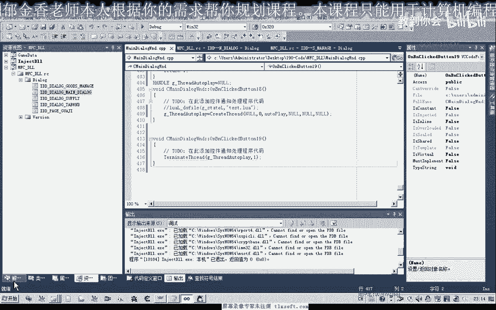

我們先打開遊戲測試，我們先打開遊戲測試，我們先打開遊戲測試，我們先打開遊戲測試，我們先打開遊戲測試，我們先打開遊戲測試，我們先打開遊戲測試，我們先打開遊戲測試，我們先打開遊戲測試，我們先打開遊戲測試。

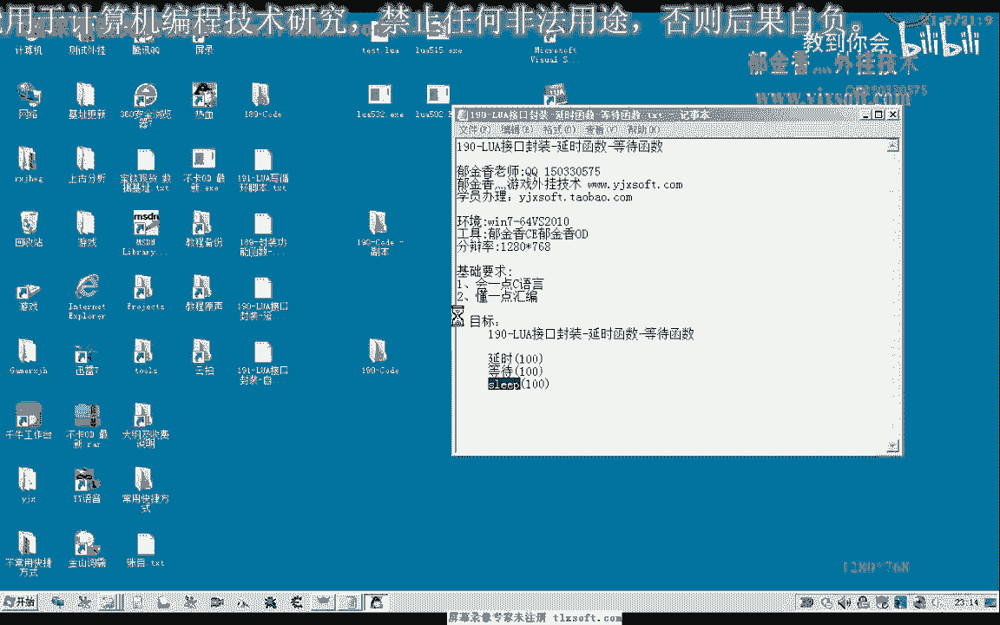

我們先打開遊戲測試，嗯，好，大已终于拿到了。