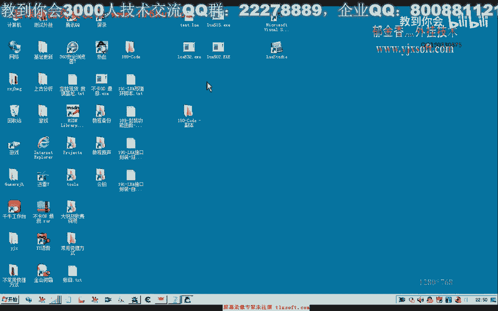
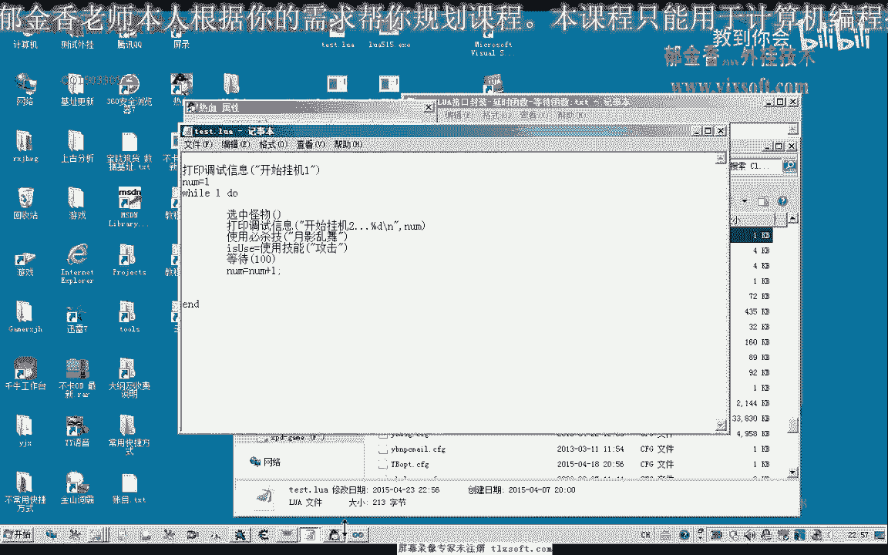
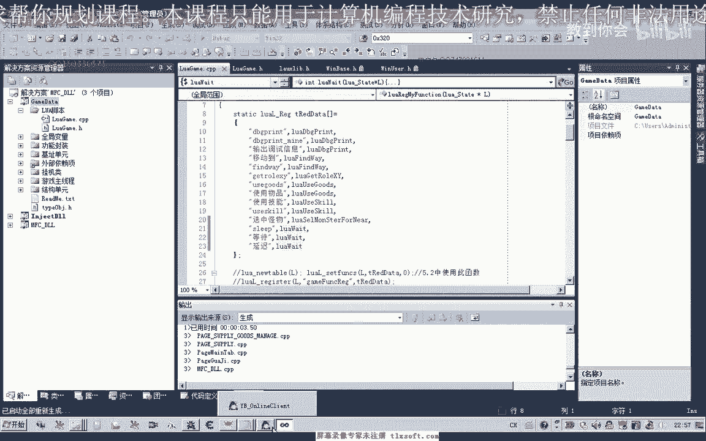
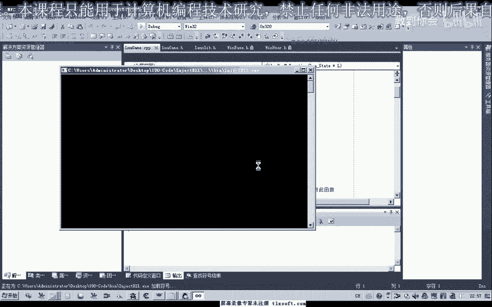
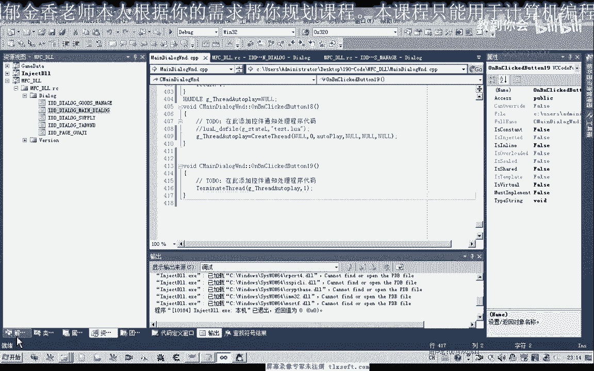
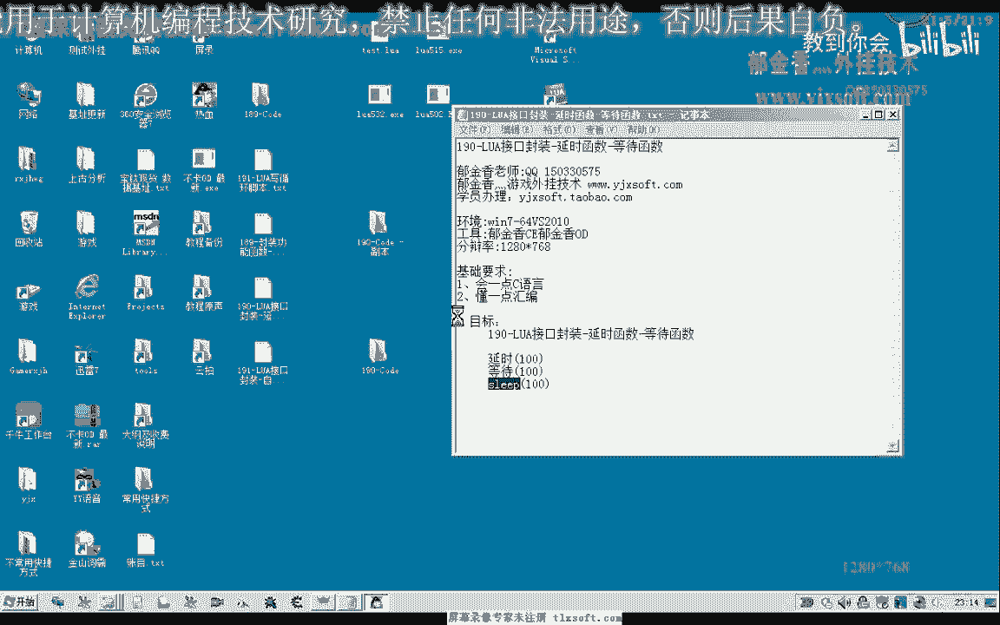

# 课程 P177：190-LUA接口封装-延时函数-等待函数 ⏱️


在本节课中，我们将学习如何为Lua脚本封装一个延时等待函数。这个功能类似于编程中常见的 `Sleep` 函数，在游戏脚本中用于控制技能释放间隔或其他操作的等待时间。我们将从现有代码开始，添加一个Lua接口，并进行测试与优化。


## 封装延时函数接口

上一节我们介绍了延时函数在脚本中的用途。本节中，我们来看看如何具体实现这个Lua接口。


首先，我们需要打开第189课的代码，并展开脚本单元部分。在这里，我们将添加一个等待函数。





以下是添加Lua接口的步骤：




1.  **判断参数个数**：首先对传入Lua函数的参数个数进行判断。如果没有参数传入，则默认等待100毫秒。这可以通过直接调用系统的 `Sleep` 函数实现。
2.  **处理带参数的情况**：如果函数调用时传入了一个参数，则取出该参数的数字值，并以此值作为等待的毫秒数调用 `Sleep` 函数。
3.  **注册接口**：接口编写完成后，需要将其注册到Lua环境中。注册时，函数名可以设置为小写的 `sleep`、`等待` 或 `延迟`。


核心的接口逻辑可以用以下伪代码描述：
```lua
-- Lua 侧调用示例
sleep(500) -- 等待500毫秒
sleep()    -- 默认等待100毫秒
```

## 编写测试脚本

接口封装完成后，我们需要编写一个测试脚本来验证其功能。

我们创建一个名为 `Test.lua` 的脚本文件。这个脚本模拟一个自动攻击的循环，在每次“攻击”后等待一段时间。同时，我们定义一个全局变量用于计数。

以下是测试脚本的内容示例：
```lua
count = 0
while true do
    print(“开始攻击循环，计数：” .. count)
    -- 执行攻击操作...
    sleep(1000) -- 等待1000毫秒，即1秒
    count = count + 1
end
```


## 测试与问题发现


现在，我们挂接主线程并运行脚本来进行测试。初始测试时，可能会发现脚本没有成功执行。

通过打印调试信息，我们发现问题在于新注册的延时函数接口没有被正确识别。这通常是因为动态链接库更新后，需要重新编译生成相关的头文件，并确保脚本引擎加载了最新的模块。


解决函数注册问题后，再次测试。脚本成功执行到了循环部分，并能够每隔一秒打印一次调试信息，这证明我们的延时函数基本功能是完善的。

## 解决阻塞问题与优化

然而，在测试中我们发现了一个新问题：当 `Sleep` 函数在主线程中被调用时，会导致整个程序窗口停止响应。

这是因为 `Sleep` 会阻塞当前线程。为了解决这个问题，我们需要将执行Lua脚本的逻辑放到一个独立的线程中运行，这样主线程就不会被阻塞。

因此，我们需要修改执行脚本的代码，将 `DoFile`（执行脚本文件）的操作放入一个新创建的线程中。这样，即使脚本中的 `sleep` 函数造成了阻塞，也只会影响这个独立的脚本线程，而不会冻结程序主界面。

关于线程的创建和控制，我们将在后续课程中深入讨论。本节课我们主要完成将脚本执行移至独立线程的初步修改。

## 最终测试

最后，我们再次修改测试脚本，将等待时间改为2秒，并在独立线程的环境下进行最终测试。

打开游戏并加载脚本后，可以观察到脚本按预期每隔2秒输出一次信息，并且游戏主窗口操作流畅，不再出现卡顿或无响应的现象。这表明我们的延时函数接口以及多线程执行方案是成功的。

## 课程总结

本节课中，我们一起学习了如何为Lua脚本环境封装一个延时等待函数。



我们首先在C++侧实现了这个接口，处理了默认参数和指定参数两种情况。然后，我们编写了Lua测试脚本，并发现了直接在主线程调用 `Sleep` 会导致界面阻塞的问题。最后，我们通过将脚本执行逻辑移至独立线程，解决了阻塞问题，确保了程序的响应性。



通过本课，你掌握了为脚本引擎添加基础功能接口、进行功能测试以及利用多线程优化脚本执行体验的基本方法。