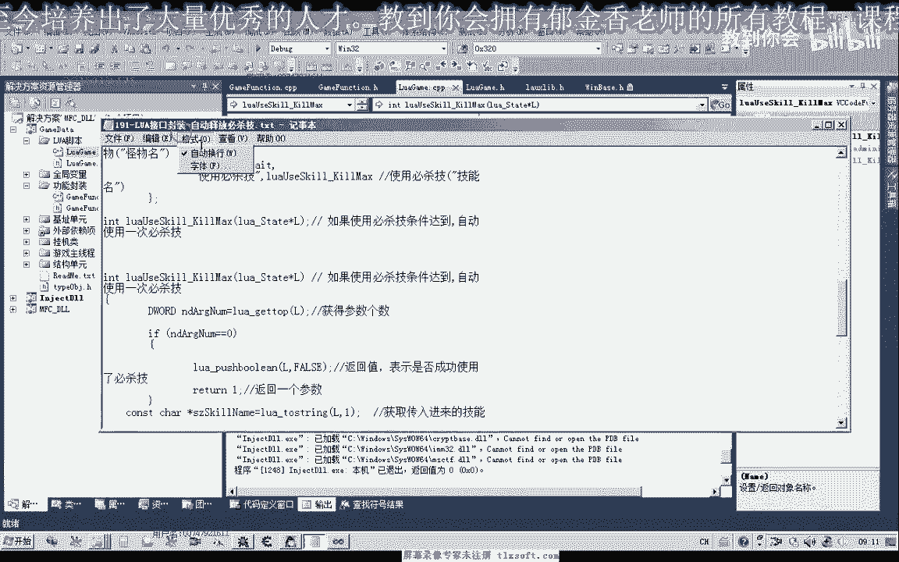
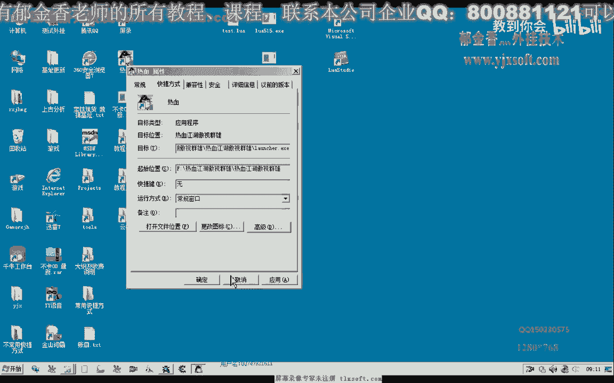
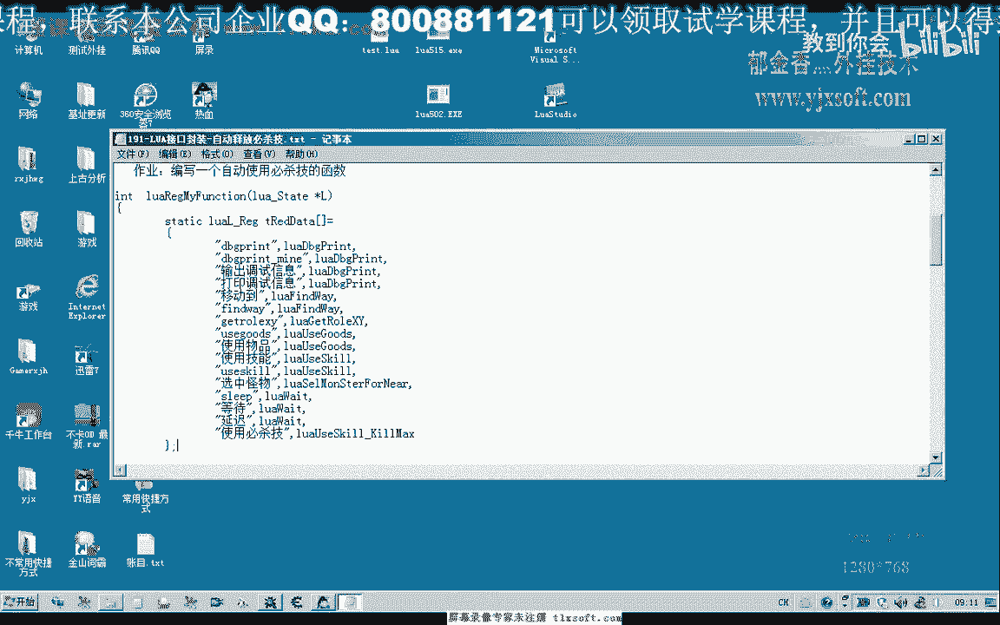

# 课程 P178：LUA接口封装 - 自动释放必杀技 🔧


在本节课中，我们将学习如何封装一个Lua接口，用于在游戏中自动判断并释放怪物的必杀技。我们将基于上一节课的代码，将核心逻辑封装成简洁的Lua函数，并进行测试。

---

## 准备工作 🛠️

上一节我们编写了一个自动释放必杀技的函数。本节中，我们主要进行接口封装和测试。

首先，打开第190课的代码，并展开脚本单元。我们需要在同文件中添加脚本接口，并在对应的C++文件中实现相应代码。

在此之前，我们还需要准备一个核心的功能函数。

## 封装核心功能函数 ⚙️

这个函数的核心逻辑是：先获取当前选中怪物的必杀技状态，如果状态可用，则使用必杀技并返回相应的数值。

以下是该功能函数的逻辑描述：

1.  获取当前选中怪物的信息。
2.  判断该怪物是否可以使用必杀技。
3.  如果可以使用，则调用相应的技能，传入必杀技的名字。
4.  如果使用成功，则返回 `true`。

用伪代码表示如下：
```lua
function UseSkillIfAvailable(monster, skillName)
    if monster:canUseSkill(skillName) then
        monster:useSkill(skillName)
        return true
    else
        return false
    end
end
```

封装好这个函数后，我们接着来看Lua接口函数的封装。

## 封装Lua接口函数 📦

在Lua脚本中，我们希望以 `UseSkill(“技能名”)` 的形式调用这个功能。


以下是接口函数的封装步骤：

1.  函数被调用时，首先获取传入参数的个数。
2.  如果没有传递参数进来，则直接返回 `false`。
3.  如果参数正确，则取得必杀技的名字。
4.  调用上面封装好的“使用必杀技”功能函数。
5.  如果使用不成功（例如没有选中怪物，或怪物不满足使用条件），则返回 `false`。
6.  另一种情况就是使用成功，返回 `true`。

函数写好后，需要在前面进行注册，然后编译生成。这样，理论上我们就能够通过Lua脚本自动进行判断和释放了。


**关于设计思路的讨论**：大部分功能逻辑在C++中实现。另一种方式是将条件判断的数据暴露给Lua接口，在脚本里判断后再调用技能库。但对于给一般用户使用的脚本，建议设计得简单一些，将逻辑部分放在C++中实现可能更好。当然，我们目前主要是为了探讨和学习Lua的功能。


## 脚本测试与调试 🧪

接口注册好后，我们接下来进行测试。我们在上一节课的脚本基础上进行修改，增加使用必杀技的功能。


修改思路如下：选中怪物后，首先判断是否需要使用必杀技。我们还可以定义一个变量来记录是否成功使用了必杀技。

以下是测试脚本的核心循环示例：
```lua
while true do
    -- 选中怪物...
    local success = UseSkill("烈焰风暴") -- 调用封装好的接口
    if success then
        print("成功释放必杀技！")
    end
    Sleep(1000) -- 等待1秒
end
```

**注意**：这个循环有一个弱点，即目前无法控制它何时结束。这个问题留作思考，大家可以在课后想一想解决方案。

我们进行了实际测试。测试过程中，当周围有怪物且其必杀技状态就绪时，脚本成功地自动使用了必杀技。通过调试信息可以看到，每次都会进入 `UseSkill` 核心函数，并在条件满足时释放技能。

同时，我们也发现脚本的循环退出机制设计得不够好。这引出了下一个问题：如何从C++端控制Lua脚本中循环的退出？或者说，如何给循环一个条件，让它知道需要退出线程？

这将是下一节课我们将要讨论的内容。

---

## 本节总结 📝



本节课中，我们一起学习了如何为自动释放必杀技的功能封装一个Lua接口。主要内容包括：



1.  准备并封装了一个核心的C++功能函数，用于判断并释放技能。
2.  将该功能封装成可供Lua脚本调用的接口函数 `UseSkill`。
3.  讨论了脚本逻辑放在C++端与Lua端的优缺点。
4.  编写并测试了调用该接口的Lua脚本，实现了自动释放必杀技。
5.  发现了当前脚本循环无法优雅退出的问题，为下一课的内容做了铺垫。



通过本课，你将掌握如何将游戏功能封装成简洁的Lua接口，使脚本编写更简单、直观。