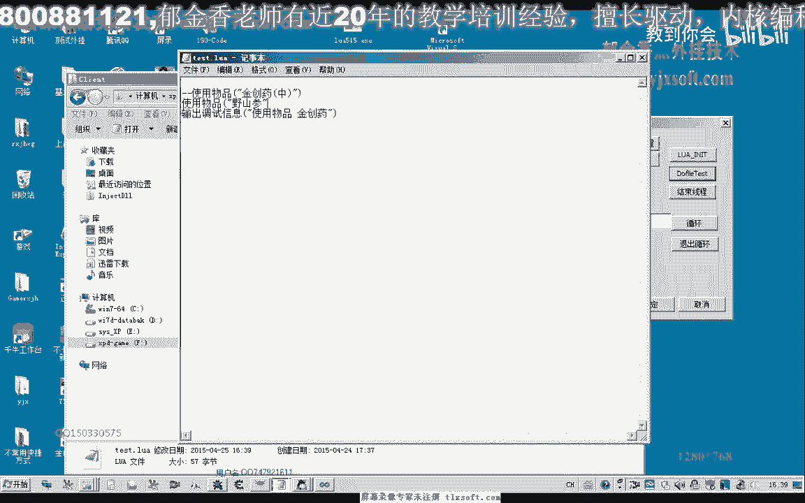

# 课程 P179：封装LUA使用物品的接口 🧪


在本节课中，我们将学习如何为Lua脚本封装一个调用游戏内“使用物品”功能的接口。我们将基于已有的功能函数，编写一个Lua可调用的接口，并进行测试。


---

上一节我们介绍了功能封装的基础，本节中我们来看看如何将“使用物品”这个功能暴露给Lua脚本使用。

首先，我们需要打开第192课的代码文件。

然后，展开我们的Lua脚本单元。我们将在这里添加相应的接口。由于“使用物品”的功能函数已在功能封装单元中实现，我们只需在此添加一个桥接接口即可。

以下是添加接口的具体步骤：


1.  **判断参数**：首先判断传入Lua接口的参数数量。如果参数数量小于1，即没有传递任何参数，则直接退出。
2.  **获取并转换参数**：如果有参数传入，我们获取第一个参数。可以对其进行类型判断，但为简化，我们直接将其转换为字符串（`AnsiString`）。
3.  **调用功能函数**：使用转换后的字符串参数，调用我们之前封装好的“使用物品”功能函数。
4.  **返回结果**：如果调用成功，则返回一个真值（`True`）。对于无参数的情况，可以返回一个假值（`False`）。
5.  **注册接口**：最后，我们需要在 `RegisterFunction` 区域添加对这个新接口的注册，这样Lua脚本才能识别和调用它。


接口代码的核心逻辑如下：
```pascal
function Lua_UseItem(L: Plua_State): Integer; cdecl;
var
  ArgCount: Integer;
  ItemName: AnsiString;
begin
  Result := 0;
  ArgCount := lua_gettop(L);
  if ArgCount < 1 then Exit;

  ItemName := lua_tostring(L, 1);
  if UseGameItem(ItemName) then
    lua_pushboolean(L, True)
  else
    lua_pushboolean(L, False);
  Result := 1;
end;
```
完成接口编写后，我们需要将其注册到Lua引擎中。

---



上一节我们编写并注册了接口，本节中我们来进行测试，验证接口是否正常工作。

首先，转到游戏主程序所在的单元。


找到游戏脚本文件（例如 `mod.txt`）的路径，并修改其内容。我们在脚本中调用新封装的接口。

以下是测试脚本示例：
```lua
-- 使用物品“金疮药”
UseItem("金疮药")
```
然后，我们跨线程初始化并执行这个Lua文件。此时可以观察到，游戏角色成功使用了“金疮药”这个物品。

我们可以将脚本中的物品名改为“野山参”再次测试：
```lua
-- 使用物品“野山参”
UseItem("野山参")
```
每执行一次脚本，角色就会使用一次对应的物品。这个过程非常简单，因为核心功能已经封装好，接口只需负责参数转换和函数调用。

---

然而，在实际编写自动化脚本时，我们通常不会无条件地使用物品。我们需要为物品使用添加条件判断，例如：
*   当生命值（HP）低于某个数值或百分比时，才使用“金疮药”。
*   当法力值（MP）低于某个数值或百分比时，才使用“野山参”。

这就要求我们的Lua脚本能够获取到角色当前的HP、MP等状态数据。

目前，我们有两种思路来实现这种条件判断：
1.  **将角色状态数据暴露给Lua**：这是更灵活、更专业的方法。我们需要额外封装接口，让Lua脚本能直接读取HP、MP等数值，从而在脚本内部进行复杂的逻辑判断。
2.  **将条件判断集成在功能函数内部**：这种方法灵活性较低，例如在 `UseGameItem` 函数内部硬编码判断逻辑，但实现起来相对简单。


为了让脚本具备更高的灵活性，我们倾向于采用第一种方法。在下一节课中，我们将一起探讨如何将人物角色的各项状态数据封装并暴露给Lua脚本使用。

---

本节课中我们一起学习了如何为“使用物品”功能封装Lua接口。我们完成了从判断参数、调用功能函数到注册接口的完整流程，并成功进行了测试。同时，我们也指出了当前接口的局限性，即缺乏对游戏角色状态的感知能力，为下一节课的内容做好了铺垫。