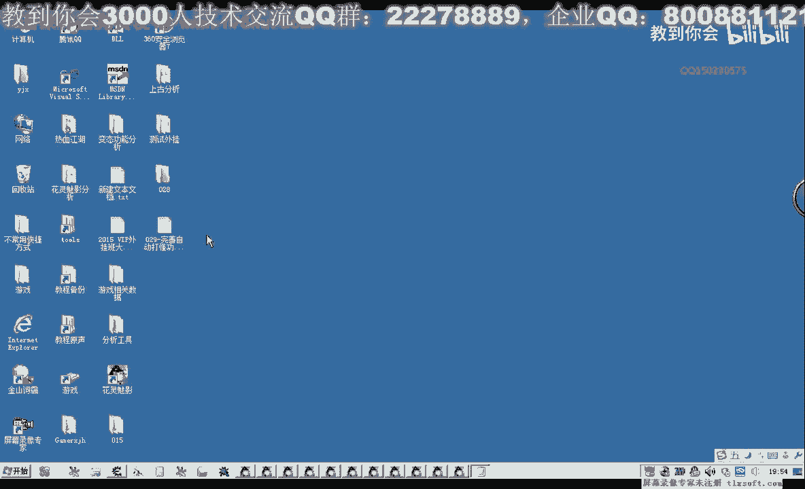
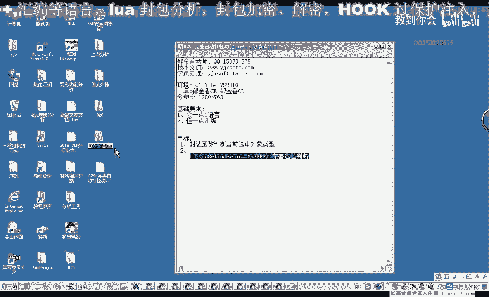
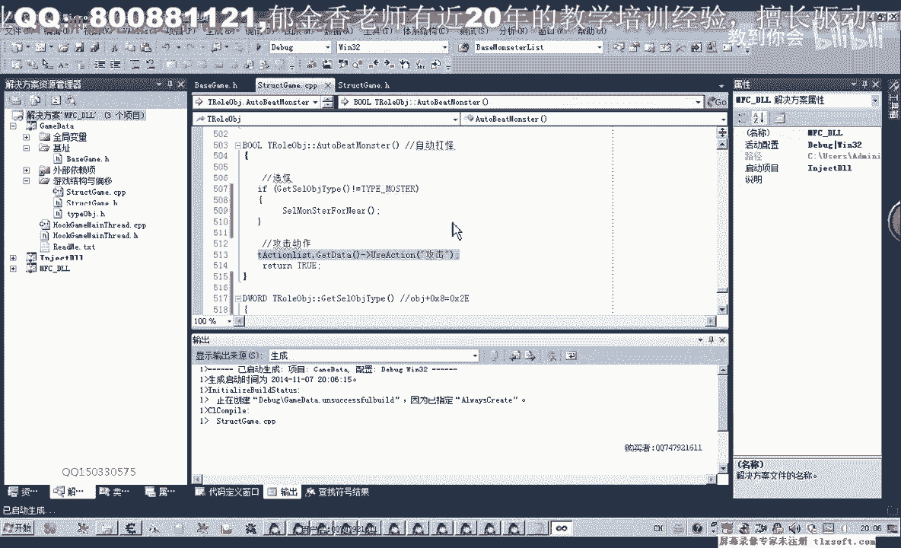
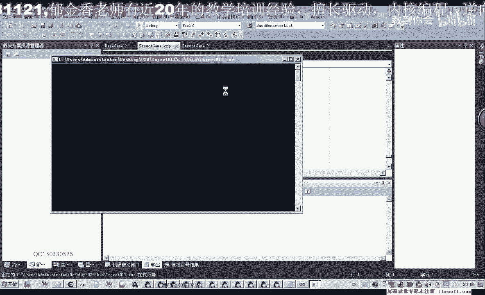
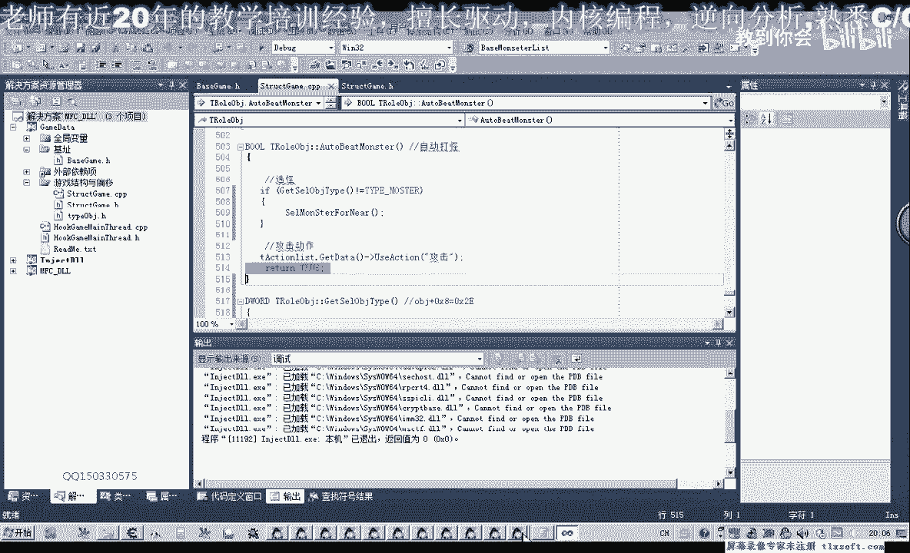
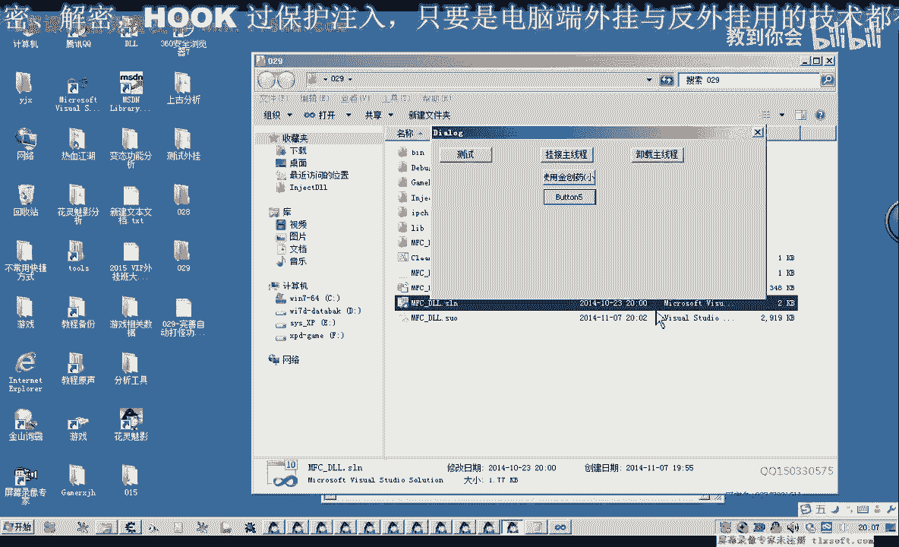
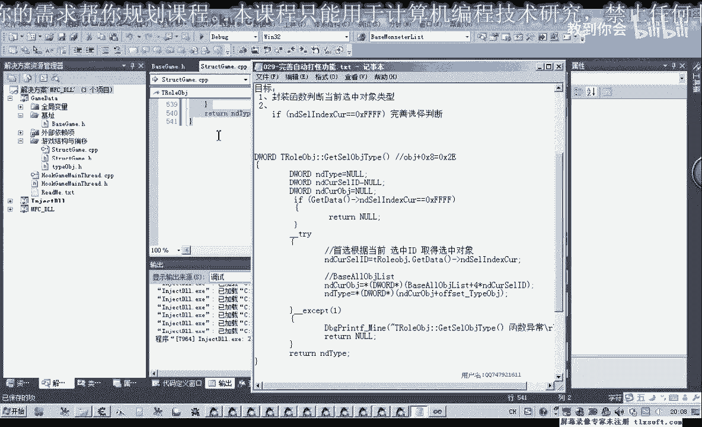

# P18：029-完善自动打怪功能 - 教到你会 - BV1DS4y1n7qF

大家好，我是郁金香老师，那么在上节课我们选会的时候，一个判断的如果只加一个当前的这个选中的id，是不是等于这个max f f呢，那么它的判断呢并不是很准确，那么如果我们选中的是玩家。

或者选中的是我们自己，那么这个id的话，那判断它就不会这么准确了，所以说我们还需要加上一个判断，其实我们要需要判断的是当前选中啊的这个对象，它的一个类型究竟是不是怪物了这个类型。

那么这样结合起来判断的话，才能够完善这个选外的一个功能，那么我们把第28块的代码打开。

啊，那这个时候呢我们再打开游戏的结构啊，我们再来一个玩家这个对象，角色对象里面呢，我们再添加一个函数，用来获取当前的返回类型，那么需要这样一个函数，那么这个函数呢实际上它就是用来帮助我们的对象地址。

加上max 8这个地方它的一个类型，那么如果是怪物的话，它最终的法国在我们就是里面开始日益这个好的，那么大概的原理我们知道了，我们看一下该怎么添加我们的代码，写到最后。

那我们先定一个变量用来获取这个法复制，那么最后呢我们放这个微型，那么这个类型的话我们需要有一个步骤，这个我们也需要读一些路程地址的一个操作，那么我们加上一个异常的一个处理，哈哈哈哈。

那么在这里呢我们需要几个步骤，那么首先呢，我们根据当前选中的it其他整顿的对象，那么这个我们需要用到呃，用到一个相应的一个机制，这个这个所有对象数据，那么我们首先我们第一，这样我们就取出当前的id。

当前选中这个，那么我们要先去，那么当前选中了这个id的话，等于在整部的角色啊啊初始化，初始化取出我们当前选中的，然后取出来之后呢，我们再用来获得我们当前选中的对象，那么当前选中对象我们都知道有一个公式。

那么在这里呢我们在第一个片面，如果去掉当前的对象的时候，就指定，那么它加上四乘以我们当前的这个i p，数组的下标也就40，那么取出了这个对象之后呢，我们呃还要取他的一个类型，那就太多，这不。

再加上max 8这个位置，然后我们取出这个地方呢，就是取出了相应的还有一个类型，然后呢我们看就可以了，如果出现了异常的话，当然了，这里就发挥啊，回答的是五零，那么有了这个判断的话。

我们上一节课的那一个选中啊，怪不得这个扩自动打怪了啊，就相对就完善了，那我们接下来进行一下测试，那么这个加八这个的偏移以后，我们用的地方比较多啊，为了防止这个游戏更新之后这个偏移发生变化呢。

我们把它把它放入，放到这个加八，这个我们用一个门外表示，我喜欢这，那么我们专门可以定义一个偏移的一个单元来存放这个红，我之前呢我们的这个偏移呢都是集中放在这个相应的初始化函数里。

那么我们也可以想一下思考一下这个呃这个标志我们放在哪啊，这个地方好一些，那么我们暂时的放在这个结构的条件里，暂时放在这里，好，的再编译一下，那么现在我们就更改我们自动打怪的这个地方。

那么这里呢我们就要做一个其他的一个判断，那么在这里呢我们就把这个选中类型的这个判断呢，是否就是说是否没有选中呃，没有选中对象的这个判断呢，我们加杠刚才的那个函数里面，哈哈哈，那么在这个地方。

我们在这还有一些代码，这个上一节课我们这里应该有一个相应的一个bug，应该是get到的答复，这是这个选中的这个，当前群众的id，然后再做一个相应的一个判断，那么如果它是等于这个的话。

我们就直接返回的类型的话，这个时间是一个空啊，这直接因为他这个时候是未选中对象，那么所以说我们把给空把封就行了，那么在这里的话，我们直接怎么判断呢，就直接判断，就调用我们下面的这个函数，gcc态度。

那么直接调用这个函数，我们要进行一个判断，判断呢它是否等于它of master，也就是说是否等于怪物啊，那么如果我们等于这个怪物的话，等于怪物的话，我们就继续啊，实行这个工期就可以了。

就直接使用功能就可以，那么如果不等于怪物来，我们就不等于一的时候呢，我们才进行一个选块的一个操作就可以，那么不是选中了怪物的话，那么我们就进行旋转，然后进行攻击，那么如果他选中的本身就是怪物。

那么这一句呢就不会执行，那么就继续攻击当前的这个怪物，这样就可以了，这样变异形。

好的，那么我们输入到游戏里面进行一下测试。

挂进我们的主线层，然后把游戏调出来看一下，这个时候我们是选中的是自己，那么如果我们上不做今天的一个修改的话，那么他判断的时候呢，它始终就是攻击自己了，就没有效果，那么这个时候我们再点击一下。

我在出现成功，而可能是刚才编译没有成功，那么我们选中自己的时候，他同样的呃没有更改啊。

没有去选择这个怪物，那我们再来看一下我们的逻辑啊，那么首先这一句可能他就没有不执行，再重新再编译一次，好那我们再来测试一下，同样的我们是选中的是自己啊，挂机到主线程啊，这个时候就可以了。

刚才我们编译代码的时候呢，呃没有编译成功，应该是代码没有更新，那么这个时候我们可以添加到定时器或者是线程里面，就可以自动打快了，就可以自动打怪，好的，那么这节课呢我们就讲到这里，那么我们下一节课再见。

