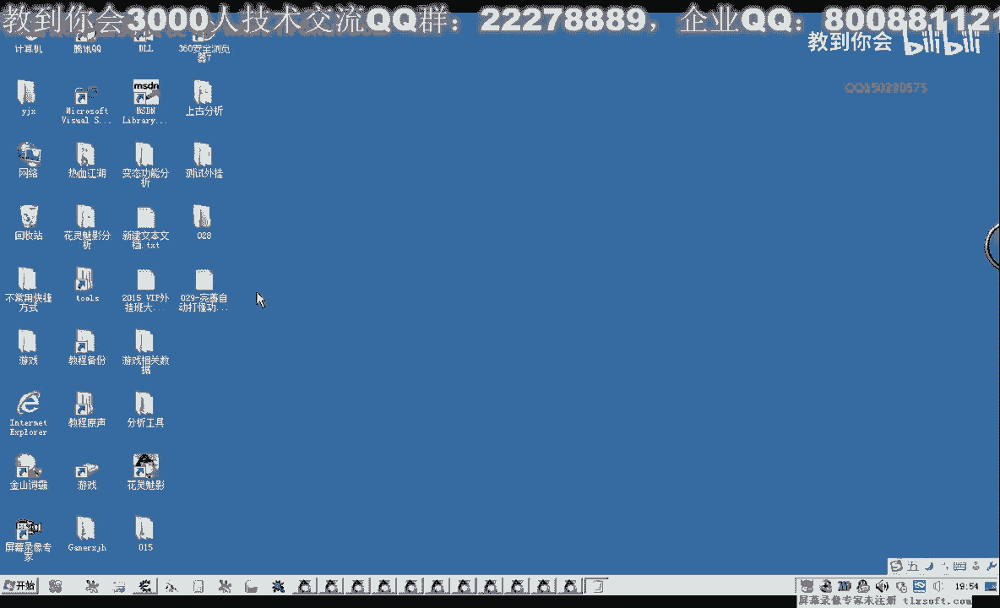
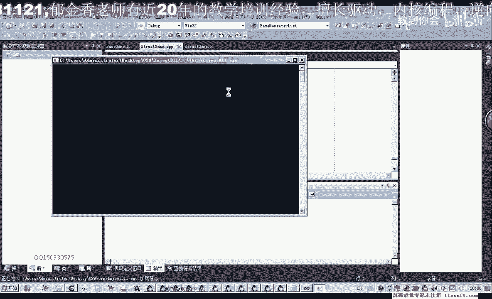
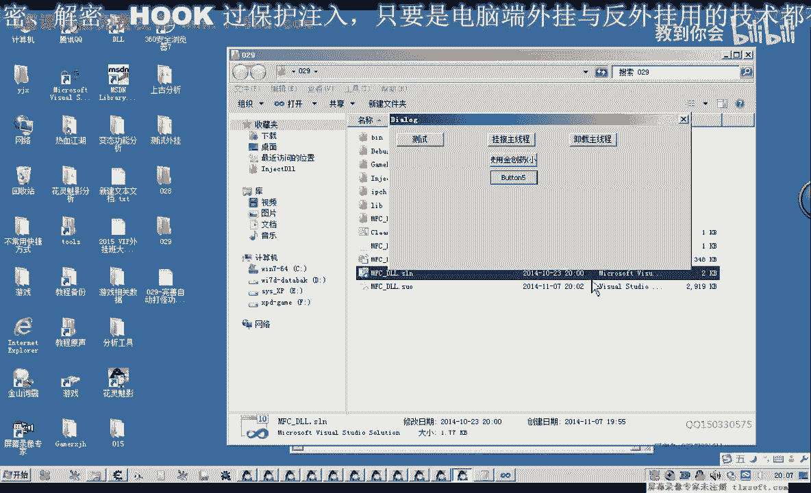

# 课程 P18：029 - 完善自动打怪功能 🛠️

在本节课中，我们将学习如何完善自动打怪功能。上节课我们仅通过判断选中的ID是否等于特定值来识别怪物，这种方法不够准确。本节课我们将增加对选中对象类型的判断，以确保只攻击怪物，而非玩家或自己。

---

## 问题分析与解决思路


上一节我们介绍了通过选中ID来判断怪物的方法。本节中我们来看看如何结合对象类型进行更准确的判断。

仅判断选中ID（`max f f`）存在缺陷。如果选中玩家或自己，ID判断会失效。因此，需要额外判断当前选中对象的类型是否为怪物。结合两者，才能完善选怪功能。

---

## 代码实现步骤

以下是完善自动打怪功能的具体步骤。

首先，我们需要在角色对象结构中添加一个函数，用于获取当前选中对象的类型。该函数通过对象地址和特定偏移（`max 8`）来读取类型值。若为怪物，则返回对应标识。

### 1. 定义获取选中对象类型的函数

我们定义一个变量来存储返回值，并使用异常处理确保代码健壮性。

```cpp
// 伪代码示例：获取选中对象类型
int GetSelectedTargetType() {
    try {
        // 步骤1: 获取当前选中的ID
        int selectedId = GetCurrentSelectedId();

        // 步骤2: 通过ID获取对象地址
        // 公式: 对象地址 = 基地址 + 4 * selectedId
        DWORD objectAddress = baseAddress + 4 * selectedId;

        // 步骤3: 从对象地址读取类型值（偏移为 max8）
        int objectType = ReadMemory(objectAddress + offset_max8);

        return objectType;
    } catch (...) {
        // 发生异常时返回一个无效值，例如0
        return 0;
    }
}
```

### 2. 将常用偏移定义为常量

为防止游戏更新导致偏移变化，我们将常用偏移（如 `+8`）定义为常量。

```cpp
// 建议将偏移常量集中管理，例如放在初始化函数或专用头文件中
const DWORD OFFSET_MAX8 = 0x8; // 示例偏移值
```

### 3. 修改自动打怪逻辑

接下来，我们修改自动打怪的核心判断逻辑。

```cpp
// 在自动打怪循环中
int targetType = GetSelectedTargetType();

if (targetType == TYPE_MONSTER) {
    // 当前选中已经是怪物，直接攻击
    ContinueAttack();
} else {
    // 当前选中的不是怪物，执行选怪操作
    SelectNewMonster();
    // 然后攻击新选中的怪物
    AttackTarget();
}
```

我们需要将“未选中对象”的判断也整合到 `GetSelectedTargetType` 函数中。如果选中ID无效，则直接返回空或无效类型。

---

## 功能测试与调试

完成代码修改后，我们进行编译和测试。


1.  将代码注入游戏主线程。
2.  在游戏中选中自己（非怪物）。
3.  启动自动打怪功能进行观察。



**预期结果**：即使选中自己，程序也应能正确识别并重新选择怪物进行攻击，而不是攻击自己。


如果测试失败（例如仍攻击自己），请检查：
*   代码是否编译成功并正确更新。
*   类型判断条件（`TYPE_MONSTER`）的值是否正确。
*   对象地址和偏移计算是否准确。

测试成功后，即可将完善后的逻辑放入定时器或独立线程中，实现稳定的自动打怪。

---



## 课程总结

本节课中我们一起学习了如何完善自动打怪功能。核心改进在于引入了对象类型判断，结合选中ID，确保了攻击目标的准确性。我们通过添加类型获取函数、定义偏移常量并重构攻击逻辑，使程序能够智能区分怪物与其他角色。

关键点总结：
1.  **问题**：仅凭ID无法准确区分怪物与玩家。
2.  **解决方案**：增加对选中对象**类型**的判断。
3.  **实现**：编写 `GetSelectedTargetType` 函数，并修改攻击决策逻辑。
4.  **优化**：将关键偏移定义为常量便于维护。


经过本次完善，自动打怪功能变得更加可靠。下一节课我们将继续探索其他功能的实现。