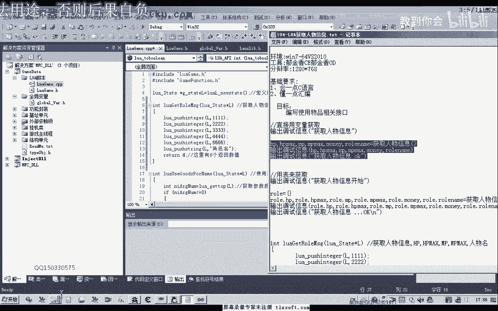
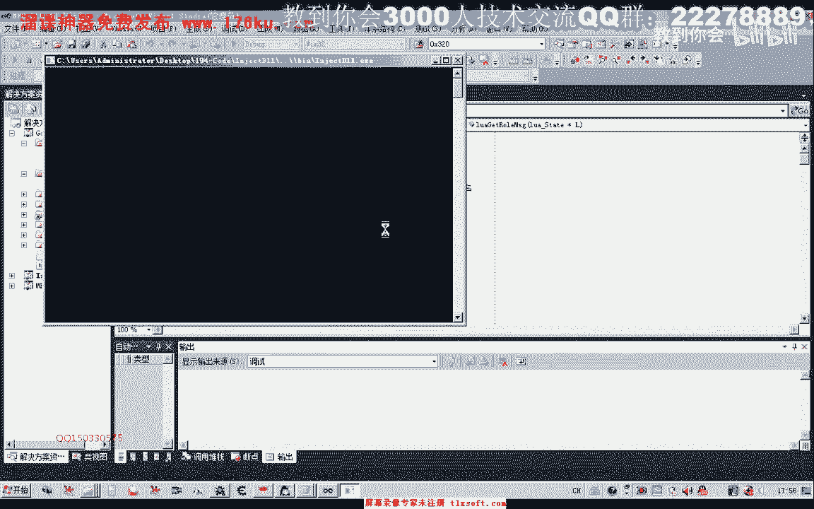

# 课程 P180：LUA获取人物信息 🧑💻


在本节课中，我们将学习如何在Lua脚本中获取C++或游戏内部的人物属性信息。我们将通过封装函数、注册到Lua环境，并最终编写一个自动检测血量并使用药品的脚本来实践这一过程。


---

上一节我们介绍了Lua与C++交互的基础。本节中，我们来看看如何具体获取游戏内的人物数据。

首先，我们需要打开第100课的代码。在全局变量单元中，存在一个包含人物属性的结构体变量。

为了在Lua脚本中使用这些数据，我们需要在脚本单元封装一个函数。这个函数将负责获取并返回人物信息。



以下是在C++单元中添加的测试代码，用于向Lua返回数据：


```cpp
// 示例：返回人物信息的函数
int GetCharacterInfo(lua_State* L) {
    // 这里应填充实际获取人物属性的代码
    // 暂时返回6个测试数值
    lua_pushnumber(L, 100); // 当前HP
    lua_pushnumber(L, 1000); // 最大HP
    lua_pushnumber(L, 50); // 当前MP
    lua_pushnumber(L, 200); // 最大MP
    lua_pushnumber(L, 5000); // 金钱
    lua_pushstring(L, "PlayerName"); // 人物名称
    return 6; // 返回值的数量
}
```


添加代码后，需要将此函数注册到Lua环境中，函数名定为“获取人物信息”。



完成注册后，我们可以在Lua脚本中调用此函数。因为函数返回六个参数，所以在Lua中接收时也需要对应六个变量。

以下是简单的Lua脚本示例，用于接收并打印信息：

```lua
-- 调用C++端注册的函数，接收六个返回值
local currentHP, maxHP, currentMP, maxMP, money, name = 获取人物信息()
-- 打印接收到的信息
print("当前HP:", currentHP)
print("最大HP:", maxHP)
print("当前MP:", currentMP)
print("最大MP:", maxMP)
print("金钱:", money)
print("名字:", name)
```

将脚本保存到游戏目录并运行。如果一切正确，控制台将输出人物的各项属性值。

在最初的测试中，可能因为函数名注册错误导致没有输出。检查并确保C++中的注册名与Lua中的调用名完全一致，然后重新编译运行即可。

成功输出后，我们需要将测试返回值替换为真实的游戏数据。修改C++函数，使其从游戏的人物属性结构体中读取真实值。

**注意**：对于“金钱”这类可能数值较大的数据，在Lua中应使用`number`类型（对应C++的`double`）来接收，以确保64位整数的完整性。如果使用`int`类型，在数值过大时可能导致数据截断。

替换代码后，再次挂起主线程并初始化测试。此时，控制台输出的将是人物的真实属性，例如：当前血量、血量上限、魔法值及金钱数量。

掌握了获取人物信息的方法后，我们就可以解决上节课遗留的问题——实现条件判断逻辑。

以下是如何利用获取到的信息编写一个自动使用药品的脚本：

```lua
-- 循环检测人物血量
while true do
    -- 获取当前人物信息
    local currentHP, maxHP = 获取人物信息()
    
    -- 判断条件：如果当前血量低于1000
    if currentHP < 1000 then
        -- 执行使用金疮药的操作
        UseItem("金疮药")
        print("血量过低，已使用金疮药。")
    end
    
    -- 等待3秒后再次检测
    等待(3000)
end
```

运行此脚本后，当游戏人物受到攻击导致血量低于1000时，脚本会自动使用“金疮药”进行补充。

---


本节课中，我们一起学习了从C++向Lua暴露接口以获取游戏人物信息的方法。关键步骤包括在C++端封装并注册函数，在Lua端正确调用和接收多返回值，并利用获取的数据实现简单的游戏逻辑（如自动补血）。这为编写更复杂的游戏辅助脚本奠定了坚实基础。下一节课我们将探讨更多高级功能。