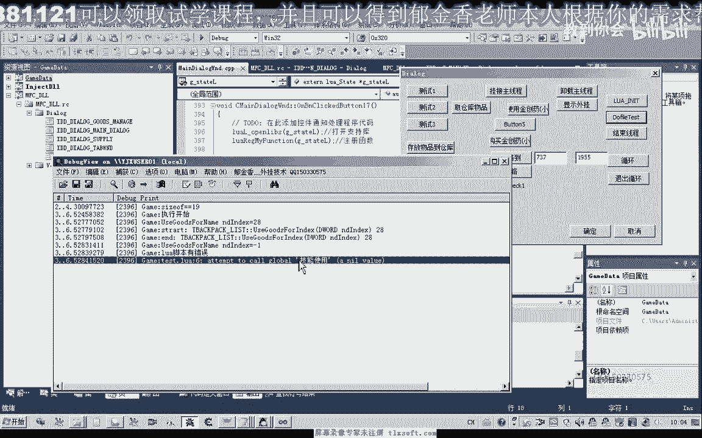
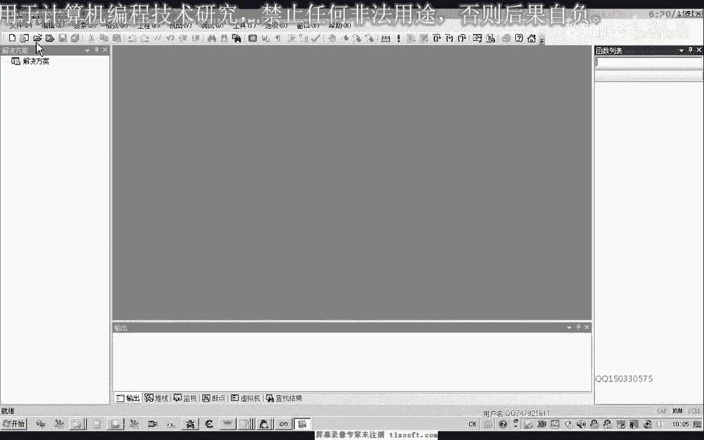
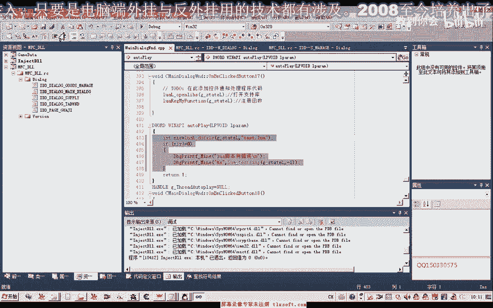

# P181：195-LUA脚本错误检测与排除 🐛


在本节课中，我们将学习如何在LUA脚本中检测和排除错误。我们将通过分析`dofile`函数的返回值来定位错误，并打印出具体的错误信息，以帮助初学者快速找到并修复代码中的问题。

---

上一节我们介绍了LUA脚本的基本执行。本节中，我们来看看如何检测脚本执行过程中的错误。

首先，我们打开第194课的代码。

如果在这段LUA脚本中，我们使用了一个错误的命令，或者出现了其他运行时错误，例如调用了一个未注册的函数`技能使用`。

我们随意使用一个技能，例如`蔑视屠龙`，然后执行这段代码。正常情况下，代码会执行到指定位置。但执行开始后，如果出现问题，我们很难仅凭肉眼找出错误所在。特别是当脚本越来越庞大时，检测和排除错误会更加困难。

因此，本节课探讨如何检测脚本中具体哪一行出现了错误。实际上，我们执行的`dofile`函数本身有一个返回值。如果其返回值不为零，就证明执行过程中出现了错误。

我们可以添加相应的检测逻辑，对`dofile`的返回值进行判断。如果返回值不为零，则说明存在错误。但仅仅检测到错误是不够的，我们还需要定位出错的具体信息。

在LUA中，数据通常通过环境堆栈进行传递。我们可以直接打印出相关的错误信息。出错信息是一个字符串类型，位于堆栈的顶部。

以下是实现错误检测的核心代码逻辑：

```lua
-- 执行脚本文件
local result = dofile("script.lua")
-- 检查返回值
if result ~= 0 then
    -- 从堆栈顶部获取错误信息并打印
    print(debug.traceback())
end
```



我们再次重新编译并生成程序。此时，我们注册LUA脚本，然后执行`dofile`。程序会输出一段错误信息，例如：`test.lua:6: attempt to call a nil value (global '技能使用')`。



这段信息表明，错误发生在`test.lua`文件的第6行，原因是尝试调用了一个未定义的全局变量`技能使用`。


我们查看第6行代码，恰好就是调用`技能使用`的这一行。为了更好地定位行号，建议使用带有行号显示功能的编辑器，例如`Notepad++`或`Visual Studio Code`。这类编辑器能清晰显示行号，方便我们快速找到出错代码。

错误信息还会显示具体的调试信息，例如“变量`技能使用`没有注册”。

---

还有一种情况也会导致出错。如果我们在没有初始化LUA环境（即没有注册必要的函数）时就开始执行脚本，那么从第二行开始就会出错，并终止整个脚本的执行。因为此时连`print`这类输出调试信息的函数也未被注册。

因此，我们必须先完成初始化，然后再执行代码。这样，当某个函数未注册时，它就会显示出具体的出错行信息。

我们回到代码中，找到出错的那一行并将其改正。例如，将错误的`技能使用`改为正确的函数名，或者直接注释掉该行。纠正错误后，脚本就能顺利执行完`dofile`。

我们检查其他函数，例如`选中怪物`。如果传递的参数错误，例如传递了一个不存在的怪物名，那么`选中怪物`函数可能不会真正执行选中操作，但脚本不会因此报语法错误。

需要注意的是，`dofile`的返回值主要能反馈语法层面的错误。对于逻辑错误或参数错误，它可能无法直接检测到。

---



本节课中，我们一起学习了如何利用`dofile`的返回值检测LUA脚本错误，并通过堆栈信息定位出错的具体位置和原因。掌握这一方法，能有效提升调试脚本的效率。