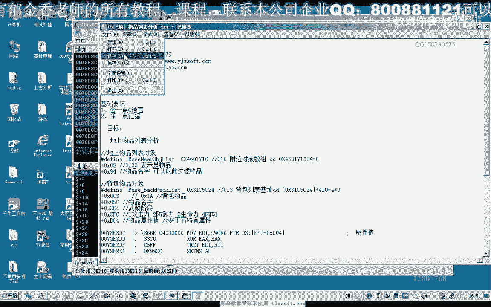

# 课程 P183：197-地上物品列表分析 📦


在本节课中，我们将学习如何分析游戏中的地上物品列表。我们将探讨如何定位物品对象、识别其关键属性（如名称和数值），并理解背包内物品的属性结构。这些知识是后续实现自动拾取和物品过滤功能的基础。

## 地上物品列表机制

上一节我们介绍了附近对象列表的概念。本节中，我们来看看地上物品列表，它本质上是“附近对象列表”的一种具体形式。

首先，我们进入游戏并观察附近的对象。此时，附近对象列表中有三个项目。




当我们向地上丢弃一个物品时，列表中会增加一个新对象。通过分析其内存结构，我们可以发现物品名称的存储位置。

在对象数据中，名称信息通常存储在特定的偏移地址处。例如，在某个偏移量（如 `+0x94`）的位置可以找到代表物品名称的字符串。

```
物品名称地址 = 对象基地址 + 0x94
```

此时，我们只能看到物品的名称。物品的具体属性（如攻击力、防御力）在物品位于地上时是不可见的。

## 物品属性的可见性

上一节我们提到地上物品只能看到名称。本节中，我们来理解属性何时变得可见。

物品的属性需要被拾取到背包中才会显示。例如，一件武器的攻击力或一块宝石的加成数值，只有在进入背包后才能在内存中访问到相应的属性值。


因此，对于地上物品的初步过滤，我们只能依赖其名称。要判断其具体属性优劣，必须先将物品拾取到背包中。

## 分析背包物品属性


既然属性在背包中可见，本节我们就来深入分析背包内物品对象的属性结构。

我们以背包中的“寒铁刀”和“强化石”为例。某些固定属性的物品（如寒铁刀）无需判断。我们需要关注的是像“寒玉石”、“金刚石”这类带有随机数值属性的物品。

以下是定位物品属性值（如防御力+4）的方法：

1.  确定背包物品对象的起始地址。
2.  在该对象的内存范围内搜索特定的属性值（例如数值4）。
3.  通过修改找到的地址值，观察游戏内物品属性的变化，从而确认该地址对应的属性。

通过此方法，我们找到了存储防御力加成的地址偏移量 `+0xD04`。

```
防御力属性地址 = 物品对象基地址 + 0xD04
```

修改该地址附近的其他值（如 `+0xCFC`），可以改变物品的其他属性，例如攻击力或生命力。这说明该区域存储了物品的一系列属性值。

```
攻击力属性地址 ≈ 物品对象基地址 + 0xCFC
生命力属性地址 ≈ 物品对象基地址 + 0xD00
```

这些属性值通常以数字代码表示（如1=攻击力，2=防御力，3=生命力）。我们可以通过判断物品名称以及这些属性的具体数值，来决定是否保留或丢弃该物品。例如，如果“寒玉石”的攻击力加成低于某个阈值，就可以将其视为垃圾物品。

## 通过字符串描述过滤物品

除了直接读取数值属性，我们还可以通过物品的描述文本来进行过滤。

在物品对象中，存在存储详细描述文本的地址偏移（例如 `+0x230`）。对于带属性的物品，此处会包含如“攻击力增加”等文本。

```
物品描述地址 = 物品对象基地址 + 0x230
```

对于不带属性的物品，则可能在另一个偏移地址（如 `+0xF1`）存储其简单的功能说明。

因此，我们有两种主要的过滤思路：
1.  **数值判断**：读取 `+0xCFC`、`+0xD04` 等地址的具体数值，进行量化比较。
2.  **文本判断**：分析 `+0x230` 或 `+0xF1` 地址的字符串内容，根据关键词进行过滤。

## 课程总结

本节课中，我们一起学习了地上物品列表的分析方法。

我们首先了解了地上物品列表与附近对象列表的关系，并知道只能通过物品名称进行初步识别。接着，我们明确了物品的具体属性只有在进入背包后才能被读取和分析。然后，我们深入探索了背包内物品对象的属性结构，学会了定位如攻击力、防御力等关键属性的内存地址。最后，我们介绍了通过属性数值和描述文本两种方式来过滤垃圾物品的思路。

这些分析为我们下一节课实现自动拾取和智能物品过滤功能打下了坚实的基础。