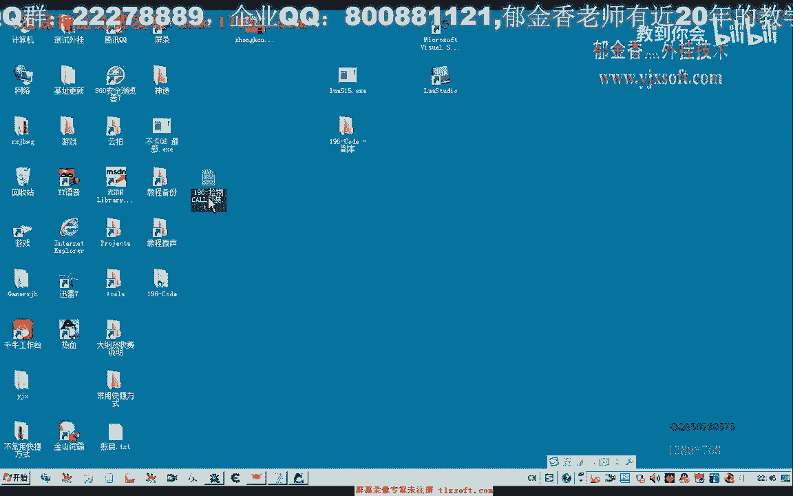
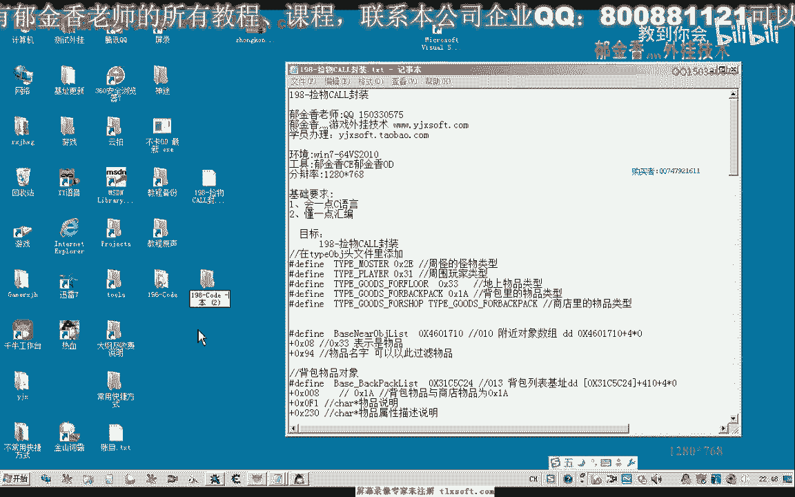
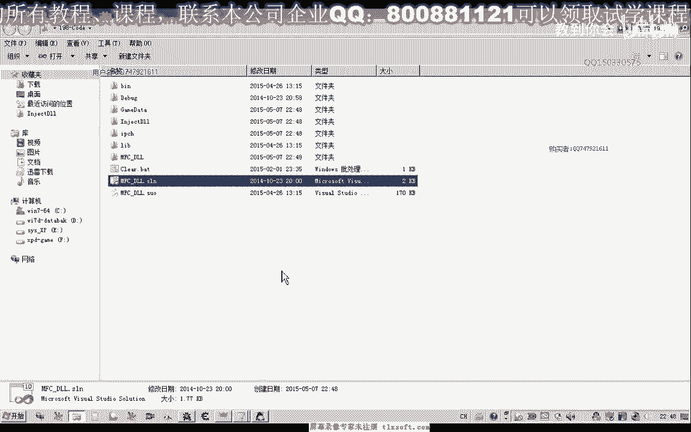
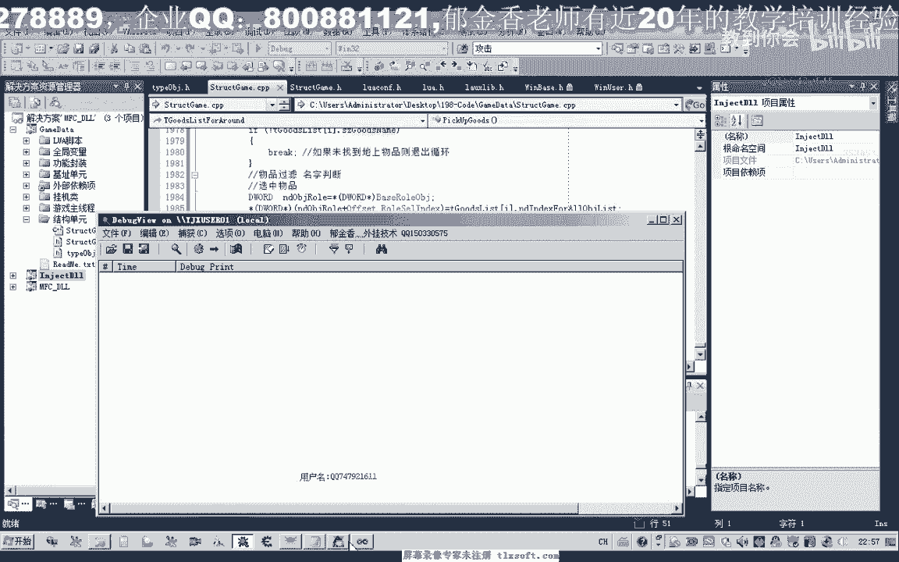
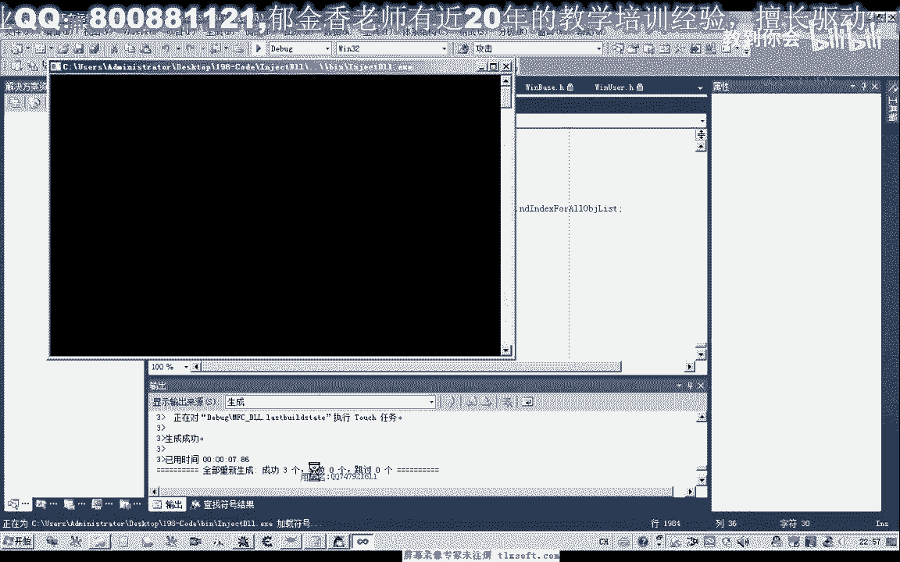
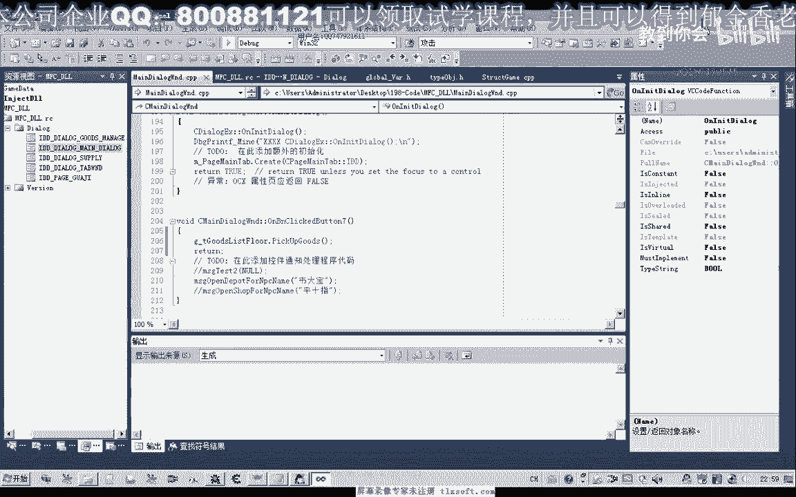

# 课程 P184：物品过滤与自动拾取功能封装 🧹



在本节课中，我们将学习如何封装一个具有过滤功能的自动拾取物品函数。我们将从分析游戏中的物品对象结构开始，逐步构建一个能够筛选并拾取特定物品的自动化功能。

## 概述

之前，我们使用游戏内置的“拾取”动作时，会按顺序拾取地上的所有物品，无法进行筛选。例如，我们可能不想拾取“金刚石”，而只想拾取其他物品。为了实现过滤拾取，我们需要编写自定义的功能函数。





实际上，我们可以利用“攻击”技能在选中物品的基础上实现拾取，从而达到过滤的目的。接下来，我们将基于第196课的代码进行扩展。

## 定义物品对象结构

首先，我们需要定义一个代表地上物品的对象结构。这个结构最终将用于解析游戏“附近对象列表”中的数据。地上的物品、怪物和玩家都存储在这个列表中。

物品对象结构主要包含以下有用信息：
*   **物品名称**：用于过滤功能。
*   **物品在所有对象数组中的下标**：用于选中物品。

以下是物品对象的结构定义代码：

```cpp
struct ItemObject {
    DWORD index; // 物品在对象数组中的下标
    std::string name; // 物品名称
    // ... 其他可能的属性
};
```

## 封装核心功能函数

我们将封装几个核心函数来管理物品列表和拾取逻辑。

### 初始化物品列表

`GetItemList` 函数用于从“附近对象列表”中提取所有地上物品的信息，并存储到我们的物品对象数组中。

其核心逻辑是遍历附近对象，检查其类型偏移（`+0x08`）的值。如果该值等于 `0x33`，则代表这是一个地上物品。然后，我们从该对象中读取名称（偏移 `+0x90`）和下标（偏移 `+0x0C`），并存入列表。

```cpp
void GetItemList(std::vector<ItemObject>& itemList) {
    itemList.clear(); // 清空列表，获得干净的数据
    DWORD nearbyObjBase = ReadDWORD(NearbyObjectList_Base);
    int count = ReadDWORD(NearbyObjectList_Count);

    for(int i = 0; i < count; i++) {
        DWORD objAddr = ReadDWORD(nearbyObjBase + i * 4);
        BYTE objType = ReadByte(objAddr + 0x08);
        if(objType == OBJECT_TYPE_ITEM_ON_GROUND) { // 0x33 代表地上物品
            ItemObject item;
            item.index = ReadDWORD(objAddr + OBJECT_INDEX_OFFSET); // 0x0C
            item.name = ReadString(objAddr + OBJECT_NAME_OFFSET); // 0x90
            itemList.push_back(item);
        }
    }
}
```

### 选中并拾取物品（带过滤）

`PickupItem` 函数是自动拾取的核心。它首先调用 `GetItemList` 初始化物品列表，然后遍历列表。我们可以在此处添加过滤逻辑，例如判断物品名称。如果物品符合拾取条件，则将其下标写入角色“选中目标”的偏移（`0x14B8`），然后执行“攻击”动作即可拾取。

以下是实现简单名称过滤的示例：

```cpp
void PickupItem() {
    std::vector<ItemObject> items;
    GetItemList(items); // 初始化物品列表

    for(const auto& item : items) {
        // 过滤逻辑示例：不拾取名为“寒玉石”的物品
        if(item.name.find("寒玉石") != std::string::npos) {
            continue; // 跳过本次循环，不拾取此物品
        }

        // 选中物品
        WriteDWORD(PLAYER_BASE + TARGET_INDEX_OFFSET, item.index); // 0x14B8
        // 执行攻击动作以拾取物品
        UseSkill(ATTACK_SKILL_ID);
        Sleep(300); // 稍作延迟，避免操作过快
        break; // 每次调用只拾取一个物品，可根据需要修改
    }
}
```

## 功能测试与应用





为了测试上述功能，我们需要在全局变量中定义一个物品列表对象，并创建测试函数。

以下是两个简单的测试函数：

1.  **测试一：打印地上物品信息**
    此函数调用 `GetItemList` 并打印出所有地上物品的名称和下标，方便我们查看和设计过滤规则。



2.  **测试二：执行过滤拾取**
    此函数调用 `PickupItem`。每次调用会按过滤规则拾取一个符合条件的物品。通过连续调用或将其放入循环，可以自动清理地上的目标物品。

**应用示例**：当我们在游戏中丢弃“寒玉石”和其他物品后，运行测试二。函数会拾取除“寒玉石”外的所有物品，而“寒玉石”则会留在地上，从而实现了过滤拾取的目的。

## 总结

本节课中，我们一起学习了如何封装一个带过滤功能的自动拾取系统。我们首先定义了物品对象结构来存储关键信息，然后实现了初始化物品列表和带过滤逻辑的拾取函数。通过名称判断等简单的过滤条件，我们能够控制角色只拾取我们想要的物品，从而提升了自动化操作的灵活性和效率。

下一节课，我们将进一步探讨更复杂、更多样化的物品过滤规则。