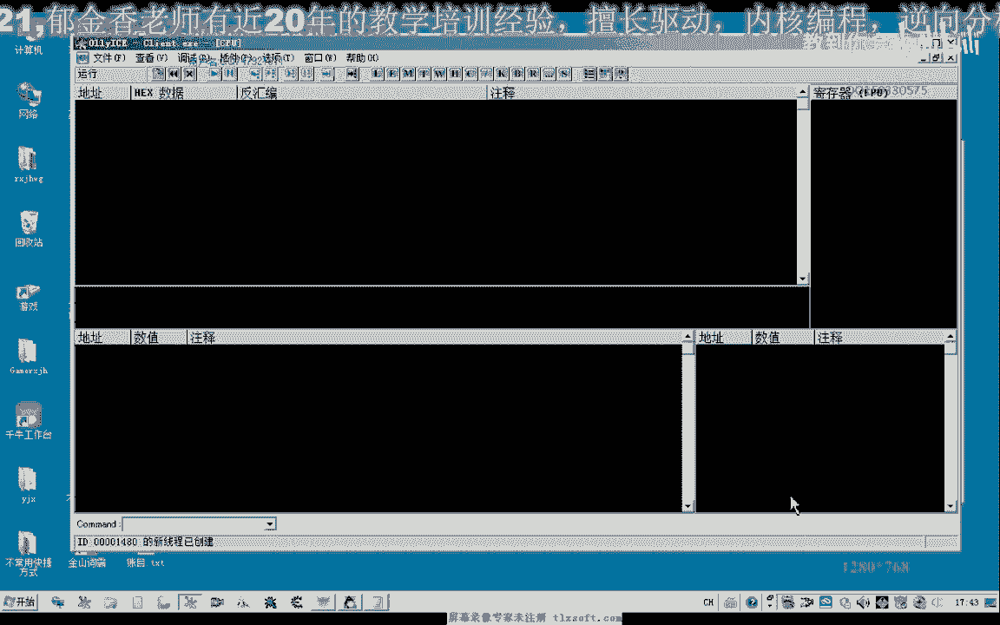
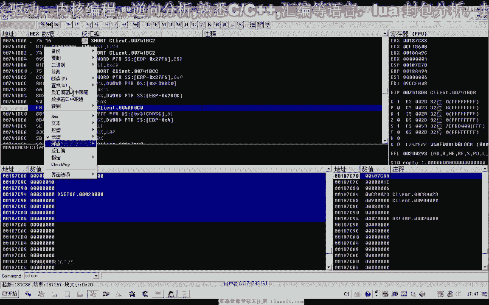
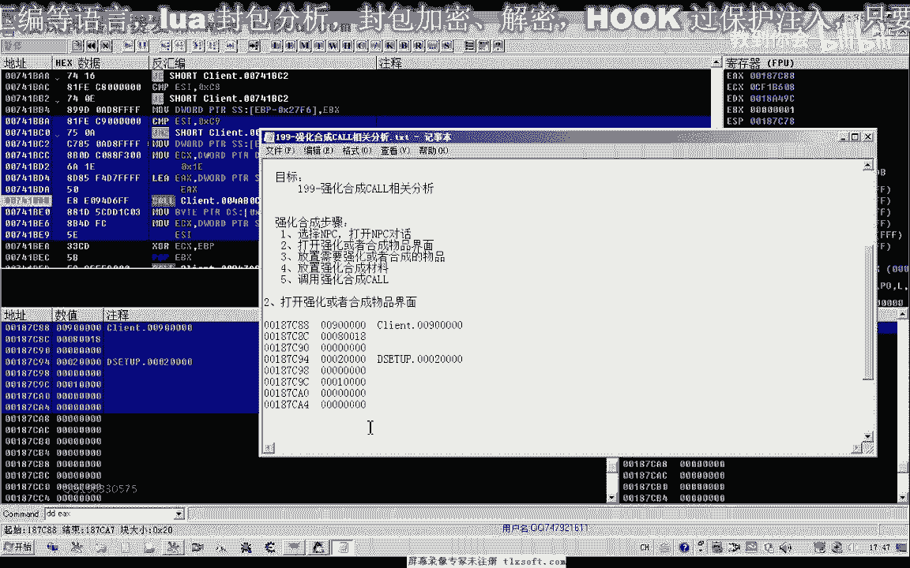
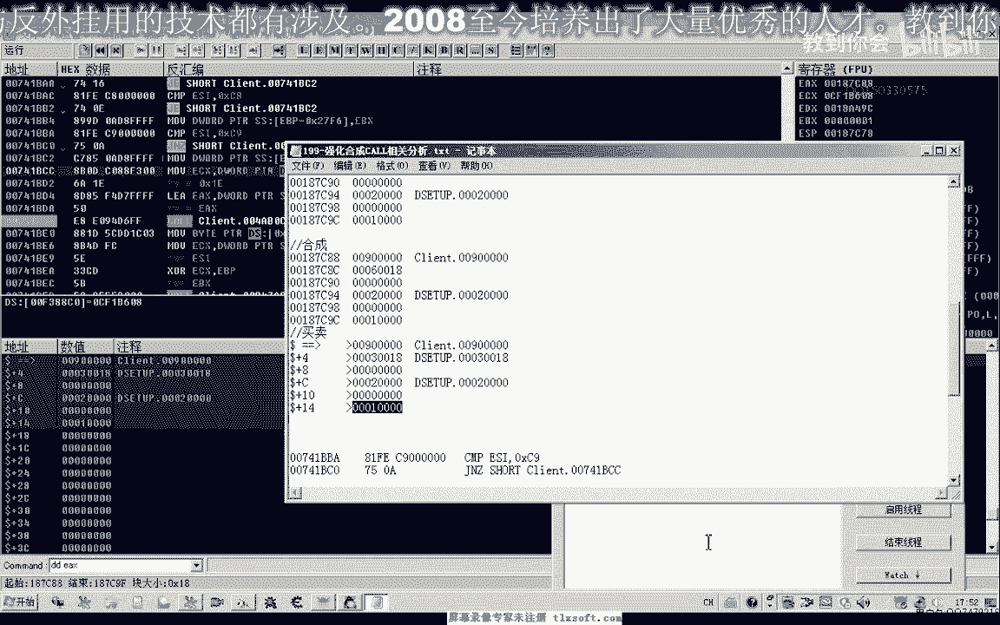
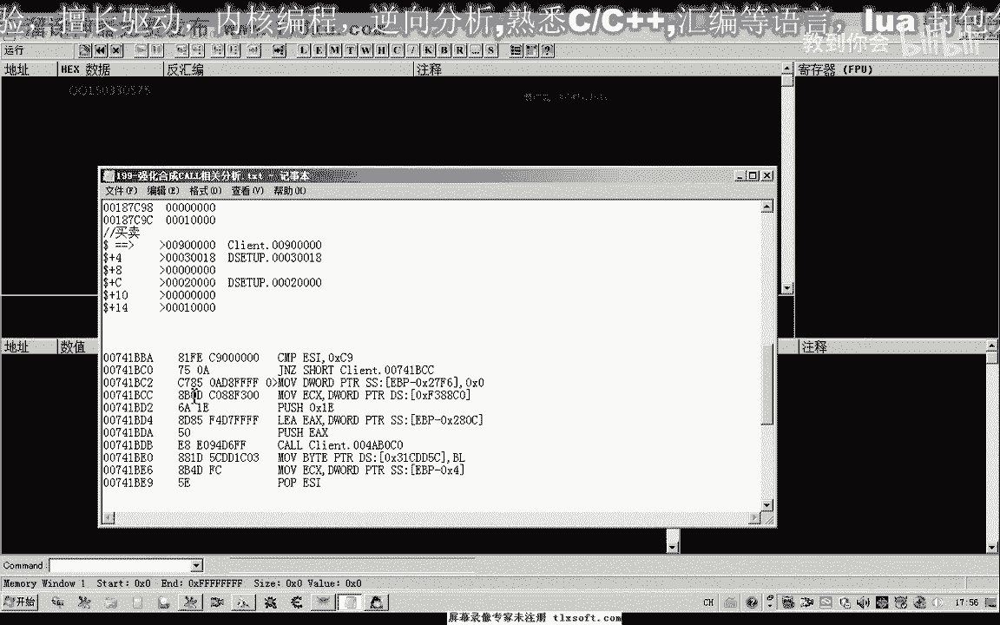
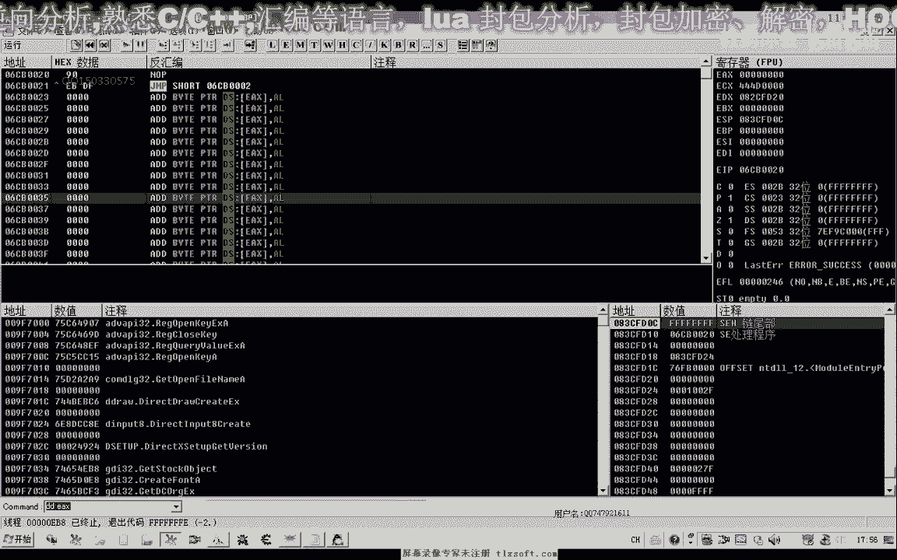

# 课程 P185：游戏强化与合成功能调用分析 🎮




在本节课中，我们将学习如何分析一款游戏中与物品强化、合成相关的功能调用。我们将通过逆向工程的方法，定位并理解游戏客户端与服务器交互的关键函数，并尝试通过代码注入来模拟这些操作。


---

## 概述：打开NPC菜单

上一节我们介绍了如何与游戏进程交互。本节中，我们来看看如何通过代码调用打开游戏内NPC的菜单界面。

在游戏中，与名为“刀剑鞘”的NPC对话后，可以进行物品的强化与合成。此过程通常包含几个步骤：
1.  选择目标NPC。
2.  打开NPC对话菜单。
3.  在菜单中选择“强化”或“合成”选项。
4.  放置需要强化/合成的物品及所需材料。
5.  调用最终的强化/合成功能函数。

首先，我们关注如何通过代码触发第二步，即打开菜单。

选中NPC后，调用游戏内“普通攻击”相关的函数，实际上可以打开NPC的菜单。这是因为游戏逻辑中，与NPC交互和发起攻击可能共用部分底层通信机制。当在菜单中选择“卖出”、“确认”或“合成”时，客户端会向服务器发送特定数据包。

因此，我们可以对游戏发送网络数据包的API函数下断点进行分析。

---

## 定位数据包发送函数





以下是定位关键函数的步骤：


1.  在游戏中选中NPC，并打开其菜单。
2.  对疑似发送数据包的函数（如 `send`、`sendto` 或游戏特定函数）下断点。
3.  在游戏菜单中选择“强化物品”或“合成物品”。
4.  观察断点是否被触发。


在本例中，断点命中了一个名为 `WSASend` 的函数。执行程序直到该函数返回，并观察其上层调用。最终，我们定位到了游戏内负责组包和发包的关键调用点（下文以 `Call_SendPacket` 指代）。


通过调用这个 `Call_SendPacket` 函数，理论上就能模拟客户端行为，向服务器发送“打开强化界面”的指令。服务器收到指令后，会返回数据给客户端，从而打开对应的窗口。

分析发现，打开商店、合成、强化等不同菜单，都调用了同一个 `Call_SendPacket` 函数，区别仅在于传入数据缓冲区中的某个参数值不同。

**核心调用伪代码：**
```cpp
// 假设的函数原型
void Call_SendPacket(void* pBuffer, int bufferSize);
// 缓冲区数据示例（十六进制）：
// 打开商店： 90 80 01 08 01 00 00 00 ...
// 打开合成： 90 80 01 08 06 00 00 00 ...
// 打开强化： 90 80 01 08 08 00 00 00 ...
```

---

## 构建并注入测试代码


为了验证我们的分析，需要编写代码注入到游戏进程中，模拟发送数据包。




我们可以使用代码注入器，在 `Call_SendPacket` 函数被调用前，构建正确的缓冲区并设置相关寄存器。由于在注入器中直接编写字节码不便，通常采用汇编指令顺序压栈的方式来构建缓冲区。

**关键汇编注入逻辑：**
```assembly
// 假设调用约定为 stdcall，参数从右向左压栈
push 0x00000000        // 缓冲区部分数据
push 0x00000000
push 0x00000000
push 0x00000000
push 0x00000000
push 0x18030000        // 缓冲区部分数据
push 0x02000000        // 参数可能表示功能类型
push 0x00900180        // 缓冲区头部
// 此时栈顶即为缓冲区地址，将其存入EAX
mov eax, esp
// 接下来需要将缓冲区大小存入ECX（具体寄存器根据游戏而定）
mov ecx, bufferSize
// 最后跳转或调用原始的 Call_SendPacket 函数地址
jmp [Call_SendPacket_Address]
```
**注意**：注入代码必须保持堆栈平衡。在函数执行完毕后，需要释放临时占用的栈空间（例如 `add esp, 0x18`）。

经过测试，修改缓冲区中的特定字节（例如，将 `01` 改为 `06` 或 `08`），可以分别成功打开商店、合成界面和强化界面。


---

## 探索上层调用函数

除了直接调用发包函数，我们还可以向上层追溯，寻找更简洁的调用方式。

在 `Call_SendPacket` 的调用者位置下断点，继续执行并返回后，我们发现了一个更上层的函数（下文以 `Call_OpenMenu` 指代）。这个函数参数更简单，似乎直接对应了菜单类型。




以下是分析 `Call_OpenMenu` 函数参数的结果：
*   打开商店时，参数为 **1**。
*   打开合成界面时，参数为 **6**。
*   打开强化界面时，参数为 **8**。




测试调用 `Call_OpenMenu(1)` 可以成功打开商店。这个函数相比底层的 `Call_SendPacket` 更为简洁。

**两种调用方式的对比：**
*   **`Call_SendPacket` 方法**：需要构建完整数据缓冲区，更接近底层通信。在游戏更新后，通常只需更新该函数地址，灵活性较高。
*   **`Call_OpenMenu` 方法**：参数简单，调用方便，逻辑更清晰。但游戏更新时，此函数本身变动的可能性更大。

具体使用哪种方法，取决于你的需求和维护策略。

---

## 总结与下节预告

本节课中，我们一起学习了如何分析游戏内强化与合成功能的调用逻辑。

我们掌握了两种关键方法：
1.  定位并调用底层的**数据包发送函数** `Call_SendPacket`，通过构建不同的缓冲区数据来触发不同功能。
2.  定位并调用更上层的**菜单打开函数** `Call_OpenMenu`，通过传入不同的整数参数来打开对应界面。

这两种方法的核心都是理解游戏客户端与服务器的交互协议，并通过逆向工程找到关键的函数入口点。

下一节课，我们将继续深入分析，研究在打开菜单后，如何模拟“放置装备”、“放置材料”以及最终执行“强化”或“合成”操作的完整过程。