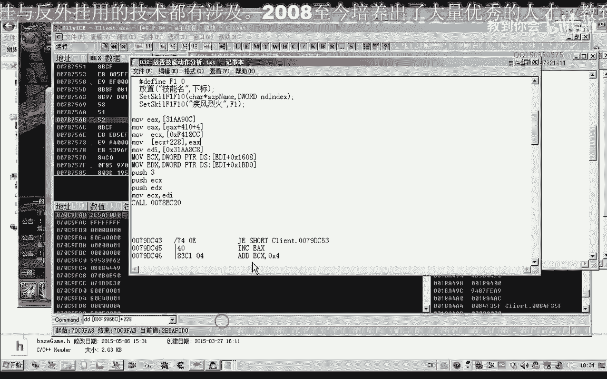
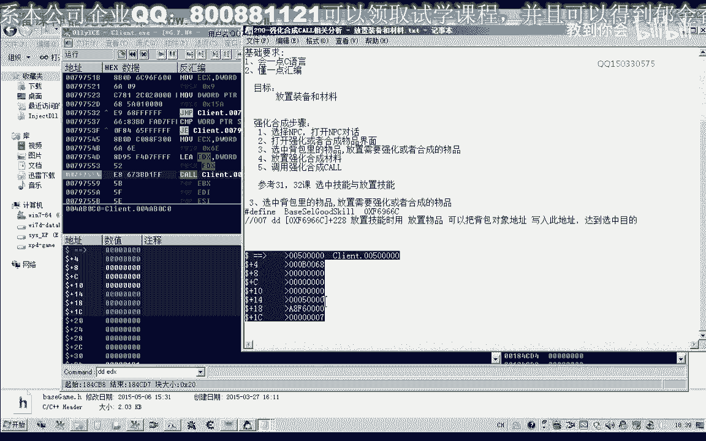
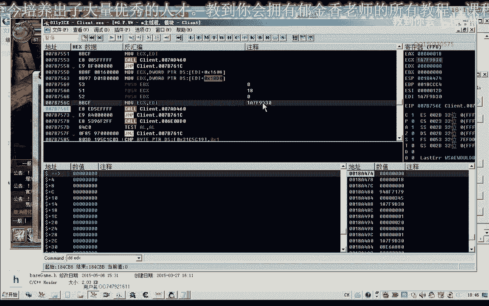
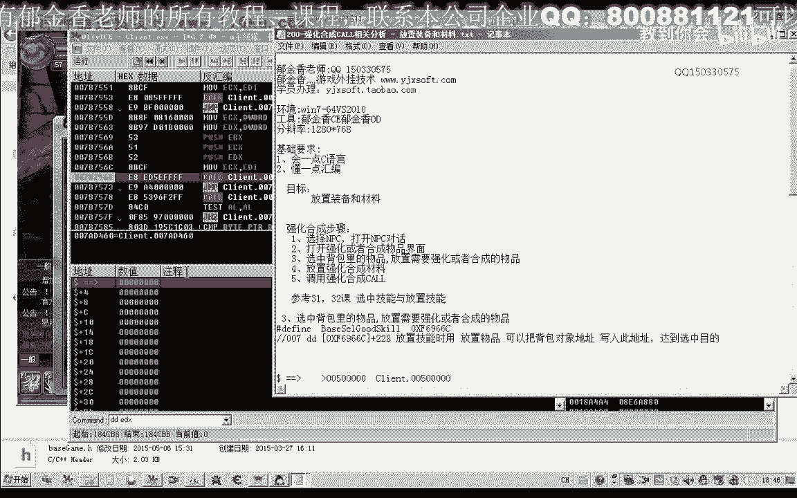
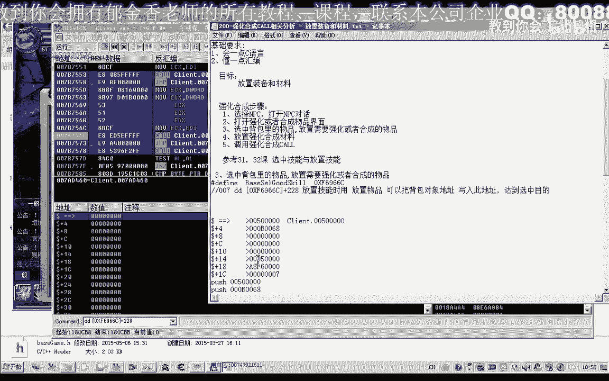
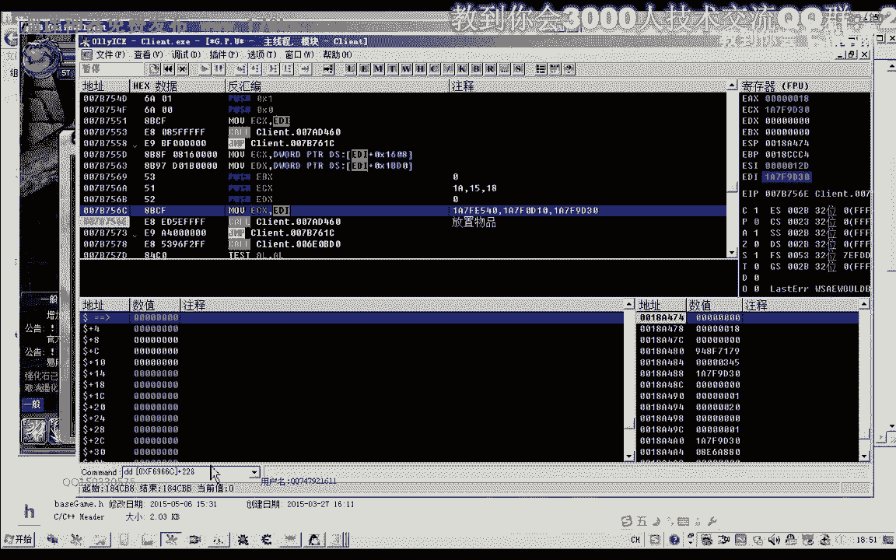
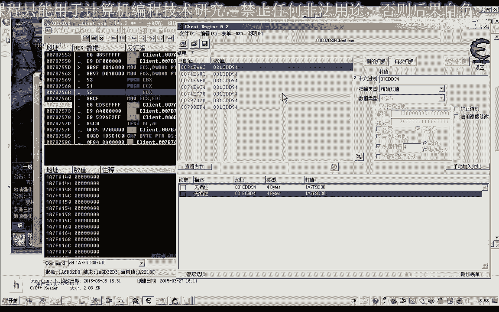
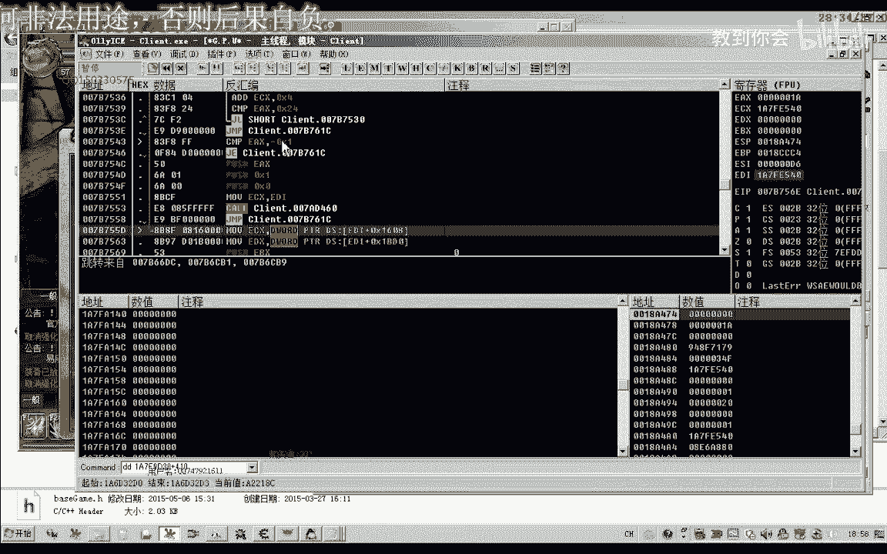
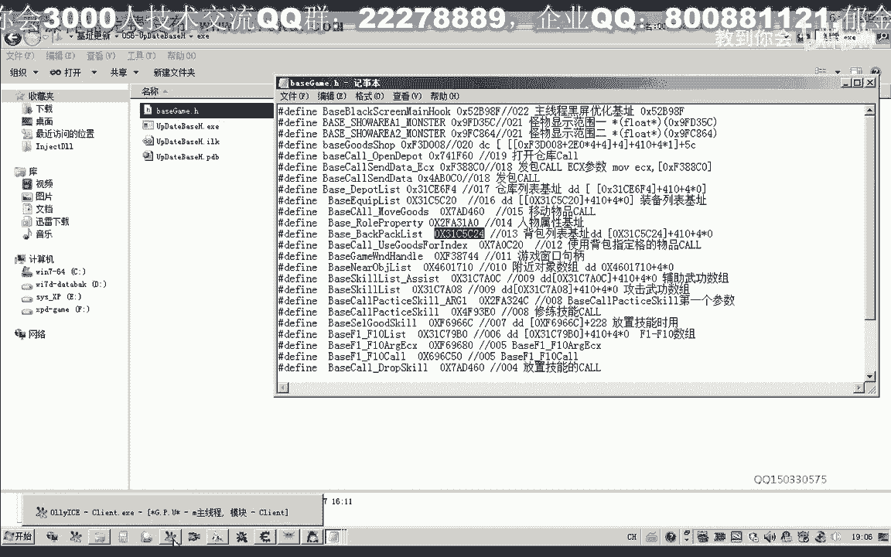

# 课程 P186：强化合成CALL相关分析 - 放置装备和材料 🧪


在本节课中，我们将学习如何分析并实现游戏内强化合成功能中的关键步骤：将背包中的装备和材料放置到强化窗口的指定位置。我们将通过分析游戏内存机制和调用关键函数（CALL）来完成这一过程。


---

## 第一步：选中背包物品 🎯

上一节我们介绍了技能放置的分析方法，本节中我们来看看如何选中物品。放置物品的第一步与选中技能类似，需要将背包中目标物品的对象地址写入特定的游戏机制（机子）中。



在之前的课程（如第31课）中，我们分析过一个用于选中物品的机制，其地址为 `228`。该机制内部有一个 `ECX` 寄存器指向选中的对象。

以下是关键步骤：
1.  找到游戏中代表“背包数组”的数据结构。
2.  确定目标物品（如强化石）在数组中的下标。
3.  将该物品的对象地址写入 `228` 机制指定的内存地址。

例如，若强化石在背包数组下标为1的位置，其对象可能是 `F0P0`。通过调用相关代码，我们可以将此对象地址写入选中机制。

**核心操作伪代码：**
```cpp
// 假设 backpackArray 是背包数组，targetIndex 是目标下标
ItemObject* targetItem = backpackArray[targetIndex];
writeToMemory(0x228, targetItem); // 将对象地址写入选中机制
```

这样，我们就完成了物品的选中，为后续放置操作做好了准备。



---


## 第二步：分析放置物品的CALL 📤

选中物品后，下一步是将其放置到强化窗口。我们可以参考分析技能放置CALL的方法，或者直接追踪游戏在放置动作时向服务器发送的数据包（发包）。

通过下断点跟踪，我们发现一个发包函数在放置完成后被调用。观察其参数 `EDX`，发现其中包含了一段数据，其开头部分与背包物品的下标有关。

例如，放置背包中下标为3的物品时，`EDX` 数据开头包含数字 `3`。这提示我们，或许可以通过直接调用这个发包函数并构造包含下标的数据包来实现放置，从而绕过“选中”步骤。


我们尝试构建缓冲区并调用该函数：
```cpp
// 构建数据缓冲区，包含物品下标等信息
char buffer[] = { /* 包含下标3等数据的字节序列 */ };
// 调用发包函数，假设函数地址为 0x6E，参数为 61
callPacketFunction(0x6E, 61, buffer);
```

然而，经过多次测试，直接调用此发包函数并未成功放置物品。这表明该数据包可能对应其他游戏动作，并非直接的放置指令。因此，我们需要寻找更底层的调用。





---

## 第三步：定位并调用放置CALL ⚙️


我们继续向上层追溯调用链，找到了一个与之前技能放置CALL（地址 `16081B10`）非常相似的函数。这个函数很可能就是负责执行放置动作的关键CALL。



通过分析发现，调用此CALL需要一个重要的前提：**必须已选中物品**。其参数含义如下：
*   `ECX`：一个关键的上下文对象，不同物品（装备、材料）来源不同。
*   第二个参数：一个标识放置类型的数值。
    *   `18`：表示放置强化装备。
    *   `1A`：表示放置强化材料（如强化石）。
    *   `15`：表示放置合成材料（如活尘）。

以下是调用示例：
1.  首先，选中背包里的一件装备。
2.  然后，调用放置CALL，传入参数 `ECX_A` 和 `18`，即可将装备放入强化窗口的装备槽。
3.  接着，选中背包里的强化石。
4.  最后，调用放置CALL，传入参数 `ECX_B` 和 `1A`，即可将强化石放入材料槽。



**关键调用逻辑：**
```cpp
// 放置装备
callPlaceItemFunction(ECX_for_Equipment, 18);
// 放置强化材料
callPlaceItemFunction(ECX_for_Material, 0x1A);
```

---

## 第四步：确定关键参数ECX的来源 🔍

`ECX` 参数是此CALL能否成功的关键。通过CE（Cheat Engine）搜索和对比分析，我们发现：
1.  **对于装备**：`ECX` 来源于一个全局的、固定的机制地址（例如 `0x31149` 或 `0x311790` 附近的地址）。这个地址与选中机制 `228` 在内存中位置相近，可能属于同一个大的游戏对象结构。
2.  **对于材料（如强化石）**：`ECX` 也来源于一个全局机制，但地址与装备的有所不同（例如 `0x314DD94`）。这可能是因为材料是以“宿主”或列表形式管理的。



**总结ECX来源：**
*   `ECX_装备` = `[基址] + 偏移A` （一个固定的全局对象）
*   `ECX_材料` = `[基址] + 偏移B` （另一个固定的全局对象）




在实际测试中，我们发现即使统一使用装备的 `ECX` 机制来放置材料，有时也能成功。这可能是因为这几个机制地址在内存中相邻，数据结构相似，游戏函数兼容处理了。但为了代码的健壮性，建议区分使用。

---


## 总结与下节预告 📝

本节课中我们一起学习了强化合成功能中放置装备和材料的完整分析流程：

1.  **选中物品**：通过向 `228` 机制写入背包物品的对象地址来完成。
2.  **放置动作**：通过调用一个关键的放置CALL（类似 `16081B10`）来执行。
3.  **关键参数**：
    *   调用前必须已选中物品。
    *   参数一（`ECX`）是一个上下文对象，对于装备和材料，其来源是不同的全局机制。
    *   参数二是一个标识码（`18` 放装备，`1A` 放强化石，`15` 放合成材料）。

我们已经成功定位了所需的函数和关键数据地址。在下一节课中，我们将开始编写C++代码，将这些分析结果封装成可调用的函数，实现自动放置装备和材料的功能。



---


**本集完。**