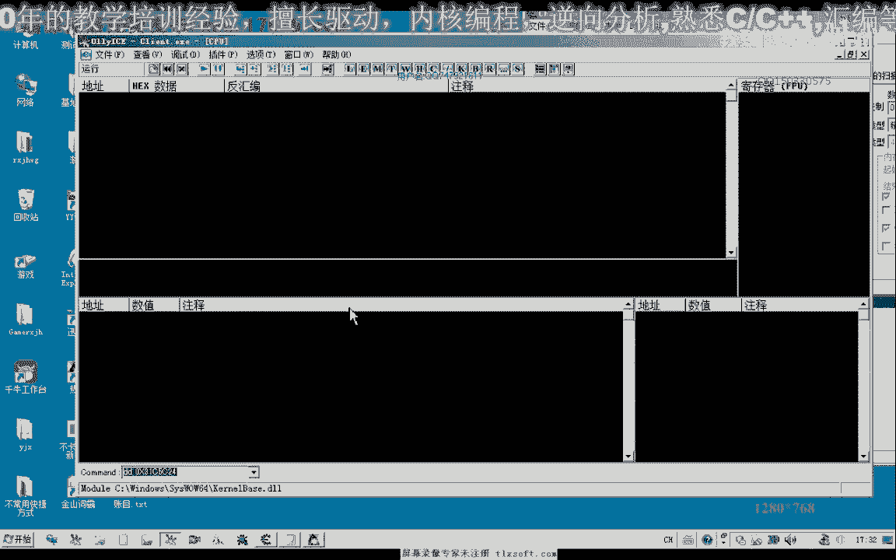
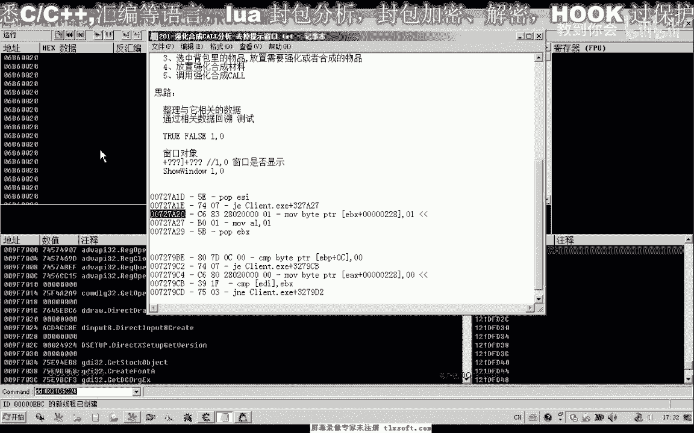
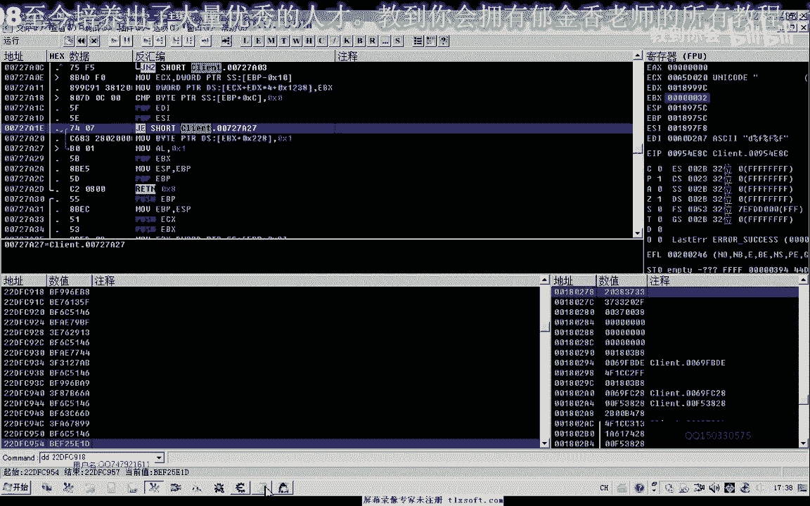
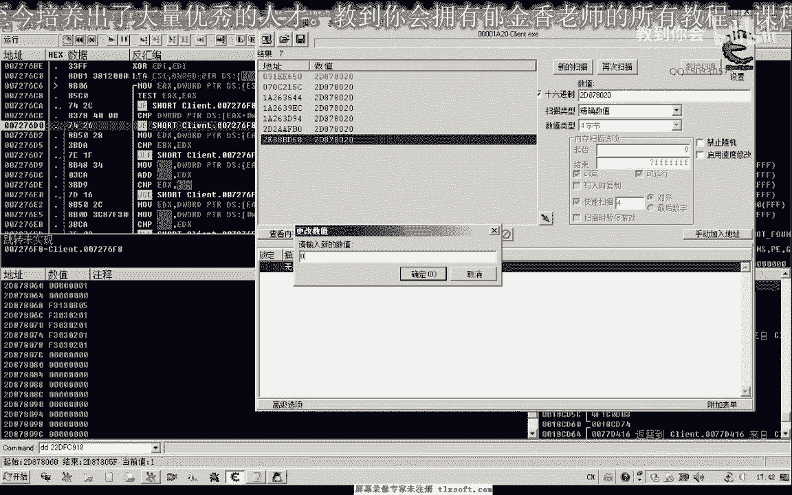
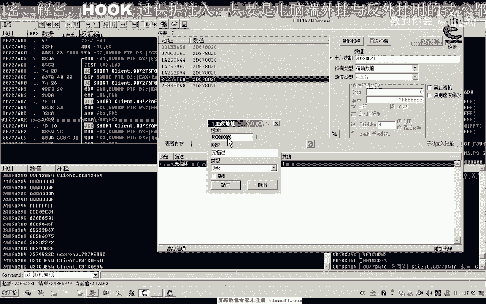
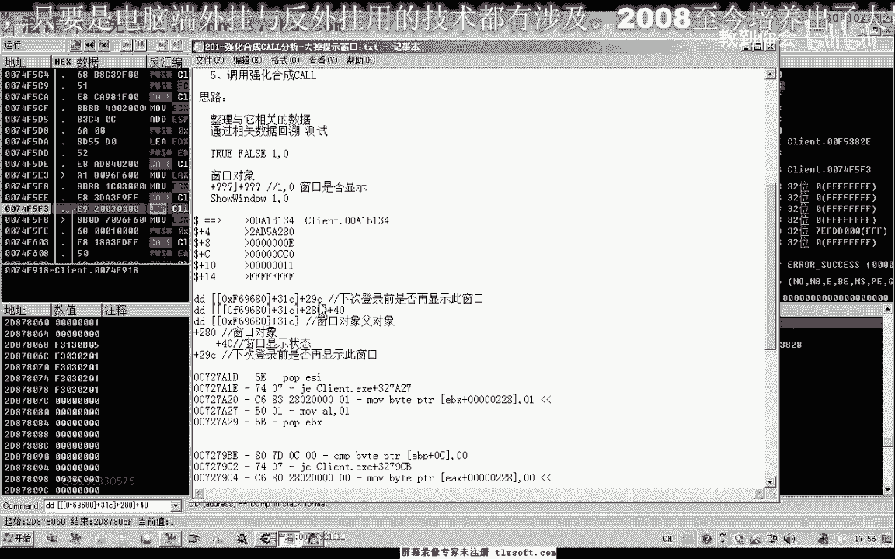
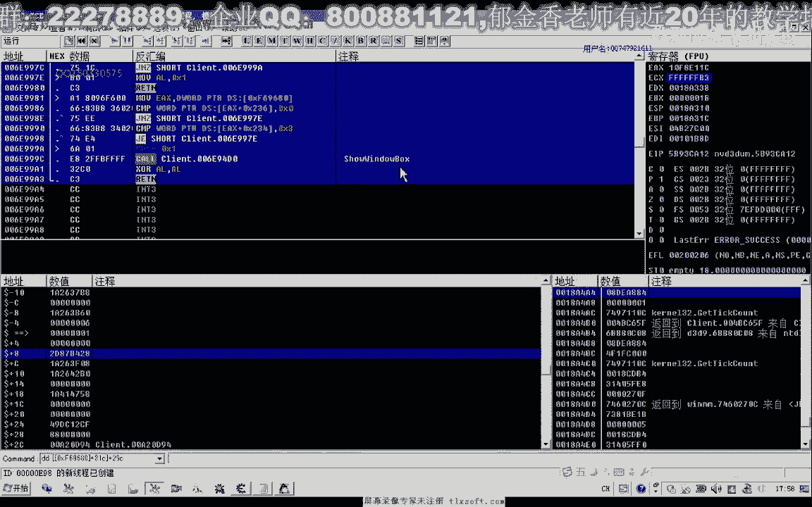
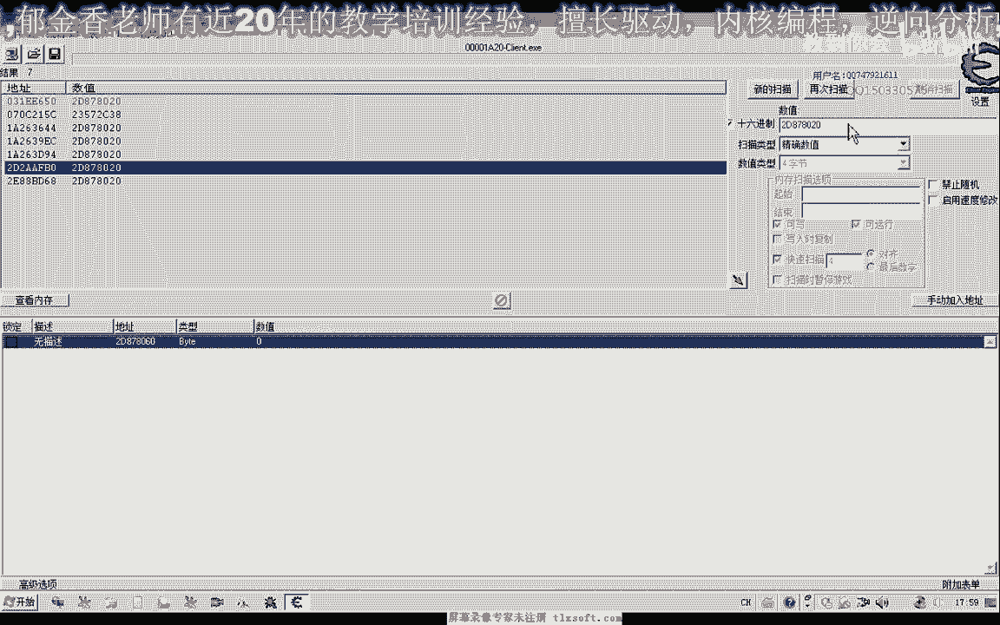

# 课程 P187：201-强化合成CALL分析-去掉提示窗口 🛠️

在本节课中，我们将学习如何分析并去除游戏强化合成装备时弹出的提示窗口。这个窗口会中断自动化操作，因此我们需要找到其显示逻辑并进行控制。

## 概述

强化合成装备时，游戏会弹出一个通知窗口，提示“需要额外的5%强化合成几率”。虽然可以手动勾选“下次登录前不再提示”，但在编写自动化代码时，我们需要通过分析内存和调用逻辑，直接控制该窗口的显示与隐藏，以确保后续操作（如放置强化石）能顺利进行。

## 分析思路

上一节我们介绍了逆向分析的基本概念，本节中我们来看看针对特定窗口的分析方法。对于这个提示窗口，我们主要有以下几种分析思路：






1.  **从窗口显示状态入手**：窗口的显示与隐藏通常由一个布尔值（`true`/`false` 或 `1`/`0`）控制。我们可以尝试搜索这个状态值。
2.  **从窗口文本字符串入手**：通过游戏内存中的字符串（如“需要额外的5%强化合成几率”）回溯找到引用它的代码。
3.  **从窗口函数调用入手**：窗口的创建、显示、关闭通常会调用特定的API或游戏内部函数。我们可以从这些调用点进行分析。


本节课我们将重点探讨第一种方法，即通过窗口的显示状态来定位关键数据。


## 定位窗口显示状态


我们的假设是：存在一个窗口对象，其内部某个偏移量处存储了一个字节（`byte`）类型的数据，用于表示窗口的显示状态（`1`为显示，`0`为隐藏）。


以下是定位该状态值的步骤：




1.  **首次搜索**：当提示窗口显示时，在内存中搜索字节数值 `1`。
2.  **状态改变**：点击“取消”关闭窗口，此时窗口隐藏，搜索数值 `0`。
3.  **再次触发**：再次放入装备，使窗口显示，搜索数值 `1`。
4.  **重复筛选**：重复“显示-搜索1，隐藏-搜索0”的过程，直到筛选出少数几个地址。

通过此方法，我们最终定位到一个关键地址。修改该地址的值为 `0` 可以立即隐藏窗口，验证了其正确性。




## 分析上层调用与对象结构

找到状态值后，我们需要分析是哪个函数或代码在读写这个地址。使用调试器（如OD）对该地址下“写入断点”。

1.  **中断分析**：当游戏写入该地址（例如写入 `1` 以显示窗口）时，调试器会中断。我们查看调用栈和寄存器。
2.  **发现窗口对象**：中断后，发现写入指令形如 `mov byte ptr [ebx+40], 1`。这里的 `ebx` 很可能是一个“窗口对象”的基地址，`+40` 是显示状态的偏移量。
3.  **追溯对象来源**：进一步分析 `ebx` 的来源，发现它来自 `esi`，而 `esi` 可能指向一个更上层的对象列表或父对象。

通过层层回溯，我们初步理清了结构：一个**父对象**（或管理器）在偏移 `+0x31C` 处存储了窗口对象的指针。而**窗口对象**本身在偏移 `+0x40` 处存储了显示状态。

## 定位复选框控制逻辑

我们的最终目的不是简单地隐藏窗口，而是模拟勾选“下次登录前不再提示”复选框，使其永久不弹出。这意味着需要找到控制这个复选框逻辑的变量。


1.  **分析显示判断**：在调用显示窗口的函数内部，存在一个条件判断。如果某个条件满足（代表复选框已勾选），则跳过显示窗口的调用。
2.  **定位关键判断**：通过调试跟踪，我们找到了一个关键跳转。该跳转依赖于一个内存值，例如 `cmp byte ptr [ecx+29C], 0`。
3.  **验证变量作用**：`[ecx+29C]` 这个地址的值，`0` 代表需要显示窗口（未勾选），`1` 代表不显示窗口（已勾选）。修改此值可以控制窗口的后续行为。
4.  **关联对象**：这里的 `ecx` 经分析，就是之前找到的**父对象**地址。因此，完整的控制链是：
    *   **父对象基址** + `0x31C` = **窗口对象地址**
    *   **窗口对象地址** + `0x40` = **即时显示状态** (`1`/`0`)
    *   **父对象基址** + `0x29C` = **复选框持久化状态** (`1`/`0`)


核心逻辑可以用以下伪代码表示：
```cpp
// 假设 parentObj 是找到的父对象基址
if ( *(byte*)(parentObj + 0x29C) == 1 ) {
    // 用户勾选了“不再提示”，不执行显示窗口操作
    return;
} else {
    // 需要显示窗口
    windowObj = *(DWORD*)(parentObj + 0x31C);
    *(byte*)(windowObj + 0x40) = 1; // 设置窗口为显示状态
    // 调用 ShowWindow 等函数...
}
```




## 总结


本节课中我们一起学习了如何逆向分析游戏中的提示窗口：



1.  **从状态值切入**：通过搜索内存中变化的状态值（`1`/`0`），快速定位到控制窗口即时显示/隐藏的地址。
2.  **向上回溯**：利用调试器的断点功能，从写入该状态值的代码向上回溯，逐步分析出“窗口对象”及其“父对象”的地址和结构。
3.  **定位业务逻辑**：通过分析函数内部的判断逻辑，找到了模拟“不再提示”复选框效果的关键变量及其在父对象中的偏移（`+0x29C`）。





通过本次分析，我们不仅掌握了关闭窗口的方法，更重要的是理解了其背后的对象关系和持久化控制逻辑。下一节课，我们将基于这些分析成果，编写代码来实现自动化的强化合成操作，并重点分析点击“确认”后执行强化合成的CALL。