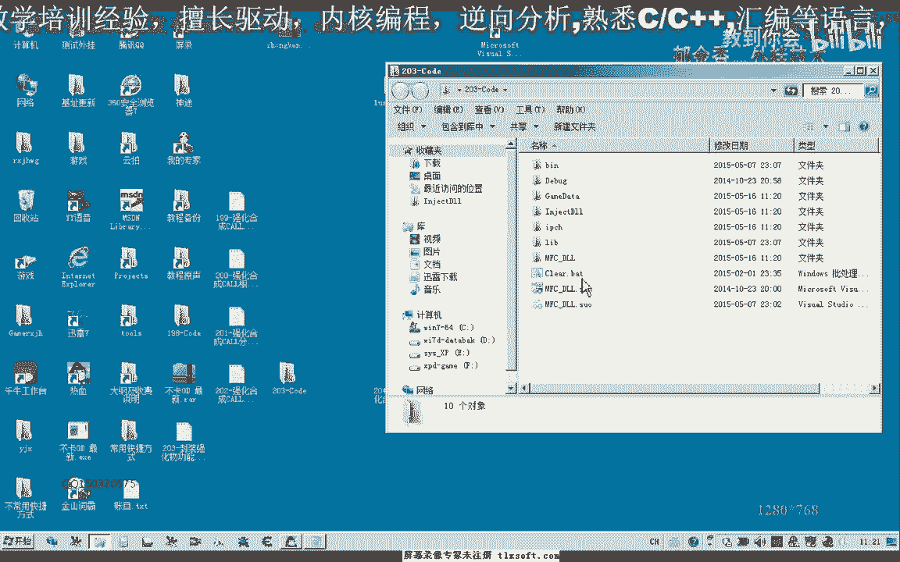
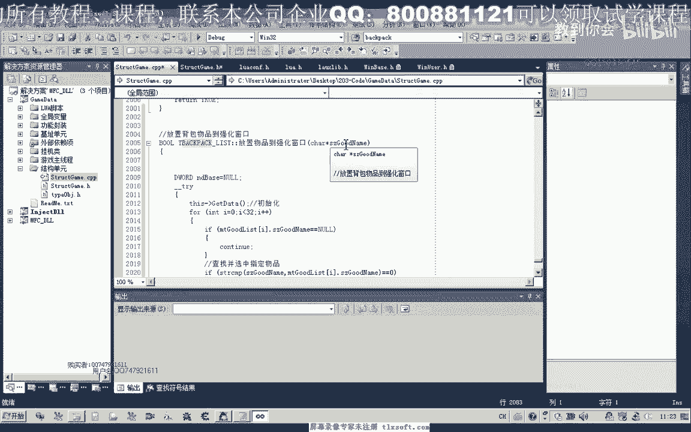
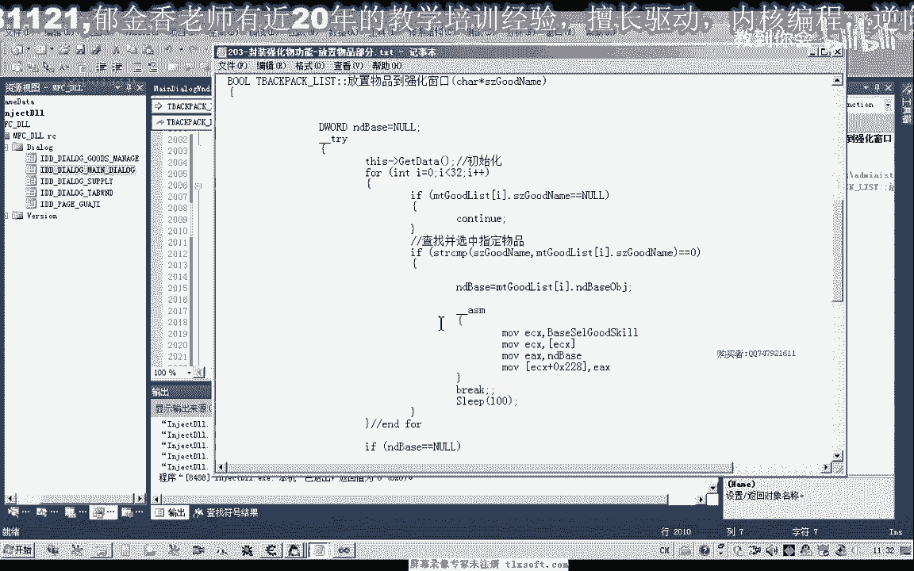
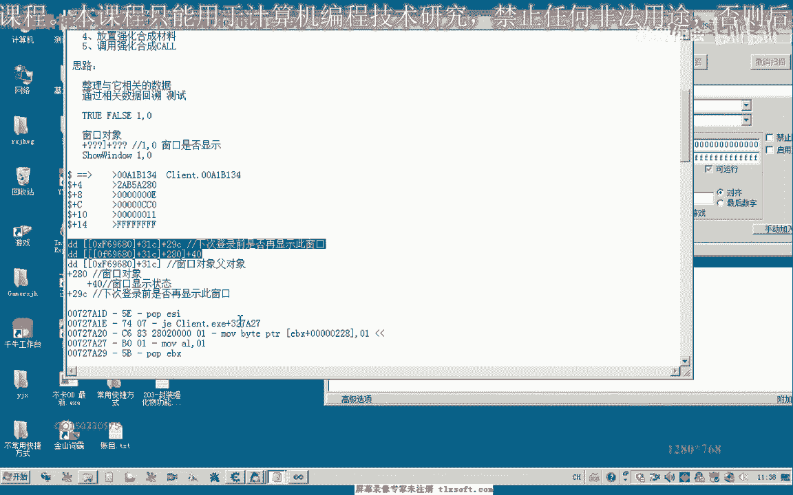
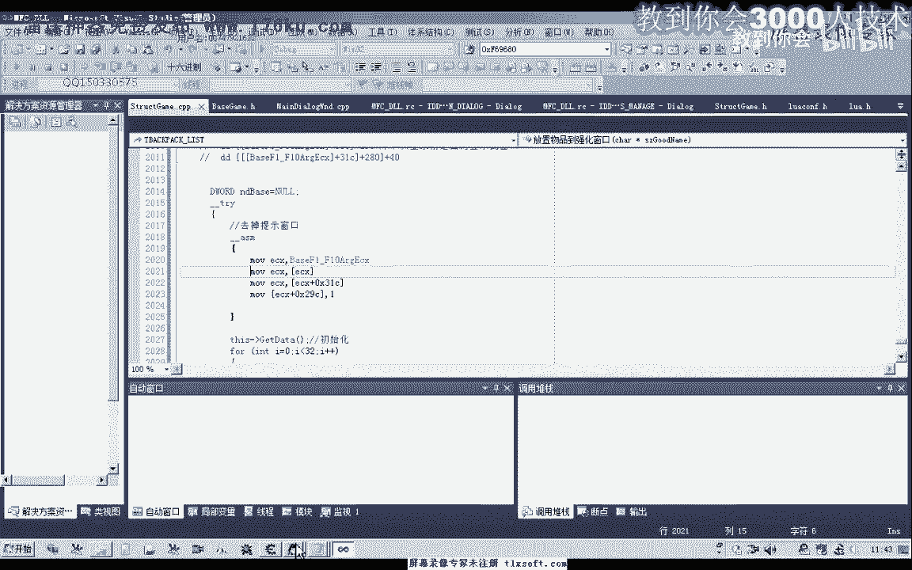

# 课程 P188：封装强化物功能 - 放置物品部分 🧱


在本节课中，我们将学习如何封装游戏内“强化物品”功能中的“放置物品”部分。我们将分析代码逻辑，修改数据结构，并最终实现将指定物品（如装备或强化石）自动放入强化窗口的功能。



---



上一节我们介绍了功能封装的目标，本节中我们来看看如何具体实现放置物品的代码逻辑。

首先，我们需要打开项目代码，并在背包相关的结构单元中添加新的函数声明。


在结构单元中声明函数后，我们需要在对应的CPP实现单元中添加具体的代码。为了节省时间，核心代码已预先编写完成。


让我们一起来分析这部分代码的逻辑。函数会接收一个参数，用于标识物品性能。


强化窗口只能放置三类物品：幸运符、装备以及强化石。我们之前的分析指出，在传递参数时存在区别。


具体来说，当放置强化石时，中间参数值为 `1A`；当放置装备时，该参数值为 `0x18`。这两个参数值来源于游戏内对象列表的特定机制。


我们可以通过搜索CE（Cheat Engine）来找到这些动态地址的基址。另一种简便方法是复用之前为技能栏（F1-F10）编写的对象列表机制。

但需要注意的是，如果复用技能栏的机制，则 `1A` 和 `0x18` 这两个参数值不能从该机制中获取，必须手动控制。本教程采用了复用技能栏基址，但手动控制关键参数值的方法。

代码中对物品类型进行了判断：
*   如果放置的是强化石，则传入 `1A`。
*   如果放置的是装备，则传入 `0x18`。

在实现放置功能前，我们还需要获取一个关键信息：背包物品的对象地址。因为选中物品时需要向特定地址（如 `0x288`）写入该对象的地址。

因此，我们需要修改背包物品的结构体，为其添加一个“对象地址”属性。

以下是需要添加的属性定义示例：
```cpp
// 在背包物品结构体中添加
DWORD objAddress; // 物品的对象地址
```
在初始化背包物品列表时，我们需要将这个地址值赋值给新添加的属性。

有了对象地址后，我们就可以编译并测试代码了。放置物品的函数主要包含两个步骤：
1.  **查找并选中物品**：遍历背包列表，根据物品名称找到目标物品，然后执行选中操作。
2.  **放置物品到强化窗口**：将已选中的物品放入强化窗口的指定位置。



接下来我们进行功能测试。首先尝试放置一件装备（例如“青铜护手”），然后放置一个强化石。为了给游戏足够的响应时间，调用函数后需要添加适当的延迟。

首次测试可能会弹出游戏内的确认窗口。我们可以通过修改一个特定的内存地址值来关闭这个弹窗。



经过查找和测试，我们找到了控制弹窗显示的内存地址。将其值设置为 `1` 可以关闭弹窗，设置为 `0` 则会显示。

最后，我们将这个内存地址的基址添加到项目的基址单元中，并将关闭弹窗的代码整合到主逻辑里，然后重新编译项目。


---



本节课中，我们一起学习了如何封装“放置物品到强化窗口”的功能。我们分析了参数传递的逻辑，为背包物品结构添加了必要属性，并实现了查找、选中、放置的完整流程。同时，我们还解决了测试过程中出现的弹窗问题。下一节课，我们将继续封装强化功能的其他部分。